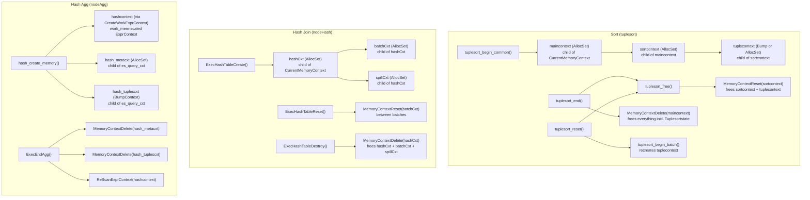

## PostgreSQL 中排序与哈希操作的内存上下文管理  
      
### 作者      
digoal      
      
### 日期      
2026-03-23      
      
### 标签      
PostgreSQL , 排序 , 哈希聚合 , 哈希JOIN , 内存上下文 , 创建 , 释放 , 限制 , work_mem , 溢出磁盘  
      
----      
      
## 背景  
本文介绍PostgreSQL 中排序与哈希操作的内存上下文管理: 创建、限制、溢出到磁盘、释放机制等.  
  
PostgreSQL 使用分层的 memory context 体系来管理排序和哈希操作的内存。每类操作都会创建多个嵌套的 context，这些 context 具有不同的生命周期；同时它会使用 `work_mem`（或其派生值）作为一个软性的内存预算，在超出预算前尽量使用内存，超出后再落盘。  
  
    
  
## 1. 排序操作（`tuplesort`）  
  
### 内存上下文的创建  
  
所有排序操作都从 `src/backend/utils/sort/tuplesort.c` 中的 `tuplesort_begin_common()` 开始。该函数会创建 **两个** 嵌套的 memory context：  
  
1. **`maincontext`**（`"TupleSort main"`）  
   它是 `CurrentMemoryContext` 的子 context，通过 `AllocSetContextCreate` 创建。这个 context 在 `tuplesort_reset()` 之后仍然存活，用于保存可跨多个排序 batch 复用的数据。  
  
2. **`sortcontext`**（`"TupleSort sort"`）  
   它是 `maincontext` 的子 context，同样通过 `AllocSetContextCreate` 创建。这个 context 会在 `tuplesort_reset()` 时被销毁（即 batch 之间会清空）。   
  
`workMem` 参数（通常来自 GUC 参数 `work_mem`）会被转换为一个字节数预算，保存在 `state->allowedMem` 中，并且会强制保证最小值为 64 KB：   
  
随后，`tuplesort_begin_batch()` 会立刻创建第三个 context：  
  
3. **`tuplecontext`**（`"Caller tuples"`）  
   它是 `sortcontext` 的子 context。对于**无界**排序，使用 `BumpContextCreate` 创建（更紧凑，不需要逐 tuple 释放）；对于**有界**排序，使用普通的 `AllocSetContextCreate` 创建（支持任意顺序释放）。   
  
因此，最终形成的三级层次结构为：`maincontext` → `sortcontext` → `tuplecontext`。  
  
### 内存预算跟踪  
  
在每个 batch 开始时，`availMem` 会用 `allowedMem` 初始化。代码里通过三个宏来跟踪内存使用：   
  
当 `LACKMEM` 为真时（也就是 `availMem < 0`），排序会通过 `inittapes()` 溢写到磁盘。  
  
### 排序变体的入口函数  
  
所有与具体类型相关的入口函数，例如 `src/backend/utils/sort/tuplesortvariants.c` 中的 `tuplesort_begin_heap`、`tuplesort_begin_index_btree`，最终都会委托给 `tuplesort_begin_common()`；传入的预算要么是 `work_mem`（查询级排序），要么是 `maintenance_work_mem`（索引构建场景）。   
  
### 内存上下文的释放  
  
**`tuplesort_free()`** 是内部清理函数。它会关闭所有 tape 文件，然后 reset `sortcontext`；由于 `tuplecontext` 是 `sortcontext` 的子 context，所以也会被一并销毁。   
  
**`tuplesort_end()`** 是对外的完整销毁函数。它先调用 `tuplesort_free()`，然后彻底删除 `maincontext`（这也会同时销毁 `Tuplesortstate` 结构体本身，因为它就是分配在 `maincontext` 中的）。   
  
**`tuplesort_reset()`** 用于跨 batch 复用排序器。它先调用 `tuplesort_free()`（从而 reset `sortcontext`），然后再次调用 `tuplesort_begin_batch()`，在刚刚 reset 过的 `sortcontext` 中重新创建 `tuplecontext`。   
  
执行器层面的销毁函数是 `src/backend/executor/nodeSort.c` 中的 **`ExecEndSort()`**，它会调用 `tuplesort_end()`。   
  
   
  
## 2. Hash Join 操作  
  
### 内存上限的计算  
  
哈希操作内存预算的权威函数是 `src/backend/executor/nodeHash.c` 中的 `get_hash_memory_limit()`。它计算方式为：  
  
`work_mem * hash_mem_multiplier * 1024` 字节。   
  
### 内存上下文的创建  
  
`src/backend/executor/nodeHash.c` 中的 `ExecHashTableCreate()` 会创建 **三个** memory context。`HashJoinTableData` 控制块本身是在执行器当前的 `CurrentMemoryContext` 中 `palloc` 出来的，但真正用于哈希工作的内存都放在它的附属 context 中：  
  
1. **`hashCxt`**（`"HashTableContext"`）  
   `CurrentMemoryContext` 的子 context；生命周期覆盖整个 join。  
  
2. **`batchCxt`**（`"HashBatchContext"`）  
   `hashCxt` 的子 context；保存每个 batch 的数据，在 batch 之间 reset。  
  
3. **`spillCxt`**（`"HashSpillContext"`）  
   `hashCxt` 的子 context；保存临时文件缓冲区相关的内存。   
  
头文件中也明确说明了这种三层 context 的设计：   
  
`HashJoinTableData` 中也有字段保存这三个 context：   
  
`ExecHashTableCreate()` 会在 `nodeHashjoin.c` 的 `ExecHashJoin()` 中，于 `HJ_BUILD_HASHTABLE` 阶段被调用。   
  
### 每个 batch 的 context reset  
  
在多 batch hash join 中，每当开始处理一个新的 batch，`ExecHashTableReset()` 就会 reset `batchCxt`，从而以较低成本释放这一 batch 的所有 tuple 内存。   
  
### 内存上下文的释放  
  
**`ExecHashTableDestroy()`** 会关闭临时文件，然后删除 `hashCxt`。由于 `batchCxt` 和 `spillCxt` 都是 `hashCxt` 的子 context，它们也会被隐式一并释放。   
  
`nodeHashjoin.c` 中的 **`ExecEndHashJoin()`** 会调用 `ExecHashTableDestroy()`。   
  
    
  
## 3. Hash Aggregation 操作  
  
### 内存上下文的创建  
  
对于 hash aggregation，相关 context 在 `src/backend/executor/nodeAgg.c` 的 `hash_create_memory()` 中创建；当 `use_hashing` 为真时，`ExecInitAgg()` 会调用它。   
  
这里会创建三类内存资源：  
  
1. **`hashcontext`**  
   通过 `CreateWorkExprContext()` 创建。该函数会按 `work_mem / 16` 的比例调整 `AllocSet` 的最大 block size。这个 context 用于保存按引用传递（byref）的 transition value。  
  
2. **`hash_metacxt`**（`"HashAgg meta context"`）  
   在 `es_query_cxt` 下通过 `AllocSetContextCreate` 创建。用于保存 bucket 数组（因为 bucket 可能 resize，所以必须支持 `pfree`）。  
  
3. **`hash_tuplescxt`**（`"HashAgg hashed tuples"`）  
   在 `es_query_cxt` 下通过 `BumpContextCreate` 创建，其 `maxBlockSize` 同样按 `work_mem / 16` 比例调整。这个 context 用来保存真正的哈希表项。  
  
`src/backend/executor/execUtils.c` 中的 `CreateWorkExprContext()` 会完成与 `work_mem` 成比例的 block size 计算，用于创建 `hashcontext`：   
  
`hash_metacxt` 和 `hash_tuplescxt` 在 `AggState` 中有相应字段声明：   
  
内存上限检查会调用 `get_hash_memory_limit()`，并且会对这三个 context 的总使用量进行跟踪。   
  
### 内存上下文的释放  
  
**`ExecEndAgg()`** 会显式删除 `hash_metacxt` 和 `hash_tuplescxt`。    
`hashcontext` 则通过 `ReScanExprContext()` 清理（因为 `CreateWorkExprContext()` 已经把它挂到了 `EState` 的 expression context 列表中）。   
  
    
  
## 总结图  
  

  
    
  
## 说明  
  
- **`work_mem` 与 `hash_mem_multiplier` 的区别**    
  排序操作直接使用 `work_mem` 作为预算。    
  哈希操作则使用 `get_hash_memory_limit()`，即 `work_mem * hash_mem_multiplier * 1024`；而 `hash_mem_multiplier` 默认值是 2.0，所以默认情况下哈希操作可用内存是排序的 **两倍**。  
  
- **软限制而非硬限制**    
  排序中的 `allowedMem` / `availMem`，以及 hash join 中的 `spaceUsed` / `spaceAllowed`，都只是**软限制**。memory context 分配器本身并不会强制执行这个上限，真正决定何时 spill 到磁盘的是上层应用代码中的检查逻辑。  
  
- **排序中 `maincontext` 的存活设计**    
  `tuplesort` 中的 `maincontext` 被特意设计成在 `tuplesort_reset()` 后仍然保留，这样排序键函数信息以及其他元数据就可以跨多个排序 batch 复用，例如增量排序场景 `src/backend/executor/nodeIncrementalSort.c`。  
  
- **Hash Aggregation 的 spill**    
  当 hash aggregation spill 到磁盘时，它会使用 `get_hash_memory_limit()`（通过 `hash_agg_set_limits()`）作为触发分区式 spill 的阈值。`hash_tuplescxt` 之所以使用 `BumpContext`，是因为哈希表项不会逐条释放，而是整个 context 一次性 reset。  
  
- **`ExprContext` 的清理**    
  Hash aggregation 中的 `hashcontext` 会通过 `CreateWorkExprContext()` 挂入 `EState->es_exprcontexts`。这意味着当 `FreeExecutorState()` 调用 `MemoryContextDelete(estate->es_query_cxt)` 时，它本来也会被自动清理；不过 `ExecEndAgg()` 仍然会显式对它调用 `ReScanExprContext()`，以便触发并刷新相关的 shutdown callback。  
  
   
本文来自 deepwiki 深度思考: https://deepwiki.com/search/postgresql-workmem-sql_281d8b2c-c9af-4594-b743-6ff484c6bbab  
  
  
#### [PostgreSQL 解决方案集合](../201706/20170601_02.md "40cff096e9ed7122c512b35d8561d9c8")
  
  
#### [德哥 / digoal's Github - 公益是一辈子的事.](https://github.com/digoal/blog/blob/master/README.md "22709685feb7cab07d30f30387f0a9ae")
  
  
#### [About 德哥](https://github.com/digoal/blog/blob/master/me/readme.md "a37735981e7704886ffd590565582dd0")
  
  

  
