## PostgreSQL 中排序与哈希操作的提前释放机制与改进思路    
        
### 作者        
digoal        
        
### 日期        
2026-03-23        
        
### 标签        
PostgreSQL , 排序 , 哈希聚合 , 哈希JOIN , 内存上下文 , 创建 , 释放 , 限制 , work_mem , 溢出磁盘    
        
----        
        
## 背景    
本文讨论 PostgreSQL 中排序与哈希操作的提前释放机制与改进思路, 如何尽早的释放内存, 或者减少内存的使用.    
    
  
PostgreSQL 在 `tuplesort.c`、`nodeHash.c` 和 `nodeAgg.c` 中实现了相当丰富的内存回收策略。下面按文件分别展开说明。  
  
   
  
## `tuplesort.c` — 多策略内存管理  
  
### 1. 双层 Memory Context 架构  
  
`tuplesort_begin_common()` 建立了两个不同的 context：  
  
- `maincontext`：在 `tuplesort_reset()` 之后仍然保留，用于多个 batch 排序之间的复用  
- `sortcontext`：每次调用 `tuplesort_free()` 时都会被完整 reset  
  
  
  
`tuplesort_free()` 会调用 `MemoryContextReset(state->base.sortcontext)`，从而一次性释放所有工作内存，而不需要逐个跟踪每次分配。  
  
### 2. 专用 `tuplecontext`，并在 Bump 与 AllocSet 之间做选择  
  
系统使用了一个专门的子 context `tuplecontext`，只用于保存调用方传入的 tuples。一个关键优化是：  
  
- 对于**无界排序**，不需要单独对某个 tuple 调用 `pfree`，因此使用 `BumpContext`，分配效率最高  
- 对于**有界排序**，tuple 可能会从堆中被淘汰，因此使用普通的 `AllocSetContext`，以支持单独 `pfree`  
  
   
  
### 3. 每次输出 run 后立即 reset `tuplecontext`  
  
在 `dumptuples()` 中，当内存中的 tuples 完成排序并写入 tape 后，会立刻调用 `MemoryContextReset(state->base.tuplecontext)`。  
  
这样做能在下一轮 run 开始积累 tuples 之前，立即回收当前 run 的全部 tuple 内存，避免 run 之间产生碎片。  
  
### 4. merge 开始时进行批量释放  
  
在 `mergeruns()` 中，当排序从“生成 runs”阶段切换到“merge”阶段时，会发生两次重要的内存回收：  
  
- `MemoryContextResetOnly(state->base.tuplecontext)` 释放所有内存中的 tuples  
- 大的 `memtuples[]` 数组会显式通过 `pfree` 释放，并通过 `FREEMEM` 记账返还可用内存  
  
  
  
### 5. merge 阶段使用 slab allocator，实现零额外开销的 tuple 复用  
  
在 merge 过程中，`init_slab_allocator()` 会建立一个固定大小的 slot 数组，每个 slot 大小为 `SLAB_SLOT_SIZE`（1 KB）。  
  
tuple 内存通过 `RELEASE_SLAB_SLOT` 宏归还到 free-list 中，从而完全避免 `palloc/pfree` 的开销。     
  
### 6. 延迟释放 `lastReturnedTuple`  
  
在 `TSS_SORTEDONTAPE` 或 `TSS_FINALMERGE` 模式下，从 tape 返回 tuple 时，并不会立刻释放其 slot。  
  
相反，它会先保存到 `state->lastReturnedTuple` 中，等到下一次调用 `tuplesort_gettuple_common` 时，再对上一个 tuple 调用 `RELEASE_SLAB_SLOT`。  
  
这样可以保证调用方在内存被复用之前，仍然可以安全读取这个 tuple。    
  
### 7. 在线 final merge 中提前关闭 tape  
  
在 `TSS_FINALMERGE` 期间，当某个源 tape 被读尽时，会立刻调用 `LogicalTapeClose(srcTape)`，即使此时整个排序还在持续输出 tuples。  
  
这意味着 tape 的读缓冲区可以在排序完成前很早就被释放。  
  
### 8. 多轮 merge 之间关闭输入 tape  
  
在 `mergeruns()` 中，当一组输入 tapes 的所有 runs 都被消费完时，这些 tapes 会在下一轮 merge 开始前立即关闭。  
  
同样，在最终 merge 结束时，所有已经空掉的输入 tapes 也会立刻关闭。  
  
### 9. 有界堆中立即释放超额 tuple  
  
在使用 `tuplesort_set_bound()` 时，如果堆已满，而新来的 tuple 比堆顶更小，那么会立刻调用 `free_sort_tuple()` 释放被拒绝 tuple 的内存，因此系统不会持有超过 `bound` 个 tuples。  
  
`free_sort_tuple()` 会显式 `pfree` tuple 数据，并把相应内存返还到 `availMem`。  
  
### 10. `tuplesort_reset()`：跨多个 batch 复用 context  
  
`tuplesort_reset()` 会先调用 `tuplesort_free()`（从而 reset `sortcontext`），然后调用 `tuplesort_begin_batch()` 重新初始化排序状态。  
  
而 `maincontext` 会被保留下来，其中包括 `sortKeys` 等元数据；这使重复执行相似排序时可以省掉重新初始化的代价。  
  
   
  
## `nodeHash.c` — 按 batch reset + 增量驱逐  
  
### 1. 三层 Memory Context 层次结构  
  
头文件中说明了三类 context 的设计动机：  
  
- `hashCxt`：生命周期覆盖整个 join  
- `spillCxt`：保存 batch 文件缓冲区，生命周期同样覆盖整个 join  
- `batchCxt`：只保存单个 batch 的数据，在 batch 之间 reset  
  
  
  
这三个 context 都是在 `ExecHashTableCreate()` 中创建的。  
  
### 2. `ExecHashTableReset()`：批量释放单个 batch 的内存  
  
`ExecHashTableReset()` 会调用 `MemoryContextReset(hashtable->batchCxt)`，一次性释放上一个 batch 的所有 bucket header 和 tuple 数据。  
  
然后系统会在新的 context 中重新分配 bucket 数组，并把 chunk list 指针清空。  
  
### 3. `ExecHashIncreaseNumBatches()`：按 chunk 逐步驱逐  
  
当 `spaceUsed` 超过 `spaceAllowed` 时，`ExecHashIncreaseNumBatches()` 会扫描所有内存 chunk，把当前 batch 之外的 tuples 写到磁盘文件中，从而逐步降低 `hashtable->spaceUsed`。  
  
每个旧 chunk 一旦处理完成，就会立刻显式 `pfree`。  
  
### 4. 倾斜桶的提前回收（`ExecHashRemoveNextSkewBucket`）  
  
当 `spaceUsedSkew > spaceAllowedSkew` 时，`ExecHashSkewTableInsert()` 会触发删除价值最低的 skew bucket。  
  
这些 skew tuples 要么迁移到主表中，要么写入 batch 文件；对应的 skew tuple 内存和 bucket 结构都会被显式 `pfree`。   
  
如果所有 skew buckets 都被移除，那么整套 skew 数组也会被释放，并关闭 skew 优化。  
  
此外，skew bucket 的内存本身分配在 `batchCxt` 中，因此即使没有显式删除，在 batch 0 结束时也会被自动回收。  
  
### 5. 稠密 chunk 分配器（`dense_alloc`）  
  
系统不会为每个 tuple 单独 `palloc`，而是把所有 hash tuples 打包放进较大的 `HASH_CHUNK_SIZE` 内存块里。  
  
这样既减少了分配开销，也让批量释放更高效，因为 `batchCxt` reset 时整个 chunk 就一起被回收。  
  
   
  
## `nodeAgg.c` — 多粒度 context reset + spill 到磁盘  
  
### 1. 多个专用 Memory Context  
  
`hash_create_memory()` 会创建多个用途不同的 context：  
  
- `hashcontext`（`ecxt_per_tuple_memory`）：保存按引用传递的 transition value，在 batch 之间 reset  
- `hash_metacxt`：保存 bucket 数组，在 bucket 扩容时可释放并重新分配  
- `hash_tuplescxt`：一个 `BumpContext`，保存 hash entry，在哈希表清空时 reset  
  
  
  
### 2. 每个输入 tuple 后 reset 一次 context（Sorted Agg 与 Hash Agg 都适用）  
  
每处理完一个输入 tuple，都会调用 `ResetExprContext(aggstate->tmpcontext)`，释放该 tuple 产生的所有中间表达式求值结果。   
  
### 3. 在 group 边界对每组 context 做 rescan（Sorted Agg）  
  
在 `agg_retrieve_direct()` 中，每当跨过一个 group 边界，就会对每个已完成 grouping set 调用 `ReScanExprContext(aggstate->aggcontexts[i])`。  
  
这会释放该分组的所有 transition state 内存，同时触发已注册的 shutdown callback，用于清理非内存资源。  
  
### 4. spill 模式：限制内存继续增长（`hash_agg_check_limits` / `hash_agg_enter_spill_mode`）  
  
`hash_agg_check_limits()` 会监控 `hash_metacxt`、`hash_tuplescxt` 和 `hashcontext`（transition values）三者的总内存使用。  
  
当超过上限时，就触发 `hash_agg_enter_spill_mode()`：此后不再为新 group 创建新的 hash table entry，而是把属于新 group 的 tuples 立刻通过 `hashagg_spill_tuple()` spill 到磁盘。   
  
### 5. spilled batch 之间完整重置哈希表（`agg_refill_hash_table`）  
  
在处理每个 spilled batch 之前，会先执行：  
  
- `ReScanExprContext(aggstate->hashcontext)`，释放所有 transition state value  
- `ResetTupleHashTable()`，清空 `hash_tuplescxt` 中的所有 BumpContext 条目  
  
这样下一批次就能重新获得完整的内存预算。  
  
### 6. 选择性列 spill  
  
当 tuples 被 spill 到磁盘时，`hashagg_spill_tuple()` 只会写出真正需要的列，这由 `aggstate->colnos_needed` 控制。  
  
这样可以减少磁盘 I/O，也能减少 tape 缓冲时所需的内存。  
  
### 7. batch 完成后立即关闭 tape  
  
当一个 spilled batch 的所有 tuples 都读完后，会立刻调用 `LogicalTapeClose(batch->input_tape)` 关闭 tape，从而在下一批开始前先释放其读缓冲区。  
  
### 8. phase 切换时释放 tuplesort 状态  
  
在 `initialize_phase()` 中，当切换到新的 grouping phase 时，任何已经完成的输入 tuplesort（`sort_in`）都会立即通过 `tuplesort_end()` 释放。  
  
   
  
## 总结图  

```mermaid  
graph TD  
    A["tuplesort.c"]  
    A --> A1["BumpContext / AllocSet\nfor tuplecontext\n(unbounded vs bounded)"]  
    A --> A2["MemoryContextReset(tuplecontext)\nafter each run dump"]  
    A --> A3["MemoryContextResetOnly(tuplecontext)\n+ pfree(memtuples)\nat merge start"]  
    A --> A4["Slab allocator with free-list\nfor merge phase tuples"]  
    A --> A5["lastReturnedTuple lazy\nfree on next gettuple call"]  
    A --> A6["LogicalTapeClose on exhausted\ntapes during on-the-fly merge"]  
    A --> A7["free_sort_tuple for\nbounded heap evictions"]  
    A --> A8["tuplesort_reset: reuse\nmaincontext across batches"]  
  
    B["nodeHash.c"]  
    B --> B1["batchCxt reset per batch\nvia ExecHashTableReset"]  
    B --> B2["ExecHashIncreaseNumBatches:\nchunk-by-chunk eviction to disk"]  
    B --> B3["ExecHashRemoveNextSkewBucket:\nearly skew memory reclaim"]  
    B --> B4["dense_alloc chunks:\nbulk-free via batchCxt reset"]  
  
    C["nodeAgg.c"]  
    C --> C1["ResetExprContext(tmpcontext)\nper-input-tuple"]  
    C --> C2["ReScanExprContext(aggcontexts)\nper-group boundary"]  
    C --> C3["hash_agg_enter_spill_mode:\ncaps memory by spilling to disk"]  
    C --> C4["ReScanExprContext(hashcontext)\n+ ResetTupleHashTable\nbetween spilled batches"]  
    C --> C5["Selective column spilling\n(only needed columns)"]  
    C --> C6["BumpContext for hash_tuplescxt:\nreset, not per-tuple pfree"]  
```  
  

  
   
  
## 说明  
  
1. **Bump Allocator 与 AllocSet 的区别**    
   一个反复出现的主题是这两种 allocator 的取舍。`BumpContext` 几乎没有单次分配的额外开销，适合“整批 reset 就够了”的场景，例如 `nodeAgg.c` 中的 `hash_tuplescxt`，以及无界排序中的 `tuplecontext`。`AllocSet` 则用于需要单独释放对象的场景，例如有界排序中的 `tuplecontext`。  
  
2. **Context Reset 与 Delete 的区别**    
   `MemoryContextReset` 会释放该 context 下的所有子分配，但保留 context 本身以便复用，这是这里最常见的模式。`MemoryContextDelete` 则用于最终销毁，例如 `ExecHashTableDestroy` 会删除 `hashCxt`。  
  
3. **Hash Build 阶段并不存在真正的逐 tuple 释放**    
   `nodeHash.c` 在构建哈希表阶段，并不会对每个 tuple 单独释放。一个 batch 的内存通常是在 `batchCxt` reset 时一次性回收。只有在移除 skew bucket，或者在 `ExecHashIncreaseNumBatches` 中驱逐 tuples 时，才会出现单独释放，但这些本质上仍是“按块”的批量操作。  
  
4. **`MemoryContextResetOnly` 与 `MemoryContextReset` 的区别**    
   `mergeruns()` 使用 `MemoryContextResetOnly`，它不会去 reset 子 context，这样可以避免误伤父级 `sortcontext`。这是一个细节上非常重要的区别，否则可能会过早销毁 tape set。  
```  
  
本文来自 deepwiki 深度思考: https://deepwiki.com/search/postgresql-workmem-sql_281d8b2c-c9af-4594-b743-6ff484c6bbab  
  
