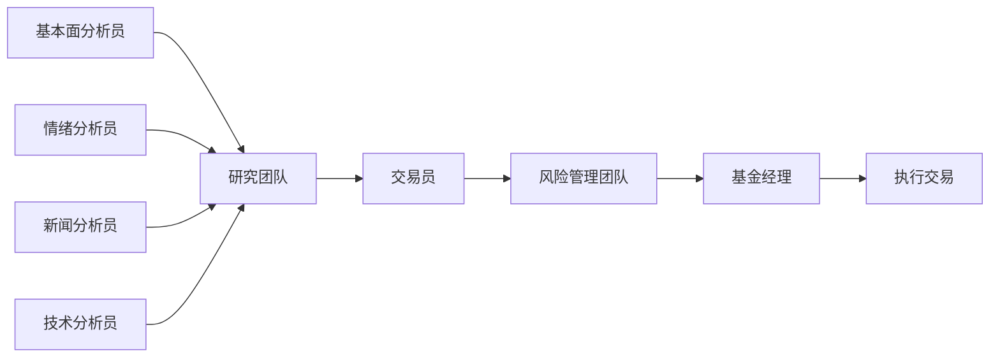
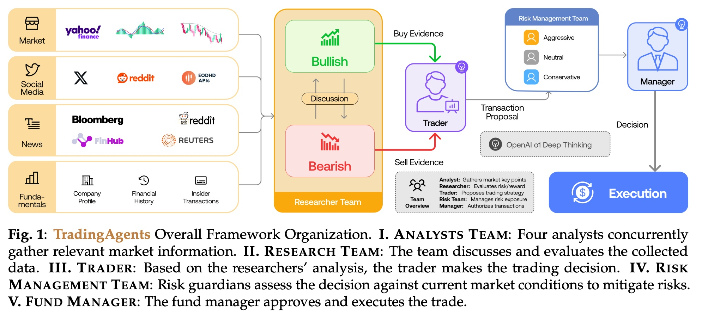
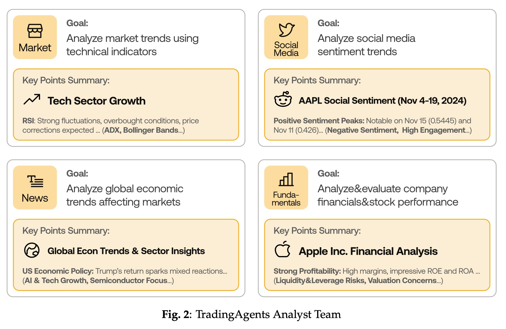
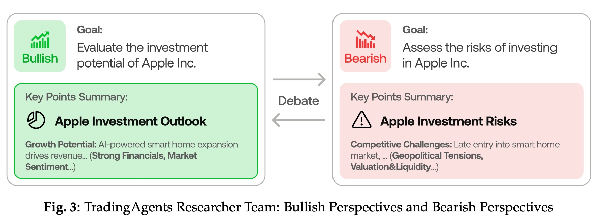
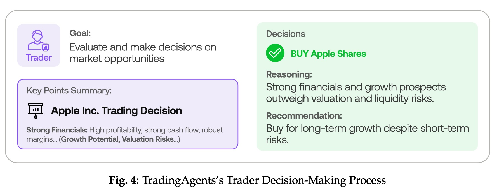
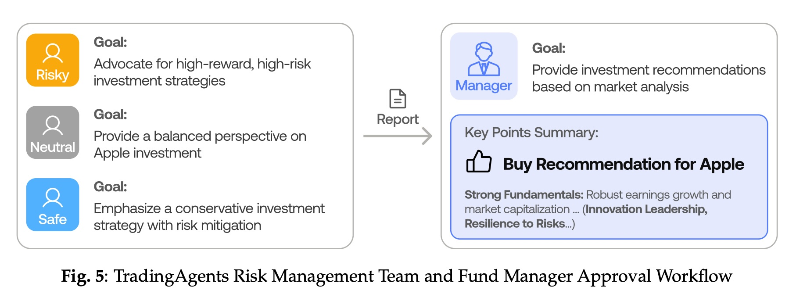
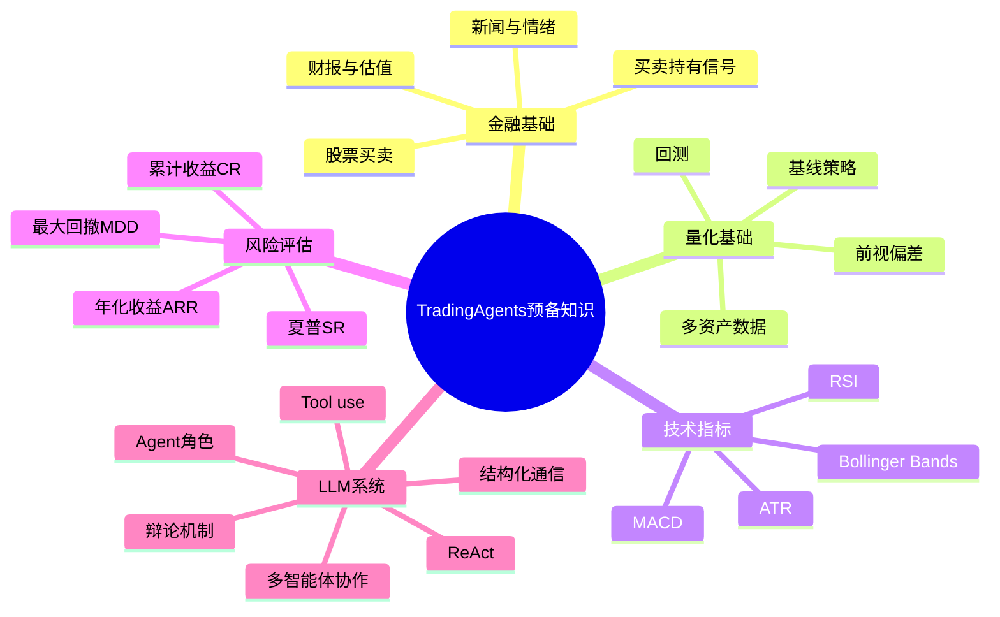
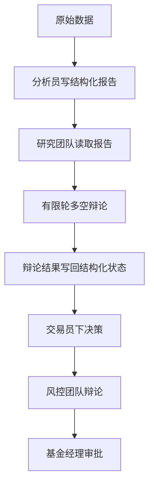
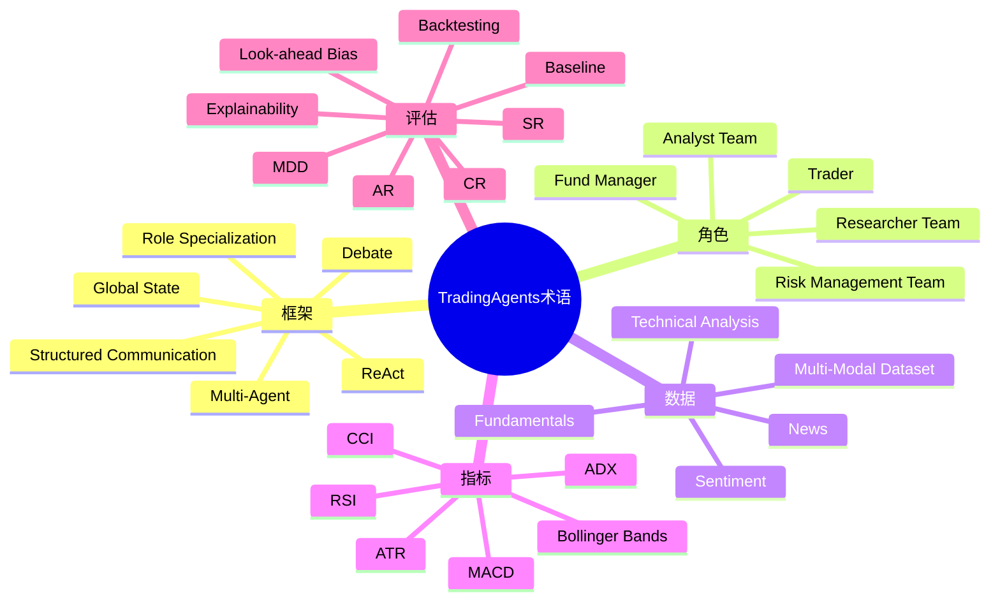

## AI论文解读 | TradingAgents: Multi-Agents LLM Financial Trading Framework  
  
### 作者  
digoal  
  
### 日期  
2026-03-25  
  
### 标签  
AI , 论文解读 , 多智能体 , 金融交易  
  
----  
  
## 背景  
  
https://arxiv.org/pdf/2412.20138  
  
提示:  
```  
读懂《TradingAgents: Multi-Agents LLM Financial Trading Framework》这篇论文需要提前掌握哪些基础知识, 请使用中文通熟易懂的讲解这些基础知识, 可以引用论文中的图、表或使用Markdown支持的图形(text,mermaid等)增加解释性.  
  
使用中文通熟易懂的解读《TradingAgents: Multi-Agents LLM Financial Trading Framework》这篇论文, 其中的关键内容请着重讲解, 可以引用论文中的图、表或使用Markdown支持的图形(text,mermaid等)增加解释性.  
  
提取《TradingAgents: Multi-Agents LLM Financial Trading Framework》这篇论文中的重要术语, 使用中文对这些术语进行通熟易懂的讲解, 可以引用论文中的图、表或使用Markdown支持的图形(text,mermaid等)增加解释性.  
```  
  
---  
  
# 1 前置知识  
  
要读懂这篇《TradingAgents: Multi-Agents LLM Financial Trading Framework》，你不用先变成“金融+AI 双博士”，但确实需要先补几块地基。否则会出现一种情况：每个词都认识，连起来却不知道作者到底在解决什么问题。  
  
我先给你一句话版结论：  
  
**这篇论文的核心，不是在发明某个新的技术指标，而是在把“一个交易团队怎么协作做决策”这件事，用多个 LLM 代理模拟出来。** 它把“看基本面、看新闻、看情绪、看技术面、做多空辩论、控风险、最后下单”串成一个组织化流程。论文的总框架图就在第 3 页图 1，后面第 5–8 页把各团队职责拆开讲得很清楚。  
  
这篇论文有对应的开源项目, 有兴趣的股民盆友可以直接使用: https://github.com/TauricResearch/TradingAgents  
  
# 一、建议你先掌握的 6 块基础知识  
  
可以按这个顺序学：  
  
1. **股票交易基础**  
2. **量化交易与回测基础**  
3. **常见金融数据类型**  
4. **技术指标与风险指标**  
5. **LLM Agent / 多智能体基础**  
6. **论文方法阅读套路**  
  
下面我用通俗中文讲。  
  
  
  
# 二、股票交易基础：先知道论文里的“买卖”到底在做什么  
  
## 1. 股票交易不是“预测答案”，而是“做决策”  
  
这篇论文里的系统，每天面对的是：**买（buy）/卖（sell）/持有（hold）**。论文在实验中就是让代理根据当天及之前的数据生成交易信号，然后执行，再进入下一天。作者特别强调**不能偷看未来数据**，也就是避免“未来函数”或“前视偏差（look-ahead bias）”。这一点在实验设置里讲得很明确。  
  
你可以把它理解成：  
  
* 今天收盘前，我只能看今天以前的信息  
* 然后决定明天或当下怎么交易  
* 最终看整个期间赚了多少、风险多大  
  
## 2. 交易里常见的几种分析视角  
  
论文把现实交易团队拆成四类“分析员”，这其实对应金融分析里最常见的四种信息来源：第 5–6 页对 Analyst Team 有很清楚的定义。  
  
### 基本面（Fundamentals）  
  
看公司本身怎么样，比如：  
  
* 营收、利润、毛利率  
* 资产负债  
* 估值高不高（PE、PB）  
* 管理层有没有减持  
  
一句话：**这家公司值不值这个价**。  
  
### 情绪面（Sentiment）  
  
看市场情绪，比如：  
  
* 社交媒体讨论是乐观还是悲观  
* 散户情绪偏热还是偏冷  
* 舆论是否正在推高/压低股价  
  
一句话：**市场现在在兴奋还是在害怕**。  
  
### 新闻/宏观（News / Macro）  
  
看外部环境，比如：  
  
* 行业新闻  
* 政策变化  
* 国际关系  
* 利率、通胀、经济环境  
  
一句话：**外部世界有没有在改变这只股票的处境**。  
  
### 技术面（Technical）  
  
看价格和成交量本身，比如：  
  
* 趋势是否向上  
* 是否超买超卖  
* 波动是否变大  
* 有没有突破信号  
  
一句话：**图形和指标有没有给出买卖时机**。  
  
  
  
# 三、量化交易与回测基础：论文里的“效果好”是怎么证明的  
  
这篇论文不是说“我们感觉这个系统很聪明”，而是做了**历史回测**。实验区间是 **2024-01-01 到 2024-03-29**，股票包括 Apple、Nvidia、Microsoft、Meta、Google 等，比较对象是 Buy & Hold、MACD、KDJ+RSI、ZMR、SMA 等基线策略。  
  
## 1. 什么是回测（Backtesting）  
  
回测就是：  
  
> 把历史市场数据按时间顺序“重放”一遍，看你的策略如果当时真的这么做，会赚还是亏。  
  
像打游戏读档一样，但规则是：  
  
* 只能用当时能看到的信息  
* 每天做一次决策  
* 记录资产净值变化  
* 最后算收益和风险指标  
  
## 2. 为什么要有基线（baseline）  
  
论文不是拿自己和空气比，而是和常见策略比：  
  
* **Buy and Hold**：买了就不动  
* **MACD**：用均线差做趋势跟踪  
* **KDJ+RSI**：用超买超卖信号  
* **ZMR**：均值回归  
* **SMA**：短长均线交叉  
  
这些基线在附录 S1.1 有定义。  
  
这很重要，因为论文不是在证明“交易能赚钱”，而是在证明：  
  
> **多智能体 LLM 交易框架，是否比传统规则策略更有效。**  
  
  
  
# 四、常见金融数据类型：论文为什么要喂给代理这么多信息  
  
论文第 10 页列出了它用到的数据模态，基本就是一个真实交易团队会看的信息池：  
  
* 历史股价（开高低收量）  
* 新闻  
* 社交媒体帖子与情绪  
* 内部人交易与情绪  
* 财报  
* 公司简介与财务历史  
* 60 个技术指标  
  
这就是论文为什么叫 **multi-modal / multi-source** 的原因：  
它不是只看 K 线，也不是只看新闻，而是把多种来源拼起来。  
  
你可以把它想成：  
  
```text  
股票走势 = 公司本身 + 市场情绪 + 新闻事件 + 技术走势 + 风险约束  
```  
  
而作者的做法是：**让不同角色分别处理不同信息，再汇总。**  
  
  
  
# 五、技术指标与风险指标：这是读实验结果最关键的一块  
  
很多人第一次读这类论文，最容易卡在指标名上。其实你不用把每个公式都背下来，先抓住“它想衡量什么”。  
  
  
  
## 1. 技术指标：它们不是魔法，是“压缩过的价格描述”  
  
论文中技术分析员会用 MACD、RSI、Bollinger Bands 等指标，第 6 页明确提到这些例子；附录还展示了 AAPL 的详细技术分析报告。  
  
### RSI：是否“买太猛/卖太猛”  
  
RSI 常用来判断：  
  
* 值高：可能超买  
* 值低：可能超卖  
  
通俗理解：  
  
> 最近涨太快了，可能有人要获利了结；  
> 最近跌太狠了，可能有人要抄底。  
  
### MACD：趋势是不是在变  
  
MACD 更像看“加速度”：  
  
* 向上穿越，可能转强  
* 向下穿越，可能转弱  
  
通俗理解：  
  
> 不只是看涨跌，而是看“上涨动能”或“下跌动能”有没有变。  
  
### 布林带（Bollinger Bands）：波动大不大  
  
它反映价格波动区间。  
  
通俗理解：  
  
> 股价最近是在正常晃动，还是已经晃得很厉害，快出大动作了？  
  
  
  
## 2. 风险收益指标：论文表 1 要看懂这四个  
  
论文主结果表（第 11 页 Table 1）用了四个核心指标：**CR、ARR、SR、MDD**。附录第 19–20 页给了定义和公式。  
  
### (1) Cumulative Return, CR：累计收益率  
  
看整个回测期总共赚了多少。  
  
公式意思很简单：  
  
```text  
(期末资产 - 期初资产) / 期初资产  
```  
  
如果从 10 万变成 12 万，那累计收益就是 20%。  
  
  
  
### (2) Annualized Return, AR / ARR：年化收益率  
  
因为不同策略测试时长可能不同，所以要把收益“折算成每年平均”。  
  
通俗理解：  
  
> 这段时间赚的钱，换算成一年大概相当于多少回报。  
  
  
  
### (3) Sharpe Ratio, SR：每承担一份波动，换来多少超额收益  
  
这是量化里非常重要的指标。  
  
别被公式吓到，它本质上问的是：  
  
> 你赚的钱，值不值得你承担这份风险？  
  
* 收益高且波动小，Sharpe 高  
* 收益一般但忽上忽下，Sharpe 低  
  
论文里作者特别强调，他们的 TradingAgents Sharpe Ratio 很高，说明**风险调整后的表现很好**。同时作者也提醒，实验期只有 3 个月，这个数值异常高可能和这段时间回撤少有关。  
  
  
  
### (4) Maximum Drawdown, MDD：最大回撤  
  
这是最容易理解、也最接近“真实痛感”的指标。  
  
它问的是：  
  
> 从一个历史最高点往下掉，最惨的时候掉了多少？  
  
比如你资金一度从 10 万涨到 12 万，后来跌到 9 万。  
那不是只亏 1 万，而是相对最高点回撤了 25%。  
  
对真实交易来说，**最大回撤非常重要**，因为很多策略不是死于“不赚钱”，而是死于“中间跌得太狠扛不住”。  
  
  
  
## 3. 为什么论文里要同时看收益和回撤  
  
因为单看收益会骗人。  
  
例如：  
  
* 策略 A：赚 30%，但中途最大跌 40%  
* 策略 B：赚 20%，但中途最多跌 5%  
  
对很多资金来说，B 反而更可用。  
  
论文的结论之一就是：TradingAgents 不只是收益高，**在风险控制上也保持了比较可控的回撤**。这是它声称优于纯规则策略的重要理由。  
  
  
  
# 六、LLM Agent / 多智能体基础：这是读懂论文“方法部分”的核心  
  
这篇论文最重要的不是金融，而是 **Agent 组织结构设计**。  
  
## 1. 什么是 Agent  
  
在这篇论文里，Agent 可以简单理解为：  
  
> 一个由 LLM 驱动、带着明确角色、能调用工具、能产出报告的“数字员工”。  
  
不是普通聊天机器人，而是：  
  
* 有角色（如技术分析员）  
* 有目标（如分析趋势）  
* 有工具（如查数据、算指标）  
* 有输出格式（如结构化报告）  
  
论文第 4–9 页都在讲这种角色拆分和协作方式。  
  
  
  
## 2. 什么是 Multi-Agent  
  
不是一个大模型包打天下，而是多个代理分工合作。  
  
你可以用公司组织来理解：  
  

  
这正对应论文第 3 页图 1 的总体流程，以及第 5–8 页各团队说明。  
  
  
  
## 3. 为什么不用“一个超级大提示词”全做完  
  
论文明确指出，现有很多框架有两个问题：  
  
1. **不够像真实交易组织**  
2. **全靠自然语言对话，容易信息丢失**  
  
作者把第二个问题称作类似“传话游戏（telephone effect）”：对话越长，关键信息越可能被忘掉、扭曲，或者淹没在上下文里。这个问题在第 2 页和第 8 页讲得很清楚。  
  
所以他们采用：  
  
* **分析阶段：结构化报告**  
* **辩论阶段：自然语言讨论**  
* **最终决策：再回到结构化状态**  
  
这个设计是全文最值得抓住的点之一。  
  
  
  
## 4. 结构化通信为什么重要  
  
论文第 8–9 页强调：代理之间主要不是闲聊，而是通过**结构化文档和全局状态**协作。  
  
你可以把它理解成：  
  
* 不是“大家一直在群里聊”  
* 而是“每个人先交一份报告”  
* 需要辩论时再开会  
* 最后由负责人形成决议  
  
这样做的优点：  
  
* 信息更清楚  
* 上下文更短  
* 责任更明确  
* 不容易越聊越乱  
  
  
  
## 5. Debate（辩论）机制是什么  
  
研究团队里有：  
  
* **Bullish researcher（看多）**  
* **Bearish researcher（看空）**  
  
他们会围绕同一只股票进行多轮辩论；风险团队也类似，会从激进、中性、保守三个视角讨论。这个机制在第 6–9 页、图 3 和图 5 都体现出来了。  
  
通俗讲：  
  
> 作者不是让模型“直接下判断”，而是让模型先把反方意见也说出来。  
  
这很像人类决策里的“唱红脸和唱白脸”，好处是：  
  
* 降低单一视角偏见  
* 强迫系统考虑反证  
* 更容易做风险平衡  
  
  
  
# 七、ReAct、工具调用、深浅模型分工：这部分不难，但很重要  
  
## 1. ReAct 是什么  
  
论文说所有代理都遵循 **ReAct prompting framework**。  
  
你不用把它看得太复杂，它就是：  
  
> 一边思考（Reasoning），一边行动（Acting）  
  
也就是：  
  
* 先想需要什么信息  
* 再去调工具  
* 再根据结果继续想  
* 最后形成报告或动作  
  
所以附录里你能看到很多类似：  
  
* 先获取 AAPL 数据  
* 再算 RSI / MACD / ATR  
* 再汇总成技术报告  
  
这就是 ReAct 风格。  
  
  
  
## 2. 工具调用为什么关键  
  
LLM 自己不会实时知道股票最新情况，也不会天然会算每个指标。  
所以它需要调用工具：  
  
* 查财经数据 API  
* 查新闻 API  
* 查 Reddit/X 情绪  
* 计算技术指标  
  
这也是为什么这类系统不是“纯提示词工程”，而是**LLM + Tools + Workflow**。  
  
  
  
## 3. 为什么论文区分“快模型”和“深思考模型”  
  
第 9 页说得很明确：作者会根据任务类型选择不同 LLM。  
  
* **快模型**：摘要、检索、表格转文本  
* **深思考模型**：决策、分析、报告撰写、综合推理  
  
这背后的思想是：  
  
> 不要让最贵、最强的模型做所有事；  
> 把它留给真正需要推理的环节。  
  
这其实是工程上非常实用的思路。  
  
  
  
# 八、论文的组织结构图，应该怎么读  
  
你读这篇论文时，建议盯着这 5 张图：  
  
* **图 1（第 3 页）**：总流程   
* **图 2（第 5 页）**：分析员团队   
* **图 3（第 6 页）**：多空研究员辩论   
* **图 4（第 7 页）**：交易员决策流程   
* **图 5（第 8 页）**：风控团队 + 基金经理审批   
  
  
  
你可以按下面这张文字图理解：  
  
```text  
[市场/新闻/社交媒体/财报/技术指标]  
                |  
                v  
      [四类分析员分别出报告]  
                |  
                v  
        [研究团队：多空辩论]  
                |  
                v  
          [交易员形成方案]  
                |  
                v  
      [风控团队：激进/中性/保守讨论]  
                |  
                v  
         [基金经理最终拍板]  
                |  
                v  
              [执行]  
```  
  
整篇论文其实就是在证明：  
  
1. 这种组织式结构是合理的  
2. 这种“结构化报告 + 局部自然语言辩论”的通信方式比纯对话更稳  
3. 回测结果比若干传统策略更好  
  
  
  
# 九、表 1 应该怎么看：别只看“收益高”  
  
第 11 页 Table 1 是最关键的结果表。  
  
论文报告说，在 AAPL、GOOGL、AMZN 上，TradingAgents 的表现为：  
  
* **AAPL**：CR 26.62%，ARR 30.5%，SR 8.21，MDD 0.91%  
* **GOOGL**：CR 24.36%，ARR 27.58%，SR 6.39，MDD 1.69%  
* **AMZN**：CR 23.21%，ARR 24.90%，SR 5.60，MDD 2.11%  
  
而且它都超过了表中的几种规则策略。  
  
但读论文时要保持清醒，至少注意三点：  
  
## 1. 回测时间不长  
  
作者自己承认，测试只有大约 3 个月。  
所以结果好，不等于已经证明长期稳定有效。  
  
## 2. 对比对象主要是规则策略  
  
它比的是 MACD、SMA 这类传统基线。  
这能说明“比简单规则更强”，但还不能自动说明“比最先进的量化模型都强”。  
  
## 3. 成本问题没完全展开  
  
论文脚注提到，每次预测涉及 **11 次 LLM 调用和 20+ 次工具调用**，成本不低。  
所以你还要思考：**这个系统是否真的能低成本、实时地跑在真实市场里？**  
  
这正是读研究论文时要具备的“批判性阅读”。  
  
  
  
# 十、读这篇论文前，你最好能听懂这些术语  
  
给你一个最小术语表：  
  
| 术语                       | 通俗解释      |  
| ------------------------ | --------- |  
| Fundamental Analysis     | 看公司值不值钱   |  
| Sentiment Analysis       | 看市场情绪     |  
| Technical Analysis       | 看价格走势和指标  |  
| Backtesting              | 用历史数据模拟交易 |  
| Baseline                 | 参照组       |  
| Sharpe Ratio             | 风险调整后收益   |  
| Max Drawdown             | 最惨的一次回撤   |  
| Multi-Agent              | 多角色协作     |  
| Debate                   | 多空辩论      |  
| ReAct                    | 边想边调用工具   |  
| Structured Communication | 用结构化报告传信息 |  
| Look-ahead Bias          | 偷看未来数据    |  
  
  
  
# 十一、给你一个“读论文前速成脑图”  
  

  
  
  
# 十二、如果你时间有限，最低限度先学哪几样  
  
如果你只想先把论文读懂到 70%，先补这 5 个：  
  
1. **什么是回测**  
2. **CR / Sharpe / MDD 是什么**  
3. **基本面、新闻、情绪、技术面分别在看什么**  
4. **什么是多智能体协作**  
5. **什么是结构化通信 vs 纯对话**  
  
掌握这五个，论文主线基本就能跟上。  
  
  
  
# 十三、最后给你一个“阅读顺序建议”  
  
别从头一字一句啃，建议这样读：  
  
### 第一步：先看图  
  
先看图 1 到图 5，搞清楚系统组织结构。  
  
### 第二步：再看方法  
  
重点看第 3 节和第 4 节：  
  
* 角色分工  
* 通信协议  
* 交互方式  
* 模型选择  
  
### 第三步：最后看实验  
  
重点看：  
  
* 实验设置  
* 表 1  
* 图 6、图 7  
* 附录里的指标定义  
  
### 第四步：带着问题回头看引言  
  
这时再看引言，你就能真正理解作者说的两大问题：  
  
* 不像真实交易组织  
* 纯自然语言通信容易失真  
  
  
---  
  
# 2 解读论文  
  
下面我用**通俗中文**把这篇《TradingAgents: Multi-Agents LLM Financial Trading Framework》讲明白。先给结论：  
  
**这篇论文最有价值的地方，不是“让大模型直接猜涨跌”，而是把一个真实交易团队的分工、辩论、风控、审批流程，搬进了多智能体系统里。** 作者认为，交易不是一个模型闷头算分数，而更像一个团队协作：有人看基本面，有人看新闻，有人看情绪，有人看技术面；之后多空双方辩论，再由交易员、风控团队和基金经理层层收敛成最终决策。  
  
  
  
# 一、这篇论文到底在解决什么问题  
  
作者先指出，现有很多金融 LLM/Agent 系统有两个明显缺点：  
  
**第一，不像真实交易机构。**  
很多方法只是“一个模型做一个任务”，或者“多个 agent 各自找信息”，但没有真正模拟现实中交易公司的组织结构和协作方式。  
  
**第二，通信方式太松散。**  
很多多智能体系统主要靠自然语言来回对话，信息一长就容易出现“传话游戏效应（telephone effect）”：前面说过的重点会丢、会变形、会被后面大量无关文本淹没。  
  
所以这篇论文的核心主张是：  
  
```text  
交易决策 ≠ 一个LLM直接喊“买/卖”  
交易决策 = 多个专业角色 + 结构化报告 + 有边界的辩论 + 风控约束 + 最终审批  
```  
  
这就是它的出发点。  
  
  
  
# 二、论文的核心思想：把交易公司“仿真”出来  
  
论文的总框架图（图 1）很关键。它把整个系统拆成 5 个层级：  
  
1. **分析员团队（Analyst Team）**  
2. **研究团队（Research Team）**  
3. **交易员（Trader）**  
4. **风险管理团队（Risk Management Team）**  
5. **基金经理（Fund Manager）**  
  
最后再执行交易。  
  
你可以把它理解成下面这个流程：  
  

  
这张图基本就是整篇论文的骨架。作者的意思很明确：  
**如果要让 LLM 真正用于复杂金融决策，就不该只做“会说话的指标生成器”，而应该做“像交易团队一样运作的系统”。**  
  
  
  
# 三、最关键的创新点：不是“多 agent”，而是“怎么组织多 agent”  
  
很多人第一次读这篇论文，会以为创新点只是“用了多智能体”。其实不够准确。真正关键的是下面四点。  
  
## 1. 角色专业化分工  
  
论文定义了七类角色：**基本面分析员、情绪分析员、新闻分析员、技术分析员、研究员、交易员、风险管理者**。不同角色有不同目标、约束、工具和上下文。比如情绪分析员会用社交媒体和情绪评分工具，技术分析员会算 MACD、RSI 等指标。  
  
可以用这个表理解：  
  
| 角色     | 主要看什么         | 作用            |  
| ------ | ------------- | ------------- |  
| 基本面分析员 | 财报、估值、内线交易    | 判断公司值不值这个价    |  
| 情绪分析员  | Reddit、X、情绪分数 | 判断市场现在偏乐观还是悲观 |  
| 新闻分析员  | 公司新闻、宏观事件、政策  | 判断外部事件会不会冲击股价 |  
| 技术分析员  | RSI、MACD、布林带等 | 判断趋势、动量和买卖时机  |  
| 研究员    | 综合前面报告，多空辩论   | 强制系统考虑正反两面    |  
| 交易员    | 汇总观点，下交易信号    | 决定买、卖、持有及仓位   |  
| 风控团队   | 波动、流动性、风险暴露   | 防止赚得猛也死得快     |  
  
这跟现实里的投研交易流程已经很像了。  
  
  
  
## 2. “结构化报告 + 自然语言辩论”的混合通信  
  
这是这篇论文里**最值得注意**的设计。  
  
作者不满意纯聊天式多智能体，因为容易越聊越乱。于是他们做了一个折中：  
  
* **大部分时候：用结构化报告传递信息**  
* **只有辩论时：才用自然语言对话**  
* **辩论结束后：再把结论写回结构化状态**  
  
论文第 4 节明确说，分析员会先生成简洁、组织良好的分析报告；交易员也会输出带理由的决策报告。只有研究团队和风控团队内部辩论时，才做有限轮数的自然语言讨论。  
  
你可以把它理解成：  
  

  
这套设计为什么重要？  
  
因为它同时解决了两个问题：  
  
* 结构化报告让信息更稳，不容易丢  
* 自然语言辩论让推理更深，不会太死板  
  
作者想要的是：**既有“表格/文档式的清晰”，又有“讨论式的灵活”。**  
  
  
  
## 3. 辩论机制不是花活，而是用来“去偏见”  
  
研究团队里有两个核心角色：  
  
* **Bullish Researcher（看多研究员）**  
* **Bearish Researcher（看空研究员）**  
  
他们会针对同一只股票进行多轮辩论。  
  
风控团队则更进一步，分成三种视角：  
  
* **Risky（激进）**  
* **Neutral（中性）**  
* **Safe（保守）**  
  
然后由基金经理做最终批准。  
  
这件事的意义在于：  
普通单模型系统很容易“一股脑相信当前最显眼的信息”。而这篇论文强制系统把**反方意见**说出来，相当于给交易系统加入了“内部审计”和“内部反驳”。  
  
通俗说：  
  
```text  
不是“模型觉得可以买，所以买”  
而是“先让一个模型拼命说为什么该买，  
再让另一个模型拼命说为什么不该买，  
最后再让第三层决定谁更有道理”  
```  
  
这比“直接输出结论”更接近真实决策。  
  
  
  
## 4. 风控不是附属功能，而是独立团队  
  
很多交易论文容易犯一个错误：  
把“赚钱能力”当成全部。  
  
这篇论文不是这样。作者专门加了一层风险管理团队，职责包括：  
  
* 评估市场波动、流动性和对手方风险  
* 提议止损、分散持仓等风控动作  
* 对交易员方案提出修正  
* 确保组合符合风险偏好和投资目标  
  
这很重要，因为现实交易中：  
  
> 真正把账户打爆的，往往不是“收益不够高”，而是“风险控制失灵”。  
  
所以这篇论文最像交易公司的地方，不是“有分析员”，而是**有风控团队，并且风控能否决或调整交易方案。**  
  
  
  
# 四、论文怎么让系统真正运行起来  
  
## 1. 所有 agent 都遵循 ReAct  
  
论文说，所有 agent 都遵循 **ReAct prompting framework**，也就是“边推理，边行动”。  
  
在这篇论文里，ReAct 的意思很实际：  
  
* 先思考需要什么信息  
* 再调工具拿数据  
* 再进一步分析  
* 最后写报告或做决策  
  
所以它不是单纯聊天，而是一个**会调用工具的推理工作流**。  
  
  
  
## 2. 不同任务用不同模型  
  
论文还讲了一个很工程化、也很现实的设计：  
  
* **快模型**（如 gpt-4o-mini、gpt-4o）负责摘要、检索、把表格转文本这类低深度任务  
* **深思考模型**（如 o1-preview）负责证据整合、分析写作、决策推理等高深度任务  
  
这个设计其实很合理。因为不是每一步都值得烧最贵最强的模型。  
  
通俗说：  
  
```text  
跑腿的活，交给快模型  
拍板的活，交给深思考模型  
```  
  
这也是它在工程层面比较成熟的一点。  
  
  
  
# 五、实验部分在做什么  
  
作者用的是**历史回测**。时间是 **2024 年 1 月 1 日到 2024 年 3 月 29 日**，测试对象包括苹果、英伟达、微软、Meta、谷歌等科技股。系统每天只看当天以前能拿到的数据，避免“偷看未来”的前视偏差。  
  
用到的数据很多，属于**多模态、多来源**：  
  
* 历史股价  
* 新闻  
* 社交媒体情绪  
* 内部人交易与情绪  
* 财报  
* 公司资料和财务历史  
* 60 个技术指标  
  
这说明它不是单靠一个信号，而是想模拟更完整的投研信息流。  
  
  
  
## 对比基线有哪些  
  
作者拿 TradingAgents 去和这些常见策略比：  
  
* Buy & Hold  
* MACD  
* KDJ + RSI  
* ZMR  
* SMA  
  
评价指标是四个经典金融指标：  
  
* **CR**：累计收益率  
* **AR/ARR**：年化收益率  
* **SR**：夏普比率  
* **MDD**：最大回撤  
  
附录里还给出了公式。比如：  
  
```text  
累计收益率 CR = (期末资产 - 期初资产) / 期初资产  
```  
  
```text  
Sharpe Ratio = （平均收益 - 无风险收益） / 波动率  
```  
  
```text  
最大回撤 MDD = 从历史高点跌到最低点的最大跌幅  
```  
  
这些指标组合起来，能同时看“赚得多不多”和“跌得惨不惨”。  
  
  
  
# 六、结果怎么看：论文为什么说自己有效  
  
论文最关键的结果表是 **Table 1**。作者在 AAPL、GOOGL、AMZN 上给出的主要结果是：  
  
| 股票    | CR 累计收益 | ARR 年化收益 | SR 夏普 | MDD 最大回撤 |  
| ----- | ------: | -------: | ----: | -------: |  
| AAPL  |  26.62% |    30.5% |  8.21 |    0.91% |  
| GOOGL |  24.36% |   27.58% |  6.39 |    1.69% |  
| AMZN  |  23.21% |   24.90% |  5.60 |    2.11% |  
  
而这些结果都优于表中的几种规则策略。比如在 AAPL 上，Buy & Hold 的累计收益是 **-5.23%**，SMA 也是负收益，而 TradingAgents 达到 **26.62%**。  
  
论文还给出 improvement 行，说明相对于最佳基线的提升：  
  
* AAPL：CR +24.57，ARR +28.43，SR +6.57  
* GOOGL：CR +16.58，ARR +19.49，SR +4.26  
* AMZN：CR +6.10，ARR +7.30，SR +2.07  
  
从图 7 和附录 S2、S4 的累计收益曲线也能看出，TradingAgents 的净值曲线整体跑在其他策略上方。  
  
  
  
# 七、这些结果为什么看起来这么好  
  
作者自己的解释主要有三层。  
  
## 1. 它能整合更多维度的信息  
  
传统规则策略通常只看价格和指标，比如均线、MACD、RSI。  
而 TradingAgents 同时看：  
  
* 技术走势  
* 公司基本面  
* 新闻事件  
* 市场情绪  
* 内部人行为  
  
这使得系统对复杂市场环境更不容易“瞎”。  
  
  
  
## 2. 它不是单次判断，而是多轮审议  
  
系统不是“一个 agent 看完就下单”，而是：  
  
* 先分析  
* 再多空辩论  
* 再由交易员形成方案  
* 再经过三种风险视角审查  
* 最后基金经理审批  
  
这会让冲动型决策少很多。  
  
  
  
## 3. 风控层帮助它把回撤压住  
  
论文特别强调，虽然一些规则基线在 MDD 上有时更低，但它们拿不到高收益；TradingAgents 则在收益显著更高的同时，把回撤控制在较可管理水平。作者把这归功于风险控制 agent 之间的讨论。  
  
也就是说，它追求的不是“最保守”，也不是“最猛”，而是：  
  
```text  
尽量多赚  
但不要为多赚付出失控的回撤  
```  
  
  
  
# 八、附录为什么很重要：它让“可解释性”不是嘴上说说  
  
论文第 6.1.4 节说，LLM agentic framework 的一个优势是**可解释性高**。因为决策不是藏在神经网络黑箱里，而是能用自然语言把理由写出来。  
  
附录里给了一个 Apple 的完整示例，非常适合看工作流是怎么落地的：  
  
* 技术分析员会写出 RSI、ADX、布林带、ATR、MACD 的解释  
* 新闻分析员总结宏观、行业、公司新闻  
* 情绪分析员给出 Reddit/X 情绪和情绪分数  
* 基本面分析员汇报盈利能力、估值、内线交易  
* 看多研究员和看空研究员分别陈述理由  
* 激进/保守/中性风控继续讨论  
* 基金经理最后给出 Buy/卖出/持有的结论  
  
这个附录的价值在于，它证明这套系统不是一张好看的架构图，而是**真的能把分析过程写成一条完整证据链**。  
  
你可以把这个过程想成：  
  
```text  
数据 --> 报告 --> 辩论 --> 交易方案 --> 风险修正 --> 审批 --> 执行  
```  
  
这就是论文所谓的 explainability。  
  
  
  
# 九、这篇论文最值得肯定的地方  
  
如果只抓最重要的优点，我会给它三条。  
  
## 1. 它把“组织结构”当成算法的一部分  
  
大多数论文把模型当核心，把流程当包装。  
这篇论文反过来：**流程本身就是方法的一部分。**  
  
## 2. 它认真对待“通信问题”  
  
很多 agent 论文只关心 agent 数量，不关心 agent 之间怎么传信息。  
这篇论文非常明确地处理了“纯自然语言通信容易失真”这个问题。  
  
## 3. 它把收益、风险、解释性放在一起看  
  
它不是只晒收益曲线，还强调夏普、最大回撤和推理日志。  
  
  
  
# 十、但也要冷静：这篇论文有哪些局限  
  
这里我得直接一点。论文很有意思，但**还远没到可以无脑信的程度**。  
  
## 1. 回测时间太短  
  
作者自己承认，实验只做了 **3 个月**。  
  
在金融里，三个月是很短的窗口。  
一个策略短期漂亮，不等于长期稳健。  
  
  
  
## 2. 夏普比率高得有点“过分漂亮”  
  
论文里 AAPL 的夏普比率到了 **8.21**。作者自己在脚注里也提醒，这高于常见经验范围；他们检查过计算没有问题，但推测是因为那段时间回撤很少。  
  
这说明作者算是诚实，但也说明：  
  
> 这个结果可能受测试区间非常强的影响。  
  
  
  
## 3. 对比对象主要是规则策略  
  
它对比的是 MACD、SMA、KDJ+RSI、ZMR 这类传统方法。  
这能说明它比**简单规则基线**强，但还不能直接说明它比更先进的量化模型、深度学习交易系统、或者更长周期策略都强。  
  
  
  
## 4. 成本很高  
  
脚注里提到，每次预测要 **11 次 LLM 调用和 20+ 次工具调用**。  
  
这意味着：  
  
* 回测都已经很贵  
* 真要高频或长周期部署，成本压力会更大  
* 实盘延迟、稳定性、API 依赖也会是问题  
  
所以它现在更像一个**有研究价值的原型框架**，而不是已经成熟到能直接上实盘的大规模系统。  
  
  
  
# 十一、如果把整篇论文浓缩成一句话  
  
我会这样概括：  
  
> **TradingAgents 证明了一件事：在金融交易里，LLM 的价值不一定是“直接预测价格”，而是“像一个有分工、有辩论、有风控的投研组织那样协作决策”。**  
  
  
  
# 十二、你读这篇论文时最该盯住的 5 个点  
  
如果你准备自己再回去看原文，重点盯这五个：  
  
1. **图 1**：整体组织架构  
2. **图 2、图 3、图 5**：分析员团队、多空辩论、风控团队  
3. **第 4 节**：结构化通信协议  
4. **表 1**：收益、夏普、回撤的核心结果  
5. **附录的 Apple 示例**：看工作流怎么真实跑起来  
  
  
  
# 十三、我的总体评价  
  
这篇论文的亮点不在于“某个提示词设计得多花”，而在于它提出了一个很强的观点：  
  
**复杂金融决策更像组织问题，而不仅仅是模型问题。**  
  
它做得最好的地方有三点：  
  
* 把真实交易机构的角色分工模拟出来  
* 用“结构化报告 + 有限辩论”解决 agent 通信失真  
* 在收益、风险和解释性之间找到一个不错的平衡  
  
但你也要知道，它还没有彻底证明长期有效性。  
更准确地说，它是一篇**方向感很强、工程设计很聪明、实验结果很亮眼，但仍需要更长周期、更强基线和更低成本验证**的论文。  
  
---  
  
# 3 术语  
  
下面我把这篇《TradingAgents: Multi-Agents LLM Financial Trading Framework》里最重要的术语，按“**先懂框架，再懂交易，再懂评估**”的顺序，用中文讲清楚。你可以把它当作这篇论文的**术语导读表**。  
  
先给一个总览图：  
  

  
这正是论文图 1 的核心意思：先收集多源信息，再分角色分析、辩论、决策、风控，最后执行。  
  
  
  
# 一、框架层术语：先搞懂这篇论文“在搭什么系统”  
  
## 1）TradingAgents  
  
**TradingAgents** 是这篇论文提出的多智能体金融交易框架。它不是让一个大模型直接说“买还是卖”，而是模拟一家真实交易公司：有分析员、研究员、交易员、风控团队、基金经理等角色，一层层形成交易决策。  
  
通俗说，它更像：  
  
```text  
不是“一个AI炒股”  
而是“一支AI投研交易团队在协作”  
```  
  
  
  
## 2）Multi-Agent / 多智能体  
  
**多智能体** 指多个 LLM agent 分工协作，而不是一个模型包打天下。论文认为，金融交易是复杂任务，需要拆成多个子任务，由不同角色分别处理。  
  
通俗理解：  
  
* 一个 agent 像一个员工  
* 多个 agent 像一个部门协作  
  
  
  
## 3）Role Specialization / 角色专业化  
  
论文第 3 节强调，复杂任务要靠**清晰角色分工**。TradingAgents 定义了 7 类角色：Fundamentals Analyst、Sentiment Analyst、News Analyst、Technical Analyst、Researcher、Trader、Risk Manager。每个角色有自己的目标、上下文、技能和工具。  
  
你可以把它记成：  
  
| 角色     | 白话解释     |  
| ------ | -------- |  
| 基本面分析员 | 看公司值不值钱  |  
| 情绪分析员  | 看市场情绪热不热 |  
| 新闻分析员  | 看新闻和宏观事件 |  
| 技术分析员  | 看价格图形和指标 |  
| 研究员    | 组织多空辩论   |  
| 交易员    | 下买卖决定    |  
| 风险经理   | 控制别亏太狠   |  
  
  
  
## 4）Analyst Team / 分析员团队  
  
分析员团队由四类分析员组成：基本面、情绪、新闻、技术。论文说他们负责并行收集并分析不同类型的市场数据，形成对市场的“全景理解”。  
  
这部分和图 2 对应。  
  
通俗说，这一层做的是：  
  
```text  
把“公司怎么样、市场怎么想、新闻发生了什么、图形怎么走”  
分别整理清楚  
```  
  
  
  
## 5）Researcher Team / 研究员团队  
  
研究员团队由 **看多研究员（Bullish）** 和 **看空研究员（Bearish）** 组成。他们要围绕分析员的报告进行多轮辩论，评估投资机会和风险。  
  
这部分对应图 3。  
  
通俗解释：  
  
* 看多研究员：拼命找“为什么值得买”  
* 看空研究员：拼命找“为什么现在不能买”  
  
这不是重复劳动，而是为了防止系统只看到一面。  
  
  
  
## 6）Bullish / Bearish  
  
这两个词很重要。  
  
* **Bullish**：看多，觉得价格更可能涨  
* **Bearish**：看空，觉得价格更可能跌  
  
论文专门让这两种立场对辩，是为了得到更平衡的判断。  
  
一句话记忆：  
  
```text  
Bullish = 乐观派  
Bearish = 谨慎/悲观派  
```  
  
  
  
## 7）Trader Agents / 交易员  
  
交易员负责综合分析员和研究员的结果，决定**什么时候交易、交易多大仓位、买还是卖**。论文明确写到，交易员要平衡收益和风险。  
  
这部分对应图 4。  
  
白话说：  
  
> 交易员不是重新分析数据，而是“把前面的意见变成实际下单动作”。  
  
  
  
## 8）Risk Management Team / 风险管理团队  
  
风控团队负责盯住**波动、流动性、对手方风险、持仓风险**等，确保交易不超出风险承受范围。论文明确提到，他们会设置止损、建议分散持仓，并反馈给交易员调整策略。  
  
对应图 5。  
  
通俗理解：  
  
```text  
风控团队不负责“多赚”  
而是负责“别死”  
```  
  
  
  
## 9）Fund Manager / 基金经理  
  
基金经理是最后审批的人。他会看风控讨论结果，决定是否接受风险调整，并更新最终交易决定。  
  
白话说：  
  
> 基金经理相当于最终拍板的人。  
  
  
  
## 10）Structured Communication Protocol / 结构化通信协议  
  
这是全文最关键的术语之一。  
  
论文指出，很多多智能体系统只靠自然语言交流，容易出现“传话游戏”问题，所以他们引入了**结构化通信协议**：每个 agent 按固定格式读取需要的信息、处理后输出一份完成的报告。这样能减少信息损坏，让长流程更稳定。  
  
通俗理解：  
  
```text  
不是大家一直在群里聊天  
而是每个人先交一份格式清楚的报告  
```  
  
  
  
## 11）Telephone Effect / 传话游戏效应  
  
论文用这个词描述纯自然语言多轮交流的问题：对话越长，前面的信息越容易被忘记、扭曲、淹没。  
  
白话说：  
  
> 一件事传三个人之后，原话经常已经变味了。  
  
这是作者为什么要强调结构化通信的根本原因。  
  
  
  
## 12）Global State / 全局状态  
  
论文说 agent 们不是各聊各的，而是从一个**共享环境状态**里读取信息，并把自己的结果写回去。研究员会查询分析员报告，风控会查询交易员决定。  
  
你可以把它理解成：  
  
```text  
一个全员共享的“项目资料库”  
谁需要什么就去读  
做完再写回去  
```  
  
  
  
## 13）Debate / 辩论机制  
  
论文里有两种重要辩论：  
  
* 研究员团队的多空辩论  
* 风控团队的激进/中性/保守辩论  
  
作者认为，有限轮、聚焦式的辩论能促进更深推理，并整合不同视角。  
  
这不是花架子，它的作用是**逼系统把反方证据也说出来**。  
  
  
  
## 14）ReAct Prompting Framework  
  
论文明确说，所有 agent 都遵循 **ReAct** 框架，也就是“Reasoning + Acting”，推理和行动结合。  
  
白话说就是：  
  
1. 先想需要什么信息  
2. 再调用工具拿数据  
3. 再继续分析  
4. 最后输出结果  
  
附录里也展示了这种模式：先调数据工具，再算指标，再写报告。  
  
  
  
## 15）Backbone LLMs / 骨干大模型  
  
论文会针对不同任务选不同模型：  
  
* **快模型**：做摘要、检索、表格转文字  
* **深思考模型**：做分析、报告、决策推理  
  
作者举例用了 gpt-4o-mini / gpt-4o 处理快任务，用 o1-preview 处理重推理任务。  
  
白话说：  
  
```text  
跑腿的活用快模型  
拍板的活用强推理模型  
```  
  
  
  
# 二、数据与分析术语：搞懂他们“看了什么”  
  
## 16）Multi-Modal Financial Dataset / 多模态金融数据集  
  
论文实验不是只看 K 线，而是整合多种信息源：历史股价、新闻、社交媒体情绪、内部人交易、财报、公司资料、60 个技术指标。  
  
通俗解释：  
  
> 它想模拟真实交易团队看到的“信息全景图”。  
  
  
  
## 17）Fundamental Analysis / 基本面分析  
  
基本面分析看的是公司本身的经营和财务情况，包括财报、利润率、估值、负债、内部人交易等。论文中基本面分析员就是干这个的。  
  
白话说：  
  
```text  
这家公司到底值不值这个价格？  
```  
  
  
  
## 18）Sentiment Analysis / 情绪分析  
  
情绪分析关注市场情绪、社交媒体帖子、情绪分数以及投资者态度。论文中的情绪分析员会从 Reddit、X/Twitter、情绪评分工具里提取信号。  
  
白话说：  
  
```text  
市场现在是在兴奋，还是在害怕？  
```  
  
  
  
## 19）News Analysis / 新闻分析  
  
新闻分析员会看公司新闻、政府公告、宏观事件等，评估哪些事件可能影响市场走势。  
  
白话说：  
  
> 有些股票不是因为财务变了，而是因为外部世界变了。  
  
  
  
## 20）Technical Analysis / 技术分析  
  
技术分析员会计算 RSI、MACD 等指标，分析价格形态、成交量、波动性，用来辅助判断买卖时机。  
  
白话说：  
  
```text  
不看公司故事，先看图形和走势本身  
```  
  
  
  
# 三、技术指标术语：这是读附录和案例时最常见的一组词  
  
论文附录示例里用了很多技术指标，比如 RSI、ADX、Bollinger Bands、ATR、CCI、MACD、Supertrend。  
  
## 21）RSI（Relative Strength Index，相对强弱指标）  
  
RSI 用来判断股票是不是涨得太猛或跌得太狠。论文附录说，AAPL 某些时间 RSI 很高，说明可能进入**超买**状态，后面可能有回调。  
  
白话说：  
  
* 高 RSI：可能涨过头了  
* 低 RSI：可能跌过头了  
  
  
  
## 22）MACD（Moving Average Convergence Divergence）  
  
MACD 是趋势和动量指标。论文技术分析示例中说，AAPL 的 MACD 整体向上，意味着偏多情绪较强。  
  
白话说：  
  
> 它不是只看涨跌，而是看“上涨动能是不是还在”。  
  
  
  
## 23）Bollinger Bands / 布林带  
  
布林带反映价格波动区间。论文示例里说，AAPL 的布林带向上，说明市场偏多而且波动不算太失控。  
  
白话说：  
  
```text  
布林带像一个会伸缩的价格轨道  
轨道上移，通常表示市场偏强  
```  
  
  
  
## 24）ATR（Average True Range，平均真实波幅）  
  
ATR 用来衡量波动大小。论文示例中说 ATR 上升，说明市场活跃度和波动在增加。  
  
白话说：  
  
> ATR 不告诉你涨还是跌，它告诉你“晃得厉不厉害”。  
  
  
  
## 25）ADX（Average Directional Index）  
  
ADX 衡量趋势强度。论文附录说，AAPL 一开始 ADX 很高，说明趋势强，后面回落，说明趋势在减弱，可能进入盘整。  
  
白话说：  
  
* 高 ADX：趋势很有力  
* 低 ADX：趋势没那么强，可能横盘  
  
  
  
## 26）CCI（Commodity Channel Index）  
  
CCI 衡量价格偏离平均值的程度。论文附录里把它用来观察过热和波动。  
  
白话说：  
  
> CCI 就像在问：现在价格离“正常水平”偏得远不远。  
  
  
  
## 27）Supertrend  
  
Supertrend 是趋势判断指标。论文附录说，supertrend 比较稳定，说明市场可能在整理蓄势，等待突破。  
  
白话说：  
  
```text  
它像一条“趋势护栏线”  
帮助判断当前更偏上行还是下行  
```  
  
  
  
# 四、交易与风控术语：这些决定“怎么下单、怎么少亏”  
  
## 28）Trading Signal / 交易信号  
  
论文里 agent 最终会生成 **buy / sell / hold** 这类交易信号。实验流程里也是按每天已有数据生成信号，然后执行。  
  
白话说：  
  
* buy：买入  
* sell：卖出  
* hold：持有不动  
  
  
  
## 29）Portfolio Allocation / 组合配置  
  
交易员不仅决定买卖，还要调整不同资产的仓位配置。  
  
白话说：  
  
> 不只是“买不买”，还包括“买多少”。  
  
  
  
## 30）Risk-Seeking / Neutral / Risk-Conservative  
  
风控团队从三种立场出发讨论：  
  
* **Risk-Seeking**：激进，愿意承担更高风险换更高收益  
* **Neutral**：中性，追求平衡  
* **Risk-Conservative**：保守，优先控制损失  
  
论文第 4.2 节明确写了这一点。  
  
这三类视角很像投委会里的不同风险偏好代表。  
  
  
  
## 31）Stop-Loss / 止损  
  
论文风控团队的职责里提到，会设置止损等风险缓释策略。  
  
白话说：  
  
> 如果行情跟预想反着走，到某个位置必须认错退出。  
  
  
  
## 32）Liquidity / 流动性  
  
流动性指的是资产是否容易买卖、会不会一下单就把价格砸偏。论文风控团队明确会评估流动性风险。  
  
白话说：  
  
* 流动性好：想买想卖都方便  
* 流动性差：你想卖，可能根本没人接  
  
  
  
## 33）Counterparty Risk / 对手方风险  
  
这是风控术语，指与你交易的另一方可能出问题、违约或无法履约的风险。论文列在风控职责里。  
  
白话说：  
  
> 不是市场不对，而是交易对面的人先出事了。  
  
  
  
# 五、实验与评估术语：这些决定“论文是不是站得住”  
  
## 34）Backtesting / 回测  
  
回测就是用历史数据重放交易过程，看策略过去如果这样做会不会赚钱。论文用 2024-01-01 到 2024-03-29 的历史数据做回测。  
  
通俗说：  
  
```text  
把历史当成考试卷  
让策略重新做一遍题  
看它答得好不好  
```  
  
  
  
## 35）Look-Ahead Bias / 前视偏差  
  
论文明确说，agent 每天只能基于当天之前的数据做决定，不能看未来数据，这样就避免了前视偏差。  
  
白话说：  
  
> 不能先知道明天涨跌，再回头装作今天就会选。  
  
  
  
## 36）Baseline Models / 基线模型  
  
基线就是参照组。论文拿 TradingAgents 和 Buy & Hold、MACD、KDJ+RSI、ZMR、SMA 做比较。  
  
如果没有基线，论文就只能说“我看起来不错”，说服力会差很多。  
  
  
  
## 37）Buy and Hold  
  
买入并长期持有，不做频繁交易。论文把它当作最基本的市场基线。  
  
白话说：  
  
> 买了不动，等时间给答案。  
  
  
  
## 38）SMA（Simple Moving Average）  
  
简单移动平均线。论文附录定义它为一种基于短期和长期均线交叉来产生买卖信号的趋势策略。  
  
白话说：  
  
* 短均线上穿长均线：可能看多  
* 短均线下穿长均线：可能看空  
  
  
  
## 39）ZMR（Zero Mean Reversion）  
  
均值回归策略的一种，论文附录说它根据价格偏离并回归参考线来发出信号。  
  
白话说：  
  
> 涨太多可能回落，跌太多可能反弹。  
  
  
  
## 40）CR（Cumulative Return，累计收益率）  
  
累计收益率表示整个回测期间总共赚了多少。附录给了公式。  
  
白话说：  
  
```text  
期末资产比期初资产多了多少  
```  
  
  
  
## 41）AR / ARR（Annualized Return，年化收益率）  
  
年化收益率把一段时间的收益折算成“每年大概赚多少”。附录给了定义和公式。  
  
白话说：  
  
> 方便不同长度实验之间比较。  
  
  
  
## 42）SR（Sharpe Ratio，夏普比率）  
  
夏普比率衡量**风险调整后的收益**，即每承受一份波动，换来了多少额外收益。论文附录给出定义。  
  
白话说：  
  
```text  
赚得多不多不够  
还要看是不是“值回承担的风险”  
```  
  
论文结果里 TradingAgents 的 SR 很高，比如 AAPL 上是 8.21。  
  
  
  
## 43）MDD（Maximum Drawdown，最大回撤）  
  
最大回撤表示从历史高点跌到低点最惨的一次跌幅。附录给了定义。  
  
白话说：  
  
> 这策略最难熬的时候，账户曾经跌得有多狠。  
  
这比“总收益多少”更接近真实交易者的体感。  
  
  
  
## 44）Explainability / 可解释性  
  
论文认为 TradingAgents 的一大优势是**可解释性高**。因为决策过程能用自然语言报告、工具调用记录、辩论过程展现出来，而不是黑箱。  
  
白话说：  
  
> 不只是告诉你“买”，还告诉你“为什么买”。  
  
  
  
# 六、论文中特别值得你记住的“关键词组合”  
  
我建议你把下面这组词成套记忆：  
  
```text  
角色专业化  
+ 结构化通信  
+ 多空辩论  
+ 风险分层审查  
+ 回测评估  
= TradingAgents 的核心思想  
```  
  
它们分别对应论文的方法主线和实验主线：  
角色专业化与组织分工见第 3 节，结构化通信与辩论见第 4 节，回测和 CR/AR/SR/MDD 评估见第 5–6 节及附录。  
  
  
  
# 七、如果只背最关键的 12 个术语，背这组  
  
如果你不想一次记太多，最低限度记这 12 个就够读懂大半篇论文：  
  
1. TradingAgents  
2. Multi-Agent  
3. Role Specialization  
4. Analyst Team  
5. Researcher Team  
6. Trader  
7. Risk Management Team  
8. Structured Communication Protocol  
9. ReAct  
10. Backtesting  
11. Sharpe Ratio  
12. Maximum Drawdown  
  
这 12 个覆盖了：**系统是什么、怎么协作、怎么评估**。  
  
  
  
# 八、最后给你一个“术语关系图”  
  

  
  
  
## 参考  
  
https://arxiv.org/pdf/2412.20138  
  
<b> 以上内容基于DeepSeek、Qwen、Gemini及诸多AI生成, 轻微人工调整, 感谢杭州深度求索人工智能、阿里云、Google等公司. </b>  
  
<b> AI 生成的内容请自行辨别正确性, 当然也多了些许踩坑的乐趣, 毕竟冒险是每个男人的天性.  </b>  
  
  
#### [PostgreSQL 解决方案集合](../201706/20170601_02.md "40cff096e9ed7122c512b35d8561d9c8")
  
  
#### [德哥 / digoal's Github - 公益是一辈子的事.](https://github.com/digoal/blog/blob/master/README.md "22709685feb7cab07d30f30387f0a9ae")
  
  
#### [About 德哥](https://github.com/digoal/blog/blob/master/me/readme.md "a37735981e7704886ffd590565582dd0")
  
  

  
