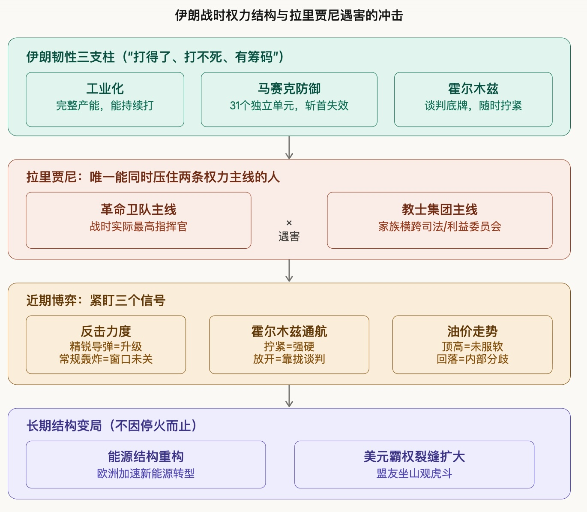

## 德说-第464期, 美以伊战争的拐点，来了？  
  
### 作者  
digoal  
  
### 日期  
2026-03-29  
  
### 标签  
美国 , 伊朗 , 以色列 , 战争拐点 , 欧洲能源体系转型 , 美元霸权裂缝 , 黄金  
  
----  
  
## 背景  
  
**伊朗最重要的一颗棋子，被打掉了。战争的拐点，来了？**  
  
著名财经频道柏年说博主进行了逻辑非常清晰的分析, 原文: https://mp.weixin.qq.com/s/_2YWsMExM1q6LAFI3CFenw  
  
表面上，这是一次斩首行动的延续 —— 美以联手，精准打击，伊朗高层一个个被清出局。  
  
但这次不一样。拉里贾尼的位置，不是可以被简单替补的。  
  
革命卫队听他的，教士集团认他的，各方利益到了他这里才能达成一个统一的方向。  
  
他走了，革命卫队的31个独立作战单元、教士集团、四股抵抗力量，没有人能同时压住这些势力。  
  
特朗普以为拔掉一颗棋，局就活了。  
  
但事情的发展很可能恰恰相反，他拔掉的是伊朗内部唯一能压住全局的那枚棋。  
  
从此这盘棋，更乱了。  
  
**逻辑推演请看原文 ... 本文关注柏年说博主后面提出的几个问题, 我想用AI以投行分析师视角来回答这几个问题, 后面再对照柏年说博主后续文章看看是否能匹配上.**  
  
历史的逻辑从来都是这样：乱局之后，旧的秩序松动，新的格局成型。  
  
对我们普通人来说，看清楚这场仗在加速什么，在改变什么，在重塑什么，要比盯着每天的战报更加重要。  
  
那么，在这场全球能源与美元霸权加速破裂的过程中，除了黄金，还有哪些资产可能复刻70年代的避险行情？  
  
在欧洲不得不大量进口基础设施、加速能源转型的背景下，中国的出海链条里又蕴藏着怎样的机遇？  
  
---  
  
以下是基于原文内容的整理分析，以及续写的投行视角结尾。  
  
**核心论点梳理**  
  
原文的分析框架是：拉里贾尼遇害，打断的不是一个人，而是伊朗战时权力结构的神经中枢。文章分四层递进：伊朗的韧性基础 → 此次打击的真实意义 → 近期博弈信号 → 长期结构性变局。  
  
以下是结构图，帮助理解各层逻辑关系：  
  
  
  
**续写（投行分析师视角）**  
  
在这场战争加速重构全球能源与货币体系的背景下，作为投行分析师，我们需要回答的不是"局势走向哪里"，而是"哪些资产将系统性受益"。以下是我们的研判框架。  
  
**一、能复刻1970年代的资产，远不止黄金**  
  
1973年第一次石油危机之后，受益最深的不只是黄金，而是整个实物资产体系的重新定价。当前局势与彼时有一个关键共性：供给端的地缘政治溢价被永久性抬高。  
  
黄金的逻辑是清晰的：美元信用受损 + 实际利率存在下行空间 + 各国央行去美元化加速配置。但黄金已在定价中充分反映了避险溢价，边际收益不如70年代那般丰厚。  
  
更值得关注的是**能源类大宗商品及其上游权益资产**。霍尔木兹的持续不稳定，使市场对中东原油供应通道的长期风险溢价重新定价。西德克萨斯中质油（WTI）和布伦特原油的远期曲线结构，已开始反映这种溢价，但资本市场对美国页岩油服务商、加拿大油砂、北海深水项目的权益估值仍相对保守 —— 这是一个尚未充分定价的窗口。  
  
白银与铂族金属同样值得关注。70年代白银的涨幅超越黄金，驱动力并非单纯避险，而是工业需求与货币属性的双重共振。当前白银在光伏产业中的用量持续攀升，新能源转型加速恰好为其提供了额外的需求支撑。  
  
**二、欧洲能源转型：中国出海链条的隐性红利**  
  
欧洲的处境可以用一句话概括：它同时承受着化石能源依赖的惩罚，和转型太慢的代价。这场战争正在强制性地加速欧洲能源基础设施的投资周期。  
  
从供应链角度拆解，欧洲能源转型的大规模推进，将系统性利好中国出海链条中的以下环节：  
  
其一是**光伏组件与逆变器**。欧洲本土制造成本远高于中国，在能源安全焦虑倒逼装机规模快速扩张的情况下，短期内仍将严重依赖中国供应。尽管欧盟的双反调查持续施压，但能源紧迫性会在政治层面产生对冲。  
  
其二是**海上风电核心部件**。欧洲海上风电扩张计划中，单桩基础、海缆、升压站等重型部件的本土产能严重不足。中国企业在这一领域的制造成本优势和产能规模，构成了难以在3至5年内被替代的竞争壁垒。  
  
其三是**储能系统**。欧洲电网在新能源高渗透率下的调峰压力，推动了大型储能项目的招标加速。宁德时代、比亚迪等企业已在欧洲多国取得项目落地资格，这条链条的订单能见度正在提升。  
  
其四是**电网改造相关的特高压与配电设备**。这是一个容易被忽视的细分领域。欧洲现有电网基础设施老化严重，难以承载大规模分布式新能源的接入。特变电工、许继电气等企业的出海步伐，值得密切跟踪。  
  
**三、风险提示**  
  
以上判断建立在几个前提假设之上，若以下变量出现反转，上述逻辑需要重新评估：  
- 第一，若伊朗内部出现强力整合者，谈判进程大幅提速，地缘溢价快速消退；  
- 第二，若欧盟在政治压力下大幅强化对华贸易壁垒，中国出海链条的欧洲市场准入将系统性收窄；  
- 第三，若美联储因通胀超预期而被迫维持高利率，实物资产的再定价将面临更长的等待周期。  
  
我们的核心结论是：**这场战争加速的不是某个单一资产的上涨，而是整个实物资产体系相对于金融资产的重新定价**。这种重定价的节奏，将与霍尔木兹的通航状态、油价中枢的位置，以及伊朗内部权力整合的进展，保持高度同步。  
  
  
#### [PostgreSQL 解决方案集合](../201706/20170601_02.md "40cff096e9ed7122c512b35d8561d9c8")
  
  
#### [德哥 / digoal's Github - 公益是一辈子的事.](https://github.com/digoal/blog/blob/master/README.md "22709685feb7cab07d30f30387f0a9ae")
  
  
#### [About 德哥](https://github.com/digoal/blog/blob/master/me/readme.md "a37735981e7704886ffd590565582dd0")
  
  

  
