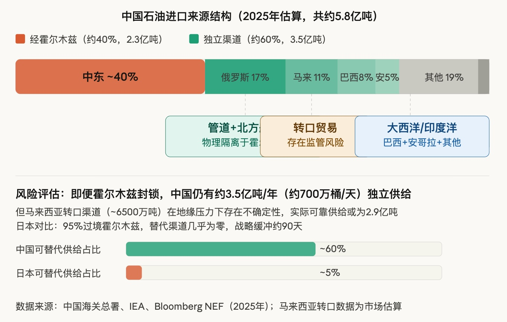

## 霍尔木兹封锁压力测试：中国能源安全的三层防御体系  
  
### 作者  
digoal  
  
### 日期  
2026-03-30  
  
### 标签  
能源安全 , 防御体系  
  
----  
  
## 背景  
  
先放一张供应来源的结构图：  
  
  
  
## 前言：先把数字对齐  
  
中国是全球第一大石油进口国，2025年进口量约5.8亿吨（约1155万桶/天）。美国约630万桶/天，印度约500万桶/天。这个体量意味着：按照线性逻辑，霍尔木兹海峡封锁对中国的冲击理应最大。  
  
然而现实是：七国集团紧急开会，IEA史无前例地宣布联合释放4亿桶战略储备，日本、美国争相跟进 —— 西方一片恐慌，而中国保持沉默。  
  
这不是偶然。我将从供给侧、需求侧和结构性转型三个维度，还原这盘棋的真实逻辑 —— 同时指出那些被情绪叙事所掩盖的真实风险。  
  
  
  
## 第一层防御：供给多元化  
  
中国通过霍尔木兹海峡的石油进口约占总量的40%，这意味着即便海峡封锁，仍有约60%的供给渠道物理上独立于此。  
  
**几条关键渠道：**  
  
俄罗斯是最重要的非中东来源，2025年供货约1亿吨（占比约17%），走西伯利亚力量管道和ESPO（东西伯利亚-太平洋）管道，以及北冰洋航线，与霍尔木兹完全脱钩。双方的绑定是结构性的 —— 俄罗斯在制裁压力下需要买家，中国需要稳定的非中东供给，利益高度一致，这条通道的可靠性在可预见未来相当高。  
  
巴西走大西洋航线，安哥拉走印度洋西侧，两者合计约占7500万吨，与霍尔木兹毫无关联。  
  
**但来自马来西亚的数据需要拆解：**  
  
中国2025年从马来西亚进口了约6500万吨原油，而马来西亚自身年产量仅约2000万吨。差额来自什么？业内没有秘密：这是以马来西亚为中转的第三方贸易，主要涉及受制裁的伊朗石油。  
  
在地缘压力陡升的封锁场景下，这条渠道恰恰是最脆弱的一环 —— 美国可能对参与中转的马来西亚贸易商实施次级制裁，渠道规模会迅速收缩。因此，中国可靠的独立供给，实际上应扣除这部分的不确定性。  
  
**陆路备份的战略价值：**  
  
中巴经济走廊（CPEC）和瓜达尔港的价值是真实的，但需要说明的是：目前陆路通道的实际运力仍然有限，更多属于中长期战略布局，而非近期可全量启用的备用管道。中缅油气管道同理，实际过境量远低于理论容量上限。  
  
**战略储备：**  
  
中国约从2003年开始系统建设战略石油储备（SPR），目前已基本达到IEA标准的90天使用量。这意味着即便在最坏的场景下，有一个完整的外交谈判窗口期可供缓冲。此次IEA联合释放4亿桶储备，中国选择静观 —— 不是没有牌，而是牌还用不上。  
  
  
  
## 第二层防御：需求侧的煤化工替代能力  
  
中国每年约消耗石油7.7亿吨，其中大约60%用于交通燃烧，40%用于化工原料（生产塑料、化纤、合成橡胶等）。这40%的化工需求，技术上可以通过煤化工路线替代 —— 煤制油、煤制烯烃等已有成熟产业链，中国是全球在该领域产能最大的国家。  
  
**经济学逻辑是自洽的：** 正常油价60美元以下时，煤化工成本偏高，没有大规模转产的经济动力；一旦油价冲破80美元甚至更高（封锁场景必然如此），煤化工的盈利窗口打开，产能利用率会自然提升。这是一种"价格触发型"的对冲机制，不需要行政指令介入。  
  
**但这里必须补一个现实约束：**  
  
规模切换需要时间。现有煤化工产能的快速爬坡、原料煤的调配、物流体系的重组，在封锁发生的初期数月内，不可能完全填补缺口。短期冲击依然会传导到国内成品油价格和化工品供给。  
  
此外，煤化工的碳排放强度显著高于石油路线，大规模启用会与中国的绿色转型目标产生张力，政策层面需要权衡。  
  
  
  
## 第三层防御：能源结构性转型  
  
这是时间维度最长、但最具战略意义的一张牌。  
  
**电力侧：** 中国发电结构与欧美有根本性区别。根据国家能源局2025年数据，全年总发电量约10.4万亿千瓦时，煤电占约60%，而气电装机占比不足4%。这意味着欧洲式的"天然气价格冲击→电价暴涨→工业停摆"的传导链条，在中国基本不成立。  
  
**新能源装机：** 截至2025年底，中国风电装机约6.4亿千瓦，光伏装机约12亿千瓦，合计18.4亿千瓦，远超2030年目标。2025年新能源新增发电量占全社会新增用电量的97.1%，增量供给几乎全由清洁能源承接。  
  
**交通侧：** 据彭博新能源财经测算，2025年中国新能源汽车保有量接近4400万辆，每年替代的成品油消耗超过7400万吨，折算原油约9000万吨。需要说明的是，这是基于模型假设的测算数据，存在一定的上下行偏差。但量级上的参考价值是真实的：这相当于接近日本全年石油进口总量（约1.2亿吨）。随着新车渗透率持续提升（2025年已超59%），这个数字只会单向增长。  
  
**对外影响：** 中国向全球供应约70%的光伏组件和约60%的风电设备，推动全球光伏发电成本下降超过80%、风电成本下降超过60%。在全球能源转型加速的背景下，中国不仅是能源安全的受益者，也是全球能源成本重塑的定价方之一。  
  
  
  
## 综合评估：真实的底气，与真实的风险  
  
把三层防御叠加来看：  
  
供给侧，60%的独立渠道加上90天战略储备，为外交斡旋提供了充足缓冲；需求侧，煤化工替代能力构建了一道价格触发型的对冲机制；结构侧，新能源转型正在系统性降低石油在中国能源体系中的权重。  
  
这套布局不是临时应急，而是过去十五年间国家战略层面的系统性投入。  
  
**但有几个风险点不能忽视：**  
  
第一，马来西亚转口渠道在封锁场景下的可持续性存在重大不确定性，实际可靠独立供给可能低于60%。第二，煤化工替代有技术可行性，但规模切换存在数月至一年以上的时滞，封锁初期的价格冲击不可低估。第三，陆路备用通道（瓜达尔港、中缅管道）目前实际运力仍然有限，中长期价值大于近期应急价值。  
  
**结论是：**  
  
中国面对霍尔木兹封锁的从容，不是无视风险，而是风险已被多层缓冲吸收到了可管理的范围。当日本在计算"储备还能撑几天"时，中国已在计算"哪些渠道可以加量、哪些产能可以切换、哪一层防御先启动"。  
  
这不是运气，是提前布局的红利。  
  
  
  
*注：本文数据来源包括中国海关总署、国家能源局、IEA、彭博新能源财经等，马来西亚转口数据为市场估算，部分新能源节油数据为模型测算值。*  
  
  
