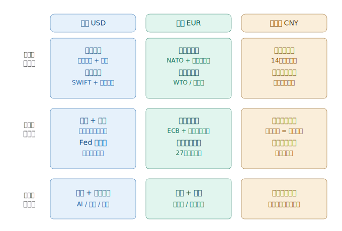

## 德说-第469期, 货币的锚：一个被低估的核心命题  
  
### 作者  
digoal  
  
### 日期  
2026-04-12  
  
### 标签  
结算货币 , 美元霸权 , 利弊 , 三足鼎立 , 锚  
  
----  
  
## 背景  
美元、人民币、欧元的锚是什么?  
  
这是一个需要跨越经济学、地缘政治、历史和哲学边界才能真正回答的问题。让我从根本开始重建这个框架。  
  
"货币的锚"本质上是在问：为什么全世界愿意持有这种纸？  
  
## 首先，货币的"锚"是什么？一个更精确的定义  
  
货币的锚不是"用什么商品支撑"，而是回答一个更深的问题：  
  
> **全世界为什么愿意在没有强制的情况下，自愿接受并持有这张纸？它背后绑定的真实价值是什么？**  
  
货币的锚不是单一的，它是一个价值网络 —— 由军事、经济、制度、网络效应、心理预期共同编织而成。任何单一锚点都是脆弱的，组合才是真正的信用基础。  
  
这个问题的答案，可以分解为三个层次：  
  
- 第一层：**交换锚** —— 它能换到什么东西？（商品、服务、资产）  
- 第二层：**制度锚** —— 谁来保证它的承诺不被违背？（法律、央行独立性、产权保护）  
- 第三层：**权力锚** —— 谁在背后撑腰？（军事、网络效应、历史惯性）  
  
三层缺一不可。金本位崩溃的教训是：单一实物锚太脆弱。布雷顿森林体系的教训是：锚必须与真实经济实力匹配。而今天的货币战争，本质上是三大货币在这三个层次上的竞争。现在让我对三种货币逐一深挖，尤其是你最感兴趣的欧元。  
  
  
  
## 美元的锚：不是"商品"，是"不可或缺性"  
  
你举的 AI 服务是对的，但只是表面。美元锚的本质比这深得多——它锚定的是**全球经济运转本身对美元的依赖**。  
  
美元最核心的锚，是**石油美元体系**与**美债市场**的双重循环：全球买石油必须用美元，产油国赚到美元后买美国国债，美国用这笔钱维持军事存在保护产油国……这是一个自我强化的闭环，与任何具体商品无关。  
  
其次是**金融基础设施的垄断**：SWIFT、CHIPS清算系统、CME期货定价、美国评级机构——全球大宗商品从铜到大豆几乎都以美元计价。这不是因为美国东西好，而是因为历史路径依赖太深，切换成本极高。  
  
AI 和科技是**第三代锚**，是正在形成中的新支撑。AWS、Google Cloud、OpenAI——全球企业的数字基础设施越来越运行在美国平台上，产生的数据和计算资源以美元计费，这确实是新型的"必须持有美元才能运转"的逻辑。  
  
但美元最大的弱点暴露了：它的锚越来越依赖**惯性和强制**，而非真实价值创造。一旦美国将美元武器化（冻结俄罗斯外储），全球开始重新评估：我为什么要持有一种随时可能被没收的资产？  
  
---  
  
## 人民币的锚：不是"商品"，是"世界工厂的不可替代性"  
  
你说"中国制造的商品"，这是对的，但需要精确化。人民币锚定的不是某类商品，而是**全球制造业供应链的完整性**——这是一个任何单一国家都无法复制的生态系统。  
  
中国同时拥有：稀土开采和提炼（全球 60%+ 产能）、中间品制造（从螺丝到芯片封装）、整机组装、物流港口、配套服务业。这个"全谱系"是关键——印度可以做组装，越南可以做低端，但没有任何国家能同时替代全部。  
  
这让人民币有了一个非常独特的锚：**你可以不喜欢中国，但你无法不与中国做生意**。即便在中美脱钩的叙事中，苹果 2025 年仍有约 90% 的 iPhone 在中国组装。  
  
但人民币锚的致命弱点在于：**制造业的锚是"你需要我的产品"，而不是"你需要持有我的货币"**。买中国商品可以先换成美元再交易，不需要持有人民币。这就是为什么人民币的制造业锚至今没有转化为真正的货币储备需求——它缺少那个"必须用人民币结算"的强制节点。  
  
人民币真正在做的是把这种制造业影响力转化为货币需求：通过一带一路以人民币贷款、通过石油人民币协议、通过数字人民币的跨境支付——本质上是在**人为制造人民币结算的"必要性"**。  
  
---  
  
## 欧元的锚：这是最值得深思的问题  
  
欧元的锚是三者中最复杂、也最脆弱的，因为它**没有一个单一的强力支撑点**，而是靠多个相互交织的软性锚维持。  
  
### 欧元的锚，共有五层：  
  
**第一层：规范与标准的输出能力（最被低估）**  
  
这是你举例中没提到，但可能是欧元最独特的锚。欧盟是全球最强大的"规则出口机器"——GDPR 数据保护标准、碳边界调节机制（CBAM）、AI 监管法案……任何想进入欧洲市场的企业，必须遵守欧盟标准。这被称为"布鲁塞尔效应"：欧盟的规则事实上成为了全球规则，因为任何跨国公司只能执行最严格的那套标准。  
  
这意味着：**做生意要进欧洲市场，就必须与欧元体系打交道**。不是因为欧洲的产品最好，而是因为欧洲的门槛最高、市场最大、规则最难绕过。  
  
**第二层：高端制造与"无可替代"的细分垄断**  
  
德国的机床、精密零件、工业软件（西门子 PLM），法国的奢侈品和航空（空客），北欧的医疗设备和绿色技术——这些不是"商品"，而是**全球产业链中无法被替代的关键节点**。  
  
奔驰一台发动机里有 300 多家德国中小企业的零件，这种深度垂直整合形成的护城河，任何后发国家都需要数十年才能复制。欧元的交换锚，锚定的正是这种"别人做不到的精度和可靠性"。  
  
**第三层：能源转型的先发优势（正在形成的新锚）**  
  
这是欧元未来最重要的潜在锚，目前被严重低估。欧洲在风能、太阳能、氢能、电网技术上的积累，加上碳边境税的实施，正在构建一套以欧元定价的**绿色经济标准体系**。  
  
如果未来全球脱碳是不可逆趋势，那么"碳信用额度"、"绿色认证"、"可再生能源技术"将成为新的战略资源，而这套标准体系的定义权在布鲁塞尔手中，结算货币自然是欧元。这相当于欧洲在下一个能源文明的"石油美元"位置上提前布局。  
  
**第四层：超国家制度本身（最独特也最脆弱）**  
  
欧元是人类历史上第一个**没有对应国家的主权货币**——它是 27 个主权国家将货币主权让渡给一个超国家机构的产物。这本身就是一种信用：如此复杂的政治工程能够维持，证明欧洲的制度协调能力具有极高的可信度。  
  
但这也是欧元最大的弱点。希腊债务危机、英国脱欧、意大利财政争议——每一次内部分裂都在消耗这种制度信用。欧元没有"最后贷款人"，ECB 在政治上无法像美联储那样随意行动，这使得欧元在危机时刻总是慢半拍。  
  
**第五层：历史与地理的"中间人"地位**  
  
欧洲地处美国与亚洲之间，连接非洲，是全球贸易的传统枢纽。欧元区同时是美国最大的贸易伙伴和中国最重要的市场之一。这种地理与历史形成的中间人角色，让欧元天然具有"两边都要打交道"的必要性。  
  
---  
  
## 三种锚的本质对比  
  
维度	| 美元	| 欧元	| 人民币  
---|---|---|---  
核心锚定物	| 不可替代的基础设施：石油定价权、SWIFT、美债市场、科技平台	| 规则制定权 + 无可替代的细分制造 + 全球最大单一消费市场准入	| 全谱系制造业不可替代性 + 最大增长市场准入 + 国家信用背书  
锚的逻辑	| 你必须用美元运转全球经济	| 你必须遵守欧洲规则才能进入市场	| 你必须与中国做生意，但不一定用人民币  
最大优势	| 历史惯性极深，切换成本极高，避险需求天然流向美元	| 制度中立性强，非武器化，各国愿意持有	| 制造业锚最真实，中国经济体量庞大  
核心脆弱点	| 武器化侵蚀信任；财政赤字无上限；Fed 独立性受政治压力	| 27国共识脆弱；无统一财政；缺军事硬实力；能源依赖	| 资本管制阻碍国际化；法治预期不稳；制造业锚≠货币需求  
新兴锚（未来）	| AI 算力定价权、数字美元、科技平台铸币税	| 碳定价权、绿色技术标准、数字欧元	| 数字人民币跨境、大宗商品人民币定价、CIPS 扩展  
一句话本质	| "世界离不开美元清算"	| "世界离不开欧洲标准"	| "世界离不开中国工厂"  
  
## 最深层的洞察：锚的"转化效率"才是关键  
  
这里有一个被大多数分析忽略的核心问题：**拥有真实价值不等于拥有货币权力**，关键在于能否把真实价值转化为"必须持有我的货币"的需求。  
  
美元的转化效率最高——石油定价权直接创造了全球对美元的刚性需求，不持有美元就没法买石油。  
  
欧元的转化效率居中——进入欧洲市场需要遵守规则，但不一定长期持有欧元，只是在交易时需要换汇。欧元的短板在于它缺少一个"必须用欧元结算"的强制节点，就像石油之于美元那样。  
  
人民币的转化效率最低——这正是中国面临的核心矛盾。全世界依赖中国制造，但你只需要在交货时把人民币换成美元就够了，没有理由长期持有人民币资产。中国正在试图通过数字人民币、大宗商品定价、一带一路债务创造这个强制节点，但至今尚未成功。  
  
---  
  
## 一个终极视角：货币的锚是"文明输出能力"  
  
退后一步看，三种货币的锚，本质上对应三种不同的文明影响力输出模式：  
  
美元输出的是**规则与秩序**——我来定义全球游戏规则，你用我的货币就是接受我的规则。  
  
欧元输出的是**标准与价值观**——我来定义什么叫"好的"产品、"好的"治理，你想进我的市场就得达到我的标准。  
  
人民币输出的是**能力与效率**——我能帮你建基础设施、帮你生产商品，代价是你接受我的货币计价。  
  
三者都在争夺同一件事：**让全球其他地区为了获得自己想要的东西，不得不持有自己的货币**。区别在于"想要的东西"是什么——是秩序、是标准，还是能力。  
  
而在这场竞争中，欧元面临的挑战最为微妙：它的标准输出非常强大，但没有军事硬实力保驾护航，也没有像石油美元那样的强制结算节点。欧元在某种意义上是三者中最"文明"的货币——它的锚最依赖于各国的自愿接受，而非强制——这既是它的道德优势，也是它在极端情景下最脆弱的地方。  
  
  
#### [PostgreSQL 解决方案集合](../201706/20170601_02.md "40cff096e9ed7122c512b35d8561d9c8")
  
  
#### [德哥 / digoal's Github - 公益是一辈子的事.](https://github.com/digoal/blog/blob/master/README.md "22709685feb7cab07d30f30387f0a9ae")
  
  
#### [About 德哥](https://github.com/digoal/blog/blob/master/me/readme.md "a37735981e7704886ffd590565582dd0")
  
  

  
