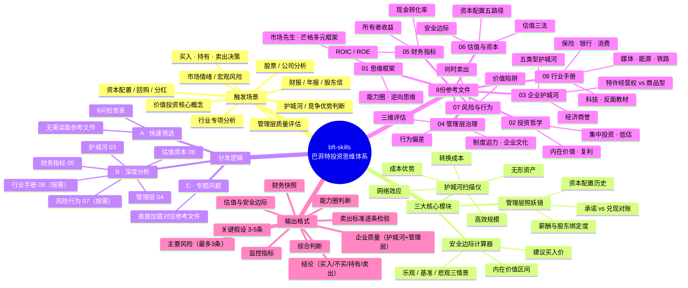

## 巴菲特被蒸馏了  
  
### 作者  
digoal  
  
### 日期  
2026-04-14  
  
### 标签  
AI , 技能 , skill , claude code , 巴菲特  
  
----  
  
## 背景  
  
无意间看到一个开源项目: https://github.com/agi-now/buffett-skills  
  
基于 沃伦·巴菲特 投资框架构建的 Claude Code skills 合集。  
  
## 脑图如下  
  

  
## Skills 使用方法  
  
### 安装  
  
克隆本仓库，然后将 `skills/buffett` 目录复制到你的项目中即可：  
  
```bash  
git clone --depth 1 https://github.com/agi-now/buffett-skills /tmp/buffett-skills  
  
cd your-project  
mkdir -p .claude/skills  
mv /tmp/buffett-skills/skills/buffett your-project/.claude/skills/  
```  
  
buffett 放在项目根目录 `.claude/skills/` 下：  
  
```  
your-project/  
└── .claude/  
    └── skills/  
        └── buffett/          ← 这个文件夹  
            ├── SKILL.md  
            └── references/  
                ├── 01-thinking-frameworks.md  
                ├── 02-investment-philosophy.md  
                ├── 03-business-moat.md  
                ├── 04-management-governance.md  
                ├── 05-financial-metrics.md  
                ├── 06-valuation-capital.md  
                ├── 07-risk-behavior.md  
                └── 08-industry-playbooks.md  
```  
  
Claude Code 会自动发现 `.claude/skills/<name>/SKILL.md` 下的 skill，无需任何注册操作。  
  
### `buffett` — 巴菲特投资思维体系  
  
激活巴菲特完整的投资思维体系，覆盖从快速筛选到深度分析的完整流程，输出结构化分析报告，并包含各行业专项手册。  
  
**以下场景自动触发：**  
- 分析任何股票或公司  
- 评估投资机会  
- 解读财报、年报或股东信  
- 判断企业护城河或竞争优势  
- 评估管理层质量与诚信  
- 做买入 / 持有 / 卖出决策  
- 讨论价值投资核心概念（复利、内在价值、安全边际、能力圈、市场先生）  
- 分析特定行业（保险、银行、消费、媒体、能源、铁路、科技）  
- 处理资本配置、回购或分红问题  
- 判断市场情绪与宏观风险  
  
不需要提到"巴菲特" —— 只要涉及投资分析或企业质量判断，均自动触发。  
  
  
## Skill 结构  
  
`buffett` skill 采用**渐进式加载**设计：`SKILL.md` 始终加载，8 个参考文件按需读取。  
  
### 分发逻辑  
  
| 路径 | 触发场景 | 读取文件 |  
|------|---------|---------|  
| **A · 快速筛选** | "这值得深入分析吗？" | 无，直接用 8 问检查表 |  
| **B · 深度分析** | 完整公司评估 | `03→04→05→06`，按需补充 `08`（行业）和 `07`（风险） |  
| **C · 专题问题** | 特定概念或决策 | 直接加载对应参考文件 |  
  
### 参考文件  
  
| 文件 | 内容 |  
|------|------|  
| `01-thinking-frameworks.md` | 能力圈、逆向思维、市场先生、长期主义、芒格多元框架 |  
| `02-investment-philosophy.md` | 内在价值、复利、低估、集中投资、有效市场理论反驳 |  
| `03-business-moat.md` | 护城河五类型、特许经营权 vs 商品型企业、经济商誉 |  
| `04-management-governance.md` | 管理层三维评估、制度迫力、企业文化、公司治理 |  
| `05-financial-metrics.md` | 所有者收益、ROIC/ROE、现金转化率、透视盈余 |  
| `06-valuation-capital.md` | 估值三法、安全边际、资本配置五路径 |  
| `07-risk-behavior.md` | 何时卖出、价值陷阱、杠杆、通胀、衍生品、行为偏差 |  
| `08-industry-playbooks.md` | 保险、银行、消费、媒体、能源、铁路、科技、反面教材 |  
  
### 输出格式  
  
每次分析均遵循固定模板，所有章节必须输出：  
  
- **结论** — 买入 / 不买 / 持续观察 / 持有 / 卖出 + 一句话核心理由  
- **能力圈判断** — 在圈内 / 圈外 / 边界区域  
- **关键假设** — 决策成立所依赖的 3-5 条核心假设  
- **企业质量** — 护城河类型 + 强弱趋势、管理层评估  
- **财务快照** — ROIC、现金转化率、所有者收益估算  
- **估值** — 内在价值区间、安全边际%、建议买入价  
- **卖出标准逐条检验** — 四条卖出标准逐条判断（持有/卖出场景必须输出）  
- **主要风险** — 最多 3 条，聚焦最关键的  
- **监控指标** — 季度检查项和触发卖出的信号  
- **综合判断** — 用巴菲特的视角直接给出决策建议  
  
## 评测结果  
  
在 3 个测试用例（苹果股票分析、银行业框架、茅台持有/卖出）上的 benchmark：  
  
| 指标 | 有 skill | 无 skill | 差值 |  
|------|---------|---------|------|  
| 通过率 | **100%**（15/15） | 66.7%（10/15） | **+33%** |  
| 平均 tokens | 43,353 | 12,524 | +30,829 |  
| 平均耗时 | 154.4s | 95.2s | +59.2s |  
  
skill 的核心价值在于系统性读取参考文件（11+ 次 vs 2 次工具调用）和严格遵循输出格式。额外的 token 和时间开销是分析深度的代价。  
  
## 对比 TradingAgents  
  
对比 https://github.com/TauricResearch/TradingAgents  
  
TradingAgents 用法参考 [《把 MiniMax 接入 Claude, 给 TradingAgents 添加 MiniMax 模型供应商支持》](../202603/20260330_07.md)  
  
我只能说: 巴菲特.skill 还是太嫩了, 如果你想深度分析某只股票, 目前我看只有 TradingAgents .  
  
  
