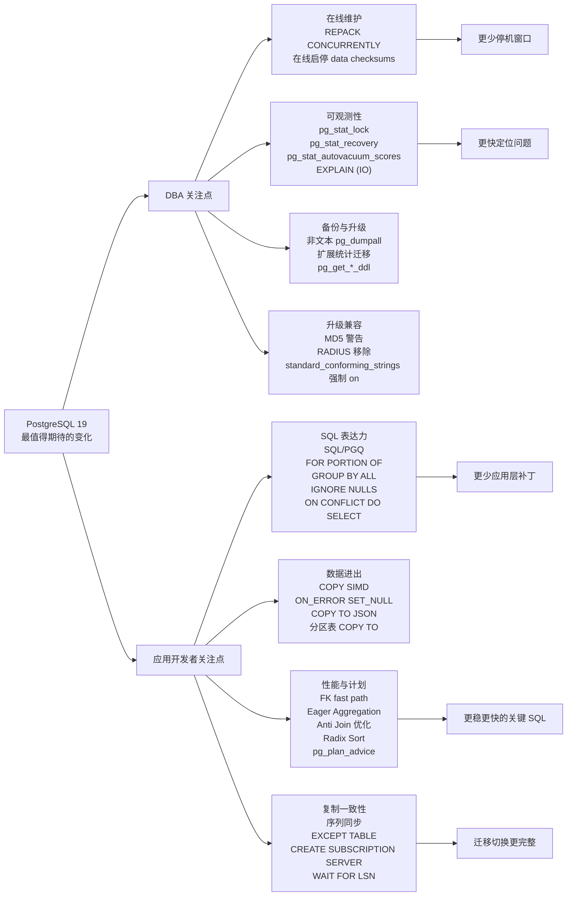

## Bruce 连夜发布 PostgreSQL 19 release notes, 重新整理 PG 19 最有价值新特性解读  
  
### 作者  
digoal  
  
### 日期  
2026-04-15  
  
### 标签  
PostgreSQL , 19 , 新特性  
  
----  
  
## 背景  
  
之前通过对 commit log 分析, 发过一期 19 新特性分享, 今天有了 bruce 老师的 release notes, 这份特性解读更准确了.  
  
[《用 AI 分析 PostgreSQL 19 最值得期待的特性》](../202604/20260408_13.md)  
  
PostgreSQL 19 的主线, 不是某一个惊艳语法, 而是三个方向同时向前走了一大步: 运维动作越来越在线化, 复制与导入导出越来越接近真实生产场景, 优化器和观测系统越来越能解释自己。  
  
如果把这些 commit 放在 DBA 和应用开发者的日常痛点里看, PG19 最值得期待的地方是: 过去要停机、要手工绕路、要靠经验猜的操作, 正在变成数据库内核可理解、可监控、可自动化执行的能力。  
  

  
## 升级前先看的兼容性变化  
  
1、release notes 的迁移章节里有几项不一定“酷”, 但会直接影响升级评估的变化。相关提交为 `1d92e0c2`, `bc60ee86`, `a1643d40`, `45762084`, `b380a56a3`, `79534f90`, `de28140de`。  
  
一句话简介: PG19 开始更明确地推动安全认证和旧兼容行为退场: MD5 认证会警告, 密码过期可提前警告, RADIUS 支持被移除, `standard_conforming_strings` 在服务端强制为 `on`, `max_locks_per_transactions` 默认从 64 调到 128。  
  
出现背景: 很多老集群长期依赖旧认证、旧字符串转义语义或历史配置默认值。它们平时不显眼, 但一到大版本升级就会变成阻塞项。  
  
解决痛点: DBA 可以在升级前用明确清单做兼容性扫描, 而不是等应用连接失败或 SQL 行为变化后再补救。  
  
方法和原理: `password_expiration_warning_threshold` 默认提前 7 天在成功密码认证后发出即将过期警告; MD5 password 认证成功时会发 WARNING, 可由 `md5_password_warnings` 控制; RADIUS/UDP 因安全缺陷被移除; 服务端不再允许 `standard_conforming_strings = off`, 同时移除无意义的 `escape_string_warning`; 锁表内存布局改变后, `max_locks_per_transactions` 默认翻倍, 但如果用户在配置文件里显式设置了旧值, release notes 提醒需要自行重新评估容量。  
  
效果对比: 补丁前, 一些危险或过时路径仍能静默运行; 补丁后, 安全风险更早暴露, 但旧应用也更容易在升级时被迫修正。  
  
用法:  
  
```sql  
-- 查找仍使用 MD5 口令的角色, 升级前应迁移到 SCRAM。  
SELECT rolname  
FROM pg_authid  
WHERE rolpassword LIKE 'md5%';  
  
-- 提前 14 天提醒密码即将过期; 设置为 0 可关闭该提醒。  
ALTER SYSTEM SET password_expiration_warning_threshold = 14;  
  
-- 如果历史配置显式设置过 max_locks_per_transaction, 升级前重新评估。  
SHOW max_locks_per_transaction;  
ALTER SYSTEM SET max_locks_per_transaction = 128;  
```  
  
最佳实践: 升级演练时先跑认证、角色、HBA、显式 GUC 配置检查。尤其要查 RADIUS、MD5、`standard_conforming_strings = off`、自定义 `max_locks_per_transaction`、postgres_fdw 读写事务语义这些点, 因为它们不一定会在单元测试里暴露。  
  
## 维护窗口正在被压缩: REPACK 和在线 checksum  
  
2、数据库膨胀治理过去绕不开两个名字: `VACUUM FULL` 和 `CLUSTER`。前者回收空间但锁重, 后者按索引重排但概念容易和集群混淆。PG19 引入 `REPACK`, 把这两类“重写表”的操作收敛成一个更清晰的命令, 并进一步提供并发模式。相关提交为 `ac58465e`, `28d534e2`, `e76d8c74`。  
  
一句话简介: `REPACK` 是 PostgreSQL 内置化的表重写入口, `REPACK (CONCURRENTLY)` 让重写期间应用仍能正常读写原表, 只有最终切换 relfilenode 时需要短暂强锁。  
  
出现背景: 生产库最怕的不是一次慢查询, 而是“必须做, 但一做就挡业务”的维护操作。膨胀表需要重写, 但传统 `VACUUM FULL` 需要长时间 `ACCESS EXCLUSIVE` 锁; `CLUSTER` 又承担排序重写的语义, 名字和用途都不够直观。  
  
解决痛点: DBA 不再需要在“空间回收”和“业务可用性”之间做二选一。对大表而言, 重写耗时可能是小时级; PG19 的并发 repack 把大部分耗时阶段放在低锁级别下执行, 把阻塞窗口压缩到最后切换阶段。  
  
方法和原理: `REPACK` 先在 MVCC 快照下复制旧表数据到新物理文件, 并在快照位置建立专用逻辑复制槽。复制期间应用对旧表的增删改不会丢失, 后台 worker 通过逻辑解码把并发变更写入 stash, 最终在交换 relfilenode 前回放这些变更。`e76d8c74` 又引入 `max_repack_replication_slots`, 为 concurrent repack 单独预留复制槽, 避免和普通逻辑复制槽抢资源。  
  
效果对比: 补丁前, 大表空间整理往往意味着长时间阻塞写入甚至读取; 补丁后, 初始复制阶段只需要类似 vacuum 的较低锁级别, 应用持续访问旧表, 最后短暂切换。代价是需要额外磁盘空间、逻辑解码资源、后台 worker 和复制槽配额。  
  
用法:  
  
```sql  
REPACK my_big_table;  
REPACK my_big_table USING INDEX my_big_table_created_at_idx;  
REPACK (CONCURRENTLY) my_big_table USING INDEX;  
REPACK (ANALYZE, VERBOSE) my_big_table (tenant_id, created_at);  
  
SELECT pid, datname, relid::regclass, phase  
FROM pg_stat_progress_repack;  
```  
  
最佳实践: 首次在生产使用 concurrent repack 前, 先确认表有足够重写空间, 设置好 `max_repack_replication_slots`, 并在业务低峰验证最终切换阶段的锁等待。高写入表要重点观察逻辑解码积压和 stash 增长, 不要把它当成完全零成本操作。  
  
3、另一项直接影响生产维护的是在线启停 data checksums, 相关提交为 `f19c0ecc`, `5e13b0f2`。  
  
一句话简介: PG19 可以在集群运行中启用或关闭数据页 checksum, 不再只能在 `initdb` 时决定或离线运行 `pg_checksums`。  
  
出现背景: checksum 是发现存储静默损坏的重要防线, 但很多老集群初始化时没有开启。过去想补上这层保护, 通常要安排停机窗口。随着数据规模变大, 离线扫描全库页的窗口越来越难拿到。  
  
解决痛点: DBA 可以把“补开 checksum”从停机变成在线后台任务, 降低安全加固的组织成本。  
  
方法和原理: PG19 增加 checksum worker launcher, 按数据库启动动态后台 worker, 遍历所有有存储的 relation, 标记 buffer 为 dirty, 让后续写出时计算 checksum。启用过程中存在中间态: 后端会写 checksum 但暂不校验读到的 checksum, 等所有后端通过 procsignal barrier 吸收状态变化后, 才切换为读时校验。关闭 checksum 时也采用类似屏障, 避免读到“状态与页面不同步”导致误报或漏报。`5e13b0f2` 又在 x86 上为页面 checksum 增加 AVX2 路径, 在可用硬件上加速计算。  
  
效果对比: 补丁前, checksum 状态基本是初始化或停机维护时的决定; 补丁后, 可以在线改变, 后台逐步推进, 对业务访问的约束大幅降低。代价是启用期间会带来额外写放大和后台 I/O, 需要纳入维护计划。  
  
用法:  
  
```sql  
-- 在线启用 checksum, 可用 vacuum cost 思路限速。  
SELECT pg_enable_data_checksums(10, 1000);  
  
SELECT name, setting  
FROM pg_settings  
WHERE name = 'data_checksums';  
  
SELECT pid, datname, phase,  
       databases_done, databases_total,  
       relations_done, relations_total,  
       blocks_done, blocks_total  
FROM pg_stat_progress_data_checksums;  
  
-- 如确需关闭 checksum。  
SELECT pg_disable_data_checksums();  
```  
  
最佳实践: 对没有 checksum 的老集群, 优先在只读副本或低峰环境压测启用过程的 I/O 影响; 与备份校验、底层存储巡检配合使用; 不要在已经存在 I/O 饱和的时间段启动全库 checksum 转换。  
  
## 约束、导入和 SQL 语义更贴近应用真实需求  
  
4、外键检查是 OLTP 系统的基础成本。PG19 对外键 referential check 做了 fast path 和批量化优化, 相关提交为 `2da86c1e`, `b7b27eb4`, `e484b0ee`, `5c54c3ed`。  
  
一句话简介: 对常见的非分区主键表外键检查, PG19 绕过 SPI, 直接探测被引用表的唯一索引, 并在 AFTER trigger 批处理中合并探测, commit message 给出的缓存场景基准从单独 fast path 的约 1.8 倍提升到批量后的约 2.9 倍。  
  
出现背景: 大批量插入带外键的明细表时, 每行都要检查父表键是否存在。传统路径通过 SPI 执行内部查询, 权限检查、快照、执行器、索引扫描等开销会在每一行重复出现。  
  
解决痛点: 应用开发者常见的“批量导入订单行、事件明细、账务流水”这类场景, 外键带来的单行触发器成本显著降低; DBA 不必为了导入性能轻易牺牲外键约束。  
  
方法和原理: `2da86c1e` 直接从 FK 值构造 scan key, 对被引用表唯一索引做 index scan, 并以 `LockTupleKeyShare` 锁定匹配 tuple, 同时模拟 SPI 路径需要的权限检查、RLS 语义和 EvalPlanQual 重检。`b7b27eb4` 再把单行探测变成批处理: AFTER trigger 触发周期内缓存 FK 行, 单列 FK 使用 `SK_SEARCHARRAY` 一次提交多个键给索引 AM, 由索引内部排序、去重并有序扫描叶子页; 多列 FK 则回退为循环探测。  
  
效果对比: 补丁前, 100 万行 FK 插入会重复走大量 SPI 和执行器框架; 补丁后, 常见单列 FK 可以共享一次快照、一次权限上下文、一批索引探测。限制是 fast path 不覆盖分区 referenced table 和 temporal FK 语义, CASCADE/SET NULL 等 action trigger 仍走原路径。  
  
用法: 应用 SQL 不需要改, 继续正常定义外键并批量插入。  
  
```sql  
CREATE TABLE customers(id bigint PRIMARY KEY);  
CREATE TABLE orders(  
  id bigint PRIMARY KEY,  
  customer_id bigint NOT NULL REFERENCES customers(id)  
);  
  
INSERT INTO orders  
SELECT g, (g % 100000) + 1  
FROM generate_series(1, 1000000) AS g;  
```  
  
最佳实践: 批量导入时继续保留外键, 但要确保 referenced key 有合适唯一索引, 单列外键收益更明显。对分区父表、复杂多列外键、带级联动作的模型, 仍应按老经验做导入压测。  
  
5、COPY 也变得更像数据工程入口, 相关提交为 `e0a3a3fd`, `2a525cc9`, `bc2f348e`, `7dadd38c`, `4c0390ac`, `4bea91f2`, `266543a6`。  
  
一句话简介: PG19 同时提升 COPY 文本/CSV 导入速度, 增强坏值容忍, 支持多行 header, 让 `COPY TO` 直接输出 JSON/JSON array, 并允许直接导出分区表。  
  
出现背景: 很多数据进入 PostgreSQL 的第一站就是 CSV、文本日志或外部系统导出的半结构化文件。现实文件经常有多行说明头、少量脏字段, 导出给下游又希望直接拿 JSON。  
  
解决痛点: DBA 不必为了几行 header 预处理文件, 应用也不必为了 JSON 导出写额外脚本。遇到类型转换错误时, 可以把列置为 NULL, 而不是整批失败。  
  
方法和原理: `e0a3a3fd` 在 COPY FROM text/csv 路径中用 SIMD 扫描输入 buffer, 成块跳过没有特殊字符的数据; 遇到短行或特殊字符时保守回退, 避免回归。`2a525cc9` 增加 `ON_ERROR SET_NULL`, 类型转换失败时把该列置 NULL, 但 NOT NULL 约束仍照常检查。`bc2f348e` 让 `HEADER` 接受非负整数, 跳过多行 header。`7dadd38c` 和 `4c0390ac` 让 `COPY TO FORMAT JSON` 输出 NDJSON 或顶层 JSON 数组。`4bea91f2` 让 `COPY partitioned_table TO` 直接扫描分区表, 不必再写 `COPY (SELECT * FROM partitioned_table) TO`, 逻辑复制初始同步也可借此加速分区表复制。  
  
效果对比: 补丁前, COPY 每字节扫描特殊字符, 错误处理粒度不够柔性, JSON 导出依赖 `row_to_json()` 或应用层拼装; 补丁后, 大块“干净”文本可以 SIMD 加速, 脏字段可按列降级为 NULL, 下游可以直接消费 JSON。  
  
用法:  
  
```sql  
COPY staging FROM '/data/input.csv'  
WITH (FORMAT csv, HEADER 3, ON_ERROR set_null);  
  
COPY (  
  SELECT id, payload, created_at FROM events  
) TO '/data/events.ndjson'  
WITH (FORMAT json);  
  
COPY (  
  SELECT id, payload FROM events LIMIT 1000  
) TO '/data/events.json'  
WITH (FORMAT json, FORCE_ARRAY true);  
  
COPY sales_partitioned TO '/data/sales.csv'  
WITH (FORMAT csv, HEADER true);  
```  
  
最佳实践: `ON_ERROR SET_NULL` 适合 staging 表, 不适合直接进入强一致业务表; 对关键字段继续保留 NOT NULL 和 CHECK 约束, 让错误在边界暴露。JSON 导出大结果集时优先使用默认 NDJSON, 只有下游明确需要单个 JSON 值时再用 `FORCE_ARRAY`。  
  
6、SQL 语法层面, PG19 加入几项对应用开发者很有用的能力: SQL/PGQ、temporal update/delete、`GROUP BY ALL`、窗口函数 `IGNORE NULLS`、以及 `INSERT ... ON CONFLICT DO SELECT`。相关提交为 `2f094e7a`, `8e72d914`, `ef38a4d9`, `25a30bbd`, `88327092`。  
  
一句话简介: PG19 开始原生支持属性图查询, 能按时间片更新/删除 range/multirange 记录, 简化探索式聚合, 补齐窗口函数忽略 NULL 的标准语义, 并让 upsert 冲突行可以被直接返回。  
  
出现背景: 应用数据模型越来越多样: 图关系、有效期历史、稀疏时间序列、幂等写入都很常见。过去这些需求要么写大量样板 SQL, 要么在应用层补逻辑。  
  
解决痛点: 图查询不再必须离开 PostgreSQL; bitemporal/有效期模型更新不再需要手写拆区间; 报表探索不用反复同步 SELECT list 和 GROUP BY; `lead/lag/first_value/last_value/nth_value` 可以自然跳过 NULL; 幂等插入可以在冲突时拿到已有行而不是再查一次。  
  
方法和原理: SQL/PGQ 引入 `CREATE PROPERTY GRAPH` 和 `GRAPH_TABLE`, 属性图在内部类似 view, rewrite 成标准关系查询执行。`FOR PORTION OF` 根据 range/multirange 列限制目标时间片, 对部分重叠的行自动截断并插入“temporal leftovers”。`GROUP BY ALL` 把 target list 中非 aggregate、非 window 的表达式自动加入 group clause。`IGNORE NULLS` 为窗口执行维护 2-bit null 信息数组, 避免重复求值。`ON CONFLICT DO SELECT` 新增冲突动作, 在 `RETURNING` 中返回已存在行, 可选 `FOR UPDATE/SHARE` 锁定。  
  
效果对比: 补丁前, 这些场景往往需要冗长 SQL、触发器或应用层二次查询; 补丁后, SQL 本身表达业务语义, 优化器也有机会理解这些语义。  
  
用法:  
  
```sql  
-- 探索式聚合  
SELECT region, product, count(*) FROM sales GROUP BY ALL;  
  
-- 稀疏序列取上一个非 NULL 值  
SELECT ts, last_value(v) IGNORE NULLS OVER (ORDER BY ts)  
FROM metrics;  
  
-- 冲突时返回已有行  
INSERT INTO users(email, name)  
VALUES ('a@example.com', 'Alice')  
ON CONFLICT (email) DO SELECT  
RETURNING id, email, name;  
  
-- 时间片更新  
UPDATE price_history  
FOR PORTION OF valid_at FROM DATE '2026-01-01' TO DATE '2026-02-01'  
SET price = price * 1.05;  
```  
  
最佳实践: `GROUP BY ALL` 适合交互式分析, 核心报表 SQL 仍建议显式列出分组键以增强可读性; `ON CONFLICT DO SELECT FOR UPDATE` 要谨慎使用, 它会引入锁语义; temporal 表要先统一 range 边界规范, 否则后续拆分行会增加审计复杂度。  
  
## 优化器更主动, 也第一次给了“计划建议”工具  
  
7、PG19 的优化器改进非常密集, 对用户最有感知的是 eager aggregation、反连接优化、radix sort、LISTEN/NOTIFY 唤醒优化和 plan advice。相关提交为 `8e118591`, `bd94845e`, `3a08a2a8`, `383eb21e`, `cf74558f`, `0da29e4c`, `ef3c3cf6`, `f6bd9f0f`, `282b1cde`, `5883ff30`, `6455e55b`, `e8ec19aa`, `c10edb10`。  
  
一句话简介: PG19 让优化器更早做聚合、更大胆把安全的 `NOT IN`/`LEFT JOIN` 转成 anti join、更快排序, 同时提供 `pg_plan_advice` 和 `pg_stash_advice` 用于稳定或干预计划。  
  
出现背景: 很多性能问题并不是 SQL 写错, 而是优化器拿不到足够结构信息, 或者统计变化导致计划抖动。DBA 常见处境是: 明知道某个 plan 更好, 但缺少官方手段稳定它。  
  
解决痛点: eager aggregation 能减少 join 输入行数; anti join 转换让 `NOT IN` 不再总是 opaque SubPlan; Memoize 可用于唯一内侧的 anti join; radix sort 加速高基数 pass-by-value 排序; LISTEN/NOTIFY 在多 listener 场景中不再唤醒无关后端; plan advice 则为“关键 SQL 的计划稳定”提供内置工具。  
  
方法和原理: eager aggregation 在 scan/join planning 阶段收集 aggregate 和 group key 信息, 为可提前聚合的 relation 创建 grouped RelOptInfo, 在 join 前先部分聚合, 减少后续行数。`NOT IN` 转 anti join 的关键是证明两侧都不会产生 NULL, 且操作符来自 B-tree 或 hash opfamily, 语义才和 anti join 一致。radix sort 把 pass-by-value Datum 归一化成无符号字节序列, 处理 signedness、DESC、NULLS FIRST/LAST, 再用原地 radix sort; 后续补丁跳过公共前缀字节, 进一步减少 pass。`pg_plan_advice` 则分析已完成 plan 生成文本 advice, 未来 planning 时按 advice 固定关键决策; `pg_stash_advice` 通过 queryId 自动加载 advice, 并可持久化到 `pg_stash_advice.tsv`。  
  
效果对比: 补丁前, 大聚合 join 只能等 join 完再聚合, `NOT IN` 常被当作子计划过滤器, sort 对部分整数类高基数数据不够快, plan 干预主要靠 GUC 或改 SQL; 补丁后, 优化器有更多等价变换, 排序和通知有更低成本, DBA 有了更细粒度的计划稳定工具。  
  
用法:  
  
```sql  
LOAD 'pg_plan_advice';  
CREATE EXTENSION pg_stash_advice;  
  
EXPLAIN (COSTS OFF, PLAN_ADVICE)  
SELECT * FROM join_fact f JOIN join_dim d ON f.dim_id = d.id;  
  
-- 只固定必要的部分, 不要把生成的 advice 全量照抄成长期规则。  
SET pg_plan_advice.advice = 'JOIN_ORDER(f d)';  
EXPLAIN (COSTS OFF)  
SELECT * FROM join_fact f JOIN join_dim d ON f.dim_id = d.id;  
  
-- 对少数关键 SQL 可按 query_id 自动应用 advice。  
SELECT pg_create_advice_stash('critical_sql');  
SELECT pg_set_stashed_advice('critical_sql', 123456789012345678,  
                             'JOIN_ORDER(f d)');  
SET pg_stash_advice.stash_name = 'critical_sql';  
SET pg_stash_advice.persist = true;  
```  
  
最佳实践: plan advice 不是 hint 的随手替代品, 应只用于少数关键 SQL: 先确认统计信息、索引、SQL 写法都合理, 再用 advice 稳定计划; 每次大版本升级、数据分布明显变化、索引调整后, 都要重新验证 advice 是否仍然正确。对 eager aggregation 和 anti join, 应重点回归 BI/报表 SQL, 看是否有明显计划变化。  
  
## 复制体系从“表数据同步”继续向“业务完整同步”靠拢  
  
8、逻辑复制在 PG19 补上了序列同步、publication 排除表、基于 foreign server 创建 subscription, 同时物理复制增加 `WAIT FOR LSN`。相关提交为 `96b37849`, `f0b3573c`, `5509055d`, `55cefadd`, `fd366065`, `493f8c64`, `5984ea86`, `6b0550c4`, `8185bb53`, `447aae13`, `49a181b5`, `a8f45dee`。  
  
一句话简介: PG19 让逻辑复制能处理序列值, 让 `FOR ALL TABLES` 可以排除少数表, 让 subscription 可以复用 FDW server 连接定义; standby 侧也能用 SQL 等待指定 LSN 达到 write/flush/replay 状态。  
  
出现背景: 逻辑复制最常见的坑之一是序列不跟随表数据自然同步, 切换后容易撞号。另一个痛点是 `FOR ALL TABLES` 太粗, 少数不想发布的表要靠反向维护 publication list。应用读写分离里, “我刚写入主库, 从库什么时候能读到”也一直需要应用层轮询函数拼装。  
  
解决痛点: 升级、迁移、蓝绿切换时, 序列值可以纳入订阅同步流程; 大 publication 可以声明排除表; 多个 subscription 可以通过 foreign server 复用连接管理; 读从库前可以直接等待 WAL 到达目标状态。  
  
方法和原理: `FOR ALL SEQUENCES` 把序列加入 publication, `REFRESH SEQUENCES` 和 sequence sync worker 在 subscriber 端把序列状态从 INIT 推进到 READY, worker 批量从 publisher 获取当前值和 page LSN 后更新本地序列。`EXCEPT (TABLE t)` 在 `pg_publication_rel` 中标记排除关系, 分区根表排除会覆盖现有和未来分区。`CREATE SUBSCRIPTION ... SERVER` 通过 postgres_fdw 的 connection function 从 foreign server 和 user mapping 获取连接参数。`WAIT FOR LSN` 作为 utility command 执行, 避免函数持有 snapshot 阻塞 WAL replay; `MODE` 支持 `standby_replay`, `standby_write`, `standby_flush`, `primary_flush`。  
  
效果对比: 补丁前, 逻辑复制切换后常需要手工修 sequence; publication 要在“全表发布”和“手动列举”之间取舍; 等待从库追平依赖轮询函数; 补丁后, 这些都变成 SQL 级能力。  
  
用法:  
  
```sql  
CREATE PUBLICATION pub_all  
FOR ALL TABLES EXCEPT (TABLE audit_log),  
    ALL SEQUENCES;  
  
ALTER SUBSCRIPTION sub REFRESH SEQUENCES;  
  
CREATE SERVER pub_srv FOREIGN DATA WRAPPER postgres_fdw  
OPTIONS (host '10.0.0.10', dbname 'app');  
  
CREATE SUBSCRIPTION sub SERVER pub_srv  
PUBLICATION pub_all;  
  
WAIT FOR LSN '0/5000000' WITH (MODE 'standby_replay');  
WAIT FOR LSN '0/5000000' WITH (MODE 'standby_flush');  
WAIT FOR LSN '0/5000000' WITH (MODE 'standby_write', TIMEOUT '100ms', NO_THROW);  
WAIT FOR LSN '0/5000000' WITH (MODE 'primary_flush');  
```  
  
最佳实践: 逻辑复制切换演练要把 sequence 校验纳入 checklist; `EXCEPT` 适合排除日志、临时汇总、不可复制的本地状态表; `WAIT FOR LSN` 应用于“读己之写”路径时要设置应用侧超时, 避免复制延迟变成请求堆积。`wal_sender_shutdown_timeout` 可用于限制关闭时等待同步副本的时间, 但默认仍是永久等待, 生产要按 RPO/RTO 明确取值。  
  
## 观测体系更像生产系统的仪表盘  
  
9、PG19 的观测增强覆盖锁、恢复、autovacuum、VACUUM 日志、EXPLAIN I/O、pg_stat_statements、pg_buffercache。相关提交为 `4019f725`, `01d485b1`, `2d4ead6f`, `d7965d65`, `87f61f0c`, `736f754e`, `adcdbe93`, `681daed9`, `3b1117d6`, `e157fe6f`, `61c36a34`, `294520c4`, `3357471c`, `bee23ea4`, `4b203d49`, `9ccc049d`, `257c8231`。  
  
一句话简介: PG19 增加 `pg_stat_lock`, `pg_stat_recovery`, `pg_stat_autovacuum_scores`, `EXPLAIN (IO)`, auto_explain I/O 输出, pg_stat_statements 计划类型计数和 pg_buffercache OS page 视图, 并让 `VACUUM (VERBOSE)` 与 autovacuum 日志显示 dead items 内存和并行 worker 使用情况。  
  
出现背景: 生产事故排查的难点往往不是“没有问题”, 而是“问题发生时缺少维度”。锁等待只看瞬时 `pg_locks` 不够, standby 恢复状态分散在多个函数里, autovacuum 为什么先扫这张表不扫那张表也不透明。  
  
解决痛点: DBA 可以从累计统计理解锁等待热点, 从一致快照查看恢复状态, 从 autovacuum score 预测下一批表, 从 EXPLAIN 看到 async I/O 和 prefetch 行为, 从 pg_stat_statements 区分 prepared statement 使用 generic plan 还是 custom plan。  
  
方法和原理: `pg_stat_lock` 以 lock tag type 为固定大小 stats kind, 统计等待次数、等待时间和 fast-path slot 超限次数, 避免侵入 fast-path 获取锁的热路径。`pg_stat_recovery` 通过一次 spinlock 获取恢复控制结构中的多项状态, 比多个函数拼接更一致。autovacuum score 把 freeze age、multixact age、dead tuple、insert threshold、analyze threshold 转成比值并排序, 再由视图暴露每表得分。`736f754e` 和 `adcdbe93` 把 dead items 内存使用、reset 次数、内存上限、计划/实际 parallel vacuum workers 写入 `VACUUM (VERBOSE)` 和 autovacuum 日志。`EXPLAIN (IO)` 为 ReadStream 支持的 BitmapHeapScan、SeqScan、TidRangeScan 采集 prefetch distance 和 I/O request 等信息。`294520c4` 在 x86-64 上可用 TSC 降低 `EXPLAIN ANALYZE TIMING` 的计时成本, commit message 中提到大量行通过计划节点的场景, instrumentation overhead 可从约 2x 降到约 1.2x。  
  
效果对比: 补丁前, 这些问题需要日志、瞬时视图、扩展和经验拼图; 补丁后, 很多维度进入核心视图或 EXPLAIN 输出。对慢 SQL, 不仅能看 “花了多久”, 还能更接近 “I/O 预读有没有帮上忙、计时本身有没有拖慢查询”。  
  
用法:  
  
```sql  
SELECT * FROM pg_stat_lock;  
  
SELECT * FROM pg_stat_recovery;  
  
SELECT relid::regclass, score, vacuum_score, analyze_score, do_vacuum, do_analyze  
FROM pg_stat_autovacuum_scores  
ORDER BY score DESC  
LIMIT 20;  
  
EXPLAIN (ANALYZE, IO)  
SELECT * FROM big_table WHERE id BETWEEN 100000 AND 200000;  
  
ALTER SYSTEM SET auto_explain.log_io = on;  
  
SELECT query, generic_plan_calls, custom_plan_calls  
FROM pg_stat_statements  
ORDER BY calls DESC  
LIMIT 20;  
  
VACUUM (VERBOSE, ANALYZE) big_table;  
  
CREATE EXTENSION pg_buffercache;  
SELECT * FROM pg_buffercache_os_pages LIMIT 20;  
```  
  
最佳实践: 把 `pg_stat_lock` 和 `pg_stat_autovacuum_scores` 纳入日常巡检, 但不要只看单点值, 要看趋势。`EXPLAIN (IO)` 适合压测和问题定位, 不应对所有生产 SQL 默认打开。pg_stat_statements 的 plan counters 可以帮助判断 prepared statement 是否因为 generic plan 引发退化, 但最终仍要结合 `EXPLAIN (ANALYZE, BUFFERS, WAL, IO)`。  
  
## 备份、升级和 DDL 还原更工程化  
  
10、PG19 在备份恢复和统计信息迁移上也有几项值得 DBA 关注的改进, 相关提交为 `763aaa06`, `3c19983c`, `c32fb29e`, `0e80f3f8`, `302879bd`, `efbebb4e`, `ba97bf9c`, `28972b6f`, `4881981f`, `76e514eb`, `b99fd9fd`, `a4f774cf`。  
  
一句话简介: `pg_dumpall` 支持 custom/directory/tar 等非文本格式, extended statistics 可以随 dump/upgrade 迁移, postgres_fdw 可导入远端统计信息, 并新增 `pg_get_role_ddl()`, `pg_get_tablespace_ddl()`, `pg_get_database_ddl()`。  
  
出现背景: 集群级备份一直被 `pg_dumpall` 的纯 SQL 文本限制住: 不利于并行恢复, 也不利于选择性恢复。升级后重新 ANALYZE 大库成本高, 扩展统计缺失会让复杂 SQL 计划不稳定。角色、表空间、数据库级 DDL 过去也缺少 SQL callable 的官方还原函数。  
  
解决痛点: DBA 可以用更接近 `pg_dump -Fc/-Fd` 的方式处理全局对象和多数据库备份; 升级后不必总是等待完整 ANALYZE 才恢复较好计划; 自动化平台可以直接从 SQL 获得角色、表空间、数据库的创建语句。  
  
方法和原理: `pg_dumpall` 非文本格式会生成目录结构, 其中 global 对象放在 `toc.glo`, 每个数据库 archive 放在 `databases/`, `pg_restore` 负责先还原 globals 再还原数据库, 并提供 `--no-globals` 跳过全局对象。extended stats 通过 `pg_restore_extended_stats()` 支持 n_distinct、dependencies、MCV、exprs 等统计种类, `pg_dump --statistics` 可导出并在恢复时注入。FDW 新增 callback 允许 ANALYZE foreign table 时直接导入远端统计, postgres_fdw 通过 `restore_stats` 控制。`pg_get_*_ddl` 系列用统一 ddlutils 解析 options 并生成可执行 DDL。  
  
效果对比: 补丁前, 全库逻辑备份更偏“一大段 SQL 脚本”, 选择性恢复和并行恢复受限; 扩展统计在 dump/upgrade 后需要重新计算; 补丁后, 备份恢复更适合自动化和大规模集群。  
  
用法:  
  
```bash  
pg_dumpall --format=directory -f /backup/cluster.dumpdir  
pg_dumpall --format=custom -f /backup/cluster.dump  
pg_dumpall --format=tar -f /backup/cluster.tar  
pg_restore -j 8 -d postgres /backup/cluster.dumpdir  
pg_restore --no-globals -d postgres /backup/cluster.dumpdir  
```  
  
```sql  
SELECT * FROM pg_get_role_ddl('app_user'::regrole, 'memberships', 'true');  
SELECT * FROM pg_get_tablespace_ddl('fast_ts', 'owner', 'true');  
SELECT * FROM pg_get_database_ddl('appdb'::regdatabase, 'owner', 'true', 'tablespace', 'true');  
  
ALTER SERVER rem OPTIONS (ADD restore_stats 'true');  
ANALYZE foreign_table;  
  
-- pg_dump/pg_dumpall 使用 --statistics 时可携带优化器统计信息,  
-- 恢复侧通过 pg_restore_extended_stats() 等函数导入扩展统计。  
```  
  
最佳实践: 把非文本 `pg_dumpall` 纳入恢复演练而不是只纳入备份脚本; 对依赖 extended statistics 的复杂查询, 升级前后比较 plan, 确认统计已迁移; `pg_get_role_ddl()` 不输出密码, 这符合安全预期, 但意味着完整灾备还要配合密钥/密码管理系统。  
  
## 默认 LZ4 TOAST 和 DDL 免重写, 小改动解决大成本  
  
11、release notes 的 General Performance 里还有两个很适合生产库的改进: 默认 TOAST 压缩在支持 LZ4 的构建中改为 `lz4`, 以及带非 volatile 约束的 domain 默认值新增列通常不再重写整表。相关提交为 `34dfca29`, `a0b6ef29`。  
  
一句话简介: PG19 在可用 LZ4 的构建中默认使用 LZ4 压缩 TOAST 数据, 同时让更多 `ALTER TABLE ADD COLUMN ... DEFAULT` 场景走 fast default。  
  
出现背景: JSONB、大文本、大数组等 TOAST 数据越来越常见。压缩算法不仅影响空间, 也影响读写 CPU。另一方面, 给大表加一列默认值是业务迭代常见动作, 但一旦触发表重写, 维护成本会陡增。  
  
解决痛点: 新建集群在支持 LZ4 时可以自然获得更好的 TOAST 读写效率; 使用 domain 建模的业务表在添加带默认值列时, 更少遇到全表重写。  
  
方法和原理: `34dfca29` 没有强制所有构建必须带 LZ4, 而是在编译时启用 `--with-lz4` 的环境中把 `default_toast_compression` 默认设为 `lz4`; 不支持 LZ4 的构建仍不会被硬性要求。`a0b6ef29` 在 `ALTER TABLE` 时用 soft error handling 预先评估 domain coercion, 如果默认值能通过 domain 的 CHECK/NOT NULL 约束, 就把该值存为 missing attribute default, 避免物理重写已有行; volatile 约束仍回退到重写路径。  
  
效果对比: 补丁前, 默认 TOAST 仍是 pglz, domain 约束列默认值通常保守触发表重写; 补丁后, 新数据更可能用 LZ4, 大表 DDL 的阻塞和 I/O 风险下降。  
  
用法:  
  
```sql  
SHOW default_toast_compression;  
ALTER SYSTEM SET default_toast_compression = lz4;  
  
CREATE DOMAIN positive_int AS int CHECK (VALUE > 0);  
  
ALTER TABLE orders  
ADD COLUMN retry_count positive_int DEFAULT 1;  
```  
  
最佳实践: 升级后不要假设所有环境都默认 LZ4, 先 `SHOW default_toast_compression` 并确认构建支持。对已有 TOAST 数据, 默认值变化不会自动重压缩旧行; 如需统一压缩策略, 要结合业务窗口通过重写类操作逐步完成。给大表新增 domain 列前仍应在影子库验证是否走 fast default, 尤其是 domain 约束里包含函数调用时。  
  
## 异步 I/O 和扫描路径继续打磨  
  
12、PG18 已经把异步 I/O 带到核心路径, PG19 更多是在“可自动调、少浪费、可解释”上继续推进。相关提交为 `d1c01b79`, `a9ee6688`, `8ca147d5`, `f63ca337`, `0ca3b169`。  
  
一句话简介: `io_method=worker` 的 worker 池可以自动扩缩, io_uring 对大 I/O 更积极触发异步处理, ReadStream 的 readahead 更按需, TID Range Scan 支持并行。  
  
出现背景: I/O 调参很难一劳永逸。worker 太少会排队, 太多会浪费; read-ahead 太保守会等 I/O, 太激进会 pin 很多 buffer 甚至读入不会消费的数据。  
  
解决痛点: DBA 对 I/O worker 的手工调参压力降低; 大扫描、范围扫描和缓存命中场景减少不必要 CPU 与 I/O 开销。  
  
方法和原理: `d1c01b79` 用 `io_min_workers`, `io_max_workers`, `io_worker_idle_timeout`, `io_worker_launch_interval` 代替固定 `io_workers`, 根据近期需求波动自动扩缩 worker 池。ReadStream 把 combining distance 和 readahead distance 拆开, 只在确实等待 I/O 时增加 read-ahead, 避免 page cache 命中或内层 nested loop 场景下盲目读太多。io_uring 路径则结合 I/O 大小和队列深度决定是否异步化, 兼顾内核 page cache 拷贝并行和小随机 I/O 延迟。TID Range Scan 按 block chunk 在 worker 间分配, 避免为了并行而退化成读更多块的 Parallel Seq Scan。  
  
效果对比: 补丁前, 固定 I/O worker 数量很容易在不同负载下过小或过大, readahead 可能过度增长; 补丁后, 系统更能随负载自适应, 范围扫描也能获得并行收益。  
  
用法:  
  
```sql  
ALTER SYSTEM SET io_method = 'worker';  
ALTER SYSTEM SET io_min_workers = 2;  
ALTER SYSTEM SET io_max_workers = 8;  
  
EXPLAIN (ANALYZE, IO)  
SELECT * FROM big_table WHERE ctid >= '(1000,1)'::tid AND ctid < '(2000,1)'::tid;  
```  
  
最佳实践: 不要只用单条 SQL 评估 I/O 参数, 要用混合负载观察 worker 扩缩、读放大和延迟。对 `io_uring` 和 `worker` 都要结合硬件、内核版本、文件系统和 page cache 行为测试。  
  
## 最后, 哪些特性最值得优先验证?  
  
如果你是 DBA, 优先验证这几类: `REPACK (CONCURRENTLY)` 对大表维护窗口的影响; 在线 checksum 对 I/O 的影响; autovacuum score 和 parallel autovacuum 是否改善膨胀治理; `pg_stat_lock`, `pg_stat_recovery`, `EXPLAIN (IO)` 是否能补齐现有监控盲区; 非文本 `pg_dumpall` 和 extended statistics 迁移是否能缩短恢复/升级后性能恢复时间。  
  
如果你是应用开发者, 优先验证这几类: FK fast path 是否改善批量写入; `COPY ... ON_ERROR SET_NULL` 和 JSON 导出能否减少数据管道代码; `ON CONFLICT DO SELECT` 能否简化幂等写入; `IGNORE NULLS`, `GROUP BY ALL`, `FOR PORTION OF`, SQL/PGQ 是否能让业务 SQL 少一层应用补丁; 逻辑复制序列同步和 `WAIT FOR LSN` 是否能简化切换、读写一致性和灰度发布。  
  
PG19 的价值不只是“新增了多少语法”, 而是 PostgreSQL 在把更多生产经验固化进内核: 维护尽量在线, 复制尽量完整, 计划尽量可控, 问题尽量可观测。对生产库来说, 这比单点性能数字更重要。  
  
