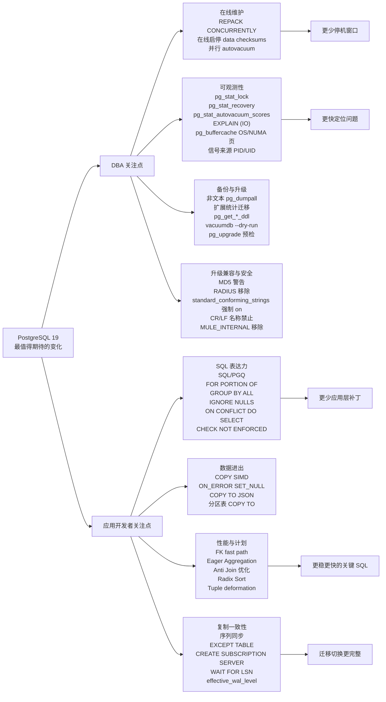

## Bruce 连夜发布 PostgreSQL 19 release notes, 重新整理 PG 19 最有价值新特性解读  
  
### 作者  
digoal  
  
### 日期  
2026-04-15  
  
### 标签  
PostgreSQL , 19 , 新特性  
  
----  
  
## 背景  
  
之前通过对 commit log 分析, 发过一期 19 新特性分享, [《用 AI 分析 PostgreSQL 19 最值得期待的特性》](../202604/20260408_13.md)  
  
今天有了 bruce 老师的 release notes, 这份特性解读更准确了.  [PG 19 PPT 更新](PostgreSQL_19_Glass_Engine.pptx)  
  
PostgreSQL 19 的主线, 不是某一个惊艳语法, 而是三个方向同时向前走了一大步: 运维动作越来越在线化, 复制与导入导出越来越接近真实生产场景, 优化器和观测系统越来越能解释自己。  
  
如果把这些 commit 放在 DBA 和应用开发者的日常痛点里看, PG19 最值得期待的地方是: 过去要停机、要手工绕路、要靠经验猜的操作, 正在变成数据库内核可理解、可监控、可自动化执行的能力。  
  

  
## 升级前先看的兼容性变化  
  
#### 1、release notes 的迁移章节里有几项不一定“酷”, 但会直接影响升级评估的变化。相关提交为 `1d92e0c2`, `bc60ee86`, `a1643d40`, `45762084`, `b380a56a`, `79534f90`, `de28140d`, `77645d44`, `ce11e63f`。  
  
一句话简介: PG19 开始更明确地推动安全认证、旧编码和旧兼容行为退场: MD5 认证会警告, 密码过期可提前警告, RADIUS 支持被移除, `standard_conforming_strings` 在服务端强制为 `on`, CR/LF 对象名和 `MULE_INTERNAL` 编码会阻断升级, `max_locks_per_transaction` 默认从 64 调到 128。  
  
出现背景: 很多老集群长期依赖旧认证、旧字符串转义语义或历史配置默认值。它们平时不显眼, 但一到大版本升级就会变成阻塞项。  
  
解决痛点: DBA 可以在升级前用明确清单做兼容性扫描, 而不是等应用连接失败或 SQL 行为变化后再补救。  
  
方法和原理: `password_expiration_warning_threshold` 默认提前 7 天在成功密码认证后发出即将过期警告; MD5 password 认证成功时会发 WARNING, 可由 `md5_password_warnings` 控制; RADIUS/UDP 因安全缺陷被移除; 服务端不再允许 `standard_conforming_strings = off`, 同时移除无意义的 `escape_string_warning`; 数据库、角色、表空间名中禁止 CR/LF, `pg_upgrade` 会拒绝这类旧集群; `MULE_INTERNAL` 编码被移除, 旧库必须先转成其他编码再升级; inet/cidr 的默认 GiST opclass 不再来自 `btree_gist`, 已存在的旧 `btree_gist` inet/cidr 索引也会让 `pg_upgrade` 失败; 锁表内存布局改变后, `max_locks_per_transaction` 默认翻倍, 但如果用户在配置文件里显式设置了旧值, release notes 提醒需要自行重新评估容量。  
  
效果对比: 补丁前, 一些危险或过时路径仍能静默运行; 补丁后, 安全风险更早暴露, 但旧应用也更容易在升级时被迫修正。  
  
用法:  
  
```sql  
-- 查找仍使用 MD5 口令的角色, 升级前应迁移到 SCRAM。  
SELECT rolname  
FROM pg_authid  
WHERE rolpassword LIKE 'md5%';  
  
-- 提前 14 天提醒密码即将过期; 设置为 0 可关闭该提醒。  
ALTER SYSTEM SET password_expiration_warning_threshold = '14d';  
  
-- 如果历史配置显式设置过 max_locks_per_transaction, 升级前重新评估。  
SHOW max_locks_per_transaction;  
ALTER SYSTEM SET max_locks_per_transaction = 128;  

-- 升级前排查会被 PG19 拒绝的对象名。
SELECT datname FROM pg_database WHERE datname ~ '[\r\n]';
SELECT rolname FROM pg_authid WHERE rolname ~ '[\r\n]';
SELECT spcname FROM pg_tablespace WHERE spcname ~ '[\r\n]';
```  
  
最佳实践: 升级演练时先跑认证、角色、HBA、显式 GUC、对象名、编码和扩展索引检查。尤其要查 RADIUS、MD5、`standard_conforming_strings = off`、CR/LF 对象名、`MULE_INTERNAL` 编码、自定义 `max_locks_per_transaction`、postgres_fdw 读写事务语义这些点, 因为它们不一定会在单元测试里暴露。  
  
## 维护窗口正在被压缩: REPACK 和在线 checksum  
  
#### 2、数据库膨胀治理过去绕不开两个名字: `VACUUM FULL` 和 `CLUSTER`。前者回收空间但锁重, 后者按索引重排但概念容易和集群混淆。PG19 引入 `REPACK`, 把这两类“重写表”的操作收敛成一个更清晰的命令, 并进一步提供并发模式。相关提交为 `ac58465e`, `28d534e2`, `e76d8c74`。  
  
一句话简介: `REPACK` 是 PostgreSQL 内置化的表重写入口, `REPACK (CONCURRENTLY)` 让重写期间应用仍能正常读写原表, 只有最终切换 relfilenode 时需要短暂强锁。  
  
出现背景: 生产库最怕的不是一次慢查询, 而是“必须做, 但一做就挡业务”的维护操作。膨胀表需要重写, 但传统 `VACUUM FULL` 需要长时间 `ACCESS EXCLUSIVE` 锁; `CLUSTER` 又承担排序重写的语义, 名字和用途都不够直观。  
  
解决痛点: DBA 不再需要在“空间回收”和“业务可用性”之间做二选一。对大表而言, 重写耗时可能是小时级; PG19 的并发 repack 把大部分耗时阶段放在低锁级别下执行, 把阻塞窗口压缩到最后切换阶段。  
  
方法和原理: `REPACK` 先在 MVCC 快照下复制旧表数据到新物理文件, 并在快照位置建立专用逻辑复制槽。复制期间应用对旧表的增删改不会丢失, 后台 worker 通过逻辑解码把并发变更写入 stash, 最终在交换 relfilenode 前回放这些变更。`e76d8c74` 又引入 `max_repack_replication_slots`, 为 concurrent repack 单独预留复制槽, 避免和普通逻辑复制槽抢资源。  
  
效果对比: 补丁前, 大表空间整理往往意味着长时间阻塞写入甚至读取; 补丁后, 初始复制阶段只需要类似 vacuum 的较低锁级别, 应用持续访问旧表, 最后短暂切换。代价是需要额外磁盘空间、逻辑解码资源、后台 worker 和复制槽配额。  
  
用法:  
  
```sql  
REPACK my_big_table;  
REPACK my_big_table USING INDEX my_big_table_created_at_idx;  
REPACK (CONCURRENTLY) my_big_table USING INDEX;  
REPACK (ANALYZE, VERBOSE) my_big_table (tenant_id, created_at);  
  
SELECT pid, datname, relid::regclass, phase  
FROM pg_stat_progress_repack;  
```  
  
最佳实践: 首次在生产使用 concurrent repack 前, 先确认表有足够重写空间, 设置好 `max_repack_replication_slots`, 并在业务低峰验证最终切换阶段的锁等待。高写入表要重点观察逻辑解码积压和 stash 增长, 不要把它当成完全零成本操作。  
  
#### 3、另一项直接影响生产维护的是在线启停 data checksums, 相关提交为 `f19c0ecc`, `5e13b0f2`。  
  
一句话简介: PG19 可以在集群运行中启用或关闭数据页 checksum, 不再只能在 `initdb` 时决定或离线运行 `pg_checksums`。  
  
出现背景: checksum 是发现存储静默损坏的重要防线, 但很多老集群初始化时没有开启。过去想补上这层保护, 通常要安排停机窗口。随着数据规模变大, 离线扫描全库页的窗口越来越难拿到。  
  
解决痛点: DBA 可以把“补开 checksum”从停机变成在线后台任务, 降低安全加固的组织成本。  
  
方法和原理: PG19 增加 checksum worker launcher, 按数据库启动动态后台 worker, 遍历所有有存储的 relation, 标记 buffer 为 dirty, 让后续写出时计算 checksum。启用过程中存在中间态: 后端会写 checksum 但暂不校验读到的 checksum, 等所有后端通过 procsignal barrier 吸收状态变化后, 才切换为读时校验。关闭 checksum 时也采用类似屏障, 避免读到“状态与页面不同步”导致误报或漏报。`5e13b0f2` 又在 x86 上为页面 checksum 增加 AVX2 路径, 在可用硬件上加速计算。  
  
效果对比: 补丁前, checksum 状态基本是初始化或停机维护时的决定; 补丁后, 可以在线改变, 后台逐步推进, 对业务访问的约束大幅降低。代价是启用期间会带来额外写放大和后台 I/O, 需要纳入维护计划。  
  
用法:  
  
```sql  
-- 在线启用 checksum, 可用 vacuum cost 思路限速。  
SELECT pg_enable_data_checksums(10, 1000);  
  
SELECT name, setting  
FROM pg_settings  
WHERE name = 'data_checksums';  
  
SELECT pid, datname, phase,  
       databases_done, databases_total,  
       relations_done, relations_total,  
       blocks_done, blocks_total  
FROM pg_stat_progress_data_checksums;  
  
-- 如确需关闭 checksum。  
SELECT pg_disable_data_checksums();  
```  
  
最佳实践: 对没有 checksum 的老集群, 优先在只读副本或低峰环境压测启用过程的 I/O 影响; 与备份校验、底层存储巡检配合使用; 不要在已经存在 I/O 饱和的时间段启动全库 checksum 转换。  
  
## 约束、导入和 SQL 语义更贴近应用真实需求  
  
#### 4、外键检查是 OLTP 系统的基础成本。PG19 对外键 referential check 做了 fast path 和批量化优化, 相关提交为 `2da86c1e`, `b7b27eb4`, `e484b0ee`, `5c54c3ed`。  
  
一句话简介: 对常见的非分区主键表外键检查, PG19 绕过 SPI, 直接探测被引用表的唯一索引, 并在 AFTER trigger 批处理中合并探测, commit message 给出的缓存场景基准从单独 fast path 的约 1.8 倍提升到批量后的约 2.9 倍。  
  
出现背景: 大批量插入带外键的明细表时, 每行都要检查父表键是否存在。传统路径通过 SPI 执行内部查询, 权限检查、快照、执行器、索引扫描等开销会在每一行重复出现。  
  
解决痛点: 应用开发者常见的“批量导入订单行、事件明细、账务流水”这类场景, 外键带来的单行触发器成本显著降低; DBA 不必为了导入性能轻易牺牲外键约束。  
  
方法和原理: `2da86c1e` 直接从 FK 值构造 scan key, 对被引用表唯一索引做 index scan, 并以 `LockTupleKeyShare` 锁定匹配 tuple, 同时模拟 SPI 路径需要的权限检查、RLS 语义和 EvalPlanQual 重检。`b7b27eb4` 再把单行探测变成批处理: AFTER trigger 触发周期内缓存 FK 行, 单列 FK 使用 `SK_SEARCHARRAY` 一次提交多个键给索引 AM, 由索引内部排序、去重并有序扫描叶子页; 多列 FK 则回退为循环探测。  
  
效果对比: 补丁前, 100 万行 FK 插入会重复走大量 SPI 和执行器框架; 补丁后, 常见单列 FK 可以共享一次快照、一次权限上下文、一批索引探测。限制是 fast path 不覆盖分区 referenced table 和 temporal FK 语义, CASCADE/SET NULL 等 action trigger 仍走原路径。  
  
用法: 应用 SQL 不需要改, 继续正常定义外键并批量插入。  
  
```sql  
CREATE TABLE customers(id bigint PRIMARY KEY);  
CREATE TABLE orders(  
  id bigint PRIMARY KEY,  
  customer_id bigint NOT NULL REFERENCES customers(id)  
);  
  
INSERT INTO orders  
SELECT g, (g % 100000) + 1  
FROM generate_series(1, 1000000) AS g;  
```  
  
最佳实践: 批量导入时继续保留外键, 但要确保 referenced key 有合适唯一索引, 单列外键收益更明显。对分区父表、复杂多列外键、带级联动作的模型, 仍应按老经验做导入压测。  
  
#### 5、COPY 也变得更像数据工程入口, 相关提交为 `e0a3a3fd`, `2a525cc9`, `bc2f348e`, `7dadd38c`, `4c0390ac`, `4bea91f2`, `266543a6`。  
  
一句话简介: PG19 同时提升 COPY 文本/CSV 导入速度, 增强坏值容忍, 支持多行 header, 让 `COPY TO` 直接输出 JSON/JSON array, 并允许直接导出分区表。  
  
出现背景: 很多数据进入 PostgreSQL 的第一站就是 CSV、文本日志或外部系统导出的半结构化文件。现实文件经常有多行说明头、少量脏字段, 导出给下游又希望直接拿 JSON。  
  
解决痛点: DBA 不必为了几行 header 预处理文件, 应用也不必为了 JSON 导出写额外脚本。遇到类型转换错误时, 可以把列置为 NULL, 而不是整批失败。  
  
方法和原理: `e0a3a3fd` 在 COPY FROM text/csv 路径中用 SIMD 扫描输入 buffer, 成块跳过没有特殊字符的数据; 遇到短行或特殊字符时保守回退, 避免回归。`2a525cc9` 增加 `ON_ERROR SET_NULL`, 类型转换失败时把该列置 NULL, 但 NOT NULL 约束仍照常检查。`bc2f348e` 让 `HEADER` 接受非负整数, 跳过多行 header。`7dadd38c` 和 `4c0390ac` 让 `COPY TO FORMAT JSON` 输出 NDJSON 或顶层 JSON 数组。`4bea91f2` 让 `COPY partitioned_table TO` 直接扫描分区表, 不必再写 `COPY (SELECT * FROM partitioned_table) TO`, 逻辑复制初始同步也可借此加速分区表复制。  
  
效果对比: 补丁前, COPY 每字节扫描特殊字符, 错误处理粒度不够柔性, JSON 导出依赖 `row_to_json()` 或应用层拼装; 补丁后, 大块“干净”文本可以 SIMD 加速, 脏字段可按列降级为 NULL, 下游可以直接消费 JSON。  
  
用法:  
  
```sql  
COPY staging FROM '/data/input.csv'  
WITH (FORMAT csv, HEADER 3, ON_ERROR set_null);  
  
COPY (  
  SELECT id, payload, created_at FROM events  
) TO '/data/events.ndjson'  
WITH (FORMAT json);  
  
COPY (  
  SELECT id, payload FROM events LIMIT 1000  
) TO '/data/events.json'  
WITH (FORMAT json, FORCE_ARRAY true);  
  
COPY sales_partitioned TO '/data/sales.csv'  
WITH (FORMAT csv, HEADER true);  
```  
  
最佳实践: `ON_ERROR SET_NULL` 适合 staging 表, 不适合直接进入强一致业务表; 对关键字段继续保留 NOT NULL 和 CHECK 约束, 让错误在边界暴露。JSON 导出大结果集时优先使用默认 NDJSON, 只有下游明确需要单个 JSON 值时再用 `FORCE_ARRAY`。  
  
#### 6、SQL 语法层面, PG19 加入几项对应用开发者很有用的能力: SQL/PGQ、temporal update/delete、`GROUP BY ALL`、窗口函数 `IGNORE NULLS`、以及 `INSERT ... ON CONFLICT DO SELECT`。相关提交为 `2f094e7a`, `8e72d914`, `5eed8ce5`, `ef38a4d9`, `25a30bbd`, `88327092`。  
  
一句话简介: PG19 开始原生支持属性图查询, 能按时间片更新/删除 range/multirange 记录, 简化探索式聚合, 补齐窗口函数忽略 NULL 的标准语义, 并让 upsert 冲突行可以被直接返回。  
  
出现背景: 应用数据模型越来越多样: 图关系、有效期历史、稀疏时间序列、幂等写入都很常见。过去这些需求要么写大量样板 SQL, 要么在应用层补逻辑。  
  
解决痛点: 图查询不再必须离开 PostgreSQL; bitemporal/有效期模型更新不再需要手写拆区间; 报表探索不用反复同步 SELECT list 和 GROUP BY; `lead/lag/first_value/last_value/nth_value` 可以自然跳过 NULL; 幂等插入可以在冲突时拿到已有行而不是再查一次。  
  
方法和原理: SQL/PGQ 引入 `CREATE PROPERTY GRAPH` 和 `GRAPH_TABLE`, 属性图在内部类似 view, rewrite 成标准关系查询执行。`FOR PORTION OF` 根据 range/multirange 列限制目标时间片, 对部分重叠的行自动截断并插入“temporal leftovers”; `5eed8ce5` 补充 `range_minus_multi` 和 `multirange_minus_multi` 内部函数, 用来把原始有效期减去目标时间片后得到前后剩余区间, 这是自动生成 leftovers 的基础运算。`GROUP BY ALL` 把 target list 中非 aggregate、非 window 的表达式自动加入 group clause。`IGNORE NULLS` 为窗口执行维护 2-bit null 信息数组, 避免重复求值。`ON CONFLICT DO SELECT` 新增冲突动作, 在 `RETURNING` 中返回已存在行, 可选 `FOR UPDATE/SHARE` 锁定。  
  
效果对比: 补丁前, 这些场景往往需要冗长 SQL、触发器或应用层二次查询; 补丁后, SQL 本身表达业务语义, 优化器也有机会理解这些语义。  
  
用法:  
  
```sql  
-- 定义一个基于普通关系表的属性图。若底层表已有主键和外键,
-- SQL/PGQ 可以从这些约束推导顶点键、边的源点和终点。
CREATE PROPERTY GRAPH myshop
    VERTEX TABLES (
        products,
        customers,
        orders
    )
    EDGE TABLES (
        order_items SOURCE orders DESTINATION products,
        customer_orders SOURCE customers DESTINATION orders
    );

-- 查询“今天有订单的客户”, MATCH 中的点和边会被改写为等价的关系连接。
SELECT customer_name
FROM GRAPH_TABLE (
    myshop
    MATCH (c IS customers)-[IS customer_orders]->(o IS orders
           WHERE o.ordered_when = current_date)
    COLUMNS (c.name AS customer_name)
);

-- 多跳路径: 如果像回归测试那样把订单和愿望单统一暴露成 lists 标签,
-- 并把对应的边统一暴露成 cust_lists/list_items 标签, 就可以从客户沿
-- 清单/订单边找到商品, 结果仍然是普通 SQL 表。
SELECT customer_name, product_name, list_type
FROM GRAPH_TABLE (
    myshop
    MATCH (c IS customers)-[IS cust_lists]->(l IS lists)-[IS list_items]->(p IS products)
    COLUMNS (c.name AS customer_name, p.name AS product_name, l.list_type)
)
ORDER BY customer_name, product_name, list_type;

-- 探索式聚合  
SELECT region, product, count(*) FROM sales GROUP BY ALL;  
  
-- 稀疏序列取上一个非 NULL 值  
SELECT ts, last_value(v) IGNORE NULLS OVER (ORDER BY ts)  
FROM metrics;  
  
-- 冲突时返回已有行  
INSERT INTO users(email, name)  
VALUES ('a@example.com', 'Alice')  
ON CONFLICT (email) DO SELECT  
RETURNING id, email, name;  
  
-- 时间片更新  
UPDATE price_history  
FOR PORTION OF valid_at FROM DATE '2026-01-01' TO DATE '2026-02-01'  
SET price = price * 1.05;  
```

SQL/PGQ 示例取自项目文档中的 `myshop` 属性图和回归测试中的多跳路径查询。核心用法是先用 `CREATE PROPERTY GRAPH` 给现有关系表声明顶点、边、标签和属性, 再通过 `GRAPH_TABLE` 把图模式匹配结果投影成关系表, 因而它可以继续参与普通 SQL 的过滤、排序、连接和聚合。多跳示例依赖回归测试里对 `orders/wishlists`、`order_items/wishlist_items`、`customer_orders/customer_wishlists` 的统一标签声明; 实际使用时应优先把业务上同类的节点或边抽象成一致标签, 再在 `MATCH` 中面向标签写路径。
  
`FOR PORTION OF` 的效果可以用价格历史表直观看出来。假设一条记录表示从 2022 年开始一直有效的价格:  
  
```sql
CREATE TABLE product_price(
  product_no int,
  price numeric(10,2),
  valid_at daterange
);

INSERT INTO product_price VALUES
  (5,  5.00, daterange('2020-01-01', '2022-01-01', '[)')),
  (5,  8.00, daterange('2022-01-01', NULL, '[)'));

SELECT product_no, price, valid_at
FROM product_price
WHERE product_no = 5
ORDER BY valid_at;

 product_no | price |        valid_at
------------+-------+-------------------------
          5 |  5.00 | [2020-01-01,2022-01-01)
          5 |  8.00 | [2022-01-01,)
```
  
如果只想把 2023-09-01 到 2025-03-01 这段时间的价格改成 12, PG19 可以直接写目标时间片:  
  
```sql
UPDATE product_price
FOR PORTION OF valid_at FROM DATE '2023-09-01' TO DATE '2025-03-01'
SET price = 12.00
WHERE product_no = 5;

SELECT product_no, price, valid_at
FROM product_price
WHERE product_no = 5
ORDER BY valid_at;

 product_no | price |        valid_at
------------+-------+-------------------------
          5 |  5.00 | [2020-01-01,2022-01-01)
          5 |  8.00 | [2022-01-01,2023-09-01)
          5 | 12.00 | [2023-09-01,2025-03-01)
          5 |  8.00 | [2025-03-01,)
```
  
这个结果说明了补丁带来的核心效果: 应用只表达“修改这一段历史”, PostgreSQL 自动把原来的长区间切成三段, 中间段执行更新, 前后两段作为 temporal leftovers 保留下来。补丁前通常要应用自己计算 `range * range` 和 `range - range`, 再手工 `UPDATE + INSERT`, 更容易漏掉边界和并发处理。
  
  
最佳实践: `GROUP BY ALL` 适合交互式分析, 核心报表 SQL 仍建议显式列出分组键以增强可读性; `ON CONFLICT DO SELECT FOR UPDATE` 要谨慎使用, 它会引入锁语义; temporal 表要先统一 range 边界规范, 否则后续拆分行会增加审计复杂度。  
  
## 优化器更主动, 也第一次给了“计划建议”工具  
  
#### 7、PG19 的优化器和计划控制改进非常密集, 对用户最有感知的是 eager aggregation、反连接优化、radix sort 和 plan advice。相关提交为 `8e118591`, `bd94845e`, `3a08a2a8`, `383eb21e`, `cf74558f`, `0da29e4c`, `ef3c3cf6`, `282b1cde`, `5883ff30`, `6455e55b`, `e8ec19aa`, `c10edb10`。  
  
一句话简介: PG19 让优化器更早做聚合、更大胆把安全的 `NOT IN`/`LEFT JOIN` 转成 anti join、更快排序, 同时提供 `pg_plan_advice` 和 `pg_stash_advice` 用于稳定或干预计划。  
  
出现背景: 很多性能问题并不是 SQL 写错, 而是优化器拿不到足够结构信息, 或者统计变化导致计划抖动。DBA 常见处境是: 明知道某个 plan 更好, 但缺少官方手段稳定它。  
  
解决痛点: eager aggregation 能减少 join 输入行数; anti join 转换让 `NOT IN` 不再总是 opaque SubPlan; Memoize 可用于唯一内侧的 anti join; radix sort 加速高基数 pass-by-value 排序; plan advice 则为“关键 SQL 的计划稳定”提供内置工具。  
  
方法和原理: eager aggregation 在 scan/join planning 阶段收集 aggregate 和 group key 信息, 为可提前聚合的 relation 创建 grouped RelOptInfo, 在 join 前先部分聚合, 减少后续行数。`NOT IN` 转 anti join 的关键是证明两侧都不会产生 NULL, 且操作符来自 B-tree 或 hash opfamily, 语义才和 anti join 一致。radix sort 把 pass-by-value Datum 归一化成无符号字节序列, 处理 signedness、DESC、NULLS FIRST/LAST, 再用原地 radix sort; 后续补丁跳过公共前缀字节, 进一步减少 pass。`pg_plan_advice` 则分析已完成 plan 生成文本 advice, 未来 planning 时按 advice 固定关键决策; `pg_stash_advice` 通过 queryId 自动加载 advice, 并可持久化到 `pg_stash_advice.tsv`。  
  
效果对比: 补丁前, 大聚合 join 只能等 join 完再聚合, `NOT IN` 常被当作子计划过滤器, sort 对部分整数类高基数数据不够快, plan 干预主要靠 GUC 或改 SQL; 补丁后, 优化器有更多等价变换, 排序和通知有更低成本, DBA 有了更细粒度的计划稳定工具。  
  
用法:  
  
```sql  
LOAD 'pg_plan_advice';  
CREATE EXTENSION pg_stash_advice;  
  
EXPLAIN (COSTS OFF, PLAN_ADVICE)  
SELECT * FROM join_fact f JOIN join_dim d ON f.dim_id = d.id;  
  
-- 只固定必要的部分, 不要把生成的 advice 全量照抄成长期规则。  
SET pg_plan_advice.advice = 'JOIN_ORDER(f d)';  
EXPLAIN (COSTS OFF)  
SELECT * FROM join_fact f JOIN join_dim d ON f.dim_id = d.id;  
  
-- 对少数关键 SQL 可按 query_id 自动应用 advice。  
SELECT pg_create_advice_stash('critical_sql');  
SELECT pg_set_stashed_advice('critical_sql', '<query_id>',  
                             'JOIN_ORDER(f d)');  
SET pg_stash_advice.stash_name = 'critical_sql';  
SET pg_stash_advice.persist = true;  
```
    
anti join 优化的效果可以用“找没有订单的客户”说明。只要 planner 能证明两侧参与比较的列都不会出现 NULL, `NOT IN` 就可以从子计划过滤器变成真正的 anti join:  
  
```sql
CREATE TABLE customers(id bigint PRIMARY KEY, name text);
CREATE TABLE orders(
  id bigint PRIMARY KEY,
  customer_id bigint NOT NULL REFERENCES customers(id)
);
CREATE INDEX ON orders(customer_id);

EXPLAIN (COSTS OFF)
SELECT c.id
FROM customers c
WHERE c.id NOT IN (SELECT o.customer_id FROM orders o);

              QUERY PLAN
---------------------------------------
 Hash Anti Join
   Hash Cond: (c.id = o.customer_id)
   ->  Seq Scan on customers c
   ->  Hash
         ->  Seq Scan on orders o
```
  
补丁前, 这类 `NOT IN` 因为 SQL 的 NULL 语义通常不能安全改写, 更容易表现为 `Seq Scan on customers` 外加 `SubPlan` 过滤。补丁后, 当 `customers.id` 是主键、`orders.customer_id` 是 `NOT NULL`, 且等值操作符来自 B-tree/hash opfamily, planner 可以把它放进 join order 搜索空间, 再选择 hash anti join、merge anti join 或 nested loop anti join。  
  
`LEFT JOIN` 也有类似收益。下面这个写法本质上是在找“没有订单的客户”, 右表连接列 `o.customer_id` 被 `IS NULL` 过滤, 但真实匹配行里它又被 `NOT NULL` 约束证明不可能为 NULL, 因此只有“没匹配上”的 NULL-extended 行能留下:  
  
```sql
EXPLAIN (COSTS OFF)
SELECT c.id
FROM customers c
LEFT JOIN orders o ON o.customer_id = c.id
WHERE o.customer_id IS NULL;

              QUERY PLAN
---------------------------------------
 Hash Anti Join
   Hash Cond: (c.id = o.customer_id)
   ->  Seq Scan on customers c
   ->  Hash
         ->  Seq Scan on orders o
```
  
这个计划变化的实际效果是: 执行器不再先构造左连接结果再过滤右表 NULL, 而是直接执行“保留左表中找不到匹配项的行”。数据量越大、右表匹配越多, 避免中间结果和给 optimizer 更多 join 方法选择的收益越明显。  
  
  
最佳实践: plan advice 不是 hint 的随手替代品, 应只用于少数关键 SQL: 先确认统计信息、索引、SQL 写法都合理, 再用 advice 稳定计划; 每次大版本升级、数据分布明显变化、索引调整后, 都要重新验证 advice 是否仍然正确。对 eager aggregation 和 anti join, 应重点回归 BI/报表 SQL, 看是否有明显计划变化。  
  
## 复制体系从“表数据同步”继续向“业务完整同步”靠拢  
  
#### 8、逻辑复制在 PG19 补上了序列同步、publication 排除表、基于 foreign server 创建 subscription, 同时物理复制增加 `WAIT FOR LSN`。相关提交为 `96b37849`, `f0b3573c`, `5509055d`, `55cefadd`, `fd366065`, `493f8c64`, `5984ea86`, `6b0550c4`, `8185bb53`, `447aae13`, `49a181b5`, `a8f45dee`。  
  
一句话简介: PG19 让逻辑复制能处理序列值, 让 `FOR ALL TABLES` 可以排除少数表, 让 subscription 可以复用 FDW server 连接定义; standby 侧也能用 SQL 等待指定 LSN 达到 write/flush/replay 状态。  
  
出现背景: 逻辑复制最常见的坑之一是序列不跟随表数据自然同步, 切换后容易撞号。另一个痛点是 `FOR ALL TABLES` 太粗, 少数不想发布的表要靠反向维护 publication list。应用读写分离里, “我刚写入主库, 从库什么时候能读到”也一直需要应用层轮询函数拼装。  
  
解决痛点: 升级、迁移、蓝绿切换时, 序列值可以纳入订阅同步流程; 大 publication 可以声明排除表; 多个 subscription 可以通过 foreign server 复用连接管理; 读从库前可以直接等待 WAL 到达目标状态。  
  
方法和原理: `FOR ALL SEQUENCES` 把序列加入 publication, `REFRESH SEQUENCES` 和 sequence sync worker 在 subscriber 端把序列状态从 INIT 推进到 READY, worker 批量从 publisher 获取当前值和 page LSN 后更新本地序列。`EXCEPT (TABLE t)` 在 `pg_publication_rel` 中标记排除关系, 分区根表排除会覆盖现有和未来分区。`CREATE SUBSCRIPTION ... SERVER` 通过 postgres_fdw 的 connection function 从 foreign server 和 user mapping 获取连接参数。`WAIT FOR LSN` 作为 utility command 执行, 避免函数持有 snapshot 阻塞 WAL replay; `MODE` 支持 `standby_replay`, `standby_write`, `standby_flush`, `primary_flush`。  
  
效果对比: 补丁前, 逻辑复制切换后常需要手工修 sequence; publication 要在“全表发布”和“手动列举”之间取舍; 等待从库追平依赖轮询函数; 补丁后, 这些都变成 SQL 级能力。  
  
用法:  
  
```sql  
CREATE PUBLICATION pub_all  
FOR ALL TABLES EXCEPT (TABLE audit_log),  
    ALL SEQUENCES;  
  
ALTER SUBSCRIPTION sub REFRESH SEQUENCES;  
  
CREATE SERVER pub_srv FOREIGN DATA WRAPPER postgres_fdw  
OPTIONS (host '10.0.0.10', dbname 'app');  
  
CREATE SUBSCRIPTION sub SERVER pub_srv  
PUBLICATION pub_all;  
  
WAIT FOR LSN '0/5000000' WITH (MODE 'standby_replay');  
WAIT FOR LSN '0/5000000' WITH (MODE 'standby_flush');  
WAIT FOR LSN '0/5000000' WITH (MODE 'standby_write', TIMEOUT '100ms', NO_THROW);  
WAIT FOR LSN '0/5000000' WITH (MODE 'primary_flush');  
```  
  
最佳实践: 逻辑复制切换演练要把 sequence 校验纳入 checklist; `EXCEPT` 适合排除日志、临时汇总、不可复制的本地状态表; `WAIT FOR LSN` 应用于“读己之写”路径时要设置应用侧超时, 避免复制延迟变成请求堆积。`wal_sender_shutdown_timeout` 可用于限制关闭时等待同步副本的时间, 但默认仍是永久等待, 生产要按 RPO/RTO 明确取值。  
  
## 观测体系更像生产系统的仪表盘  
  
#### 9、PG19 的观测增强覆盖锁、恢复、autovacuum、VACUUM 日志、EXPLAIN I/O、pg_stat_statements、pg_buffercache。相关提交为 `4019f725`, `01d485b1`, `2d4ead6f`, `d7965d65`, `87f61f0c`, `736f754e`, `adcdbe93`, `681daed9`, `3b1117d6`, `e157fe6f`, `61c36a34`, `294520c4`, `3357471c`, `bee23ea4`, `4b203d49`, `9ccc049d`。  
  
一句话简介: PG19 增加 `pg_stat_lock`, `pg_stat_recovery`, `pg_stat_autovacuum_scores`, `EXPLAIN (IO)`, auto_explain I/O 输出, pg_stat_statements 计划类型计数和 pg_buffercache OS page 视图, 并让 `VACUUM (VERBOSE)` 与 autovacuum 日志显示 dead items 内存和并行 worker 使用情况。  
  
出现背景: 生产事故排查的难点往往不是“没有问题”, 而是“问题发生时缺少维度”。锁等待只看瞬时 `pg_locks` 不够, standby 恢复状态分散在多个函数里, autovacuum 为什么先扫这张表不扫那张表也不透明。  
  
解决痛点: DBA 可以从累计统计理解锁等待热点, 从一致快照查看恢复状态, 从 autovacuum score 预测下一批表, 从 EXPLAIN 看到 async I/O 和 prefetch 行为, 从 pg_stat_statements 区分 prepared statement 使用 generic plan 还是 custom plan。  
  
方法和原理: `pg_stat_lock` 以 lock tag type 为固定大小 stats kind, 统计等待次数、等待时间和 fast-path slot 超限次数, 避免侵入 fast-path 获取锁的热路径。`pg_stat_recovery` 通过一次 spinlock 获取恢复控制结构中的多项状态, 比多个函数拼接更一致。autovacuum score 把 freeze age、multixact age、dead tuple、insert threshold、analyze threshold 转成比值并排序, 再由视图暴露每表得分。`736f754e` 和 `adcdbe93` 把 dead items 内存使用、reset 次数、内存上限、计划/实际 parallel vacuum workers 写入 `VACUUM (VERBOSE)` 和 autovacuum 日志。`EXPLAIN (IO)` 为 ReadStream 支持的 BitmapHeapScan、SeqScan、TidRangeScan 采集 prefetch distance 和 I/O request 等信息。`294520c4` 在 x86-64 上可用 TSC 降低 `EXPLAIN ANALYZE TIMING` 的计时成本, commit message 中提到大量行通过计划节点的场景, instrumentation overhead 可从约 2x 降到约 1.2x。  
  
效果对比: 补丁前, 这些问题需要日志、瞬时视图、扩展和经验拼图; 补丁后, 很多维度进入核心视图或 EXPLAIN 输出。对慢 SQL, 不仅能看 “花了多久”, 还能更接近 “I/O 预读有没有帮上忙、计时本身有没有拖慢查询”。  
  
用法:  
  
```sql  
SELECT * FROM pg_stat_lock;  
  
SELECT * FROM pg_stat_recovery;  
  
SELECT relid::regclass, score, vacuum_score, analyze_score, do_vacuum, do_analyze  
FROM pg_stat_autovacuum_scores  
ORDER BY score DESC  
LIMIT 20;

        relid        | score | vacuum_score | analyze_score | do_vacuum | do_analyze
---------------------+-------+--------------+---------------+-----------+------------
 public.events       |  3.20 |         3.20 |          0.40 | t         | f
 public.orders       |  1.45 |         0.20 |          1.45 | f         | t
 public.account_log  |  0.98 |         0.98 |          0.90 | f         | f

-- 更适合巡检的写法: 看清楚到底是哪一项把 score 顶上去。
SELECT relid::regclass,
       score,
       xid_score,
       mxid_score,
       vacuum_score,
       vacuum_insert_score,
       analyze_score,
       do_vacuum,
       do_analyze,
       for_wraparound
FROM pg_stat_autovacuum_scores
ORDER BY score DESC
LIMIT 10;
  
EXPLAIN (ANALYZE, IO)  
SELECT * FROM big_table WHERE id BETWEEN 100000 AND 200000;

                                      QUERY PLAN
--------------------------------------------------------------------------------------
 Bitmap Heap Scan on big_table
   Recheck Cond: ((id >= 100000) AND (id <= 200000))
   Prefetch: avg=31.75 max=64 capacity=128
   I/O: count=128 waits=12 size=4.00 in-progress=8.50
   ->  Bitmap Index Scan on big_table_id_idx
         Index Cond: ((id >= 100000) AND (id <= 200000))

  
ALTER SYSTEM SET auto_explain.log_io = on;  
  
SELECT query, generic_plan_calls, custom_plan_calls  
FROM pg_stat_statements  
ORDER BY calls DESC  
LIMIT 20;  
  
VACUUM (VERBOSE, ANALYZE) big_table;  
  
CREATE EXTENSION pg_buffercache;  
SELECT * FROM pg_buffercache_os_pages LIMIT 20;  
```
  
`EXPLAIN (IO)` 的预备知识, 详见附录部分.   
  
上面的 autovacuum 示例里, `events` 的 `score=3.20` 来自 `vacuum_score=3.20`, 说明它不是“快要 analyze”, 而是 dead tuples 或 insert 触发的 vacuum 压力已经明显超过阈值; `orders` 的最高分来自 `analyze_score=1.45`, 更像统计信息需要更新; `account_log` 虽然接近阈值, 但 `do_vacuum/do_analyze` 仍为 false, 可以作为观察对象而不是立即处理对象。补丁前 DBA 需要自己从 `pg_stat_all_tables`、age、阈值参数里拼公式; 补丁后核心视图直接给出排序分数和动作判断。  
  
`EXPLAIN (IO)` 的价值在于把“这个扫描到底有没有有效预读”放到执行计划里。示例中的 `Prefetch` 行说明平均预读距离、最大预读距离和预读容量, `I/O` 行说明 ReadStream 发起了多少 I/O、等待了多少次、平均一次读多少块、平均有多少 I/O 同时在途。如果同一条 SQL 在调小 `effective_io_concurrency`、关闭 AIO 或改变访问路径后 `waits` 上升、`avg` 下降, DBA 就能把慢查询原因从“可能是 I/O”推进到“这个扫描没有足够预读”或“预读距离过大导致读放大”。SeqScan 和 TidRangeScan 走 ReadStream 时也会提供同类信息。  
  
最佳实践: 把 `pg_stat_lock` 和 `pg_stat_autovacuum_scores` 纳入日常巡检, 但不要只看单点值, 要看趋势。`EXPLAIN (IO)` 适合压测和问题定位, 不应对所有生产 SQL 默认打开。pg_stat_statements 的 plan counters 可以帮助判断 prepared statement 是否因为 generic plan 引发退化, 但最终仍要结合 `EXPLAIN (ANALYZE, BUFFERS, WAL, IO)`。  
  
## 备份、升级和 DDL 还原更工程化  
  
#### 10、PG19 在备份恢复和统计信息迁移上也有几项值得 DBA 关注的改进, 相关提交为 `763aaa06`, `3c19983c`, `c32fb29e`, `0e80f3f8`, `302879bd`, `efbebb4e`, `ba97bf9c`, `28972b6f`, `76e514eb`, `b99fd9fd`, `a4f774cf`。  
  
一句话简介: `pg_dumpall` 支持 custom/directory/tar 等非文本格式, extended statistics 可以随 dump/upgrade 迁移, postgres_fdw 可导入远端统计信息, 并新增 `pg_get_role_ddl()`, `pg_get_tablespace_ddl()`, `pg_get_database_ddl()`。  
  
出现背景: 集群级备份一直被 `pg_dumpall` 的纯 SQL 文本限制住: 不利于并行恢复, 也不利于选择性恢复。升级后重新 ANALYZE 大库成本高, 扩展统计缺失会让复杂 SQL 计划不稳定。角色、表空间、数据库级 DDL 过去也缺少 SQL callable 的官方还原函数。  
  
解决痛点: DBA 可以用更接近 `pg_dump -Fc/-Fd` 的方式处理全局对象和多数据库备份; 升级后不必总是等待完整 ANALYZE 才恢复较好计划; 自动化平台可以直接从 SQL 获得角色、表空间、数据库的创建语句。  
  
方法和原理: `pg_dumpall` 非文本格式会生成目录结构, 其中 global 对象放在 `toc.glo`, 每个数据库 archive 放在 `databases/`, `pg_restore` 负责先还原 globals 再还原数据库, 并提供 `--no-globals` 跳过全局对象。extended stats 通过 `pg_restore_extended_stats()` 支持 n_distinct、dependencies、MCV、exprs 等统计种类, `pg_dump --statistics` 可导出并在恢复时注入。FDW 新增 callback 允许 ANALYZE foreign table 时直接导入远端统计, postgres_fdw 通过 `restore_stats` 控制。`pg_get_*_ddl` 系列用统一 ddlutils 解析 options 并生成可执行 DDL。  
  
效果对比: 补丁前, 全库逻辑备份更偏“一大段 SQL 脚本”, 选择性恢复和并行恢复受限; 扩展统计在 dump/upgrade 后需要重新计算; 补丁后, 备份恢复更适合自动化和大规模集群。  
  
用法:  
  
```bash  
pg_dumpall --format=directory -f /backup/cluster.dumpdir  
pg_dumpall --format=custom -f /backup/cluster.dump  
pg_dumpall --format=tar -f /backup/cluster.tar  
pg_restore -j 8 -d postgres /backup/cluster.dumpdir  
pg_restore --no-globals -d postgres /backup/cluster.dumpdir  
```  
  
```sql  
SELECT * FROM pg_get_role_ddl('app_user'::regrole, 'memberships', 'true');  
SELECT * FROM pg_get_tablespace_ddl('fast_ts', 'owner', 'true');  
SELECT * FROM pg_get_database_ddl('appdb'::regdatabase, 'owner', 'true', 'tablespace', 'true');  
  
ALTER SERVER rem OPTIONS (ADD restore_stats 'true');  
ANALYZE foreign_table;  
  
-- pg_dump/pg_dumpall 使用 --statistics 时可携带优化器统计信息,  
-- 恢复侧通过 pg_restore_extended_stats() 等函数导入扩展统计。  
```  
  
最佳实践: 把非文本 `pg_dumpall` 纳入恢复演练而不是只纳入备份脚本; 对依赖 extended statistics 的复杂查询, 升级前后比较 plan, 确认统计已迁移; `pg_get_role_ddl()` 不输出密码, 这符合安全预期, 但意味着完整灾备还要配合密钥/密码管理系统。  
  
## 默认 LZ4 TOAST 和 DDL 免重写, 小改动解决大成本  
  
#### 11、release notes 的 General Performance 里还有两个很适合生产库的改进: 默认 TOAST 压缩在支持 LZ4 的构建中改为 `lz4`, 以及带非 volatile 约束的 domain 默认值新增列通常不再重写整表。相关提交为 `34dfca29`, `a0b6ef29`。  
  
一句话简介: PG19 在可用 LZ4 的构建中默认使用 LZ4 压缩 TOAST 数据, 同时让更多 `ALTER TABLE ADD COLUMN ... DEFAULT` 场景走 fast default。  
  
出现背景: JSONB、大文本、大数组等 TOAST 数据越来越常见。压缩算法不仅影响空间, 也影响读写 CPU。另一方面, 给大表加一列默认值是业务迭代常见动作, 但一旦触发表重写, 维护成本会陡增。  
  
解决痛点: 新建集群在支持 LZ4 时可以自然获得更好的 TOAST 读写效率; 使用 domain 建模的业务表在添加带默认值列时, 更少遇到全表重写。  
  
方法和原理: `34dfca29` 没有强制所有构建必须带 LZ4, 而是在编译时启用 `--with-lz4` 的环境中把 `default_toast_compression` 默认设为 `lz4`; 不支持 LZ4 的构建仍不会被硬性要求。`a0b6ef29` 在 `ALTER TABLE` 时用 soft error handling 预先评估 domain coercion, 如果默认值能通过 domain 的 CHECK/NOT NULL 约束, 就把该值存为 missing attribute default, 避免物理重写已有行; volatile 约束仍回退到重写路径。  
  
效果对比: 补丁前, 默认 TOAST 仍是 pglz, domain 约束列默认值通常保守触发表重写; 补丁后, 新数据更可能用 LZ4, 大表 DDL 的阻塞和 I/O 风险下降。  
  
用法:  
  
```sql  
SHOW default_toast_compression;  
ALTER SYSTEM SET default_toast_compression = lz4;  
  
CREATE DOMAIN positive_int AS int CHECK (VALUE > 0);  
  
ALTER TABLE orders  
ADD COLUMN retry_count positive_int DEFAULT 1;  
```  
  
最佳实践: 升级后不要假设所有环境都默认 LZ4, 先 `SHOW default_toast_compression` 并确认构建支持。对已有 TOAST 数据, 默认值变化不会自动重压缩旧行; 如需统一压缩策略, 要结合业务窗口通过重写类操作逐步完成。给大表新增 domain 列前仍应在影子库验证是否走 fast default, 尤其是 domain 约束里包含函数调用时。  
  
## 异步 I/O 和扫描路径继续打磨  
  
#### 12、PG18 已经把异步 I/O 带到核心路径, PG19 更多是在“可自动调、少浪费、可解释”上继续推进。相关提交为 `d1c01b79`, `a9ee6688`, `8ca147d5`, `f63ca337`, `0ca3b169`。  
  
一句话简介: `io_method=worker` 的 worker 池可以自动扩缩, io_uring 对大 I/O 更积极触发异步处理, ReadStream 的 readahead 更按需, TID Range Scan 支持并行。  
  
出现背景: I/O 调参很难一劳永逸。worker 太少会排队, 太多会浪费; read-ahead 太保守会等 I/O, 太激进会 pin 很多 buffer 甚至读入不会消费的数据。  
  
解决痛点: DBA 对 I/O worker 的手工调参压力降低; 大扫描、范围扫描和缓存命中场景减少不必要 CPU 与 I/O 开销。  
  
方法和原理: `d1c01b79` 用 `io_min_workers`, `io_max_workers`, `io_worker_idle_timeout`, `io_worker_launch_interval` 代替固定 `io_workers`, 根据近期需求波动自动扩缩 worker 池。ReadStream 把 combining distance 和 readahead distance 拆开, 只在确实等待 I/O 时增加 read-ahead, 避免 page cache 命中或内层 nested loop 场景下盲目读太多。io_uring 路径则结合 I/O 大小和队列深度决定是否异步化, 兼顾内核 page cache 拷贝并行和小随机 I/O 延迟。TID Range Scan 按 block chunk 在 worker 间分配, 避免为了并行而退化成读更多块的 Parallel Seq Scan。  
  
效果对比: 补丁前, 固定 I/O worker 数量很容易在不同负载下过小或过大, readahead 可能过度增长; 补丁后, 系统更能随负载自适应, 范围扫描也能获得并行收益。  
  
用法:  
  
```sql  
ALTER SYSTEM SET io_method = 'worker';  
ALTER SYSTEM SET io_min_workers = 2;  
ALTER SYSTEM SET io_max_workers = 8;  
  
EXPLAIN (ANALYZE, IO)  
SELECT * FROM big_table WHERE ctid >= '(1000,1)'::tid AND ctid < '(2000,1)'::tid;  
```  
  
最佳实践: 不要只用单条 SQL 评估 I/O 参数, 要用混合负载观察 worker 扩缩、读放大和延迟。对 `io_uring` 和 `worker` 都要结合硬件、内核版本、文件系统和 page cache 行为测试。  
  
## JSON、分区和后台维护补充  
  
#### 13、`jsonpath` 字符串方法补全, 让 JSON 查询内部也能做轻量清洗。相关提交为 `bd4f879a`。  
  
一句话简介: PG19 为 `jsonpath` 增加 `ltrim()`, `rtrim()`, `btrim()`, `lower()`, `upper()`, `initcap()`, `replace()`, `split_part()` 等字符串方法。  
  
出现背景: JSON/JSONB 已经大量进入业务表, 很多过滤条件不是简单取字段, 而是要先做大小写归一、去空白、替换前缀、拆分字符串。过去这些逻辑经常要从 `jsonpath` 里退回 SQL 函数层或应用层。  
  
解决痛点: 应用开发者可以把更多 JSON 文本清洗逻辑留在同一个 path 表达式里, 减少 `jsonb_path_query()` 外层再套一堆 SQL 字符串函数的写法。  
  
方法和原理: 这些方法并没有另起一套字符串处理规则, 而是分发到 PostgreSQL 已有的标准字符串函数。大小写转换和 `initcap()` 遵循数据库 locale; commit message 说明 locale 在 `initdb` 时确定, 因此这些方法可以被视为 immutable, 允许出现在任意 `jsonpath` 表达式中。  
  
效果对比: 补丁前, 想在 JSON path 中筛选 `"status": " PAID "` 这类值, 常常要先取出字段再做 `lower(btrim(...))`; 补丁后, path 表达式本身就能完成归一化, JSON 条件更集中。  
  
用法:  
  
```sql  
SELECT jsonb_path_query('"  JOHN DOE  "'::jsonb, '$.btrim().initcap()');  
-- "John Doe"  
  
SELECT jsonb_path_query('"abcxyzabcxyz"'::jsonb, '$.replace("xy", "QQ")');  
-- "abcQQzabcQQz"  
  
SELECT jsonb_path_query('"tenant:region:shanghai"'::jsonb, '$.split_part(":", 3)');  
-- "shanghai"  
  
SELECT jsonb_path_query_array(  
  '[{"name":" Alice "},{"name":"BOB"}]'::jsonb,  
  '$[*].name.btrim().lower()'  
);  
-- ["alice", "bob"]  
```  
  
最佳实践: 这类方法适合轻量清洗和表达式过滤, 不适合把复杂 ETL 全塞进查询条件。对需要索引加速的 JSON 查询, 要单独验证表达式和索引路径是否匹配; 对大小写结果敏感的系统, 升级和迁移时要确认数据库 locale 一致。  
  
#### 14、分区表支持原生 MERGE/SPLIT, 分区生命周期管理从脚本化走向命令化。相关提交为 `f2e4cc42`, `4b3d1736`。  
  
一句话简介: PG19 增加 `ALTER TABLE ... MERGE PARTITIONS` 和 `ALTER TABLE ... SPLIT PARTITION`, 可以把多个相邻分区合并成一个分区, 也可以把一个分区拆成多个分区。  
  
出现背景: 时间分区表常见生命周期是“近期按天或按月保留细粒度, 旧数据按季度或年度归档”。过去要完成这种重划分, DBA 通常要新建分区、搬数据、调整约束、切换路由、删除旧分区, 操作链条长且容易出错。  
  
解决痛点: 分区重组有了官方 DDL 入口, 不再完全依赖手工脚本。虽然当前实现还不适合高负载大表在线执行, 但它把分区重划分的语义放进了内核, 为后续降低锁粒度和并行化打下基础。  
  
方法和原理: MERGE/SPLIT 都通过 `createPartitionTable()` 按父分区模板创建目标分区, 然后执行 tuple routing 把数据放入新的分区布局。实现要求相关分区边界相邻, 不支持 hash 分区, 并且在整个操作期间持有父表 `ACCESS EXCLUSIVE` 锁。  
  
效果对比: 补丁前, “三个月份分区合并成季度分区”往往是一套自维护迁移脚本; 补丁后, 可以用一条 DDL 表达这个意图。代价是当前实现仍是单进程、重锁, 更适合维护窗口内的中小规模分区重组。  
  
用法:  
  
```sql  
-- 三个月分区合并成一个季度分区。  
ALTER TABLE measurement  
MERGE PARTITIONS (measurement_y2026m01,  
                  measurement_y2026m02,  
                  measurement_y2026m03)  
INTO measurement_y2026q1;  
  
-- 季度分区再拆回三个月分区。  
ALTER TABLE measurement  
SPLIT PARTITION measurement_y2026q1 INTO  
  (PARTITION measurement_y2026m01 FOR VALUES FROM ('2026-01-01') TO ('2026-02-01'),  
   PARTITION measurement_y2026m02 FOR VALUES FROM ('2026-02-01') TO ('2026-03-01'),  
   PARTITION measurement_y2026m03 FOR VALUES FROM ('2026-03-01') TO ('2026-04-01'));  
```  
  
最佳实践: 把 MERGE/SPLIT 当成“官方分区重组命令”, 不要把它误读成完全在线分区重组。生产执行前先估算数据搬迁量和锁等待, 避开高峰, 并在影子库验证边界是否相邻、约束是否符合预期。超大分区仍应考虑先归档、再离线维护或等待未来更轻锁的实现。  
  
#### 15、autovacuum 并行索引清理和 autoanalyze 独立日志阈值, 让后台维护更快也更可控。相关提交为 `1ff3180c`, `dd3ae378`。  
  
一句话简介: PG19 允许 autovacuum 使用 parallel vacuum workers 处理索引 vacuum/index cleanup, 同时新增 `log_autoanalyze_min_duration` 把 autoanalyze 日志阈值从 autovacuum 日志阈值中拆出来。  
  
出现背景: 大表通常不是只有 heap 膨胀, 还伴随多个大索引的清理成本。手工 `VACUUM` 已经能利用并行 vacuum, 但 autovacuum 长期禁用这条路径。另一方面, `log_autovacuum_min_duration` 同时控制 vacuum 和 analyze 日志, DBA 很难分别观察空间清理和统计信息维护。  
  
解决痛点: 后台 vacuum 在多索引大表上可以更快完成索引阶段, 降低长期膨胀风险; autoanalyze 可以独立设置日志阈值, 便于分析统计信息刷新是否过慢、是否过频。  
  
方法和原理: `1ff3180c` 复用手工 `VACUUM` 的 parallel vacuum 基础设施, 增加实例级 `autovacuum_max_parallel_workers` 和表级 `autovacuum_parallel_workers`。默认值仍保持 0, 避免升级后突然增加 worker 消耗。为处理 autovacuum worker 收到 SIGHUP 后成本参数变化的问题, leader 会把有效 cost 参数写入 DSM, parallel vacuum worker 在 `vacuum_delay_point()` 中轮询并本地应用。`dd3ae378` 则新增 `log_autoanalyze_min_duration`, 让 analyze action 的日志阈值和 vacuum action 分开。  
  
效果对比: 补丁前, autovacuum 清理多索引大表时只能串行处理索引阶段, autoanalyze 日志也常被 vacuum 日志阈值“捆绑”; 补丁后, DBA 可以按表打开并行后台清理, 并分别观察 vacuum/analyze 两类自动维护。  
  
用法:  
  
```sql  
ALTER SYSTEM SET autovacuum_max_parallel_workers = 2;  
ALTER SYSTEM SET log_autovacuum_min_duration = '1min';  
ALTER SYSTEM SET log_autoanalyze_min_duration = '10s';  
SELECT pg_reload_conf();  
  
ALTER TABLE fact_order SET (autovacuum_parallel_workers = 2);  
ALTER TABLE small_lookup SET (autovacuum_parallel_workers = 0);  
  
-- 结合 autovacuum score 找出最值得试点并行 vacuum 的表。  
SELECT relid::regclass, score, vacuum_score, do_vacuum  
FROM pg_stat_autovacuum_scores  
ORDER BY vacuum_score DESC  
LIMIT 20;  
```  
  
最佳实践: 先在少数多索引、大更新表上试点, 不要全库一次性打开。并行 autovacuum 会消耗 `max_parallel_workers` 资源, 需要和并行查询、手工维护任务一起规划。`log_autoanalyze_min_duration` 可以比 vacuum 阈值设得更低, 用来发现统计信息刷新热点, 但要避免日志量过大。  
  
#### 16、逻辑解码快照可按数据库隔离, concurrent repack 不再天然卡住全实例。相关提交为 `0d3dba38`。  
  
一句话简介: PG19 允许逻辑复制输出插件声明自己不访问 shared catalogs, 从而让 logical replication snapshot 只等待当前数据库内的事务。  
  
出现背景: 逻辑解码默认假设可能访问共享系统目录, 因此 snapshot builder 启动时必须考虑全实例所有已分配 XID 的事务。这样一来, 某个数据库里运行 `REPACK (CONCURRENTLY)` 时, 另一个数据库里启动同类操作或启动 subscription walsender, 都可能被不相关数据库的长事务拖住。  
  
解决痛点: 多租户或多数据库集群里, 一个数据库的并发重组不应无谓阻塞另一个数据库的逻辑解码快照构建。这个改动降低了跨数据库运维操作之间的耦合。  
  
方法和原理: 新增逻辑复制 output plugin 选项, 用于声明插件不使用会被其他数据库事务修改的 shared catalogs。满足这个前提时, snapshot builder 不必等待其他数据库中的事务完成, 只需要等待当前数据库事务。当前 commit message 明确说明核心使用者是 REPACK background worker; 普通逻辑复制插件未来也可能使用, 但需要额外分析。该提交还因为 `xl_running_xacts` 增加字段而提升了 WAL version。  
  
效果对比: 补丁前, 逻辑解码快照构建更偏全实例视角, REPACK 并发能力容易被其他数据库中的事务放大影响; 补丁后, REPACK 相关解码可以缩小等待范围, 多数据库集群的维护独立性更好。  
  
用法: 这是内核和 output plugin 层能力, 普通 DBA 不需要直接写 SQL 打开。它主要体现在 `REPACK (CONCURRENTLY)` 等内部使用逻辑解码的操作上:  
  
```sql  
-- 在不同数据库中分别执行 concurrent repack 时,  
-- 快照构建不再因为不相关数据库的普通事务而天然互相等待。  
REPACK (CONCURRENTLY) tenant_big_table;  
```  
  
最佳实践: 即使等待范围缩小, concurrent repack 仍然会消耗逻辑解码、复制槽、WAL 保留和额外磁盘空间。多数据库环境应继续限制同时运行的维护任务数量, 并监控复制槽积压和 WAL 增长。  
  
#### 17、服务端 SNI 支持让同一 PostgreSQL 服务可按主机名选择证书。相关提交为 `4f433025`。  
  
一句话简介: PG19 为 libpq 服务端 SSL 增加 SNI 支持, 可通过 `$PGDATA/pg_hosts.conf` 为不同连接主机名配置不同证书、私钥和 CA。  
  
出现背景: 客户端 libpq 早已有 `sslsni` 参数, 但服务端无法利用 TLS handshake 里的主机名来选择证书。云厂商、PaaS、托管数据库和多租户网关常常希望同一 IP 或同一入口服务多个数据库域名, 但证书管理被迫变复杂。  
  
解决痛点: 运维方可以按域名拆分 TLS 证书配置, 让同一 PostgreSQL 服务入口支持多主机名证书, 减少为了证书隔离而拆 IP、拆端口或拆实例的压力。  
  
方法和原理: 新增 `ssl_sni` GUC 和 `$PGDATA/pg_hosts.conf`。当 `ssl_sni=on` 且 `pg_hosts.conf` 非空时, PostgreSQL 在 TLS 握手阶段检查客户端 SNI hostname, 按配置选择对应的 certificate/key/CA/passphrase 命令。`pg_hosts.conf` 支持字面主机名、`/no_sni/` 和 `*` 默认项; 如果文件为空或不存在, 则回退到原有 `postgresql.conf` SSL 配置。该功能需要 OpenSSL, commit message 明确当前 LibreSSL 不支持所需基础设施。  
  
效果对比: 补丁前, 服务端 SSL 配置基本是一组全局证书; 补丁后, 可以按连接目标主机名选择证书。对托管平台来说, 这让“一个入口、多域名、多证书”的部署模型更自然。  
  
用法:  
  
```conf  
# postgresql.conf  
ssl = on  
ssl_sni = on  
```  
  
```conf  
# $PGDATA/pg_hosts.conf  
db1.example.com server-db1.crt server-db1.key root-ca.crt  
db2.example.com server-db2.crt server-db2.key root-ca.crt  
/no_sni/       server-default.crt server-default.key root-ca.crt  
*              server-fallback.crt server-fallback.key root-ca.crt  
```  
  
```bash  
psql "host=db1.example.com dbname=app sslmode=verify-full sslsni=1"  
```  
  
最佳实践: 托管平台应优先使用显式主机名规则, 对 `/no_sni/` 和 `*` 的使用要有安全策略: 想强制客户端提供 SNI 时, 可以不配置 `/no_sni/` 和 fallback。证书轮换要纳入 reload 演练; 使用 TLS init hook 的扩展要特别验证, 因为它和 `ssl_sni` 的单一 TLS 配置假设不兼容。  
  
## 执行器、统计和维护细节  
  
#### 18、Hash Join 对 NULL join key 不再把“必然匹配失败”的行塞进哈希表。相关提交为 `1811f1af`。  
  
一句话简介: PG19 改进 Hash Join 对 NULL 连接键的处理, 对外连接中必须保留但不可能匹配的 NULL-key outer tuple, 不再插入 hash table, 而是单独放入 tuplestore 后续返回。  
  
出现背景: 对普通 join 来说, 严格连接操作符遇到 NULL join key 时不会匹配任何行, 执行器可以直接丢弃。但如果这些行来自外连接的外侧, SQL 语义要求它们仍要以 NULL-extended 形式输出。过去 Hash Join 为了保留这些行, 会把它们当成普通 tuple 插入哈希表。  
  
解决痛点: 当外侧数据里有大量 NULL join key 时, 这些行虽然永远不会匹配, 却会占用 hash bucket, 甚至诱发无意义的 bucket split 或 batch 数膨胀。commit 描述里提到过一个真实报告: 大 join 面对这种输入时徒劳创建了成千上万个 batch。  
  
方法和原理: 新逻辑把这类 NULL-key tuple 从 hash table 主路径中分离出来, 写入单独的 tuplestore, 等 join 匹配阶段完成后再按外连接语义返回。这样 hash table 只承载可能匹配的 tuple, bucket 分布和 batch 估算更接近真实连接负载。并行 Hash Join 中, 读取到 NULL-key tuple 的 worker 可以直接把它放入本地 tuplestore, 不需要和其他 worker 协调。该提交还顺手修复了 skew hash bucket 移动 tuple 后没有递减 `skewTuples` 的计数问题。  
  
效果对比: 补丁前, 大量 NULL join key 可能让 Hash Join 的内存和 batch 行为被“不会匹配的数据”污染; 补丁后, 这些行走更轻的保留路径, 减少 hash table 膨胀和无效分批。  
  
用法: 应用 SQL 不需要修改, 典型收益来自外连接外侧 join key 大量为 NULL 的场景。  
  
```sql  
CREATE TABLE fact_event(id bigint, campaign_id bigint, payload jsonb);  
CREATE TABLE dim_campaign(id bigint PRIMARY KEY, name text);  
  
EXPLAIN (ANALYZE, BUFFERS)  
SELECT f.id, d.name  
FROM fact_event f  
LEFT JOIN dim_campaign d ON f.campaign_id = d.id;  
```  
  
如果 `fact_event.campaign_id` 中大量为 NULL, PG19 不再把这些必然无法匹配的 outer tuple 塞进 Hash Join 的 hash table, 而是保留到单独路径等待输出。  
  
最佳实践: 对外连接慢查询, 除了看 join 算法, 也要看 join key 的 NULL 比例。业务上确实不需要保留 NULL-key 行时, 在 SQL 中显式加 `WHERE campaign_id IS NOT NULL` 仍然更直接; 需要保留外连接语义时, PG19 的改动会降低这类数据分布带来的执行器额外成本。  
  
#### 19、元组解构优化降低宽表和表达式密集查询的 CPU 成本。相关提交为 `c456e391`。  
  
一句话简介: PG19 优化 tuple deformation, 通过预计算属性偏移、按字节处理 NULL bitmap、记录 guaranteed attribute 边界和批量填充 `isnull` 数组, 降低从 tuple 取列值的运行时开销。  
  
出现背景: PostgreSQL 执行查询时, 很多算子都要把物理 tuple 解构成 slot 中的 Datum/isnull 数组。这个动作看起来底层, 但在宽表扫描、大量表达式求值、聚合、排序、函数调用等场景中会被反复执行, 变成实实在在的 CPU 成本。  
  
解决痛点: 过去每次解构都要做更多运行时判断: 逐属性维护 offset, 逐 bit 检查 NULL bitmap, 读取 tuple 的 natts 来判断属性是否存在。对列数多、行数大、NULL 分布复杂的查询, 这些小成本会叠加。  
  
方法和原理: `TupleDescFinalize()` 现在预先计算 `CompactAttribute.attcacheoff`, 并记录第一个没有缓存 offset 的属性, 让解构循环可以在安全范围内直接按缓存 offset 取值。对 NULL bitmap, 新逻辑按 1 字节而不是 1 bit 查找第一个 NULL, 在第一个 NULL 之前可以走无 NULL 检查的快速路径。执行器还记录“保证存在”的最大属性号: 如果列有 NOT NULL 约束且不是 missing attribute, 访问这些列时不必读取 tuple 的 natts。填充 `isnull` 数组时使用按位 SWAR 技巧, 一次处理 8 个布尔槽位。为了避免在约束尚未验证的路径上误用该假设, guaranteed attribute 优化通过 `TTS_FLAG_OBEYS_NOT_NULL_CONSTRAINTS` opt-in。  
  
效果对比: 补丁前, tuple deformation 在每行每列上重复做较多偏移和 NULL 判断; 补丁后, 许多确定性信息前移到 tuple descriptor 初始化阶段, 每行执行路径更短。commit message 提到性能收益与 CPU 架构相关, Apple M 系列在部分 deform-heavy 查询中超过 2 倍, x86-64 上收益较小但仍有改善。  
  
用法: 这是执行器内部优化, SQL 不需要改。可以用宽表扫描或表达式密集查询观察升级前后的 CPU 时间变化。  
  
```sql  
EXPLAIN (ANALYZE, BUFFERS)  
SELECT c1, c2, c3, c4, c5, c6, c7, c8, c9, c10  
FROM wide_fact  
WHERE tenant_id = 42  
  AND event_time >= now() - interval '1 day';  
```  
  
最佳实践: 不要为了“触发”这个优化改表结构; 它是通用执行路径收益。对宽表和高频 OLAP 查询, 升级压测时应把 CPU profile 和 `EXPLAIN (ANALYZE, BUFFERS, IO)` 结合看, 区分 I/O 改善和 tuple deformation CPU 改善。  
  
#### 20、JIT 默认关闭, 避免短查询被编译成本拖入性能悬崖。相关提交为 `7f8c88c2`。  
  
一句话简介: PG19 把 `jit` 默认值从 `on` 改为 `off`, 让需要大量分析查询的站点显式启用 JIT, 而不是让普通查询默认承担 LLVM 编译风险。  
  
出现背景: JIT 对大型分析查询可能有价值, 但也会给短查询带来严重额外成本。优化器过去根据 cost 阈值决定是否启用 JIT, 但 LLVM 编译和优化本身的成本很难准确估算。一个看似无关的小变化, 例如表里多插入几行导致成本刚好越过阈值, 就可能突然启用 JIT, 让查询延迟出现断崖式上升。  
  
解决痛点: 大多数 OLTP 和混合负载不希望短查询偶发触发 JIT 编译。commit message 明确提到, 多数大规模部署和 hyperscaler 已经默认禁用 JIT; PG19 将默认行为对齐生产实践。  
  
方法和原理: 该提交没有移除 JIT, 只是改变默认 GUC。JIT 仍可由需要的系统显式打开, 并继续受 `jit_above_cost`, `jit_inline_above_cost`, `jit_optimize_above_cost` 等阈值控制。未来如果 JIT costing 更可靠或执行成本更低, 仍可能重新评估默认值。  
  
效果对比: 补丁前, 新集群默认允许 JIT, 某些短查询可能因为成本估算越线而突然变慢; 补丁后, 默认路径更稳, 分析型系统需要主动选择启用 JIT。  
  
用法:  
  
```sql  
SHOW jit;  
  
-- 分析型会话或批处理可按需启用。  
SET jit = on;  
SET jit_above_cost = 100000;  
  
EXPLAIN (ANALYZE, SETTINGS)  
SELECT customer_id, sum(amount)  
FROM fact_order  
GROUP BY customer_id;  
```  
  
最佳实践: 升级后不要假设 JIT 仍默认参与计划。OLTP 系统通常保持默认关闭; 数仓或复杂报表系统应按查询类型压测, 只在 JIT 编译成本能被长时间执行收益覆盖时启用, 并用 `EXPLAIN (ANALYZE, SETTINGS)` 确认实际是否生效。  
  
#### 21、扩展统计支持虚拟生成列, 让优化器理解更多业务派生字段。相关提交为 `f7f4052a`。  
  
一句话简介: PG19 允许在 virtual generated columns 以及引用虚拟生成列的表达式上构建单变量和多变量 extended statistics。  
  
出现背景: 虚拟生成列适合把业务派生逻辑留在数据库定义中, 例如从 JSON 中抽取字段、规范化文本、计算分桶值。优化器如果只看基础列统计, 很难理解这些派生字段的分布、相关性和 MCV, 复杂查询计划容易失准。  
  
解决痛点: 使用虚拟生成列建模的应用, 可以像普通表达式一样收集更精确的统计信息。对依赖派生字段过滤、join、group by 的查询, 计划选择会更稳定。  
  
方法和原理: catalog 中按原样保存对虚拟生成列的引用。`ANALYZE` 构建统计时展开生成表达式来计算统计数据; planner 使用统计时也展开表达式, 从而把查询条件和统计对象对应起来。单个虚拟生成列被视为单个表达式, 因此放宽了“单列不能建 extended statistics”的限制。如果生成表达式被修改, 旧统计数据会被删除, 后续 `ANALYZE` 可按新表达式重建。  
  
效果对比: 补丁前, 虚拟生成列上的复杂选择率和列相关性较难被 extended statistics 捕捉; 补丁后, DBA 可以直接为这些派生字段建立统计对象, 减少因估算错误导致的错误 join order 或扫描路径。  
  
用法:  
  
```sql  
CREATE TABLE events (  
  id bigint,  
  payload jsonb,  
  event_type text GENERATED ALWAYS AS ((payload->>'type')) VIRTUAL,  
  tenant_id int GENERATED ALWAYS AS (((payload->>'tenant_id')::int)) VIRTUAL  
);  
  
CREATE STATISTICS events_tenant_type_stats (dependencies, mcv)  
ON tenant_id, event_type  
FROM events;  
  
ANALYZE events;  
  
EXPLAIN  
SELECT *  
FROM events  
WHERE tenant_id = 42  
  AND event_type = 'checkout';  
```  
  
最佳实践: 对频繁用于过滤、join、group by 的虚拟生成列优先建统计, 不要为所有派生列无差别创建。修改生成表达式后要重新 `ANALYZE`, 并比较关键 SQL 的估算行数和实际行数。  
  
#### 22、VACUUM/ANALYZE 进度视图补上启动来源和 vacuum 模式。相关提交为 `0d789520`, `ab40db38`。  
  
一句话简介: PG19 为 `pg_stat_progress_vacuum` 增加 `mode` 和 `started_by`, 为 `pg_stat_progress_analyze` 增加 `started_by`, 让维护任务正在“谁触发、以什么强度运行”更清楚。  
  
出现背景: 过去看到一个 VACUUM/ANALYZE 正在跑, DBA 能知道 phase、扫描块数、索引进度, 但很难直接从进度视图区分它是手工任务、普通 autovacuum, 还是防 wraparound 的 autovacuum; 对 VACUUM 来说, normal、aggressive、failsafe 的风险含义也不同。  
  
解决痛点: 生产排障时可以更快判断维护任务能不能取消、是否会因锁冲突中断、是否已经进入防 wraparound 的紧急路径。监控系统也能基于这些字段做不同级别告警。  
  
方法和原理: `0d789520` 在 `pg_stat_progress_vacuum` 中增加 `mode` 和 `started_by`。`mode` 可为 `normal`, `aggressive`, `failsafe`; `started_by` 可为 `manual`, `autovacuum`, `autovacuum_wraparound`。`ab40db38` 在 `pg_stat_progress_analyze` 中增加 `started_by`, 取值为 `manual` 或 `autovacuum`。这些字段来自命令启动路径和 vacuum 状态机, 不需要 DBA 自己从 backend 类型、日志和年龄阈值拼判断。  
  
效果对比: 补丁前, “这个 vacuum 是不是防 wraparound?” 需要结合日志、进程名、表 age 和经验判断; 补丁后, 进度视图直接给出启动来源和模式。  
  
用法:  
  
```sql  
SELECT pid, relid::regclass, phase, mode, started_by,  
       heap_blks_scanned, heap_blks_total,  
       indexes_processed, indexes_total  
FROM pg_stat_progress_vacuum  
ORDER BY started_by, relid::regclass::text;  
  
SELECT pid, relid::regclass, phase, started_by,  
       sample_blks_scanned, sample_blks_total,  
       ext_stats_computed, ext_stats_total  
FROM pg_stat_progress_analyze;  
```  
  
最佳实践: 监控上应把 `autovacuum_wraparound` 和 `failsafe` 单独标红, 这通常意味着数据库已经接近事务 ID 或 multixact 风险边界。普通 `autovacuum` 因锁冲突可被中断, wraparound vacuum 不会因锁冲突中断, 排障时要区别对待。  
  
## 生产运维细节  
  
#### 23、普通查询扫描可以顺手维护 visibility map, 更早触发 index-only scan 收益。相关提交为 `b46e1e54`。  
  
一句话简介: PG19 允许查询表扫描在访问页面时把已经全可见的页面标记到 visibility map, 让 index-only scan 更早受益。  
  
出现背景: visibility map 是 index-only scan 能否跳过 heap fetch 的关键。过去页面是否标记 all-visible 主要依赖 VACUUM 和 `COPY FREEZE`; 如果页面已经满足全可见条件但还没被 VACUUM 处理, 覆盖索引查询仍可能回表。  
  
解决痛点: 读多写少或批量装载后的表可以更早获得 index-only scan 收益, 不必完全等待下一次 VACUUM 才更新 visibility map。  
  
方法和原理: 当顺序扫描、TID range scan、sample scan、bitmap heap scan 或 index scan 背后的 heap 访问发现页面已经全可见时, PG19 可以在访问路径上设置 visibility map bit。这个动作把“发现页面全可见”和“记录页面全可见”靠近到同一次访问中, 减少 VM 状态滞后。  
  
效果对比: 补丁前, 一个页面即使已经对所有事务可见, 也可能因为 VM 未更新而让 index-only scan 回表; 补丁后, 普通访问路径有机会补上 VM 状态, 后续覆盖索引查询更容易跳过 heap。  
  
用法: 这些改动主要是内核行为, 应用 SQL 不需要改。可以用覆盖索引查询和 visibility map 扩展观察收益:  
  
```sql  
CREATE EXTENSION pg_visibility;  
  
SELECT count(*) FILTER (WHERE all_visible) AS all_visible_pages,  
       count(*) AS total_pages  
FROM pg_visibility_map('fact_order');  
  
EXPLAIN (ANALYZE, BUFFERS)  
SELECT order_id  
FROM fact_order  
WHERE tenant_id = 42  
ORDER BY order_id  
LIMIT 100;  
```  
  
最佳实践: 升级压测时关注覆盖索引查询的 heap fetch 变化。不要为了追求 VM 覆盖率而盲目跑手工 vacuum; 先确认查询是否真的能通过 index-only scan 获益。  
  
#### 24、复制链路更重视超时、冲突检测和逻辑解码内存观测。相关提交为 `7a39f43d`, `a36164e7`, `fb80f388`, `8a6af3ad`, `228c3708`, `d3b6183d`, `b93172ca`。  
  
一句话简介: PG19 让 WAL 等待、WAL receiver 状态、订阅超时、冲突信息保留和逻辑解码内存超限次数更可见、更可控。  
  
出现背景: 复制问题经常发生在边界状态: 连接正在建立但还没 streaming、某条订阅网络质量和其他订阅不同、逻辑解码内存反复超限、双向复制需要保留冲突检测信息。  
  
解决痛点: DBA 可以更准确地区分复制链路状态, 按订阅设置断链检测, 为双向或多源复制保留冲突检测所需 tuple/origin 元数据, 并通过统计判断逻辑解码内存是否经常不足。  
  
方法和原理: `7a39f43d` 为 WAL write/flush LSN 增加等待类型, 配合 `WAIT FOR LSN` 使用。`a36164e7` 增加 `WALRCV_CONNECTING`, 避免把连接建立中误看成已 streaming。`fb80f388` 和 `8a6af3ad` 让 subscription 可单独设置 `wal_receiver_timeout`。`228c3708` 增加 `retain_conflict_info`, 由 `pg_conflict_detection` slot 和 apply worker xmin 保留冲突检测所需 dead tuple 与 commit timestamp origin 信息。`d3b6183d` 在 `pg_stat_replication_slots` 增加 `mem_exceeded_count`; `b93172ca` 在 `pg_get_sequence_data()` 暴露 sequence page LSN, 为 sequence 同步提供精确水位。  
  
效果对比: 补丁前, 订阅超时是全局行为, 复制连接状态更容易误判, 冲突检测所需历史信息可能被 vacuum 提前清掉; 补丁后, 这些复制链路的边界条件有了更细控制面和观测面。  
  
用法:  
  
```sql  
CREATE SUBSCRIPTION sub_eu  
CONNECTION 'host=pub-eu dbname=app'  
PUBLICATION pub_all  
WITH (wal_receiver_timeout = '60s');  
  
ALTER SUBSCRIPTION sub_cross_region  
SET (wal_receiver_timeout = '5min', retain_conflict_info = true);  
  
SELECT slot_name, spill_count, mem_exceeded_count, restart_lsn  
FROM pg_stat_replication_slots  
ORDER BY mem_exceeded_count DESC;  
  
SELECT * FROM pg_get_sequence_data('orders_id_seq'::regclass);  
```  
  
最佳实践: `retain_conflict_info` 不应默认全开, 它会延长 dead tuple 和 origin 元数据保留时间; 只在需要冲突检测/记录的复制拓扑启用。跨地域订阅适合单独放宽 `wal_receiver_timeout`, 关键本地订阅则可以收紧。逻辑解码如果频繁 `mem_exceeded_count` 增长, 应同时检查 `logical_decoding_work_mem`、大事务、订阅消费速度和下游阻塞。  
  
#### 25、观测与诊断补齐更多“为什么”和“当前状态”。相关提交为 `4bc62b86`, `deb67445`, `a5b54325`, `b71bae41`, `8fe315f1`, `a4f12651`, `2f698d7f`, `8d33fbac`, `b15c1513`, `b3cf461b`, `48f11bfa`。  
  
一句话简介: PG19 让 Memoize 计划估算、备份类型、统计 reset 时间、checkpoint 选项、tar WAL 工具支持和 wraparound 风险表达都更透明。  
  
出现背景: 生产排障常常不是缺少一个大功能, 而是缺少关键上下文: 这个 Memoize 为什么被选中、这个 base backup 是全量还是增量、统计数据从什么时候开始累计、checkpoint 是 fast 还是 spread、tar 归档里的 WAL 能不能直接检查。  
  
解决痛点: DBA 可以减少从日志、进程、工具输出和经验中拼线索的时间, 把监控面板和故障复盘建立在更明确的字段上。  
  
方法和原理: `4bc62b86` 让 `EXPLAIN` 显示 Memoize 的 cache entries、unique lookup keys、lookups 和 hit ratio 估算。`deb67445` 给 `pg_stat_progress_basebackup` 增加 `backup_type`; `a5b54325`, `b71bae41`, `8fe315f1` 给多类统计视图补 `stats_reset`。`a4f12651`, `2f698d7f`, `8d33fbac` 把 `CHECKPOINT` 改成选项列表, 支持 `MODE FAST/SPREAD` 和 `FLUSH_UNLOGGED`。`b15c1513`, `b3cf461b` 让 `pg_waldump` 和 `pg_verifybackup` 能处理 tar 格式 WAL。`48f11bfa` 把 transaction/multixact wraparound 警告阈值从 4000 万提高到 1 亿。  
  
效果对比: 补丁前, 很多状态只能靠间接推断; 补丁后, 核心视图、日志和工具直接暴露关键上下文。对值班排障来说, 这类变化通常比单个性能数字更有用。  
  
用法:  
  
```sql  
EXPLAIN (COSTS OFF)  
SELECT * FROM parent p  
JOIN child c ON c.parent_id = p.id  
WHERE p.tenant_id = 42;  
  
SELECT pid, backup_type, phase, backup_total, backup_streamed  
FROM pg_stat_progress_basebackup;  
  
SELECT relid::regclass, seq_scan, idx_scan, stats_reset  
FROM pg_stat_all_tables  
WHERE schemaname = 'public';  
  
CHECKPOINT (MODE SPREAD, FLUSH_UNLOGGED);  
```  
  
```bash  
pg_waldump /backup/base.tar  
pg_verifybackup /backup/base.tar  
```  
  
最佳实践: 监控系统应把 `stats_reset` 纳入报表标签, 避免 reset 后的低计数被误判为负载下降。`CHECKPOINT (MODE FAST)` 仍会制造 I/O 峰值, 除非要缩短明确的维护窗口, 否则优先使用 spread。wraparound 警告提前到 1 亿后, 告警规则应结合业务写入速度判断紧急程度。  
  
#### 26、扩展与索引维护路径通过 streaming read 降低 I/O 等待。相关提交为 `213f0079`, `d841ca2d`, `4c910f3b`, `bfa3c4f1`。  
  
一句话简介: PG19 把 streaming read 用到更多扩展和索引维护路径, 让膨胀检查、bloom 和 hash index 维护更少阻塞在同步逐页读上。  
  
出现背景: 大表维护和膨胀检查的瓶颈常常不在 SQL 语义, 而在底层循环: 一页页同步读索引或扩展对象, 无法把后续 I/O 提前排队。  
  
解决痛点: `pgstattuple`、bloom 和 hash index 等维护/诊断路径能通过 streaming read 预取后续块, 降低随机等待。  
  
方法和原理: `213f0079`, `d841ca2d`, `4c910f3b`, `bfa3c4f1` 把 streaming read 应用到 `pgstatindex()`, `pgstathashindex()`, bloom vacuum/bulk deletion/bitmap scan 和 hash index bulk deletion。扫描器可以在处理当前块时预取后续块, 减少存储延迟暴露在执行路径上的时间。  
  
效果对比: 补丁前, 这些路径多是同步 `ReadBufferExtended()` 循环或固定等待; 补丁后, 扫描器能提前把后续块放进 I/O pipeline, 在高延迟或 direct I/O 测试环境下能显著减少等待。  
  
用法:  
  
```sql  
COPY staging FROM '/data/events.csv' WITH (FORMAT csv, HEADER true);  
  
CREATE EXTENSION pgstattuple;  
SELECT * FROM pgstattuple_approx('fact_event');  
SELECT * FROM pgstatindex('fact_event_created_at_idx');  
  
VACUUM (VERBOSE) fact_event;  
```  
  
最佳实践: 这类优化对大对象、大索引、I/O 延迟明显的环境最有感知。升级压测时不要只测单条 OLTP 点查, 应加入 `pgstattuple` 巡检、hash/bloom 索引维护这类维护负载。  
  
#### 27、优化器进一步理解 NULL 语义和 range 统计。相关提交为 `0a379612`, `0aaf0de7`, `cb7b7ec7`, `f41ab515`, `307447e6`。  
  
一句话简介: PG19 让 planner 更善于把可证明非空的表达式化简成普通比较或 NullTest, 同时提高 range expression 统计的可见性。  
  
出现背景: 很多 ORM 和业务 SQL 会生成 `IS DISTINCT FROM`, `IS [NOT] TRUE`, `ROW(...) IS NULL`, `NOT IN` 等表达式。它们语义严谨, 但如果优化器不能证明输入非空或识别 NULL 常量, 就很难使用等价类、索引、hash/merge join 或准确选择率。  
  
解决痛点: 非空约束、常量折叠和统计信息能更直接转化为计划收益; range 表达式的选择率估算也减少默认估算带来的计划抖动。  
  
方法和原理: `0a379612` 在输入可证明非空时把 `IS DISTINCT FROM` 转成 `<>`, 把否定形式转成 `=`; `0aaf0de7` 化简非空输入上的 BooleanTest; `f41ab515` 把规划阶段出现的 `x IS [NOT] DISTINCT FROM NULL` 转成 NullTest; `cb7b7ec7` 把 `ROW(...) IS [NOT] NULL` 拆成字段级测试并跳过可证明非空字段; `307447e6` 让 `pg_stats_ext_exprs` 暴露 range length histogram、empty fraction 和 bounds histogram。  
  
效果对比: 补丁前, 复杂 NULL-safe 表达式更容易停留在 planner 不擅长利用的节点形态, range 估算也可能回退到默认值; 补丁后, 更多表达式能回到普通比较、NullTest 或更精确统计, 计划选择空间更大。  
  
用法:  
  
```sql  
CREATE INDEX ON users(email) WHERE email IS NOT NULL;  
  
EXPLAIN  
SELECT * FROM users  
WHERE email IS NOT DISTINCT FROM 'a@example.com';  
  
CREATE STATISTICS booking_valid_stats  
ON (valid_at)  
FROM booking;  
ANALYZE booking;  
  
SELECT statistics_name, range_empty_frac, range_bounds_histogram  
FROM pg_stats_ext_exprs  
WHERE statistics_name = 'booking_valid_stats';  
```  
  
最佳实践: 不要为了优化器而把 SQL 改得不表达真实 NULL 语义; 先把 NOT NULL、CHECK、表达式统计和扩展统计建准确。对 `NOT IN` 场景, 如果业务上 NULL 不应出现, 从 schema 层加 `NOT NULL` 比在查询里临时过滤更稳。  
  
#### 28、编码、UUID、JSON domain、Unicode 和硬件 CRC 小能力减少应用层转换。相关提交为 `497c1170`, `e1d91718`, `ba21f5bf`, `3b4c2b9d`, `57ee3979`, `fbc57f2b`。  
  
一句话简介: PG19 补充 base32hex/base64url 编解码、`bytea` 与 `uuid` 显式转换、domain 上的 `IS JSON`、Unicode 17 数据, 同时在 ARM 上优化 CRC32C。  
  
出现背景: token、URL-safe 编码、二进制 UUID、多语言排序和 JSON domain 校验经常被应用层重复实现。另一方面, CRC 和 page checksum 属于可靠性基础能力, 但不能在高吞吐路径上带来过多 CPU 成本。  
  
解决痛点: 应用可以用 SQL 直接完成更多格式转换和校验; ARM 平台上的 CRC32C 计算更贴近硬件能力。  
  
方法和原理: `497c1170` 给 `encode()`/`decode()` 增加 base32hex; `e1d91718` 增加 base64url, 把 `+`/`/` 替换为 URL/文件名安全字符; `ba21f5bf` 允许 `uuid` 和 16 字节 `bytea` 按内部表示显式转换, 避免经 text 中转; `3b4c2b9d` 在 parse analysis 中把 domain 解到 base type, 让 domain over text/json/jsonb/bytea 可用 `IS JSON`; `57ee3979` 更新 Unicode 数据到 17.0.0; `fbc57f2b` 使用 ARM Crypto Extension 计算 CRC32C。  
  
效果对比: 补丁前, 这些转换和校验经常需要扩展、应用函数或文本中转; 补丁后, 标准函数覆盖更多数据交换格式, 同时底层校验更能利用硬件。  
  
用法:  
  
```sql  
SELECT encode('hello'::bytea, 'base64url');  
SELECT encode('\x1122334455'::bytea, 'base32hex');  
SELECT decode('24H36H2L', 'base32hex');  
  
SELECT encode((gen_random_uuid())::bytea, 'hex');  
  
CREATE DOMAIN json_text AS text CHECK (VALUE IS JSON);  
SELECT '{"a":1}'::json_text IS JSON;  
```  
  
最佳实践: URL token、二进制 UUID 和 JSON 校验可以逐步下沉到 SQL, 但要保持应用和数据库对编码格式的约定一致。Unicode 数据变化可能影响文本处理结果, 升级前应对依赖字符分类或排序的业务做回归测试。  
  
#### 29、升级、备份和迁移工具更关注大对象、tablespace、analyze 和日志留存。相关提交为 `161a3e8b`, `158408fe`, `b33f7536`, `412036c2`, `77645d44`, `6429e5b7`, `6b5b7eae`, `26cb14ae`。  
  
一句话简介: PG19 继续把升级恢复从“能跑完”推向“更快、更可预检、更容易复盘”, 尤其照顾 large object、in-place tablespace、分区表 analyze、pg_createsubscriber 日志和 file_fdw 多行 header。  
  
出现背景: 大版本升级和迁移最怕长尾对象: 几千万 large objects、复杂 tablespace、旧 encoding、工具失败后缺少日志。它们平时不显眼, 但会在升级窗口里放大成风险。  
  
解决痛点: pg_upgrade 处理 large object metadata 更快且边界更稳; `vacuumdb --analyze-only` 不再漏分区表; 复制迁移工具链更容易审计; file_fdw 可以直接处理多行 header 文件。  
  
方法和原理: `161a3e8b` 在 binary upgrade 中用 `COPY` 搬 `pg_largeobject_metadata` 和 `pg_shdepend`, 避免逐个 `lo_create()`; `158408fe` 进一步修正 v16+ 文件转移路径下 comment/security label 对不存在 LO 的处理, 并减少只为依赖而预搬数据的复杂性; `b33f7536` 把 COPY 方案扩展到从 v12 之前升级的相关路径。`412036c2` 支持 in-place tablespace; `77645d44` 移除 `MULE_INTERNAL`; `6429e5b7` 让 `vacuumdb --analyze-only` 处理分区表。`6b5b7eae` 给 `pg_createsubscriber` 增加 `--logdir`; `26cb14ae` 把 COPY 多行 header 扩展到 file_fdw。  
  
效果对比: 补丁前, 升级大对象多的集群可能在元数据恢复上耗费大量时间, 统计迁移和外表统计覆盖不完整, 工具失败后排查材料分散; 补丁后, 升级前检查更早暴露风险, 恢复计划更容易保持稳定, 迁移日志也更可审计。  
  
用法:  
  
```bash  
pg_upgrade --check -d /old/data -D /new/data  
vacuumdb --analyze-only --all  
pg_createsubscriber --logdir=/var/log/pg_createsubscriber ...  
```  
  
```sql  
CREATE FOREIGN TABLE ext_csv(id int, name text)  
SERVER file_srv  
OPTIONS (filename '/data/input.csv', format 'csv', header '3');  
```  
  
最佳实践: 升级演练要把 large object 数量、tablespace 布局、encoding、分区表 analyze、外表统计和 pg_dump statistics 选项列入 checklist。`pg_createsubscriber --logdir` 适合自动化平台默认打开, 失败时保留 standby server 日志和工具日志比只看终端输出可靠得多。  
  
#### 30、安全、权限和连接配置更适合平台化环境。相关提交为 `092f3c63`, `6b1c4d32`, `99336811`, `b977bd30`, `dd1398f1`, `d9819760`。  
  
一句话简介: PG19 增强 service file 可指定性和可见性, 改善 OAuth 证书/validator 配置, 允许 `GRANT/REVOKE ... GRANTED BY` 选择 grantor, 并让内置全局读写角色覆盖 large objects。  
  
出现背景: 平台化数据库环境通常有多套 service file、多租户 OAuth 配置、权限 IaC 和非超管备份需求。过去连接和认证选项更偏全局, grantor 选择也不够可控, `pg_read_all_data` 读全库时还不能自然覆盖 large objects。  
  
解决痛点: 客户端可以在连接串中指定 service file, psql 能暴露当前 `SERVICEFILE`; OAuth validator 可以按 HBA entry 注册自定义选项, libpq 可单独设置 `oauth_ca_file`; 权限脚本可以明确 grantor; 非超管备份角色读取 large objects 更完整。  
  
方法和原理: `092f3c63` 新增 libpq `servicefile` 连接选项, 优先级高于 `PGSERVICEFILE` 和默认路径; `6b1c4d32` 给 psql 增加 `SERVICEFILE` 变量。`99336811` 增加 `oauth_ca_file`, 让 OAuth 相关 CA 不必依赖调试式环境改动; `b977bd30` 允许 OAuth validator 注册 `validator.*` HBA 自定义选项, 在连接时校验。`dd1398f1` 放宽 `GRANTED BY`, 允许当前角色继承权限范围内选择具体 grantor; `d9819760` 让 `pg_read_all_data` 和 `pg_write_all_data` 覆盖 large objects。  
  
效果对比: 补丁前, 多环境连接文件选择和 OAuth 多租户配置需要更多外部约定, 权限还原脚本难以精确控制 grantor, 非超管全库读写角色对 large objects 有缺口; 补丁后, 这些平台化场景有了更明确的核心能力。  
  
用法:  
  
```bash  
psql "service=prod servicefile=/etc/postgresql/services/prod.conf"  
```  
  
```sql  
\echo :SERVICEFILE  
  
GRANT SELECT ON TABLE app.orders TO auditor GRANTED BY app_owner;  
REVOKE SELECT ON TABLE app.orders FROM auditor GRANTED BY app_owner;  
  
GRANT pg_read_all_data TO backup_user;  
```  
  
```conf  
# pg_hba.conf 示例, validator 自定义项由具体 OAuth validator 定义。  
host all all 0.0.0.0/0 oauth validator.tenant="finance"  
```  
  
最佳实践: 多环境运维应把 `servicefile` 路径显式写入自动化配置, 避免误读用户 HOME 下默认文件。OAuth validator 的自定义 HBA 选项要纳入配置 reload 和连接失败告警。使用 `GRANTED BY` 做权限 IaC 时, 先统一 owner/grantor 模型, 避免同一权限由多个 grantor 混杂导致撤权不可预期。  
  
## 运维与 SQL 细节  
  
#### 31、`log_min_messages` 支持按进程类型设置日志级别。相关提交为 `38e0190c`。  
  
一句话简介: PG19 允许 `log_min_messages` 写成逗号分隔的默认级别和 `process_type:level` 列表, 让 autovacuum、checkpointer、walsender 等进程可以有独立日志级别。  
  
出现背景: 生产排障经常只想临时放大某类后台进程日志, 例如 autovacuum 或 walsender, 但旧版 `log_min_messages` 是全局单值, 一调低就会让普通 backend 也产生大量日志。  
  
解决痛点: DBA 可以针对具体进程类型增加可见性, 同时保持其他进程日志噪音不变。调 autovacuum、复制、checkpoint 问题时, 不必在“看不到细节”和“日志爆炸”之间二选一。  
  
方法和原理: `log_min_messages` 从单一枚举值扩展为列表语法。列表中必须包含一个裸级别作为默认值, 用于未显式列出的进程类型, 这保证了旧配置仍然兼容。`backend` 覆盖普通 backend、dead-end backend 和 standalone backend; `autovacuum` 同时覆盖 launcher 和 worker。  
  
效果对比: 补丁前, 调低日志级别是全局动作, 排查 autovacuum 可能顺带记录大量业务 SQL backend 日志; 补丁后, 可以只让目标进程更啰嗦。  
  
用法:  
  
```conf  
log_min_messages = 'WARNING,autovacuum:DEBUG1,checkpointer:LOG,walsender:DEBUG1'  
```  
  
最佳实践: 按进程类型调低日志级别仍应设置明确时间窗口, 排障结束后恢复。不要长期把高频进程设为 DEBUG, 尤其是 busy backend 和 walsender, 否则日志 I/O 本身可能成为负载。  
  
#### 32、`CREATE SCHEMA` 能原子创建更多 schema 对象, 并规范外键前向引用。相关提交为 `a9c350d9`, `404db8f9`, `d5169748`。  
  
一句话简介: PG19 扩展 `CREATE SCHEMA` 可包含的对象类型, 支持函数、过程、聚合、操作符、类型、domain、collation 和全文检索对象, 同时把外键约束延后执行以支持标准要求的前向引用。  
  
出现背景: 多租户或模块化应用经常需要“一次创建一个 schema 及其配套对象”。旧版 `CREATE SCHEMA` 支持对象有限, 复杂部署脚本只能拆成多条 DDL, 原子性和可回滚性都变差。  
  
解决痛点: 应用初始化、租户开通、测试环境重建时, 可以把更多 schema 内对象放进同一条 `CREATE SCHEMA` 语句。外键依赖不再因为引用后面才创建的表而失败。  
  
方法和原理: `a9c350d9` 先移除旧实现里试图自动重排子命令的逻辑, 改为按用户书写顺序执行, 避免伪“智能排序”带来的不可预测行为。`404db8f9` 针对 SQL 标准要求的外键前向引用, 把 `FOREIGN KEY` 子句转换成 `ALTER TABLE ... ADD FOREIGN KEY` 并追加到子命令末尾统一执行。`d5169748` 增加更多 `DefineStmt` 类对象, 使 `CREATE SCHEMA` 更接近 SQL:2021。  
  
效果对比: 补丁前, `CREATE SCHEMA` 中很多对象必须拆出来单独创建; 某些历史上碰巧可用的视图前向引用会因为不再重排而不兼容。补丁后, 行为更明确: 大多数对象按书写顺序执行, 外键前向引用作为特例延后处理。  
  
用法:  
  
```sql  
CREATE SCHEMA analytics  
  CREATE TYPE status_enum AS ENUM ('active', 'inactive')  
  CREATE DOMAIN email_text AS text CHECK (VALUE LIKE '%@%')  
  CREATE FUNCTION normalize_email(text) returns email_text  
    language sql immutable  
    as 'select lower(btrim($1))::email_text'  
  CREATE TABLE users(  
    id bigint PRIMARY KEY,  
    email email_text NOT NULL,  
    status status_enum NOT NULL DEFAULT 'active'  
  );  
```  
  
最佳实践: 在迁移工具里继续按依赖顺序书写子命令, 不要依赖自动重排。外键可以前向引用, 但视图、函数体内引用等仍应显式保证对象已存在, 这样脚本跨版本更稳。  
  
#### 33、`vacuumdb --dry-run` 让维护动作可预演。相关提交为 `d107176d`。  
  
一句话简介: PG19 的 `vacuumdb` 增加 `--dry-run`, 可以打印将要发送给服务器的 `VACUUM`/`ANALYZE` 命令而不真正执行。  
  
出现背景: `vacuumdb --all`、按 schema/table 批量 vacuum、维护窗口前的自动脚本都可能影响大量对象。旧版要么直接执行, 要么靠人工推断工具会做什么。  
  
解决痛点: DBA 可以在生产执行前先看操作范围和命令形态, 降低误扫大库、误触发 I/O 峰值或脚本参数写错的风险。  
  
方法和原理: `vacuumdb` 在构造好原本要发给后端的 `VACUUM`/`ANALYZE` SQL 后, 遇到 `--dry-run` 只输出这些命令, 跳过执行路径。它不改变服务器端语义, 是客户端工具层的安全预览能力。  
  
效果对比: 补丁前, 验证 `vacuumdb` 参数只能靠小环境复刻或阅读脚本; 补丁后, 同一条生产命令可以先预览再执行。  
  
用法:  
  
```bash  
vacuumdb --all --analyze-in-stages --dry-run --verbose  
vacuumdb --dbname=app --schema=public --table=orders --dry-run  
```  
  
最佳实践: 把 `--dry-run` 作为维护审批和变更单的一部分, 特别是 `--all`、`--full`、`--freeze`、`--analyze-in-stages` 这类影响面大的参数组合。预演输出只能说明将执行什么命令, 不能替代对锁、I/O 和事务年龄的评估。  
  
#### 34、`wal_level=replica` 下可按逻辑 slot 动态启用逻辑解码。相关提交为 `67c20979`。  
  
一句话简介: PG19 引入 `effective_wal_level`, 当配置 `wal_level=replica` 且存在逻辑复制槽时自动提升实际 WAL 级别到 logical, 最后一个逻辑槽删除或失效后再降回 replica。  
  
出现背景: 逻辑复制、CDC 和临时迁移都需要逻辑级 WAL, 但很多系统只在短时间使用逻辑槽。旧版必须长期把 `wal_level` 设为 `logical`, 即使没有逻辑槽, 也持续承担额外 WAL 信息和配置重启成本。  
  
解决痛点: 系统可以默认维持较低开销的 replica WAL, 只在逻辑槽真实存在时付出 logical 级别 WAL 成本。临时迁移、短期 CDC 任务完成后, 不需要为了降 WAL 级别再重启。  
  
方法和原理: 新增 `logicalctl.c` 维护逻辑解码可用状态。创建第一个逻辑槽后同步提升 effective WAL level; 最后一个逻辑槽被删除或失效后, 由 checkpointer 异步降级, 避免恢复结束和频繁创建/删除 slot 时的竞态与抖动。写事务一旦分配 XID, 本事务内 effective WAL level 固定, 保证 WAL 记录模式一致。  
  
效果对比: 补丁前, 是否支持逻辑解码由 postmaster 启动时的 `wal_level=logical` 决定; 补丁后, 配置仍可为 `replica`, 但实际有效级别会随逻辑槽存在与否变化。降级是 lazy 的, checkpointer 忙时 `effective_wal_level` 可能延迟回落。  
  
用法:  
  
```sql  
SHOW wal_level;  
SHOW effective_wal_level;  
  
SELECT pg_create_logical_replication_slot('cdc_once', 'pgoutput');  
SHOW effective_wal_level;  
  
SELECT pg_drop_replication_slot('cdc_once');  
SHOW effective_wal_level;  
```  
  
最佳实践: 这项能力适合临时逻辑复制和按需 CDC, 但不等于逻辑复制完全零成本。仍要监控 logical slot 的 restart LSN、WAL 保留和下游消费速度。对严格容量规划的环境, 应把 `effective_wal_level` 纳入巡检, 防止遗留逻辑槽让系统长期停留在 logical。  
  
#### 35、CHECK 约束支持 `ENFORCED`/`NOT ENFORCED` 切换。相关提交为 `342051d7`。  
  
一句话简介: PG19 允许 `ALTER TABLE ALTER CONSTRAINT ... [NOT] ENFORCED` 作用于 CHECK 约束, 不再只有外键可以切换 enforceability。  
  
出现背景: 历史脏数据迁移、数据质量治理和灰度约束上线经常需要“先登记规则, 后清理数据, 最后强制执行”。如果 CHECK 一创建就强制执行, 很多老表无法平滑纳入新规则。  
  
解决痛点: DBA 可以把 CHECK 约束先设为 `NOT ENFORCED`, 用作元数据和治理目标, 待数据清理完成后再切换为 `ENFORCED`。  
  
方法和原理: 从 `NOT ENFORCED` 切到 `ENFORCED` 时, PG19 不只是改 catalog, 还会在 ALTER TABLE Phase 3 扫描全表验证现有数据。对分区表和继承层次, 操作会递归到所有子表; 切到 `NOT ENFORCED` 时即使父表已经是 NOT ENFORCED, 也要继续递归, 因为子约束可能仍处于 ENFORCED。  
  
效果对比: 补丁前, CHECK 约束 enforceability 不能像外键那样切换; 补丁后, 数据质量规则可以分阶段落地。代价是切回 ENFORCED 需要全表验证, 大表上应按维护窗口规划。  
  
用法:  
  
```sql  
ALTER TABLE product  
  ADD CONSTRAINT product_price_positive CHECK (price > 0) NOT ENFORCED;  
  
-- 清理历史数据后再强制执行。  
ALTER TABLE product  
  ALTER CONSTRAINT product_price_positive ENFORCED;  
```  
  
最佳实践: `NOT ENFORCED` 适合迁移过渡和数据质量看板, 不适合让应用误以为数据库已经强制保护。切换为 `ENFORCED` 前先用同样谓词做抽样或全量查询, 评估验证扫描耗时和锁影响。  
  
#### 36、扩展来源和 pg_buffercache 调试工具更适合审计与实验。相关提交为 `f3c9e341`, `9ccc049d`。  
  
一句话简介: PG19 在 `pg_available_extensions`/`pg_available_extension_versions` 中暴露扩展 control 文件位置, 并为 `pg_buffercache` 增加按 buffer、relation 或全 shared buffers 强制置脏的超级用户函数。  
  
出现背景: 多个 `extension_control_path` 并存时, DBA 很难从 SQL 里确认某个扩展实际来自哪个目录。另一方面, checkpoint、脏页写出和 buffer 行为测试经常需要精确制造 dirty buffer, 过去只能通过 DML 间接实现。  
  
解决痛点: 扩展安全审计可以直接看到来源位置; 内核开发、性能压测和故障复现可以用 SQL 控制 buffer dirty 状态, 更稳定地构造实验场景。  
  
方法和原理: `f3c9e341` 增加 `location` 列, 系统目录显示为 `$system`, 用户自定义路径只有超级用户可见, 普通用户显示 `<insufficient privilege>`。`9ccc049d` 增加 `pg_buffercache_mark_dirty()`, `pg_buffercache_mark_dirty_relation()`, `pg_buffercache_mark_dirty_all()` 三个函数, 利用底层高效置脏接口避免逐个 buffer 手工循环的低效。  
  
效果对比: 补丁前, 扩展来源要靠文件系统或配置推断, 脏页实验要靠实际写表; 补丁后, 两者都能通过受控 SQL 完成。  
  
用法:  
  
```sql  
SELECT name, default_version, location  
FROM pg_available_extensions  
ORDER BY location, name;  
  
CREATE EXTENSION pg_buffercache;  
SELECT pg_buffercache_mark_dirty_relation('public.fact_order'::regclass);  
SELECT pg_buffercache_mark_dirty(bufferid)  
FROM pg_buffercache  
LIMIT 1;  
```  
  
最佳实践: `pg_buffercache_mark_dirty_all()` 只应在测试环境使用, 它会把整个 shared buffers 标为 dirty, 可能制造巨大 checkpoint 写出压力。生产审计扩展来源时, 用超级用户或受控运维角色执行查询, 并把非 `$system` 路径纳入变更管理。  
  
#### 37、`pg_buffercache` 可以观察 shared buffer 到 OS page/NUMA node 的映射。相关提交为 `4b203d49`。  
  
一句话简介: PG19 为 `pg_buffercache` 增加 `pg_buffercache_os_pages()` 和 `pg_buffercache_os_pages` 视图, 不依赖 NUMA 支持也能查看 shared buffer 与操作系统内存页的映射, 需要时还能通过 `pg_buffercache_numa` 观察 NUMA node 分布。  
  
出现背景: shared buffers 是 PostgreSQL 访问数据页的核心缓存, 但一个 8KB buffer 在操作系统层可能跨多个 OS page, 在 NUMA 机器上还可能落到不同 node。过去已有 `pg_buffercache_numa` 能暴露部分 NUMA 信息, 但它依赖 libnuma; 没有 NUMA 支持或不想付出 NUMA 查询成本时, DBA 仍缺少“buffer 到 OS page 怎么映射”的轻量入口。  
  
解决痛点: 性能排查不再只能停留在“shared_buffers 命中率”这一层。DBA 可以识别哪些 buffer 跨多个 OS page, 在 NUMA 环境中检查 page 是否分散到不同 node, 从而把跨 CPU 访问内存、页映射异常、buffer cache 实验等问题定位到更底层的证据。  
  
方法和原理: `4b203d49` 把原先服务 `pg_buffercache_numa_pages()` 的逻辑重构成一个内部函数, 由参数决定是否采集 NUMA 信息。`pg_buffercache_os_pages()` 在不请求 NUMA 时只返回 `bufferid` 和 `os_page_num`, 因而不需要 libnuma, 成本也更低; `pg_buffercache_numa` 则改为包装同一内部函数并打开 NUMA 采集, 额外返回 `numa_node`。这样既保留了旧函数的兼容性, 又避免维护两套重复实现。模块版本随之提升到 1.7, 默认权限仍限制在超级用户和 `pg_monitor` 这类监控角色。  
  
效果对比: 补丁前, 没有 libnuma 的环境查询 NUMA 视图会报错, 也无法单独获取 OS page 映射; 补丁后, 所有环境都可以用轻量视图查看 buffer 到 OS page 的关系。需要 NUMA 细节时再使用 `pg_buffercache_numa`, 避免把较慢的 NUMA 查询成本强加给普通巡检。  
  
用法:  
  
```sql  
CREATE EXTENSION pg_buffercache;  
  
-- 每个 shared buffer 对应几个 OS page, 可发现跨页 buffer。  
SELECT pages_per_buffer, count(*) AS buffer_count  
FROM (  
  SELECT bufferid, count(*) AS pages_per_buffer  
  FROM pg_buffercache_os_pages  
  GROUP BY bufferid  
) s  
GROUP BY pages_per_buffer  
ORDER BY pages_per_buffer;  
  
-- 参考项目文档写法: 找出跨多个 OS page 的 relation。  
SELECT n.nspname, c.relname, count(*) AS buffers_on_multiple_pages  
FROM pg_buffercache b  
JOIN pg_class c  
  ON b.relfilenode = pg_relation_filenode(c.oid)  
 AND b.reldatabase IN (0, (SELECT oid FROM pg_database  
                           WHERE datname = current_database()))  
JOIN pg_namespace n ON n.oid = c.relnamespace  
JOIN (  
  SELECT bufferid  
  FROM pg_buffercache_os_pages  
  GROUP BY bufferid  
  HAVING count(*) > 1  
) m ON m.bufferid = b.bufferid  
GROUP BY n.nspname, c.relname  
ORDER BY buffers_on_multiple_pages DESC  
LIMIT 10;  
  
-- NUMA 环境下再看 node 分布; 非 NUMA 巡检优先用 pg_buffercache_os_pages。  
SELECT numa_node, count(*) AS os_pages  
FROM pg_buffercache_numa  
GROUP BY numa_node  
ORDER BY os_pages DESC;  
```  
  
最佳实践: 常规监控优先采样 `pg_buffercache_os_pages`, 只有在 NUMA 亲和性、跨 socket 内存访问或硬件拓扑问题排查时再查询 `pg_buffercache_numa`。这类视图反映的是内存页映射, 不等价于 SQL 层的缓存命中率; 分析时应和 `pg_buffercache`, OS NUMA 工具、CPU 亲和性和存储延迟数据一起看。  
  
#### 38、后台进程被终止时, 错误详情可以暴露信号发送者 PID/UID。相关提交为 `55890a91`, `3e2a1496`。  
  
一句话简介: PG19 在支持 `SA_SIGINFO` 的平台上记录终止信号的发送者信息, 当 backend 因 `pg_terminate_backend()` 或外部 `SIGTERM` 退出时, 错误详情会带上发送方 PID 和 UID, 帮助回答“谁杀了我的连接”。  
  
出现背景: 多租户平台、自动化运维、连接池、故障处理脚本都可能主动终止 backend。过去被杀的会话通常只能看到自己收到了终止请求, DBA 需要从应用日志、审计日志、shell history 或时间线里反推来源; 如果是外部进程直接发送 `SIGTERM`, 线索更少。  
  
解决痛点: 意外断连排查有了第一现场证据。被终止 backend 的错误上下文可以直接指出发送信号的 OS PID 和 UID, DBA 可以把它和 `pg_stat_activity`、系统进程表、审计日志关联起来, 快速区分是管理员手工操作、平台自动化、连接池治理还是外部脚本误杀。  
  
方法和原理: `55890a91` 在支持 `SA_SIGINFO` 的平台上从 `siginfo_t` 捕获 `si_pid` 和 `si_uid`, 并在处理终止信号时把它们作为 `errdetail` 输出; 不支持该机制的平台保持兼容, 只是省略这行 detail。`3e2a1496` 随后重构信号处理基础设施, 引入 `pg_signal_info` 结构并通过 `SIGNAL_ARGS` 把 sender info 传给 signal handler, 由 generic wrapper 统一填充信息, 避免用全局变量在 wrapper 和真实 handler 之间传递 PID/UID。该重构还保证只有第一条 `SIGTERM` 的来源被记录, 并修正了同步复制相关错误详情的可翻译性问题。  
  
效果对比: 补丁前, 被终止会话通常只能看到“terminating connection due to administrator command”这类结果, 很难从数据库错误本身追踪来源; 补丁后, 在 Linux、FreeBSD 等现代 Unix 平台上, 错误详情会给出发送方 PID/UID, 排查路径从“猜测是谁触发”变成“拿 PID/UID 去关联系统和数据库日志”。限制是 Windows 或缺少 `SA_SIGINFO` 的平台不会提供这些字段, 并且 PID/UID 是操作系统层身份, 不直接等同于数据库角色。  
  
用法:  
  
```sql  
-- 会话 A: 找到要终止的 backend。  
SELECT pid, usename, application_name, client_addr, state, query  
FROM pg_stat_activity  
WHERE datname = current_database()  
ORDER BY backend_start;  
  
-- 会话 B: 按项目文档中的 pg_terminate_backend(pid, timeout) 语义终止目标。  
SELECT pg_terminate_backend(12345, 5000);  
```  
  
```text  
-- 会话 A 或服务端日志中, 支持 SA_SIGINFO 的平台会附带类似信息:  
ERROR:  terminating connection due to administrator command  
DETAIL:  Signal sent by PID <sender_pid>, UID <sender_uid>.  
```  
  
```bash  
# 如果不是通过 SQL 函数, 外部 SIGTERM 也能在支持的平台上留下 sender PID/UID。  
kill -TERM 12345  
```  
  
最佳实践: 生产环境应把 PostgreSQL 日志、系统审计日志和进程管理日志统一保留, 这样看到 sender PID/UID 后才能继续定位到具体服务、脚本或登录用户。授予 `pg_signal_backend`、`pg_signal_autovacuum_worker` 等信号权限时要最小化授权, 自动化脚本调用 `pg_terminate_backend()` 应设置可识别的 `application_name`, 方便把数据库层 PID/UID 证据和业务操作关联起来。  
  
## 最后, 哪些特性最值得优先验证?  
  
如果你是 DBA, 优先验证这几类: `REPACK (CONCURRENTLY)` 对大表维护窗口的影响; 在线 checksum 对 I/O 的影响; autovacuum score、parallel autovacuum、progress vacuum/analyze 新字段是否改善膨胀治理; `pg_stat_lock`, `pg_stat_recovery`, `EXPLAIN (IO)` 是否能补齐现有监控盲区; 非文本 `pg_dumpall`、extended statistics 迁移和虚拟生成列统计是否能缩短恢复/升级后性能恢复时间。  
  
如果你是应用开发者, 优先验证这几类: FK fast path、Hash Join NULL-key 优化和 tuple deformation 是否改善批量写入与宽表查询; `COPY ... ON_ERROR SET_NULL` 和 JSON 导出能否减少数据管道代码; `ON CONFLICT DO SELECT` 能否简化幂等写入; `IGNORE NULLS`, `GROUP BY ALL`, `FOR PORTION OF`, SQL/PGQ、jsonpath 字符串方法是否能让业务 SQL 少一层应用补丁; 逻辑复制序列同步和 `WAIT FOR LSN` 是否能简化切换、读写一致性和灰度发布。  
  
PG19 的价值不只是“新增了多少语法”, 而是 PostgreSQL 在把更多生产经验固化进内核: 维护尽量在线, 复制尽量完整, 计划尽量可控, 问题尽量可观测。对生产库来说, 这比单点性能数字更重要。  
  
-----  
  
## 附录, `EXPLAIN (IO)` 基础知识  
ReadStream 的 Prefetch 可以理解成一个“带自动调节速度的传送带”。  
  
执行器真正消费数据时是一块一块取 buffer，比如 SeqScan 要读第 100 块、第 101 块、第 102 块。传统做法像是：  
  
```text  
要第 100 块 -> 发现不在 shared_buffers -> 等磁盘  
要第 101 块 -> 发现不在 shared_buffers -> 等磁盘  
要第 102 块 -> 发现不在 shared_buffers -> 等磁盘  
```  
  
ReadStream 做的是：  
  
```text  
执行器正在处理第 100 块时，  
ReadStream 已经提前把第 101、102、103... 块准备起来。  
如果这些块不在 shared_buffers，就提前发起 I/O。  
等执行器真的走到第 101 块时，最好已经读好了。  
```  
  
**核心逻辑**  
ReadStream 不是自己决定“读哪些块”，而是由扫描节点提供一个 callback 告诉它“接下来可能要哪些 block”。  
  
比如：  
  
```text  
SeqScan:       0, 1, 2, 3, 4, 5 ...  
TidRangeScan: 1000, 1001, 1002 ...  
BitmapHeapScan: 根据 bitmap 给出 heap block，可能是 10, 42, 43, 44, 60 ...  
```  
  
ReadStream 拿到这些 block number 后，会做三件事：  
  
1. 提前看后面的 block。  
2. 尽量把连续 block 合并成一次较大的 I/O。  
3. 根据实际是否等待 I/O，动态调整“提前看多远”。  
  
比如 callback 给出：  
  
```text  
10, 42, 43, 44, 60  
```  
  
ReadStream 可能形成：  
  
```text  
10  
42..44  
60  
```  
  
其中 `42..44` 是连续块，可以合并成一次更大的读请求，而不是三次小读。  
  
**什么时候发起 Prefetch**  
准确地说，ReadStream 的“发起 Prefetch”发生在它决定启动一个 pending read 的时候，也就是调用 `StartReadBuffers()`。  
  
典型触发点有几个：  
  
第一，执行器第一次向 ReadStream 要 buffer 时。  
  
如果队列里还没有任何 pinned buffer，ReadStream 会先调用 look-ahead，提前准备一批 block，然后再返回第一个 buffer。  
  
```text  
read_stream_next_buffer()  
  -> 队列为空  
  -> look ahead  
  -> 预先 pin / read 后面的 block  
  -> 返回第一个 buffer  
```  
  
第二，每次执行器消费掉一个 buffer 后。  
  
ReadStream 把一个 buffer 交给执行器之后，会发现队列腾出了位置，于是继续往后看，补充新的预读请求。  
  
可以理解为：  
  
```text  
传送带前面拿走一个箱子，  
后面马上补一个箱子上来。  
```  
  
第三，pending read 已经不能再变大时。  
  
ReadStream 会先攒一个 pending read，比如已经看到：  
  
```text  
42, 43, 44  
```  
  
如果下一个 block 是 `45`，它还能继续合并。  
  
如果下一个 block 是 `60`，不连续了，那么 `42..44` 这批就必须先发出去，然后重新开始准备 `60`。  
  
```text  
看到 42  
看到 43, 连续, 合并  
看到 44, 连续, 合并  
看到 60, 不连续  
=> 先发起 42..44 的 I/O  
=> 再开始准备 60  
```  
  
第四，到达 combine_distance 上限时。  
  
ReadStream 有一个 `combine_distance`，意思是“一次 I/O 最多想合并多少 block”。  
  
比如当前 `combine_distance = 8`，已经攒到：  
  
```text  
100..107  
```  
  
即使后面还有 `108`，也会先把 `100..107` 发出去，避免无限等待合并。  
  
第五，到达流末尾时。  
  
如果 callback 返回 `InvalidBlockNumber`，表示没有更多 block 了，那么当前 pending read 没机会继续变大，立即发出去。  
  
**Prefetch 距离是什么**  
`EXPLAIN (IO)` 里的：  
  
```text  
Prefetch: avg=31.75 max=64 capacity=128  
```  
  
这里的 Prefetch distance 不是说 PostgreSQL 一定提前向操作系统发了 31 个物理预读请求。  
  
它更接近这个含义：  
  
```text  
执行器每次取一个 buffer 时，  
ReadStream 队列里平均已经提前准备了多少个 pinned buffer。  
```  
  
这些 pinned buffer 可能有三种状态：  
  
```text  
已经在 shared_buffers 里，直接命中  
已经发起 I/O，还没完成  
已经发起 I/O，并且完成了，等执行器消费  
```  
  
所以 `avg=31.75` 的直观含义是：  
  
```text  
扫描过程中，ReadStream 通常比执行器实际消费位置提前大约 32 个 buffer。  
```  
  
`max=64` 表示曾经最多提前到 64 个 buffer。  
  
`capacity=128` 表示这个 ReadStream 最多允许自己提前 pin 128 个 buffer，这个上限受 `effective_io_concurrency`、`maintenance_io_concurrency`、`io_combine_limit`、buffer pin 限制、access strategy 等影响。  
  
**ReadStream 怎么决定提前看多远**  
它有两个相关距离：  
  
```text  
readahead_distance  
combine_distance  
```  
  
`readahead_distance` 控制“整体提前看多远”。  
  
比如：  
  
```text  
readahead_distance = 32  
```  
  
大概意思是：队列里已经 pin 的 buffer 加上 pending read，不要超过 32 个。  
  
`combine_distance` 控制“一个 I/O 请求最多合并多大”。  
  
比如：  
  
```text  
combine_distance = 8  
```  
  
意思是连续 block 可以尽量合并成 `8` 个 block 一次读。  
  
两者区别：  
  
```text  
readahead_distance = 跑多远  
combine_distance   = 每一步迈多大  
```  
  
**它是自适应的**  
ReadStream 一开始通常很保守。  
  
普通场景下初始值大致是：  
  
```text  
readahead_distance = 1  
combine_distance   = 1  
```  
  
也就是先不要激进预读。因为如果数据都在 shared_buffers 里，或者查询很快结束，提前读太多反而浪费。  
  
如果扫描节点明确声明自己会读完整关系，例如某些 full scan 场景，会跳过保守启动，直接从较大的 `io_combine_limit` 开始。  
  
之后它根据实际情况调整。  
  
如果消费 buffer 时发现必须等 I/O：  
  
```text  
说明预读不够早。  
```  
  
于是 ReadStream 会快速放大 `readahead_distance`，代码里是翻倍增长，直到上限。  
  
```text  
1 -> 2 -> 4 -> 8 -> 16 -> 32 ...  
```  
  
如果发生了实际 I/O，不管最后有没有明显等待，它也会增大 `combine_distance`，也是翻倍到上限。  
  
原因是：即使数据在 OS page cache 里，大一点的读请求也能减少 syscall / dispatch 开销。  
  
如果连续很多 block 都是 shared_buffers 命中，没有 I/O：  
  
```text  
说明没有必要提前看那么远。  
```  
  
ReadStream 会逐步降低距离，减少无意义的 pin 和预读。  
  
所以它不是固定预读 N 个块，而是类似：  
  
```text  
一等 I/O，就加速提前读；  
一直命中缓存，就慢慢收敛；  
读到不连续块，就把前一批先发出去；  
到达上限，也把当前批次发出去。  
```  
  
**Prefetch 和真正 I/O 的关系**  
非常重要的一点：  
  
```text  
Prefetch distance 高，不等于一定发生了很多磁盘 I/O。  
```  
  
ReadStream 先通过 buffer manager 尝试 pin buffer。  
  
如果 block 已经在 shared_buffers：  
  
```text  
只 pin buffer，不需要物理 I/O。  
```  
  
如果 block 不在 shared_buffers：  
  
```text  
才需要 StartReadBuffers() 发起读。  
```  
  
`EXPLAIN (IO)` 里的另一行才描述实际 I/O：  
  
```text  
I/O: count=128 waits=12 size=4.00 in-progress=8.50  
```  
  
可以这样读：  
  
```text  
count       发起了多少次 I/O 请求  
waits       消费 buffer 时真正等了多少次  
size        平均每次 I/O 读多少个 block  
in-progress 发起 I/O 时，平均已有多少 I/O 在途  
```  
  
如果看到：  
  
```text  
Prefetch: avg=64 max=128 capacity=128  
I/O: count=0  
```  
  
大概率说明读得很靠前，但数据都已经在 shared_buffers，没实际磁盘读。  
  
如果看到：  
  
```text  
Prefetch: avg=1 max=1 capacity=128  
I/O: count=很多 waits=很多 size=1  
```  
  
那就说明基本没预读起来，每次读都像临时抱佛脚，容易慢。  
  
如果看到：  
  
```text  
Prefetch: avg=48 max=64 capacity=128  
I/O: count=较少 waits=很少 size=8  
```  
  
这通常比较理想：ReadStream 提前准备，I/O 被合并，执行器消费时少等待。  
  
**顺序扫描时的特殊点**  
对于明显顺序访问，PostgreSQL 不一定一直主动向内核发 `posix_fadvise` 之类的 advice。  
  
原因是 Linux 等内核自己有顺序读检测和 read-ahead。PostgreSQL 如果过度显式 advice，可能反而干扰内核。  
  
所以 ReadStream 的策略是：  
  
```text  
随机跳转时，可以给一些 read-ahead advice；  
一旦检测到连续顺序读，就尽量让内核自己的顺序预读机制接管。  
```  
  
这也是为什么它区分：  
  
```text  
AIO / ReadBuffers 层面的提前读  
操作系统 prefetch advice  
内核自己的 readahead  
```  
  
三者不是一回事。  
  
**一个通俗例子**  
假设查询要扫 1000 个 heap block。  
  
刚开始：  
  
```text  
执行器要 block 0  
ReadStream 只提前准备 block 1  
```  
  
发现 block 1 不在缓存，等了 I/O。  
  
ReadStream 判断：  
  
```text  
我提前得太少了。  
```  
  
于是扩大距离：  
  
```text  
提前 2 个  
提前 4 个  
提前 8 个  
提前 16 个  
```  
  
同时把连续 block 合并：  
  
```text  
一次读 1 block  
一次读 2 blocks  
一次读 4 blocks  
一次读 8 blocks  
```  
  
稳定后可能变成：  
  
```text  
执行器正在处理 block 100  
ReadStream 已经提前准备到 block 140  
其中 block 120..127、128..135 已经作为大 I/O 发出  
```  
  
这样执行器走到后面时，很多 I/O 已经完成，不需要停下来等磁盘。  
  
**一句话总结**  
ReadStream 的 Prefetch 逻辑不是简单地“提前读固定 N 个块”，而是一个自适应流水线：扫描节点不断告诉它未来要哪些 block；它尽量把连续 block 合并成大 I/O；如果消费时还要等 I/O，就加大预读距离；如果大多命中缓存，就慢慢缩小距离；最终目标是让执行器消费 buffer 时少等待，同时避免提前读太多造成浪费。  
  
  
#### [PostgreSQL 解决方案集合](../201706/20170601_02.md "40cff096e9ed7122c512b35d8561d9c8")
  
  
#### [德哥 / digoal's Github - 公益是一辈子的事.](https://github.com/digoal/blog/blob/master/README.md "22709685feb7cab07d30f30387f0a9ae")
  
  
#### [About 德哥](https://github.com/digoal/blog/blob/master/me/readme.md "a37735981e7704886ffd590565582dd0")
  
  

  
