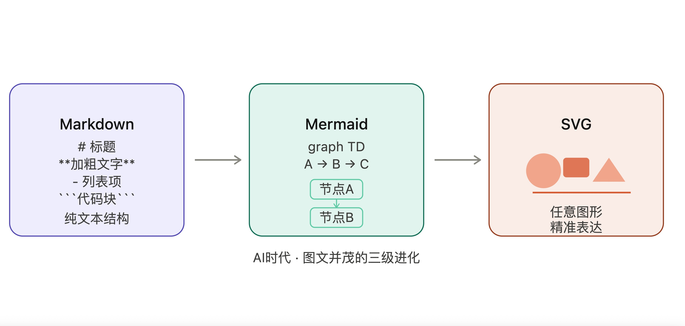
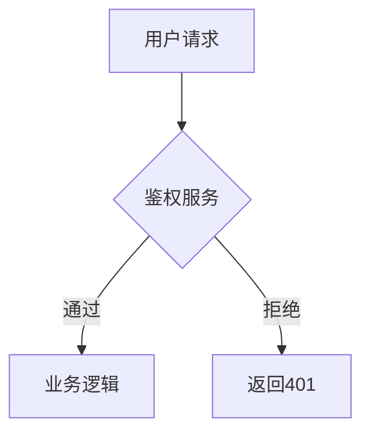

## 为什么 SVG 能走红? AI时代, 一场关于"图文并茂"的格式革命  
  
### 作者  
digoal  
  
### 日期  
2026-04-18  
  
### 标签  
AI , markdown , mermaid , svg , 图文并茂 , 结构化数据 , AI 消费 , AI 生产  
  
----  
  
## 背景  
  
  
## 一切从一个痛点说起  
  
我在 GitHub 上维护着一个博客：[digoal/blog](https://github.com/digoal/blog)，几千篇深度技术文章，全部用 Markdown 写成。  
  
Markdown 改变了我的写作方式。标题、代码块、列表、加粗……纯文本，却结构清晰，渲染优雅。更重要的是：**它是机器可读的**。  
  
这不是小事。  
  
AI时代，模型要消化海量语料，要输出可解析的内容。一篇格式混乱的Word文档，远不如一篇结构清晰的Markdown来得"营养"。于是乎，Markdown成了技术人的标配，成了AI训练数据的主流格式，甚至成了一种新的通用语言。  
  
但图片，一直是我的痛点。  
  
  
  
## 图片，技术写作的阿喀琉斯之踵  
  
你有没有遇到过这种情况？  
  
写一篇架构设计文章，想画个系统拓扑图，打开PPT折腾半小时，导出PNG，上传，插入。第二天需求改了，图要改，重来一遍。三个月后文章迁移平台，图片链接全挂了。  
  
这就是图片的原罪：**它是不可维护的二进制黑盒**。  
  
- 无法版本管理  
- 无法被搜索引擎索引内容  
- 无法被AI模型理解和生成  
- 迁移即失联，协作即混乱  
  
Markdown解决了文字的问题，但图片的问题一直悬在那里，像一根刺。  
  
  
  
## Mermaid：第一道曙光  
  
大约在这几年，Mermaid流行了起来。  
  
它的逻辑很简单：**用文字描述图，让工具去渲染图**。  
  
```text  
graph TD  
    A[用户请求] --> B{鉴权服务}  
    B -->|通过| C[业务逻辑]  
    B -->|拒绝| D[返回401]  
```  
  
效果如下:  
  

  
几行代码，一张流程图。可以放进Markdown，可以版本管理，可以被Git diff，可以被AI读懂、生成、修改。  
  
Mermaid让"图"第一次真正融入了技术写作的工作流。它的崛起，本质上是同一种需求的延伸：**让内容结构化、可编程、机器友好**。  
  
但Mermaid也有天花板。流程图、时序图、甘特图……它的图形类型是固定的，表达力是有限的。你能用Mermaid画一张系统架构的艺术感示意图吗？能画一张带渐变色、带注释气泡的数据分布图吗？  
  
不行。  
  
  
  
## SVG：真正的图文并茂  
  
SVG（Scalable Vector Graphics）不是新东西，它1999年就诞生了。但它真正走进普通开发者和内容创作者的视野，是最近这两年的事。  
  
为什么是现在？  
  
**因为AI来了，而SVG恰好是AI最擅长生成的图形格式。**  
  
SVG的本质是XML文本。它长这样：  
  
```xml  
<svg viewBox="0 0 200 100">  
  <rect x="10" y="10" width="80" height="60" fill="#5DCAA5" rx="8"/>  
  <text x="50" y="45" text-anchor="middle" fill="white">系统A</text>  
  <line x1="90" y1="40" x2="110" y2="40" stroke="#888" marker-end="url(#arrow)"/>  
  <rect x="110" y="10" width="80" height="60" fill="#D85A30" rx="8"/>  
  <text x="150" y="45" text-anchor="middle" fill="white">系统B</text>  
</svg>  
```  
  
效果如下:  
  
  
  
这就是一张图。没有二进制，没有像素，全是可读的文本。  
  
这意味着什么？  
  
**意味着AI可以直接生成它、直接修改它、直接理解它。** 你告诉Claude"帮我画一张三层架构图，数据库用绿色，缓存用橙色"——它可以直接输出SVG代码，渲染出来就是你想要的图。  
  
这在PNG时代是不可能的。模型能生成图片描述，但无法"写出"一张可维护的图。SVG打破了这个壁垒。  
  
  
  
## SVG凭什么走红？三个维度说清楚  
  
### 1. 它是文本，所以它可以被管理  
  
SVG文件可以放进Git仓库，可以被diff，可以被merge，可以被全文搜索。它就是代码，和你的.py、.go文件平起平坐。  
  
一张系统架构图，从版本1.0改到版本3.0，每一次改动都有记录，可以回滚，可以对比。这是PNG永远给不了你的。  
  
### 2. 它是结构化的，所以AI能读懂  
  
大模型训练需要图文对齐的语料。Markdown里嵌入SVG，机器同时拿到了文字逻辑和图形结构，两者是一体的，而不是割裂的。  
  
这不仅影响训练数据质量，也影响AI的输出能力。一个在大量SVG上训练过的模型，可以理解"节点"、"边"、"层级"，可以按你的语义生成图形，而不只是拼凑几个图形API调用。  
  
### 3. 它是矢量的，所以它永远清晰  
  
SVG无论放大多少倍，线条永远锐利。在4K显示器上、在Retina屏上、在打印输出时，SVG都不会变模糊。而PNG在高分辨率设备上的锯齿感，是很多技术文档的顽疾。  
  
  
  
## 我的工作流变了  
  
现在，我的技术写作工作流大概是这样的：  
  
- 文字内容：Markdown  
- 简单流程/时序：Mermaid  
- 复杂架构图/示意图/插图：SVG（让AI生成，我调整）  
- 图片（截图/照片）：只在不可替代时使用  
  
三者各司其职，却共享同一个特性：**都是文本，都可版本管理，都对AI友好**。  
  
我的那几千篇博客文章，以前插图要么没有，要么是截图放着将来某天可能失效。现在，我开始把核心示意图迁移成SVG——不是因为SVG多漂亮，而是因为它终于让图和文字处于平等的地位。  
  
  
  
## AI时代，格式即生产力  
  
有一个问题值得深思：为什么AI时代会催生对格式的更高要求？  
  
答案是：**因为AI既是消费者，也是生产者**。  
  
过去，格式是给人看的。Word、PPT、PDF，设计的核心是人类的视觉体验。  
  
现在，内容在人和机器之间双向流动。你用Markdown写文档，AI来理解和引用；AI生成SVG，你来渲染和调整。格式变成了一种接口，一种两端都能解析的协议。  
  
能被机器理解的内容，才能被机器增强。能被机器增强的内容，才真正具备AI时代的竞争力。  
  
Markdown走红，因为它结构化了文字。Mermaid走红，因为它结构化了简单图形。SVG走红，因为它把任意图形也纳入了这套逻辑。  
  
这是一条清晰的进化曲线，终点是：**所有内容，都以机器可读的形式存在**。  
  
  
  
## 写在最后  
  
如果你还在用截图做技术文档的配图，建议试试SVG。不一定要自己手写——让AI帮你生成，你来调参数、改颜色、加标注。  
  
如果你在维护一个Markdown技术博客，考虑把核心示意图换成SVG。它不会比PNG丑，却会比PNG长久得多。  
  
如果你是AI领域的从业者，关注一下你的训练数据里，图文对齐的质量怎么样。SVG可能是一个被低估的数据资产。  
  
图文并茂，从来不只是排版问题。它是内容在AI时代存活的方式。  
  
---  
  
*digoal的博客：[github.com/digoal/blog](https://github.com/digoal/blog) ——几千篇Markdown深度技术文章，持续更新中。*  
  
