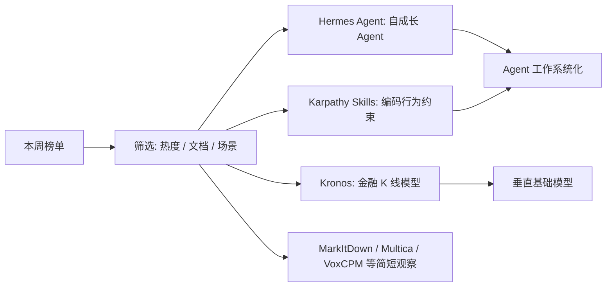
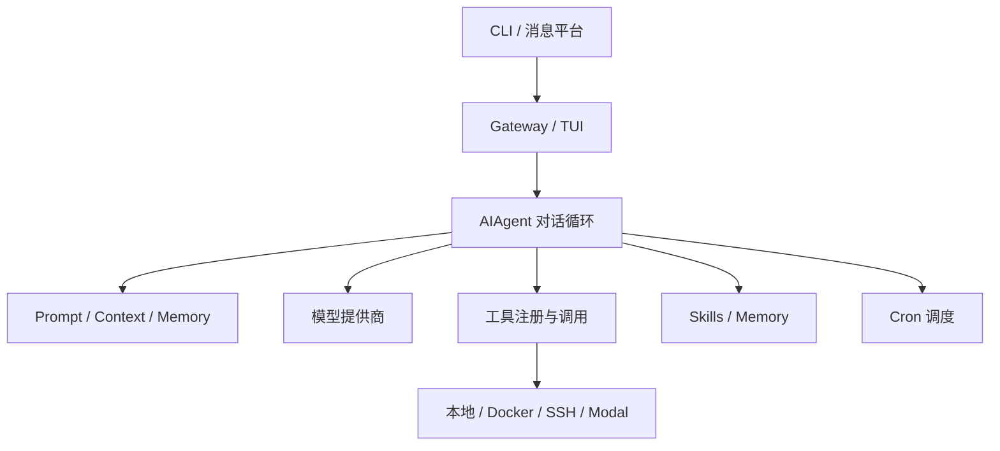
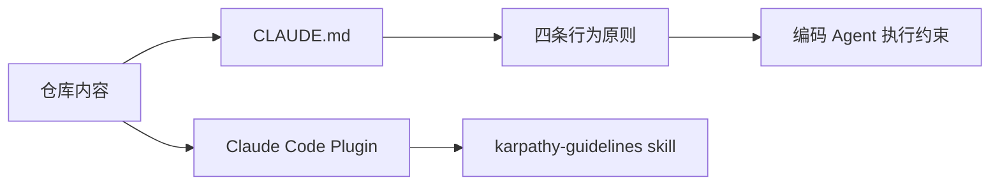
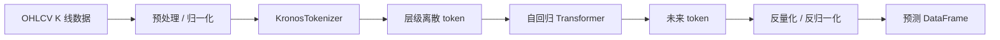

## 本周 GitHub 热点：AI Agent 正在从“工具”变成“工作系统”   
  
### 作者  
digoal  
  
### 日期  
2026-04-18  
  
### 标签  
github , 周热点项目  
  
----  
  
## 背景  
> 本周值得重点看的不是单个模型能力，而是三个方向：Agent 的长期记忆与技能复用、编码 Agent 的行为约束、金融时间序列模型的专用化。

## 导言

处理时间：2026-04-18 19:49:09 CST +0800

本周榜单的核心信号很明确：开发者正在把 AI Agent 当成可持续运行的工程系统，而不是一次性聊天窗口。`hermes-agent` 讲长期记忆、技能、自我改进和多平台入口；`andrej-karpathy-skills` 把 Agent 编码时最容易犯的错误写成行为约束；`Kronos` 则把 foundation model 的思路推进到金融 K 线序列。

## 本周趋势总览

| 项目 | 简介 | 主要语言 | stars | 本周热度 |
| --- | --- | --- | ---: | ---: |
| [NousResearch/hermes-agent](https://github.com/NousResearch/hermes-agent) | The agent that grows with you | Python | 97,742 | 47,053 |
| [forrestchang/andrej-karpathy-skills](https://github.com/forrestchang/andrej-karpathy-skills) | A single CLAUDE.md file to improve Claude Code behavior | 未标注 | 55,768 | 42,267 |
| [microsoft/markitdown](https://github.com/microsoft/markitdown) | Python tool for converting files and office documents to Markdown | Python | 111,516 | 13,214 |
| [multica-ai/multica](https://github.com/multica-ai/multica) | The open-source managed agents platform | TypeScript | 15,718 | 10,056 |
| [shiyu-coder/Kronos](https://github.com/shiyu-coder/Kronos) | Foundation Model for Financial Markets | Python | 19,138 | 6,511 |
| [OpenBMB/VoxCPM](https://github.com/OpenBMB/VoxCPM) | Tokenizer-Free TTS | Python | 14,307 | 5,786 |
| [addyosmani/agent-skills](https://github.com/addyosmani/agent-skills) | Production-grade engineering skills for AI coding agents | Shell | 17,144 | 5,571 |
| [virattt/ai-hedge-fund](https://github.com/virattt/ai-hedge-fund) | An AI Hedge Fund Team | Python | 55,994 | 4,941 |

筛选为主项目的标准是：热度高、README 信息充分、能从仓库结构或 DeepWiki 交叉验证、对中文开发者有明确参考价值。基于这个标准，本文深度解读三个项目：`hermes-agent`、`andrej-karpathy-skills`、`Kronos`。

## 一图看懂本周热点

## 项目一：NousResearch/hermes-agent

### 项目定位

[NousResearch/hermes-agent](https://github.com/NousResearch/hermes-agent) 的 README 把它定位为“会成长的 AI Agent”。GitHub 当前页面显示该仓库约 97.4k stars、13.7k forks、MIT license，主要语言为 Python。榜单热度为 47,053，是本次列表中最高的一档。

它的重点不是再做一个 CLI 聊天器，而是把 Agent 做成可长期运行的个人工作系统：CLI、Telegram/Discord/Slack/WhatsApp/Signal 等入口、技能系统、记忆、cron 调度、子 Agent 并行、不同终端后端，以及研究用的轨迹生成能力。GitHub 页面还显示最新 release 为 `Hermes Agent v0.10.0 (2026.4.16)`，说明项目近期更新活跃。

### 核心能力

| 能力 | 可验证来源 | 说明 |
| --- | --- | --- |
| 多入口交互 | README | 支持 CLI 与多种消息平台网关 |
| 多模型提供商 | README | 支持 Nous Portal、OpenRouter、Hugging Face、OpenAI 等或自定义 endpoint |
| 技能与记忆 | README / DeepWiki | 支持 agent-curated memory、skills、自身历史会话搜索 |
| 调度任务 | README | 内置 cron scheduler，可投递到不同平台 |
| 执行环境抽象 | README / DeepWiki | 支持 local、Docker、SSH、Daytona、Singularity、Modal 等终端后端 |

### 架构或工作流图

DeepWiki 对代码结构的总结显示，核心模块包括 `agent/`、`tools/`、`gateway/`、`hermes_cli/`、`plugins/` 等；`AIAgent` 负责对话循环和工具调度，`tools/registry.py` 管理工具注册，`gateway/` 负责消息平台适配，`agent/context_compressor.py` 处理上下文压缩。这些结论能和 GitHub 页面展示的目录结构交叉验证。

### 为什么会火

事实层面：本周榜单热度是 47,053；GitHub 当前页面显示该仓库已有 4,764 commits、1.9k issues、3.4k pull requests、9 个 releases，最新 release 在 2026-04-16。

推断层面：它踩中了 Agent 工程化的三个痛点。第一，Agent 不能只靠当前上下文，需要跨会话记忆和技能积累。第二，真正有用的 Agent 往往需要在服务器、容器、远程终端和消息平台之间迁移，而不是锁死在本地 IDE。第三，团队和个人都需要可审计、可中断、可调度的工作流，而不是一次性 prompt。

### 适用场景

适合用于个人长期 Agent 工作台：把 CLI、Telegram、cron、技能和记忆组合起来，处理日常开发、检索、报告和自动化任务。

适合用于研究型 Agent 实验：README 提到 batch trajectory generation、trajectory compression、Atropos RL environments，适合做工具调用轨迹和训练数据相关实验。

适合用于需要多执行环境的任务编排：DeepWiki 和 README 都显示它抽象了多种 terminal backend。

### 局限与风险

第一，功能面很宽，部署和权限管理复杂度不会低。消息平台、终端后端、模型 provider、cron 和本地文件系统组合在一起，安全边界需要认真配置。

第二，项目更新活跃，但 issues 和 PR 数量也高，采用前要评估关键路径是否稳定。

第三，README 中有很多能力描述，但本文没有找到可引用的企业采用案例或生产 benchmark，因此不写“已被某某公司大规模使用”这类结论。

## 项目二：forrestchang/andrej-karpathy-skills

### 项目定位

[forrestchang/andrej-karpathy-skills](https://github.com/forrestchang/andrej-karpathy-skills) 是一个很小但传播很快的仓库。它的核心交付物是一份 `CLAUDE.md`，目标是约束 Claude Code 在写代码时的常见坏习惯。GitHub 当前页面显示约 55.5k stars、4.7k forks、25 commits、MIT license、无发布版本；本周榜单热度为 42,267。

README 明确说，它来自 Andrej Karpathy 对 LLM 编码问题的观察：模型容易替用户做错误假设、过度设计、乱动无关代码、缺少可验证目标。项目把这些问题收敛成四条原则。

### 核心能力

| 能力 | 可验证来源 | 说明 |
| --- | --- | --- |
| Think Before Coding | README / CLAUDE.md | 编码前显式说明假设、歧义和取舍 |
| Simplicity First | README / CLAUDE.md | 最少代码解决问题，不加投机式抽象 |
| Surgical Changes | README / CLAUDE.md | 只改必要范围，不做无关重构 |
| Goal-Driven Execution | README / CLAUDE.md | 把任务转成可验证目标，围绕测试和检查闭环 |
| 两种分发方式 | README / DeepWiki | Claude Code 插件，或复制/追加 `CLAUDE.md` 到项目 |

### 架构或工作流图

DeepWiki 的结构信息显示，该仓库包含 `.claude-plugin`、`skills/karpathy-guidelines`、`CLAUDE.md`、`EXAMPLES.md` 和 `README.md`。也就是说，它不是一个复杂运行时系统，而是一个“行为协议 + 插件分发”的轻量项目。

### 为什么会火

事实层面：该项目本周榜单热度为 42,267；GitHub 当前页面显示它只有 25 commits，但 stars 已经超过 55k。

推断层面：这类项目会火，是因为 Agent 编码的主要瓶颈不再只是“模型不会写代码”，而是“模型太愿意写代码”。它会在不清楚需求时继续推进，会引入过度抽象，会把无关格式和注释一起改掉。一个短小的 `CLAUDE.md` 能快速被复制到项目中，降低试用门槛。

### 适用场景

适合用于已有 Claude Code 项目的行为约束基线，特别是多人协作仓库、代码审查要求高的仓库、以及不希望 Agent 做 drive-by refactor 的仓库。

适合用于团队内部制定 Agent 使用规范：把“先澄清、少改动、可验证”变成默认协议，再叠加项目自己的 TypeScript、测试、发布规则。

适合用于提示词治理实验：它提供了一个非常小的样本，观察行为指令如何影响 Agent 输出质量。

### 局限与风险

第一，它不是测试框架，也不是静态分析器。它只能约束 Agent 行为，不能保证结果正确。

第二，README 中的“效果”更多是目标描述，而不是经独立评测的量化结论。本文不把“减少错误”“提升质量”写成已验证性能结论。

第三，它默认偏谨慎。对大量简单小改动来说，过多澄清和计划可能降低速度，需要结合项目风险分级使用。

## 项目三：shiyu-coder/Kronos

### 项目定位

[shiyu-coder/Kronos](https://github.com/shiyu-coder/Kronos) 是面向金融 K 线序列的 foundation model。GitHub 当前页面显示约 19.1k stars、3.5k forks、MIT license、主要语言 Python；本周榜单热度为 6,511。

README 的核心说法是：Kronos 面向金融 candlesticks / K-lines，训练数据来自 45+ 全球交易所；它使用两阶段框架，先把连续的多维 OHLCV K 线数据量化为层级离散 token，再用自回归 Transformer 对 token 序列建模。项目还提供 Hugging Face model zoo、预测示例、批量预测、微调脚本和 Qlib 示例。

### 核心能力

| 能力 | 可验证来源 | 说明 |
| --- | --- | --- |
| 金融 K 线专用建模 | README | 面向 OHLCV / K-line 序列 |
| 两阶段架构 | README / DeepWiki | Tokenizer 量化连续数据，Transformer 自回归预测 token |
| Model Zoo | README | Kronos-mini、small、base 等模型，部分开源权重在 Hugging Face |
| 预测 API | README / DeepWiki | `KronosPredictor` 封装预处理、归一化、预测和反归一化 |
| 微调与 Qlib 示例 | README | 提供 finetune、Qlib 数据准备和回测示例 |

### 架构或工作流图

DeepWiki 对代码的解释与 README 一致：`KronosTokenizer` 负责编码/解码，`Kronos` 模型负责自回归生成，`KronosPredictor` 负责端到端预测流程。README 同时写明 `Kronos-small` 与 `Kronos-base` 的 `max_context` 为 512，输入过长时会被处理。

### 为什么会火

事实层面：本周榜单热度为 6,511；GitHub 当前页面显示项目有 76 commits、145 issues、23 pull requests，无正式 GitHub release。README 新闻里写到论文已上 arXiv，项目被 AAAI 2026 接收，并发布了微调脚本。

推断层面：金融市场数据天然高噪声、非平稳，而且 K 线是多维连续序列。把金融 K 线先 token 化，再使用类似语言模型的自回归建模方式，对做量化研究、金融时间序列建模、垂直领域 foundation model 的开发者都有吸引力。

### 适用场景

适合用于金融时间序列研究，尤其是想比较“连续值预测”和“离散 token 序列建模”差异的团队。

适合用于 K 线预测原型：README 给出了从 Hugging Face 加载 tokenizer/model、构造输入 DataFrame、调用 `predict` 的流程。

适合用于 A 股或其他市场的微调实验：项目提供 Qlib 数据准备、训练 tokenizer、训练 predictor、简化回测等脚本。

### 局限与风险

第一，金融预测不是普通机器学习 demo。README 自己也提示，示例回测是起点，真实量化流程还需要组合优化、风险因子中性化、交易成本、滑点和市场冲击建模。

第二，模型输入有格式约束：`open`、`high`、`low`、`close` 必须存在，`volume` 和 `amount` 可选；批量预测要求历史长度和预测长度一致。

第三，本文没有把它写成“能稳定赚钱”的系统。README 和论文链接能支持的是模型结构、示例和研究用途，不支持收益承诺。

## 其他值得关注的项目

### microsoft/markitdown

[microsoft/markitdown](https://github.com/microsoft/markitdown) 是微软维护的文件转 Markdown 工具。GitHub 当前页面显示约 111k stars、MIT license。README 说明它支持 PDF、PowerPoint、Word、Excel、图片 OCR/EXIF、音频转写、HTML、CSV/JSON/XML、ZIP、YouTube URLs、EPub 等输入，并强调输出更适合文本分析工具消费，而不是高保真排版转换。

它值得关注的原因很直接：RAG、Agent、文档问答都需要把 Office、PDF、网页和多媒体资料转成模型更容易处理的文本结构。局限也明显：复杂版式、法律合同、扫描质量差的 PDF，仍要做人工抽检。

### multica-ai/multica

[multica-ai/multica](https://github.com/multica-ai/multica) 把 coding agents 做成“可分配任务、可看进度、可复用技能”的团队平台。GitHub 当前页面显示约 15.8k stars、43 个 releases，主要语言 TypeScript 与 Go，最新 release 为 `v0.2.6`，时间是 2026-04-18。README 写到它支持任务分配、执行监控、技能复用、统一 runtime、多 workspace，并可与 Claude Code、Codex、OpenClaw、OpenCode、Hermes、Gemini、Pi、Cursor Agent 等协作。

它与 `hermes-agent` 的共同趋势是：Agent 正在从个人命令行工具走向团队作业系统。

### OpenBMB/VoxCPM

[OpenBMB/VoxCPM](https://github.com/OpenBMB/VoxCPM) 的 README 把 VoxCPM2 定位为 tokenizer-free TTS 系统，支持 30 种语言、Voice Design、可控声音克隆和 48kHz 输出，license 为 Apache-2.0。它适合关注多语音合成、声音设计、语音 Agent 的开发者。

注意：README 中包含内部 benchmark 和模型对比，本文不展开性能结论，只记录官方声明的能力边界和开源信息。

### addyosmani/agent-skills

[addyosmani/agent-skills](https://github.com/addyosmani/agent-skills) 与 `andrej-karpathy-skills` 指向同一个趋势：把工程经验沉淀成 Agent 可执行的技能。一个偏行为约束，一个偏生产级工程技能集合。

### virattt/ai-hedge-fund

[virattt/ai-hedge-fund](https://github.com/virattt/ai-hedge-fund) 与 `Kronos` 都落在 AI + 金融方向，但关注点不同。前者更像多 Agent 金融分析框架，后者是金融 K 线基础模型。对中文读者来说，重点不是“AI 炒股”，而是拆开看：数据来源、策略假设、回测严谨度、风险约束是否可验证。

## 总结

本周榜单最值得记住的不是“又出现几个爆款 Agent 项目”，而是 Agent 工程范式正在定型。

第一层是运行时：`hermes-agent` 这类项目把 CLI、消息平台、记忆、技能、调度和执行环境接起来，让 Agent 可以持续运行。

第二层是行为协议：`andrej-karpathy-skills` 这种短小项目说明，团队不只需要更强模型，还需要明确告诉模型什么不能做，什么时候要澄清，怎样才算完成。

第三层是垂直模型：`Kronos` 把 foundation model 的方法用到金融 K 线语言，说明开源社区正在从通用聊天能力转向特定数据结构和专业场景。

对开发者的实际建议是：如果你在搭 Agent 基础设施，优先看 `hermes-agent` 和 `multica`；如果你在管控编码 Agent 的输出质量，先读 `andrej-karpathy-skills`，再结合自己的仓库写项目规则；如果你关注金融时间序列，`Kronos` 值得研究，但不要把示例回测当成投资结论。

## 项目事实卡

| 项目 | GitHub 当前信息 | License | 最近 release / 活跃度 | 不确定信息 |
| --- | --- | --- | --- | --- |
| [NousResearch/hermes-agent](https://github.com/NousResearch/hermes-agent) | 约 97.4k stars，13.7k forks，Python 87.4%，4,764 commits | MIT | GitHub 页面显示最新 release 为 v0.10.0，2026-04-16 | 未验证企业采用、生产 benchmark |
| [forrestchang/andrej-karpathy-skills](https://github.com/forrestchang/andrej-karpathy-skills) | 约 55.5k stars，4.7k forks，25 commits | MIT | GitHub 页面显示 no releases published | 未验证量化效果，只能确认其行为指南内容 |
| [shiyu-coder/Kronos](https://github.com/shiyu-coder/Kronos) | 约 19.1k stars，3.5k forks，Python 81.9%，76 commits | MIT | GitHub 页面显示 no releases published；README 显示 arXiv、AAAI 2026、微调脚本信息 | 未验证真实交易收益、生产可用性 |

## 参考资料

- [NousResearch/hermes-agent GitHub](https://github.com/NousResearch/hermes-agent)
- [NousResearch/hermes-agent Releases](https://github.com/NousResearch/hermes-agent/releases)
- [forrestchang/andrej-karpathy-skills GitHub](https://github.com/forrestchang/andrej-karpathy-skills)
- [forrestchang/andrej-karpathy-skills CLAUDE.md](https://raw.githubusercontent.com/forrestchang/andrej-karpathy-skills/main/CLAUDE.md)
- [shiyu-coder/Kronos GitHub](https://github.com/shiyu-coder/Kronos)
- [Kronos arXiv paper](https://arxiv.org/abs/2508.02739)
- [microsoft/markitdown GitHub](https://github.com/microsoft/markitdown)
- [multica-ai/multica GitHub](https://github.com/multica-ai/multica)
- [OpenBMB/VoxCPM GitHub](https://github.com/OpenBMB/VoxCPM)
- DeepWiki MCP：`NousResearch/hermes-agent`、`forrestchang/andrej-karpathy-skills`、`shiyu-coder/Kronos` 的结构与架构问答
  
  
#### [PostgreSQL 解决方案集合](../201706/20170601_02.md "40cff096e9ed7122c512b35d8561d9c8")
  
  
#### [德哥 / digoal's Github - 公益是一辈子的事.](https://github.com/digoal/blog/blob/master/README.md "22709685feb7cab07d30f30387f0a9ae")
  
  
#### [About 德哥](https://github.com/digoal/blog/blob/master/me/readme.md "a37735981e7704886ffd590565582dd0")
  
  

  
