## Kronos：金融 K 线终于有了自己的“市场语言模型”   
  
### 作者  
digoal  
  
### 日期  
2026-04-18  
  
### 标签  
大语言模型 , LLM , K 线 , 金融 , 时序大模型   
  
----  
  
## 背景  
> 结论先行：Kronos 的价值不在于“又做了一个时间序列预测模型”，而在于它把金融 K 线从连续数值回归问题，改造成了“先离散成市场 token、再做自回归生成”的语言建模问题。这个判断成立的前提是：你的任务确实围绕 OHLCV/OHLCVA K 线、短中期价格/收益/波动/合成序列建模展开，并且你接受模型输出只是研究信号，不等于可直接上线交易策略。

项目地址：[shiyu-coder/Kronos](https://github.com/shiyu-coder/Kronos)  
论文：[Kronos: A Foundation Model for the Language of Financial Markets](https://arxiv.org/abs/2508.02739)  
模型卡：[NeoQuasar/Kronos-base](https://huggingface.co/NeoQuasar/Kronos-base)

## 证据包

这篇文章按以下顺序搜证：先读项目 README，再用 DeepWiki MCP 分析架构，然后才做网络搜索。

| 证据 | 来源 | 用途 |
|---|---|---|
| Kronos 是面向金融 K 线的 decoder-only foundation model，使用 tokenizer + autoregressive Transformer 两阶段框架 | [GitHub README](https://github.com/shiyu-coder/Kronos)、[Hugging Face 模型卡](https://huggingface.co/NeoQuasar/Kronos-base) | 产品定位、架构说明 |
| 预训练数据超过 12B K-line records，覆盖 45 个全球交易所、7 种采样频率 | [arXiv HTML](https://arxiv.org/html/2508.02739) | 观点成立的数据基础 |
| 论文报告：价格序列预测 RankIC 相比 strongest TSFM baseline 提升 93%，相比 best non-pre-trained baseline 提升 87%；波动预测 MAE 低 9%；合成 K 线 fidelity 提升 22% | [arXiv 摘要](https://arxiv.org/abs/2508.02739)、[arXiv HTML](https://arxiv.org/html/2508.02739) | 效果对比证据 |
| DeepWiki 分析确认核心类为 `KronosTokenizer`、`Kronos`、`KronosPredictor`，核心代码在 `model/kronos.py`，并存在 fine-tuning、web UI、regression tests | DeepWiki MCP 对 `shiyu-coder/Kronos` 的架构分析 | 架构与实操路径 |
| TimesFM、Chronos、TimeGPT 是同类时间序列 foundation model/服务，但定位更偏通用时间序列，Kronos 明确专注金融 K 线 | [TimesFM GitHub](https://github.com/google-research/timesfm)、[Chronos GitHub](https://github.com/amazon-science/chronos-forecasting)、[TimeGPT Docs](https://www.nixtla.io/docs) | 竞品对比 |
| Kronos README 明确提醒：Qlib 微调回测 pipeline 是 demo，不是生产级量化交易系统 | [GitHub README](https://github.com/shiyu-coder/Kronos) | 风险边界 |

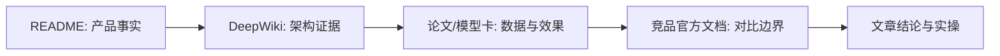

## 一、背景：时间序列 foundation model 火了，但金融 K 线不是普通时间序列

过去做时间序列预测，大多数团队按领域单独建模：电力负荷一套模型，零售销量一套模型，金融行情又一套模型。Foundation model 的思路是：先在大规模数据上预训练一个通用模型，再迁移到不同任务，减少每个场景从零建模的成本。

但金融 K 线有自己的麻烦。

金融行情不是平滑传感器数据，也不是稳定季节性的销量数据。它有低信噪比、非平稳性、强噪声、异方差、极端波动、交易制度变化、资产间风格切换等问题。K 线本身还不是单变量序列，而是由 open、high、low、close、volume、amount 等多维信息构成的压缩市场片段。

Kronos 论文把这个问题说得很直接：通用 TSFM 用在金融 K 线时经常不如专门的非预训练模型，而且主流 TSFM 对波动预测、合成 K 线、风险管理等金融关键任务覆盖不足。

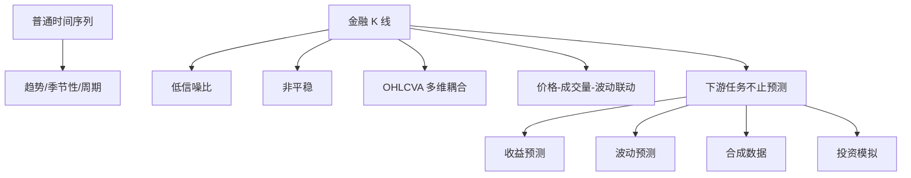

所以这篇文章的核心观点是：

> 如果通用 TSFM 是“通用时间序列外语老师”，Kronos 更像“金融 K 线母语模型”。它不是把 K 线当普通数值序列，而是先把 OHLCVA 离散成层次化 token，再用 decoder-only Transformer 学市场语言。

成立前提：

- 数据主要是 K 线/OHLCV/OHLCVA，而不是财报文本、订单簿全深度、新闻、因子大宽表。
- 目标是获得更强的价格、收益、波动、合成 K 线等基础信号，而不是直接生成生产级交易决策。
- 团队能接受 foundation model 的黑箱性，并有严谨回测、风险约束、交易成本和滑点建模。

如果这些前提不成立，Kronos 就不是银弹。

## 二、场景：量化研究员真正缺的不是一个预测函数，而是一个可迁移的市场表征

典型使用者有三类。

| 角色 | 现实场景 | 关心的问题 |
|---|---|---|
| 量化研究员 | 想从多市场 K 线中挖预测信号 | 模型能不能跨资产、跨频率迁移 |
| 金融 AI 工程师 | 要把预训练模型接入研究/回测 pipeline | 数据格式、推理速度、微调成本、稳定性 |
| 技术决策者 | 判断是否值得把 TSFM 引入投研平台 | 相比 Qlib 传统模型、TimesFM/Chronos/TimeGPT 是否有差异化 |

Kronos 的 README 给了两条路径：

- 直接用 `KronosPredictor` 做预测。
- 用 Qlib 示例 pipeline 在 A 股数据上微调 tokenizer 和 predictor，再做简单 top-K 回测。

这说明它不是只给论文看图，而是试图进入量化研究 workflow。

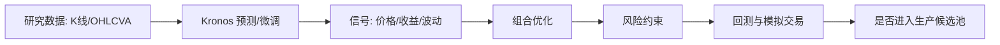

注意这里的关键：Kronos 只覆盖中间的“信号生成/表征学习”部分。README 自己也强调，示例 top-K 策略只是演示，不是生产级量化系统。真正上线还要经过组合优化、风险中性化、交易成本、滑点、容量和风控。

## 三、痛点：传统方案的问题不是不能预测，而是泛化和任务覆盖不足

### 1. 传统统计模型：解释性强，但表达能力有限

ARIMA、GARCH 等模型在金融里长期有价值，尤其适合解释波动聚集、条件异方差等现象。问题是它们通常要围绕单一任务和特定假设建模，难以统一处理大规模多资产、多频率、多任务场景。

Kronos 论文把 GARCH 等 econometric volatility models 纳入 baseline，说明作者并不是忽略传统模型，而是在更宽任务集合里比较它们。

### 2. 专用深度模型：单点强，但每个任务都要重新训练和调参

iTransformer、TCN、Transformer 类模型可以在某些金融任务上做得很好。但传统深度学习工作流常见问题是：

- 每个市场重训。
- 每个频率重训。
- 每个任务单独设计 loss。
- 迁移能力不稳定。
- 训练和特征工程成本高。

这不是模型能力不行，而是工程范式仍然是“每个任务单独造模型”。

### 3. 通用 TSFM：规模化强，但金融 K 线不是主语料

TimesFM、Chronos、TimeGPT 证明了时间序列 foundation model 的价值。比如 TimesFM 官方 README 表明它是 Google Research 的预训练 time-series foundation model，并进入 BigQuery ML、Google Sheets 等产品路径；Chronos 官方 README 说明它把时间序列缩放、量化成 token，再用语言模型训练；TimeGPT 文档强调通过 API 做预测和异常检测。

但 Kronos 论文指出，金融序列在多数通用 TSFM 预训练语料中占比有限，金融关键任务也常被低估。这就是 Kronos 的切入点。

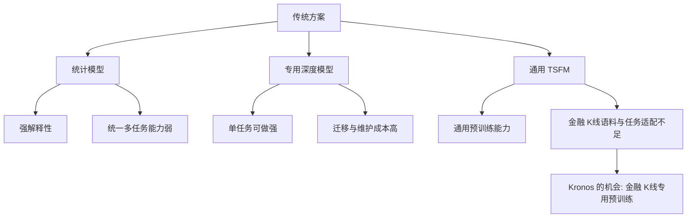

我的判断是：Kronos 批判传统方案的点不是“传统方案都过时”，而是金融 K 线需要一个可以跨资产、跨频率、跨任务迁移的基础表征层。

## 四、Kronos 的方案：把 K 线变成 token，再像语言一样生成未来

Kronos 的两阶段方案很清晰：

- 第一阶段：`KronosTokenizer` 把连续、多维 K 线 OHLCVA 量化成层次化离散 token。
- 第二阶段：`Kronos` decoder-only Transformer 对这些 token 做自回归建模。
- 预测入口：`KronosPredictor` 负责数据校验、时间特征、归一化、调用模型、反归一化和输出 DataFrame。

DeepWiki 对仓库的架构分析确认：`KronosTokenizer`、`Kronos`、`KronosPredictor` 都定义在 `model/kronos.py`，其中 tokenizer 使用 Binary Spherical Quantization，模型使用 hierarchical embedding、temporal embedding、Transformer blocks 和 dual head，predictor 编排端到端预测流程。

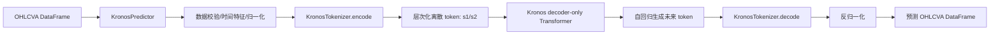

这套机制的关键不在 Transformer 本身，而在“金融 K 线 token 化”。

论文中，token 被拆成 coarse subtoken 和 fine subtoken。coarse 负责低保真重构，fine 负责补残差信息。这样做的目的，是让模型先抓市场状态的大结构，再补细节。

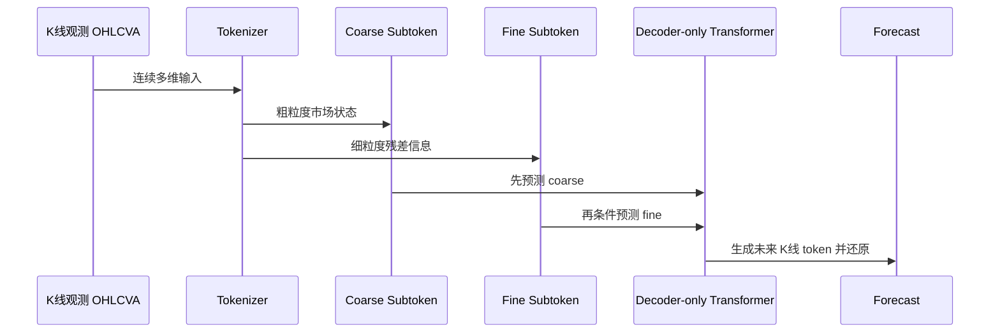

这个设计对应金融数据的两个现实：

- 市场状态有粗粒度 regime，例如趋势、震荡、流动性变化。
- 交易细节有细粒度噪声和残差，例如成交量、上下影线、短期冲击。

## 五、效果：论文数据支持“金融专用 TSFM”这个方向，但不能直接等于交易收益

Kronos 论文给出了一组关键数据：

- 预训练数据超过 12B K-line records。
- 覆盖 45 个全球交易所。
- 覆盖 7 种采样频率。
- 实验覆盖 5 类代表性金融任务。
- baseline 数量为 25 个，覆盖 non-pre-trained full-shot models、zero-shot TSFMs、econometric volatility models、generative time-series models。
- 价格序列预测中，RankIC 相比 strongest TSFM baseline 提升 93%，相比 best non-pre-trained baseline 提升 87%。
- 波动预测 MAE 低 9%。
- 合成 K 线 generative fidelity 提升 22%。
- 投资模拟中，论文报告 Kronos 在 A 股 long-only top-K 策略里取得更高 AER 和 IR。

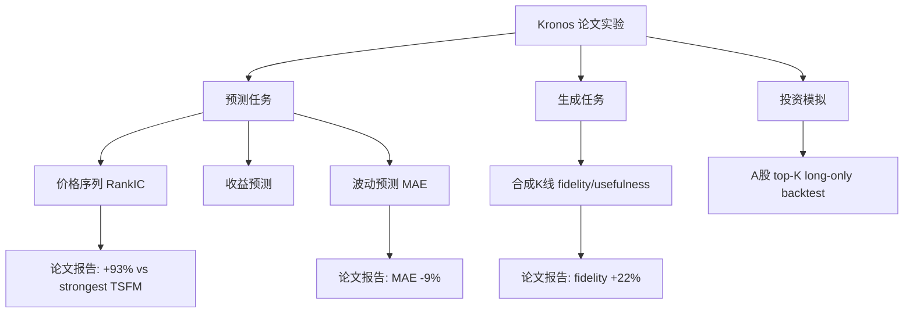

使用前后可以这样理解：

| 维度 | 使用前：传统建模 | 使用 Kronos 后 |
|---|---|---|
| 表征方式 | 连续数值回归或手工因子 | K 线先离散成层次化 token |
| 训练范式 | 每个任务/市场单独训练 | 预训练 backbone + 零样本/微调 |
| 下游任务 | 多为预测单点任务 | 预测、波动、合成数据、投资模拟统一框架 |
| 迁移能力 | 依赖数据与特征工程 | 依赖大规模多市场预训练 |
| 输出形态 | 点预测或模型分数 | 可采样多条未来路径，再平均或做分布分析 |
| 工程入口 | 自己搭 pipeline | `KronosPredictor`、batch predict、Qlib fine-tune 示例 |

但要强调：论文指标证明的是 benchmark 和模拟环境中的建模能力，不等于实盘收益。金融模型从论文到生产，至少还要经过：

- 样本外长期验证。
- 交易成本和滑点建模。
- 市场冲击和容量评估。
- 风格暴露和行业/市值中性化。
- 风险预算和回撤控制。
- 合规和审计。

## 六、与竞品对比：Kronos 是“金融 K 线专用”，不是通用 TSFM 全替代

| 项目 | 定位 | 机制 | 优势 | Kronos 相比它的差异 |
|---|---|---|---|---|
| [TimesFM](https://github.com/google-research/timesfm) | Google Research 通用 time-series foundation model | decoder-only TSFM，TimesFM 2.5 官方 README 提到 200M 参数、最高 16k context、quantile forecast | 通用性强，进入 BigQuery ML/Sheets 等产品路径 | Kronos 更专注金融 K 线，使用 OHLCVA 层次 token |
| [Chronos](https://github.com/amazon-science/chronos-forecasting) | Amazon 预训练时间序列模型家族 | 原版把时间序列 scaling/quantization 成 token；Chronos-Bolt 用 patch 直接多步预测 | 模型家族成熟，Chronos-Bolt 强调速度和内存效率 | Kronos 不是通用序列 token，而是金融 K 线专门 tokenizer |
| [TimeGPT](https://www.nixtla.io/docs) | Nixtla 商业化时间序列 foundation model/API | SDK/REST API，支持预测、异常检测、实时监控 | API 化、低代码、企业服务路径清晰 | Kronos 开源权重/代码更适合自部署和金融 K 线研究 |
| [Qlib](https://github.com/microsoft/qlib) | AI-oriented quant investment platform | 数据、模型训练、回测、策略、执行完整链路 | 量化研究基础设施完整 | Kronos 是模型/backbone，Qlib 是平台；README 中 Kronos 反而用 Qlib 做微调和回测示例 |
| 专用深度模型如 iTransformer | 单任务/特定数据训练 | 连续空间预测 | 在特定数据上可能很强 | Kronos 强调预训练迁移和多任务统一 |

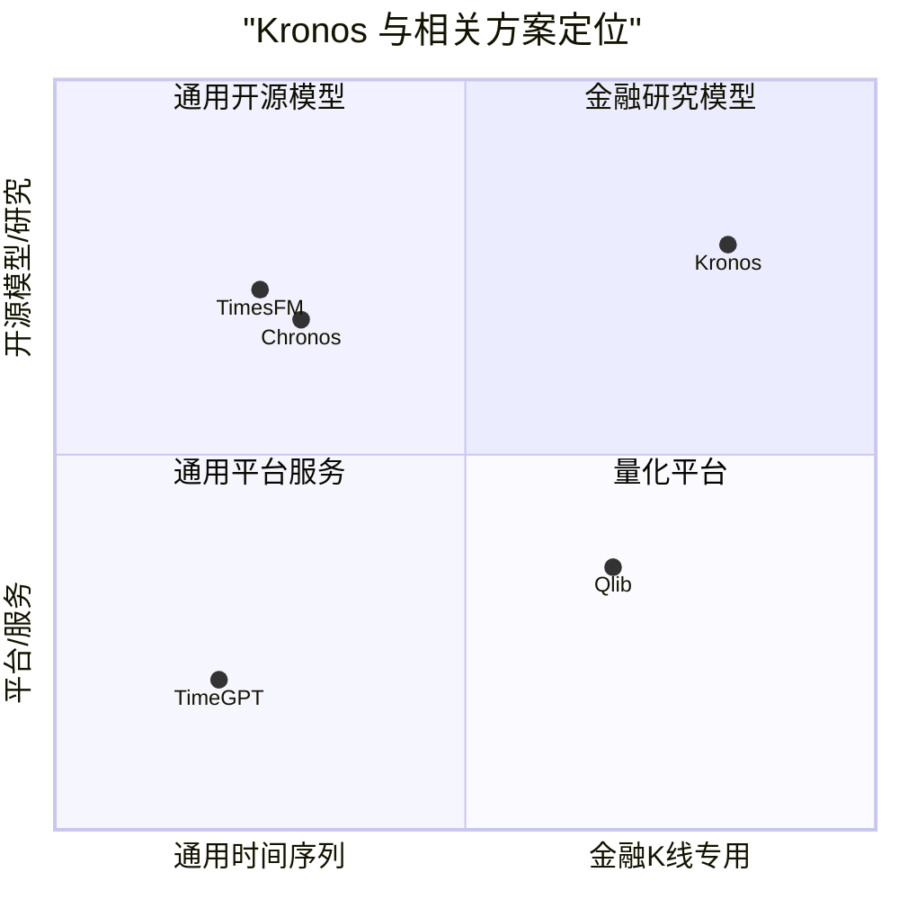

我的结论是：如果你做的是零售销量、IoT、电力负荷，优先看 TimesFM、Chronos、TimeGPT；如果你做的是 K 线、OHLCV、量化预测、合成 K 线，Kronos 的专业化假设更匹配。

## 七、使用场景：不要把它当交易机器人，要当金融基础信号模型

### 场景 1：多资产 K 线预测

症状：每个股票、币种、期货品种都训练一个模型，维护成本高。

Kronos 价值：使用预训练模型作为统一 backbone，对多个资产做预测或批量预测。

适用前提：输入字段至少包含 `open`、`high`、`low`、`close`，`volume` 和 `amount` 可选。

### 场景 2：A 股数据微调与回测研究

症状：海外/加密市场预训练模型迁移到 A 股可能存在分布偏移。

Kronos 价值：README 提供基于 Qlib 的 A 股 fine-tuning pipeline，包括数据处理、tokenizer 微调、predictor 微调和简单 top-K 回测。

适用前提：你有 Qlib 数据，并能接受示例回测不是生产策略。

### 场景 3：波动预测和风险研究

症状：只预测价格方向不够，还要预测 realized volatility、风险状态和波动 regime。

Kronos 价值：论文把 volatility forecasting 纳入主实验，并报告 MAE 改善。

适用前提：你的评估指标、训练窗口和风险模型与论文任务相近。

### 场景 4：合成 K 线生成

症状：真实高质量金融数据昂贵，策略研究和模型测试需要更多场景样本。

Kronos 价值：自回归生成 token 天然支持合成 K 线，论文用 fidelity/usefulness 评估生成质量。

适用前提：合成数据只能辅助研究，不能替代真实市场验证。

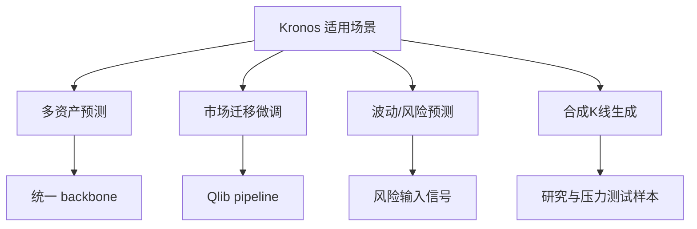

## 八、最佳实践：把 Kronos 放在研究流水线里，而不是绕过风控上线

1. 先做只读研究，不直接交易。

用 Kronos 生成预测信号后，先进入离线研究和回测，不要直接接交易系统。

2. 严格区分 raw signal 和 pure alpha。

README 明确提醒：示例信号在真实量化流程中通常需要进入组合优化，并进行市场 beta、size、value 等风险因子中性化。

3. 不要迷信单条预测路径。

Kronos 使用 temperature、top-p、sample_count 控制概率采样。论文也讨论了 test-time scaling，即通过多条采样路径平均来降低预测方差。实践中应比较不同 `sample_count` 的稳定性与推理成本。

4. 控制 context 长度。

README 和模型卡说明 `Kronos-small`、`Kronos-base` 的 `max_context` 为 512，推荐 lookback 不超过该限制，超长会被 predictor 截断。`Kronos-mini` 使用 2k tokenizer，context length 为 2048，但参数量更小。

5. 微调前先做数据质量治理。

论文强调预训练数据有清洗流程，过滤异常价格尖刺、长期不活跃等低质量片段。你自己的数据也应做相同处理，否则 tokenizer 微调和 predictor 微调会学到垃圾。

6. 用 Qlib 承接回测，而不是自己写“玩具回测”。

Kronos README 选择 Qlib 做 A 股 fine-tuning/backtesting 示例是合理的，因为 Qlib 覆盖数据处理、模型训练、回测分析等链路。

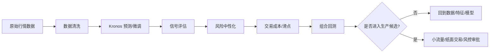

## 九、实操：从安装到第一次预测

以下命令来自项目 README 和模型卡，按研究环境改写。生产环境需要固定依赖版本、模型版本和数据路径。

### 1. 克隆并安装依赖

```bash
git clone https://github.com/shiyu-coder/Kronos.git
cd Kronos
pip install -r requirements.txt
```

### 2. 加载 tokenizer 和模型

```python
from model import Kronos, KronosTokenizer, KronosPredictor

tokenizer = KronosTokenizer.from_pretrained("NeoQuasar/Kronos-Tokenizer-base")
model = Kronos.from_pretrained("NeoQuasar/Kronos-small")

predictor = KronosPredictor(
    model=model,
    tokenizer=tokenizer,
    device="cuda:0",
    max_context=512,
)
```

### 3. 准备 K 线输入

```python
import pandas as pd

df = pd.read_csv("./data/XSHG_5min_600977.csv")
df["timestamps"] = pd.to_datetime(df["timestamps"])

lookback = 400
pred_len = 120

x_df = df.loc[:lookback - 1, ["open", "high", "low", "close", "volume", "amount"]]
x_timestamp = df.loc[:lookback - 1, "timestamps"]
y_timestamp = df.loc[lookback:lookback + pred_len - 1, "timestamps"]
```

### 4. 生成预测

```python
pred_df = predictor.predict(
    df=x_df,
    x_timestamp=x_timestamp,
    y_timestamp=y_timestamp,
    pred_len=pred_len,
    T=1.0,
    top_p=0.9,
    sample_count=1,
)

print(pred_df.head())
```

输出是以 `y_timestamp` 为索引的预测 DataFrame，字段包括 `open`、`high`、`low`、`close`、`volume`、`amount`。

### 5. 批量预测

```python
pred_df_list = predictor.predict_batch(
    df_list=[df1, df2, df3],
    x_timestamp_list=[x_ts1, x_ts2, x_ts3],
    y_timestamp_list=[y_ts1, y_ts2, y_ts3],
    pred_len=pred_len,
    T=1.0,
    top_p=0.9,
    sample_count=1,
    verbose=True,
)
```

README 说明批量预测要求所有序列有相同 historical length 和 prediction length。

### 6. 基于 Qlib 微调

```bash
pip install pyqlib
```

修改 `finetune/config.py` 中的数据和模型路径：

- `qlib_data_path`
- `dataset_path`
- `save_path`
- `backtest_result_path`
- `pretrained_tokenizer_path`
- `pretrained_predictor_path`

数据预处理：

```bash
python finetune/qlib_data_preprocess.py
```

多 GPU 微调 tokenizer：

```bash
torchrun --standalone --nproc_per_node=NUM_GPUS finetune/train_tokenizer.py
```

多 GPU 微调 predictor：

```bash
torchrun --standalone --nproc_per_node=NUM_GPUS finetune/train_predictor.py
```

回测：

```bash
python finetune/qlib_test.py --device cuda:0
```

### 7. 验证清单

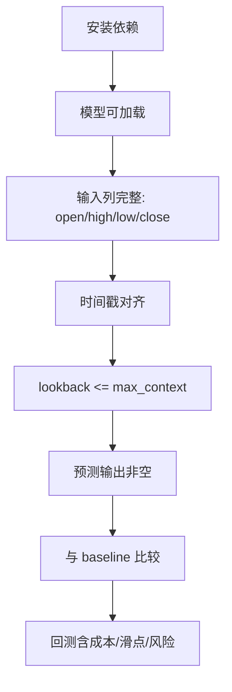

## 十、风险边界：Kronos 很强，但不能替你完成量化工程

### 1. 论文效果不等于你的市场效果

论文中的数据、清洗、切分、交易制度、资产池、频率、baseline 设置，都可能与你的生产环境不同。你必须复现实验或建立自己的样本外评估。

### 2. K 线不包含全部市场信息

K 线压缩了价格和成交信息，但不包含订单簿深度、逐笔成交、新闻、公告、资金流、宏观事件、财报文本等。只用 K 线做预测，本质上是在有限信息下建模。

### 3. 生成式预测有随机性

temperature、top-p、sample_count 会影响输出。采样多条路径可以更稳，但会增加推理成本。

### 4. 512 context 是明确工程约束

`Kronos-small` 和 `Kronos-base` 的 `max_context` 是 512。对于超长依赖、跨周期结构，需要通过频率选择、窗口设计、特征融合或模型改造解决。

### 5. 代码注释不是权威逻辑

README 提醒 `finetune/` 目录中很多注释由 Gemini 2.5 Pro 生成，可能不准确，应以代码本身为准。

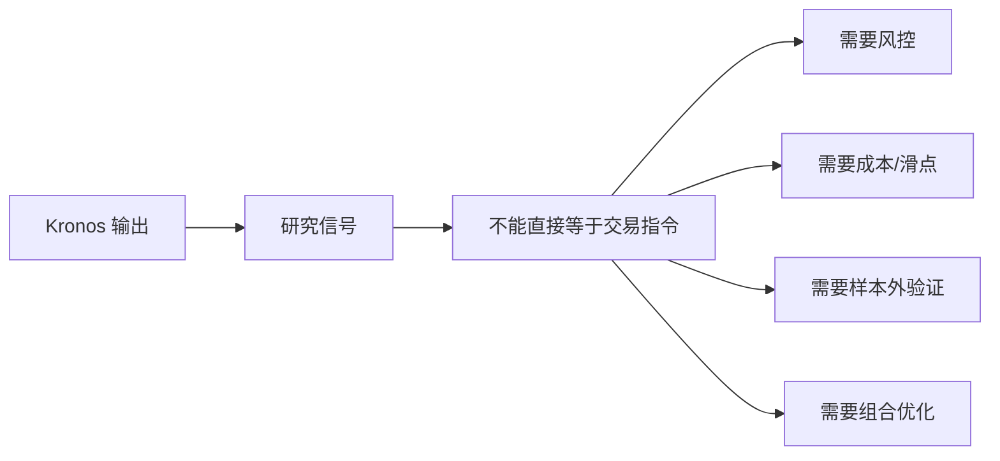

## 十一、最终判断

Kronos 最值得关注的地方，是它把金融 K 线建模从“连续数值预测”推进到“金融市场语言建模”。

这个方向有三层价值：

- 模型层：用层次化 token 把 OHLCVA 的连续噪声压缩成可生成的离散市场状态。
- 任务层：把价格预测、收益预测、波动预测、合成 K 线、投资模拟放进同一预训练范式。
- 工程层：提供 Hugging Face 模型、`KronosPredictor`、batch predict、Qlib fine-tuning/backtesting 示例，降低研究入口门槛。

它最适合成为量化研究平台里的“金融 K 线 foundation backbone”，而不是一个即插即用的交易机器人。

如果你的团队已经有 Qlib/自研回测平台、严谨的数据治理、样本外评估和风险模型，那么 Kronos 值得进入研究候选池。  
如果你的团队只是想“下载模型直接赚钱”，那 Kronos README 中关于 demo 非生产策略的提醒，应该放在第一屏。

## 参考资料

- [Kronos GitHub README](https://github.com/shiyu-coder/Kronos)
- [Kronos raw README](https://raw.githubusercontent.com/shiyu-coder/Kronos/master/README.md)
- [Kronos arXiv paper](https://arxiv.org/abs/2508.02739)
- [Kronos arXiv HTML](https://arxiv.org/html/2508.02739)
- [NeoQuasar/Kronos-base Hugging Face model card](https://huggingface.co/NeoQuasar/Kronos-base)
- [Qlib GitHub](https://github.com/microsoft/qlib)
- [Google TimesFM GitHub](https://github.com/google-research/timesfm)
- [Amazon Chronos GitHub](https://github.com/amazon-science/chronos-forecasting)
- [Nixtla TimeGPT Docs](https://www.nixtla.io/docs)

## 校验记录

- 来源顺序：已按 README → DeepWiki MCP → 必要问题/默认假设 → 网络搜索 → 写作执行。
- README 校验：项目定位、模型 zoo、安装、预测、批量预测、微调、Qlib 回测和风险提示均来自 README/模型卡。
- 架构校验：`KronosTokenizer`、`Kronos`、`KronosPredictor`、`model/kronos.py`、fine-tuning、web UI、tests 来自 DeepWiki MCP 架构分析。
- 数据校验：12B+ K 线、45 个交易所、7 种频率、25 个 baseline、RankIC/MAE/fidelity 改进来自 arXiv 论文页面或 HTML 正文。
- 竞品校验：TimesFM、Chronos、TimeGPT、Qlib 均引用官方 README/文档。
- 风险校验：未把论文回测结果表述为实盘收益，明确加入生产上线前提和失败条件。
- Mermaid 校验：核心章节已插入 Mermaid 图，语法使用 `flowchart`、`sequenceDiagram`、`quadrantChart`。

  
  
#### [PostgreSQL 解决方案集合](../201706/20170601_02.md "40cff096e9ed7122c512b35d8561d9c8")
  
  
#### [德哥 / digoal's Github - 公益是一辈子的事.](https://github.com/digoal/blog/blob/master/README.md "22709685feb7cab07d30f30387f0a9ae")
  
  
#### [About 德哥](https://github.com/digoal/blog/blob/master/me/readme.md "a37735981e7704886ffd590565582dd0")
  
  

  
