## Multica：把编码 Agent 从“单人提示词工具”推进到“团队可管理劳动力”   
  
### 作者  
digoal  
  
### 日期  
2026-04-18  
  
### 标签  
团队 agents , AI Agent , 团队用 AI Agents , Agents 平台 
  
----  
  
## 背景  
> 观点：Multica 的价值不在于再包装一个 coding agent，而在于把 Claude Code、Codex、OpenCode、OpenClaw 等 Agent 放进团队工作流：issue、board、workspace、runtime、daemon、WebSocket 进度、skills 复用和自托管。  
> 成立前提：你的团队已经开始同时使用多个编码 Agent，并且真正痛的是“任务分配、状态可见、运行环境、技能沉淀、跨人协作和数据边界”。  
> 支撑证据：Multica README 与官网都把它定位为 open-source managed agents platform，支持把任务像分配给同事一样分配给 Agent；DeepWiki 架构分析显示它有 Go 后端、Next.js 前端、PostgreSQL/pgvector、本地 daemon、WebSocket Hub、task queue、workspace 隔离和 skills 系统。  
> 如果前提崩塌：如果你只是个人偶尔用一个 Agent 写代码，直接用 Codex、Claude Code、Cursor Background Agents 或 GitHub Copilot cloud agent 更简单；如果你要严格预算、审批、组织树和“AI 公司”式治理，Paperclip 更贴近这个模型；如果你只要 GitHub issue 到 PR 的闭环，GitHub Copilot cloud agent 或 Claude Code GitHub Actions 更短路径。

项目地址：[multica-ai/multica](https://github.com/multica-ai/multica)  
官网：[multica.ai](https://multica.ai/)  
自托管文档：[SELF_HOSTING.md](https://raw.githubusercontent.com/multica-ai/multica/main/SELF_HOSTING.md)

## 证据包

本篇文章按指定顺序搜证：先读 README，再用 DeepWiki MCP 分析架构，然后才做网络搜索。

| 证据 | 来源 | 用途 |
|---|---|---|
| Multica 是 open-source managed agents platform，面向 human + AI teams，支持 Claude Code、Codex、OpenClaw、OpenCode、Hermes、Gemini、Pi、Cursor Agent | [GitHub README](https://github.com/multica-ai/multica)、[raw README](https://raw.githubusercontent.com/multica-ai/multica/main/README.md) | 产品定位 |
| 功能包括 Agent as teammate、autonomous execution、reusable skills、unified runtimes、multi-workspace | [GitHub README](https://github.com/multica-ai/multica) | 功能边界 |
| 架构是 Next.js 16 前端、Go Chi/WebSocket 后端、PostgreSQL 17 + pgvector、本地 agent daemon | [GitHub README](https://github.com/multica-ai/multica)、DeepWiki MCP | 架构依据 |
| Monorepo 包含 `server/`、`apps/web/`、`apps/desktop/`、`packages/core`、`packages/ui`、`packages/views`；任务队列使用 `FOR UPDATE SKIP LOCKED` 原子领取；前端用 TanStack Query + Zustand；实时更新通过 WebSocket Hub | DeepWiki MCP 对 `multica-ai/multica` 的架构分析 | 深层架构依据 |
| 自托管依赖 Docker/Docker Compose，服务包括 backend、frontend、PostgreSQL/pgvector；daemon 运行在用户本机 | [SELF_HOSTING.md](https://raw.githubusercontent.com/multica-ai/multica/main/SELF_HOSTING.md) | 部署与安全边界 |
| GitHub Copilot cloud agent 可在 GitHub Actions ephemeral environment 中执行任务并创建 PR | [GitHub Docs](https://docs.github.com/en/copilot/concepts/agents/cloud-agent/about-cloud-agent) | 竞品对比 |
| Claude Code GitHub Actions 通过 `@claude` 在 issue/PR 中触发，可创建 PR、实现功能、修 bug | [Anthropic Docs](https://docs.anthropic.com/en/docs/claude-code/github-actions) | 竞品对比 |
| Codex cloud 支持在云端并行执行 coding tasks | [OpenAI Codex docs](https://developers.openai.com/codex/cloud) | 竞品对比 |
| Paperclip 聚焦 agent 管理层，强调 org structure、budgets、governance、audit trail | [Paperclip 官网](https://paperclip.inc/)、[Paperclip docs](https://docs.paperclip.ing/start/core-concepts) | 竞品对比 |

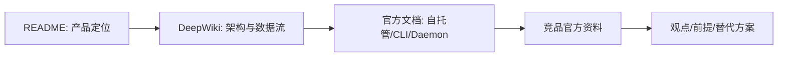

## 一、背景：Agent 越强，团队管理问题越明显

过去团队用 AI 编程，多数是“人盯着 Agent”：打开 IDE、复制 prompt、等它跑、看 diff、让它改、手工提交 PR。这个流程对个人提效有效，但放到团队里会暴露新问题：

- 这个 Agent 在做什么？
- 谁分配的任务？
- 任务是否卡住？
- 它在哪台机器上跑？
- 它用的是 Claude、Codex、Cursor 还是别的 CLI？
- 失败原因有没有留下记录？
- 这个经验能不能复用成团队 skill？
- 多个 Agent 同时干活时，谁能看到全局状态？

GitHub Copilot cloud agent、Codex cloud、Claude Code GitHub Actions、Cursor Background Agents 都在说明一个趋势：coding agent 正在从“IDE 里的同步助手”变成“后台异步执行者”。但异步执行一旦进入团队，就不再只是模型能力问题，而是管理系统问题。

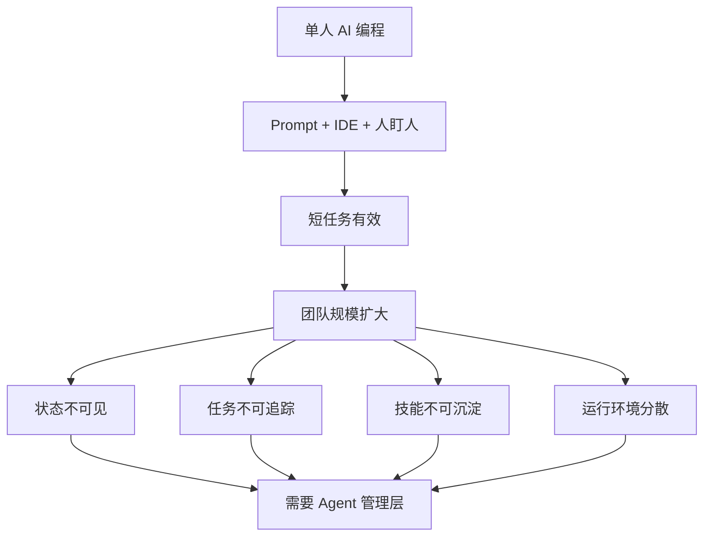

我的判断是：coding agent 的下一阶段竞争，不只是“谁的模型更会写代码”，而是“谁能把 Agent 放进真实研发组织的分工、追踪、审核、复用、审计和部署体系”。

如果这个判断不成立，也就是团队并没有多 Agent 管理痛点，那么 Multica 的价值会明显下降，直接使用单个 Agent 工具更经济。

## 二、场景：Multica 解决的是“AI 同事如何进入团队协作”

Multica 适合的不是“我想让 AI 帮我改一个函数”，而是下面这些场景：

| 角色 | 场景 | 需要的能力 |
|---|---|---|
| 研发负责人 | 想让多个 Agent 消化 backlog | issue 分配、状态追踪、失败可见 |
| AI 平台工程师 | 团队同时使用 Claude Code、Codex、OpenCode | 统一 runtime、统一 daemon、统一面板 |
| 架构师 | 想把代码审查、迁移、部署等经验沉淀 | skills 复用和版本化 |
| 安全/运维负责人 | 不希望代码都送到不可控云环境 | 自托管、本地 daemon、代码在本机执行 |
| 多团队组织 | 多个 workspace 隔离 | workspace-level agents/issues/settings |

Multica 官网强调：agents 出现在 assignee dropdown 中，像人一样被分配任务；它们会更新状态、创建 issue、评论和汇报进度。README 也说它管理 full agent lifecycle：enqueue、claim、start、complete/fail，并通过 WebSocket 流式展示进度。

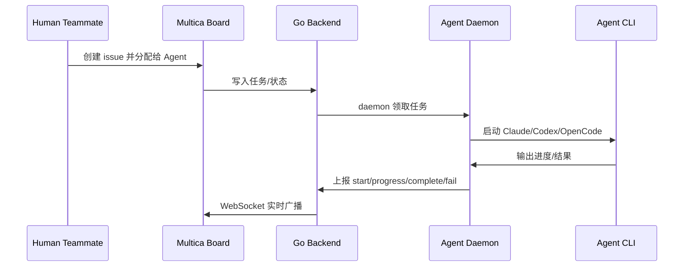

## 三、痛点：传统方案的问题是“能跑 Agent”，但管不住 Agent

### 1. IDE/CLI 直接使用：强交互，弱组织记忆

Codex、Claude Code、Cursor、OpenCode 这类工具对个人非常高效。但如果每个开发者都在自己机器上跑自己的 Agent，团队层面容易出现：

- 任务状态散落在个人终端。
- prompt 和修复经验难复用。
- 失败和 blocker 没有统一事件流。
- 多 Agent 并发没有全局 view。
- 成本、runtime、权限边界难统一。

这不是工具错，而是工具本来就偏“个人执行层”。

### 2. GitHub Actions 型 Agent：PR 闭环强，但被 GitHub 工作流绑定

GitHub Copilot cloud agent 官方文档说明，它在 GitHub Actions 支持的 ephemeral development environment 中执行任务，可探索代码、改代码、跑测试、开 PR。Claude Code GitHub Actions 也支持通过 `@claude` 在 issue/PR 中触发任务。

这类方案适合 GitHub issue/PR 工作流，但问题是：

- 管理对象主要围绕 repo/PR，而不是跨工具、跨 workspace 的 Agent 队伍。
- Agent runtime 通常在平台预设环境或 GitHub Actions 环境中。
- 如果你要混用 Claude Code、Codex、OpenCode、本地机器和私有环境，需要额外胶水。

### 3. 自己搭脚本/队列：可控，但很快变成内部平台

很多团队一开始会写脚本：从 Linear/Jira/GitHub 拉 issue，调用 Agent CLI，写日志，推 PR。短期可行，长期会膨胀成内部平台：

- token 管理。
- 任务队列。
- 并发控制。
- workspace 隔离。
- 实时状态。
- 失败重试。
- 技能复用。
- 审计记录。
- runtime 注册。

Multica 的定位就是把这层“Agent 管理平台”产品化。

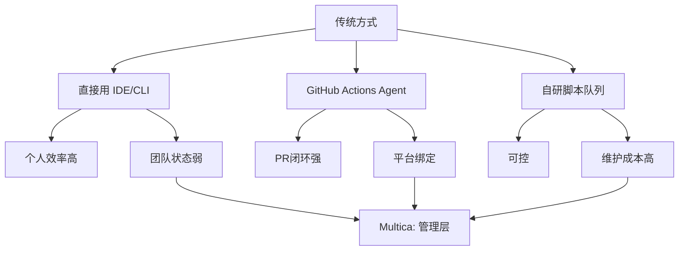

如果团队只在 GitHub 中管理所有任务，并且只需要 issue → PR，那么 GitHub Copilot cloud agent 或 Claude Code GitHub Actions 是更直接的方案。Multica 的优势只有在“多 Agent、多 runtime、多 workspace、多技能复用”成立时才明显。

## 四、Multica 的方案：项目管理系统 + Agent runtime 控制面

Multica 可以理解为两层合体：

- 上层是 AI-native task management：workspace、issues、projects、labels、agents、activity、chat。
- 下层是 agent runtime control plane：local daemon、task queue、runtime registry、WebSocket progress、skills 注入。

README 的架构图给出主干：

- Frontend：Next.js 16 App Router。
- Backend：Go，Chi router，sqlc，gorilla/websocket。
- Database：PostgreSQL 17 with pgvector。
- Agent Runtime：本地 daemon 执行 Claude Code、Codex、OpenCode、OpenClaw、Hermes、Gemini、Pi、Cursor Agent。

DeepWiki 进一步补充了 monorepo 模块：

- `server/`：Go backend，REST API、WebSocket、DB 交互。
- `apps/web/`：Next.js frontend。
- `apps/desktop/`：Electron desktop app。
- `packages/core/`：API client、auth/workspace stores、WebSocket connection、query client。
- `packages/ui/`：无业务逻辑的原子 UI。
- `packages/views/`：共享业务页面和组件。

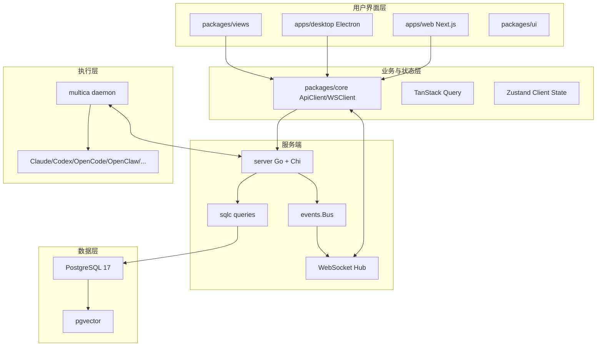

## 五、原理：Agent 任务生命周期是 Multica 的核心闭环

DeepWiki 分析显示，Multica 的任务生命周期包括：

1. 任务入队：`TaskService.EnqueueTaskForIssue` 或 `EnqueueChatTask`。
2. daemon 领取：从 `agent_task_queue` 中原子 claim，使用 `FOR UPDATE SKIP LOCKED` 避免并发抢同一任务。
3. 运行中：daemon 上报 task start。
4. 完成或失败：daemon 上报 final state。
5. 实时同步：后端通过 WebSocket Hub 向 workspace room 广播，前端收到事件后 invalidates TanStack Query cache。

这套设计的工程意义是：Agent 不再是一个黑箱 terminal，而是一个进入 task lifecycle 的执行者。

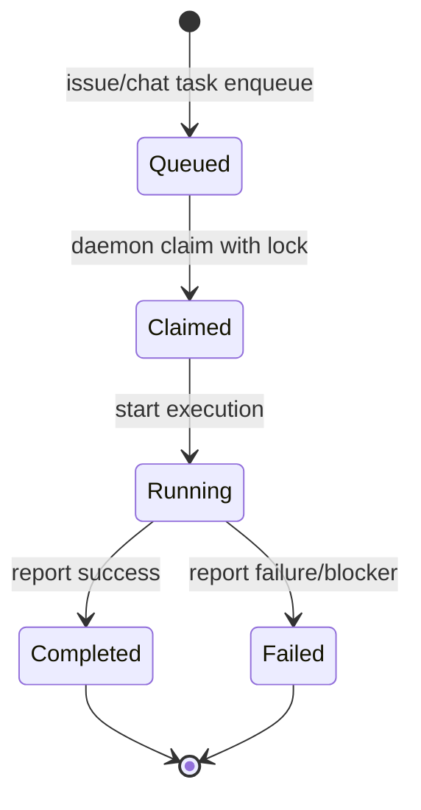

这里有一个很关键的取舍：Multica 把 Agent 执行放在本地 daemon 或用户控制的 runtime 上，而不是完全托管在中心云。官网 FAQ 表示 Agent execution happens on your machine or your own cloud infrastructure，代码不通过 Multica servers，平台主要协调任务状态和事件广播。

这对企业很重要：如果代码不能离开内网，或者团队已经采购了多个 Agent CLI，本地 daemon 模式比纯云端 Agent 更容易进入现有安全边界。

如果你的前提是“不允许本地机器执行 Agent，必须全部在标准化云沙箱跑”，那么 Multica 本地 daemon 的优势会变成运维负担，GitHub Copilot cloud agent、Codex cloud 或企业内部统一 sandbox 平台会更合适。

## 六、效果对比：Multica 改变的是协作形态，不是证明 Agent 一定写得更好

目前我没有找到 Multica 公开发布的吞吐量 benchmark、团队生产案例或 ROI 数据。因此下面的效果对比，只能作为基于架构和功能的工程推断，而不是已验证性能结论。

| 维度 | 使用前：直接使用 coding agent | 使用 Multica 后 |
|---|---|---|
| 任务分配 | 人手动复制 prompt 或在 GitHub/IDE 触发 | issue/board 中直接分配给 Agent |
| 状态可见性 | 终端、IDE、PR 分散 | board、activity timeline、WebSocket progress |
| Runtime 管理 | 每个人各跑各的 CLI | local/cloud runtimes 统一登记和监控 |
| 多 Agent 协作 | 靠人协调 | workspace + issue + agent profile |
| 技能复用 | prompt 文档散落 | skills system 统一复用 |
| 数据边界 | 取决于具体 Agent 平台 | 可自托管，本地 daemon 执行 |
| 失败处理 | 常常靠人回来看 | task complete/fail/blocker 状态化 |

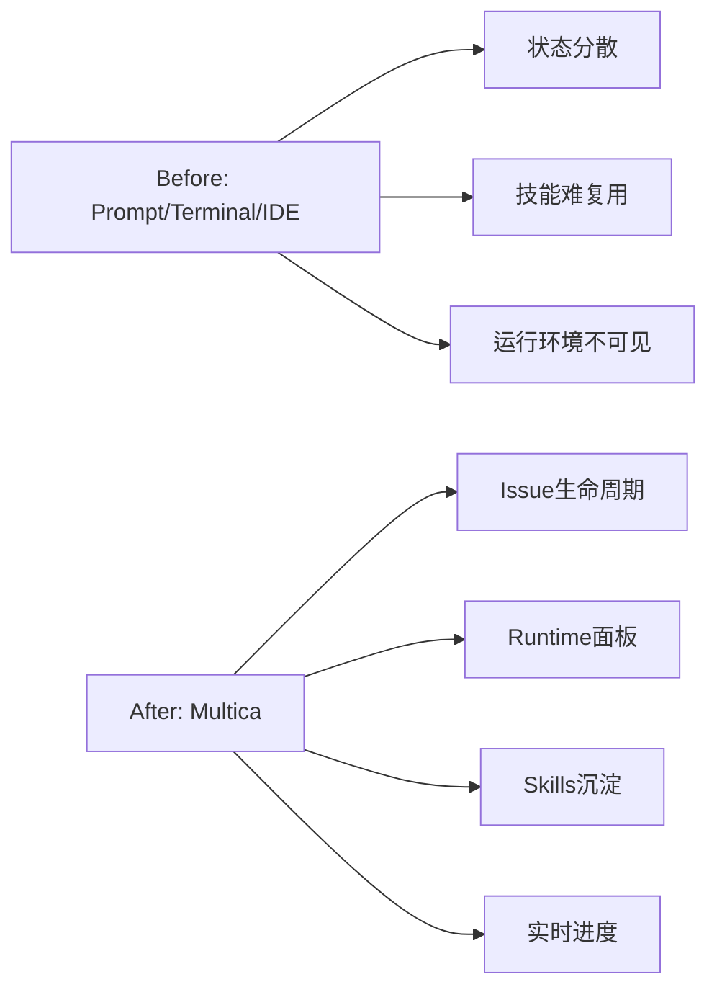

观点：Multica 能提高团队对 Agent 工作的可见性和可管理性。  
成立前提：团队确实有多个 Agent、多个任务、多个 runtime，且愿意把 Agent 工作纳入 issue/board。  
支撑证据：README、官网和 DeepWiki 都显示其核心能力围绕 task lifecycle、runtime、workspace、skills、WebSocket progress。  
如果前提崩塌：如果团队只有单人单 Agent 使用，不需要管理层，直接用 Codex/Claude/Cursor 更少摩擦。

## 七、竞品对比：Multica 更像“研发团队的 Agent 看板”，Paperclip 更像“AI 公司治理层”

| 产品/方案 | 核心定位 | 强项 | 相比 Multica 的差异 |
|---|---|---|---|
| [GitHub Copilot cloud agent](https://docs.github.com/en/copilot/concepts/agents/cloud-agent/about-cloud-agent) | GitHub 内建 cloud coding agent | issue/PR/branch/Actions 环境闭环强，安全治理与 GitHub 权限体系结合 | 更 GitHub-native，少平台集成成本；但跨 Agent、跨 runtime、skills 复用不是重点 |
| [Codex cloud](https://developers.openai.com/codex/cloud) | OpenAI 云端 coding agent | 云端并行任务、沙箱执行、PR 输出 | 适合使用 Codex 生态；Multica 更强调 vendor-neutral 和本地 daemon |
| [Claude Code GitHub Actions](https://docs.anthropic.com/en/docs/claude-code/github-actions) | 通过 GitHub Actions 触发 Claude Code | `@claude` issue/PR 触发、创建 PR、修 bug、遵循 `CLAUDE.md` | 适合 Claude + GitHub Actions；Multica 更像多 Agent 管理平台 |
| [Cursor Background Agents](https://docs.cursor.com/en/background-agents) | Cursor 内异步远程 Agent | IDE 体验和远程环境结合 | 更偏 Cursor 用户；Multica 更偏团队级统一面板 |
| [Paperclip](https://paperclip.inc/) | AI Agent 管理层/公司模拟 | org structure、budgets、governance、audit trail、approval | 更重治理和预算；Multica 更轻量，聚焦真实项目 issue/board 协作 |
| 自研脚本队列 | 内部定制 | 最贴合内部流程 | 长期维护成本高，容易重复造 Multica 这层 |

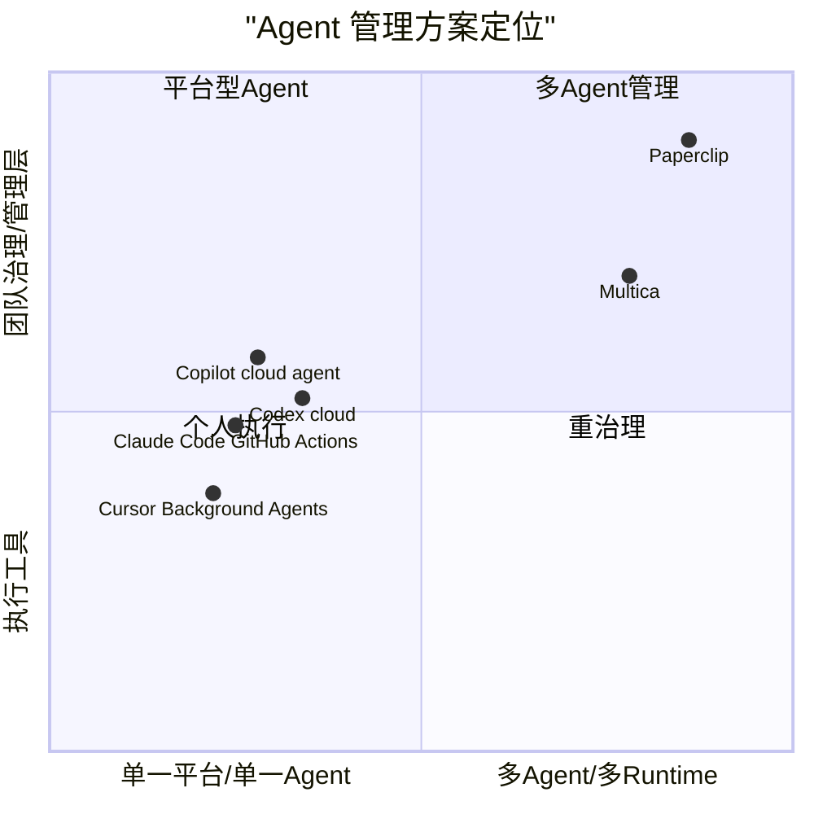

我的判断：Multica 与 Paperclip 的差异不是谁更“强”，而是组织隐喻不同。Multica 的隐喻是“项目管理里多了一类 AI teammate”；Paperclip 的隐喻是“搭一个 AI 公司，有 org chart、预算、审批和治理”。

如果你的前提是“我要严控 token 预算、审批链、组织层级和全动作审计”，Paperclip 更接近目标。  
如果你的前提是“我们团队已经有真实项目和 issue 流程，只想让 Agent 像同事一样接任务”，Multica 更直接。

## 八、使用场景

### 场景 1：把 backlog 分给多个 Agent

症状：低优先级 bug、测试补齐、文档更新、重构长期堆积。

做法：在 Multica board 创建 issue，分配给不同 Agent，daemon 领取并执行。

预期信号：issue 状态从 Todo 到 In Progress，再到 Complete/Fail；activity timeline 有进度和 blocker。

前提崩塌：如果所有任务都必须由人实时 pair review，异步 Agent 看板意义降低，IDE 内 agent mode 更合适。

### 场景 2：统一管理团队机器和云 runtime

症状：Agent 分散在开发者 Mac、Linux server、云机器上，没人知道哪些 runtime 在线。

做法：每台机器安装 `multica` CLI 并启动 daemon，Settings → Runtimes 查看在线状态和可用 CLI。

预期信号：runtime 面板看到机器在线，daemon 自动探测 `claude`、`codex`、`opencode` 等 CLI。

前提崩塌：如果团队只允许云端统一执行，本地 runtime 不是优势，应转向 Codex cloud、Copilot cloud agent 或内部 sandbox。

### 场景 3：把一次性经验沉淀成 skills

症状：每次部署、迁移、代码审查都靠复制历史 prompt。

做法：把流程封装成 skill，让不同 Agent 在任务中复用。

预期信号：skill 能跨 Agent 使用，团队能力随项目积累。

前提崩塌：如果团队没有稳定重复任务，skills 沉淀收益有限，维护成本可能超过收益。

### 场景 4：自托管 human + agent 协作平台

症状：代码和任务数据不能进入第三方托管平台。

做法：用 `install.sh --with-server` 或 `make selfhost` 部署 Multica server，daemon 仍在用户机器运行。

预期信号：本地 `http://localhost:3000` 可访问前端，`http://localhost:8080` 是后端 API，daemon status 正常。

前提崩塌：如果团队缺少 Docker、邮件、JWT、反向代理、TLS、备份和升级维护能力，使用 Multica Cloud 或平台托管 Agent 更稳。

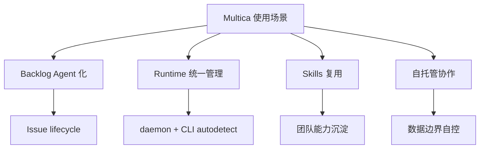

## 九、最佳实践

### 1. 先从低风险任务开始

适合起步的任务：

- 文档更新。
- 测试补齐。
- 小型 bug fix。
- lint/format 迁移。
- 重复性代码整理。

不建议一开始交给 Agent 的任务：

- 安全敏感改动。
- 数据库破坏性迁移。
- 支付、权限、加密逻辑。
- 大规模架构重写。

### 2. 把 Agent 当 junior teammate 管，不要当无人驾驶 CTO

Multica 能让 Agent 像队友一样出现在 board 上，但这不代表它能替代工程判断。正确姿势是：

- 明确 issue 描述。
- 限定 scope。
- 要求测试。
- 要求汇报 blocker。
- 人类 review PR。
- 对高风险操作设审批。

### 3. 明确 runtime 安全边界

daemon 在本机执行 Agent CLI，意味着它能接触本机代码、环境变量、工具链和网络。实践上要做：

- 用专用工作目录。
- 限制敏感环境变量暴露。
- 对私有 repo 访问做最小权限。
- 高风险任务用隔离机器或容器。
- 定期审查 daemon 日志和 agent 输出。

### 4. Skills 要小而可验证

好的 skill 应该有：

- 输入条件。
- 执行步骤。
- 验证命令。
- 失败条件。
- 输出格式。

不要把“写一个完整功能”这种大任务直接变成 skill。先把部署、迁移、测试、审查这些稳定流程沉淀下来。


## 十、实操：从安装到第一个 Agent 任务

### 1. 使用 Cloud 版本快速开始

macOS/Linux 推荐 Homebrew：

```bash
brew install multica-ai/tap/multica
```

或安装脚本：

```bash
curl -fsSL https://raw.githubusercontent.com/multica-ai/multica/main/scripts/install.sh | bash
```

Windows PowerShell：

```powershell
irm https://raw.githubusercontent.com/multica-ai/multica/main/scripts/install.ps1 | iex
```

配置、认证并启动 daemon：

```bash
multica setup
```

验证 daemon：

```bash
multica daemon status
```

### 2. 创建 Agent 并分配任务

按 README 的流程：

1. 打开 Multica web app。
2. 进入 `Settings -> Runtimes`，确认本机 runtime 在线。
3. 进入 `Settings -> Agents`，创建 Agent。
4. 选择 runtime 和 provider，例如 Claude Code、Codex、OpenCode。
5. 创建 issue，或用 CLI 创建：

```bash
multica issue create
```

6. 把 issue 分配给 Agent。

### 3. 自托管部署

两步安装 server + CLI：

```bash
curl -fsSL https://raw.githubusercontent.com/multica-ai/multica/main/scripts/install.sh | bash -s -- --with-server
multica setup self-host
```

手工方式：

```bash
git clone https://github.com/multica-ai/multica.git
cd multica
make selfhost
```

自托管默认入口：

- Frontend: `http://localhost:3000`
- Backend API: `http://localhost:8080`

生产登录建议配置 `RESEND_API_KEY`；文档明确提醒不要在公网实例上设置 `APP_ENV=development`，否则任何知道邮箱的人都可能使用 dev master code `888888` 登录。

停止服务：

```bash
make selfhost-stop
multica daemon stop
```

更新：

```bash
git pull
make selfhost
```

### 4. 贡献者开发

README 说明开发依赖：

- Node.js v20+
- pnpm v10.28+
- Go v1.26+
- Docker

启动开发环境：

```bash
make dev
```

DeepWiki 和 README 均说明测试覆盖：

```bash
# Go backend tests
make test

# Frontend / package tests
pnpm test

# E2E
pnpm playwright test
```

具体命令以仓库当前 `CONTRIBUTING.md` 和 package scripts 为准。

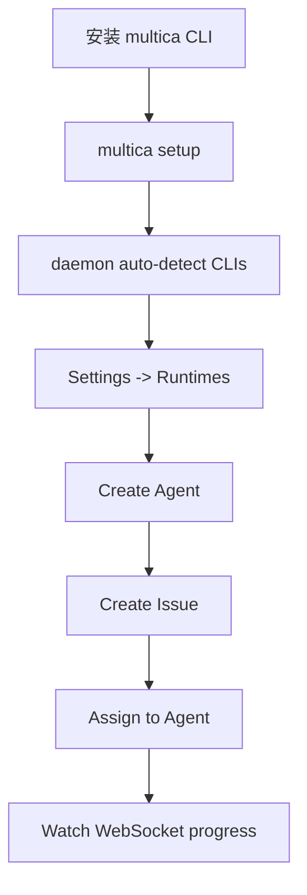

## 十一、风险与边界

### 1. 没有公开 benchmark，不要声称 ROI

Multica 的公开资料证明了功能和架构，但没有公开提供“团队效率提升 X%”或“吞吐量提升 X 倍”的权威数据。任何 ROI 都需要团队自己做试点衡量。

建议指标：

- Agent 任务完成率。
- 失败/blocked 比例。
- PR review 通过率。
- 人类返工时间。
- 平均任务等待时间。
- 运行成本。
- 安全事故/权限违规次数。

### 2. 自托管不是零成本

Multica 支持 self-host，但你仍要负责：

- Docker/Compose 或 Kubernetes。
- PostgreSQL 备份。
- `JWT_SECRET` 管理。
- 邮件服务 Resend。
- TLS/反向代理。
- 升级和迁移。
- daemon 分发和版本一致性。

如果团队没有平台运维能力，Cloud 版本或 GitHub/Codex/Claude 托管 Agent 更省心。

### 3. 本地 daemon 是优势也是风险

优势：代码可以留在本机或自有云。  
风险：本机环境一旦过宽，Agent 可能接触不该接触的文件、token、网络资源。

如果安全模型要求“每个任务必须进入严格一次性沙箱”，Multica 需要额外隔离策略，或转向 GitHub Actions/Codex cloud 这类更标准化的云沙箱。

### 4. 多 Agent 不是自动高质量

Multica 能管理任务，不保证 Agent 的代码一定正确。Agent 仍然会误解需求、产生 bug、遗漏测试、引入安全问题。必须保留人类 review、CI、权限边界和回滚流程。

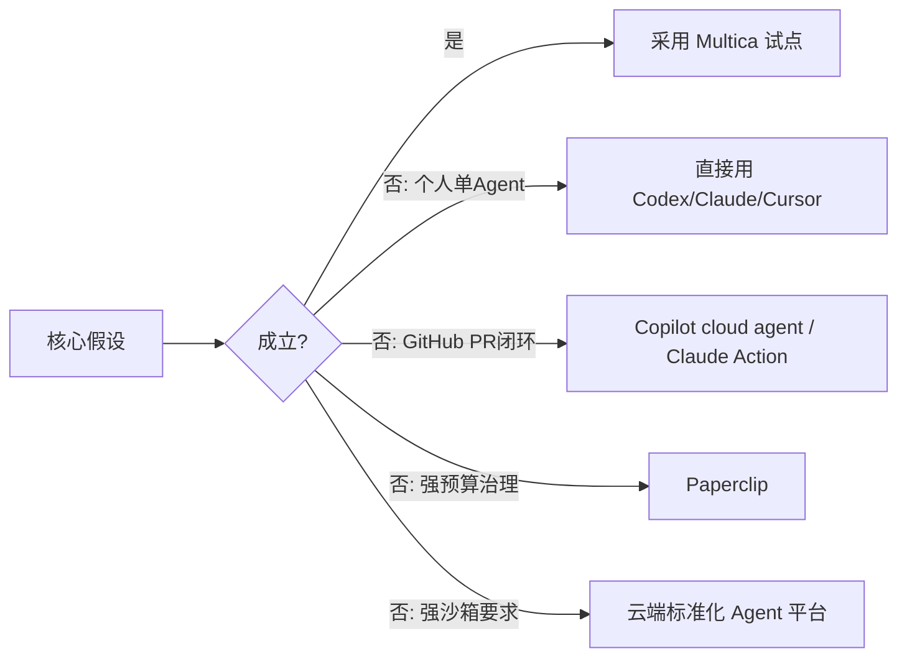

## 十二、结论

Multica 押注的是一个明确趋势：编码 Agent 会从个人工具变成团队劳动力，而团队劳动力必须被分配、追踪、复盘、治理和训练。

它的产品判断很清晰：

- 不和 Claude Code、Codex、OpenCode 抢“谁更会写代码”。
- 而是把这些 Agent 接进同一个 workspace、issue、runtime 和 skill 系统。
- 用本地 daemon 保留执行环境控制权。
- 用 WebSocket 和 task lifecycle 补上可见性。
- 用 skills 让团队经验可复用。

我的最终建议：

- 如果你是个人开发者，先别急着上 Multica，直接用一个 Agent 工具更快。
- 如果你是团队负责人，已经有多个 Agent、多台 runtime、多类重复任务，Multica 值得试点。
- 如果你是强治理组织，重点先比较 Paperclip 的预算/审批/组织树。
- 如果你只想把 GitHub issue 自动变 PR，优先看 Copilot cloud agent 或 Claude Code GitHub Actions。
- 如果你要求所有执行必须在云端一次性沙箱中完成，优先看 Codex cloud、Copilot cloud agent 或自研 sandbox。

Multica 最好的定位不是“替代工程师”，而是“给 AI 工程劳动力补一个项目管理和运行时控制层”。这个前提成立时，它的方向是对的；前提不成立时，越轻的工具越好。

## 参考资料

- [Multica GitHub README](https://github.com/multica-ai/multica)
- [Multica raw README](https://raw.githubusercontent.com/multica-ai/multica/main/README.md)
- [Multica 官网](https://multica.ai/)
- [Multica Self-Hosting Guide](https://raw.githubusercontent.com/multica-ai/multica/main/SELF_HOSTING.md)
- [Multica CLI and Agent Daemon Guide](https://raw.githubusercontent.com/multica-ai/multica/main/CLI_AND_DAEMON.md)
- [GitHub Copilot cloud agent docs](https://docs.github.com/en/copilot/concepts/agents/cloud-agent/about-cloud-agent)
- [OpenAI Codex cloud docs](https://developers.openai.com/codex/cloud)
- [Claude Code GitHub Actions docs](https://docs.anthropic.com/en/docs/claude-code/github-actions)
- [Paperclip 官网](https://paperclip.inc/)
- [Paperclip Core Concepts](https://docs.paperclip.ing/start/core-concepts)

## 校验记录

- 来源顺序：已按 README → DeepWiki MCP → 默认假设 → 网络搜索 → 写作执行。
- README 校验：产品定位、支持的 Agent CLI、功能、安装、CLI、架构和开发依赖均来自 README。
- DeepWiki 校验：monorepo 模块、Go backend、Next.js frontend、PostgreSQL/pgvector、daemon、task queue、workspace isolation、auth、WebSocket、skills、tests、tradeoffs 来自 DeepWiki MCP。
- 网络搜证：Multica 官网、自托管/daemon 文档、GitHub Copilot cloud agent、Codex cloud、Claude Code GitHub Actions、Paperclip 官网/文档。
- 数据正确性：未声称未公开的性能/ROI 数字；GitHub stars/releases 等当前数据只作为项目热度背景，没有作为核心论点依据。
- 前提崩塌校验：每个主要推荐都给出了替代方向，包括单 Agent、GitHub PR 闭环、强预算治理、强沙箱要求等。
- Mermaid 校验：核心章节已插入 Mermaid 图，语法使用 `flowchart`、`sequenceDiagram`、`stateDiagram-v2`、`quadrantChart`。

  
