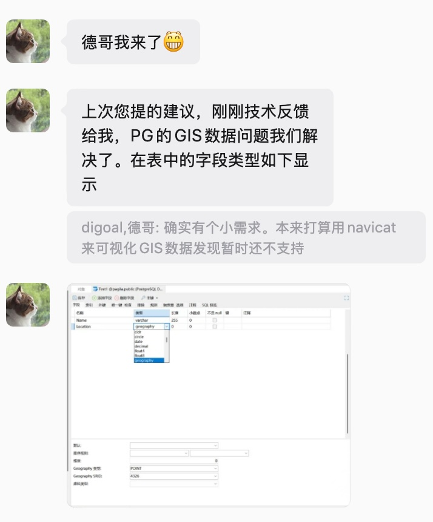
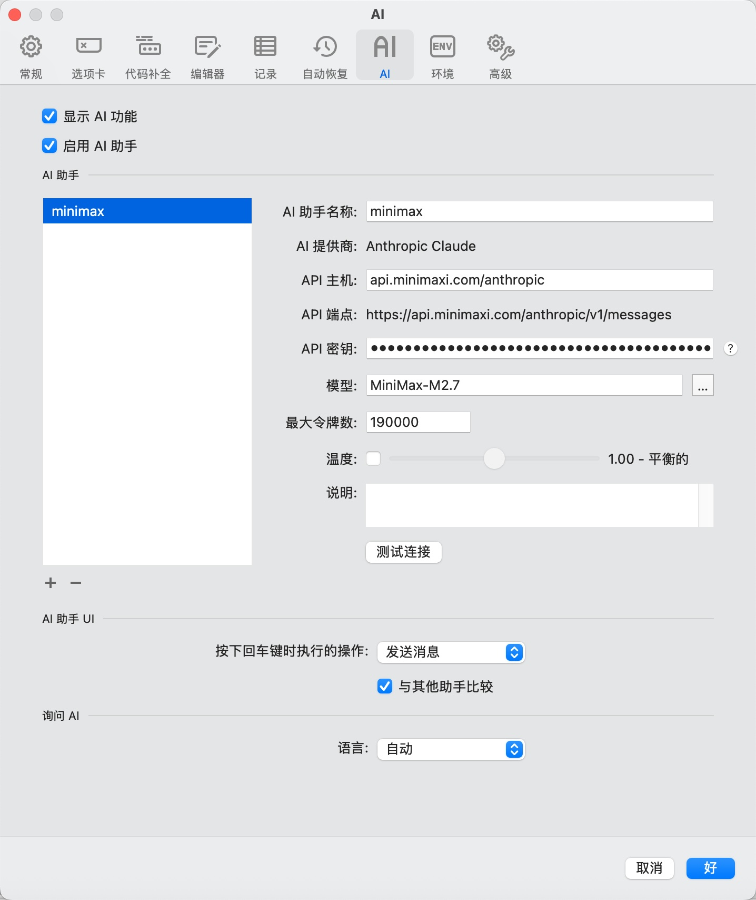
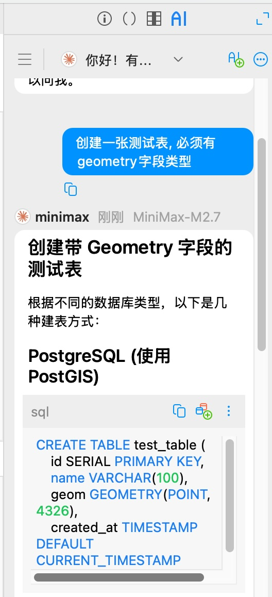
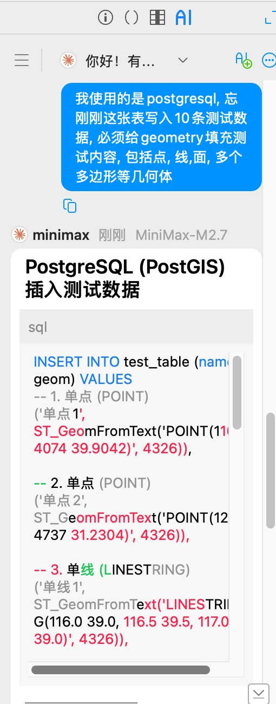
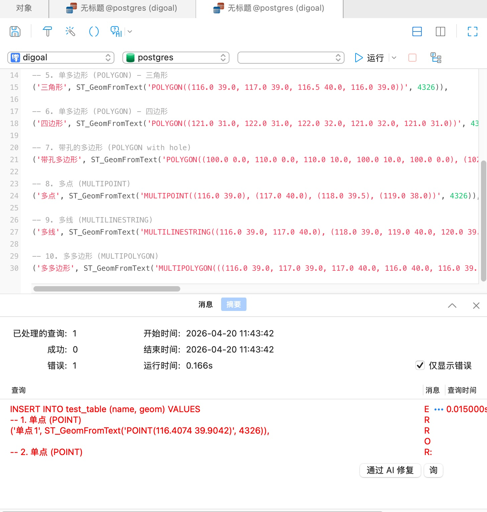
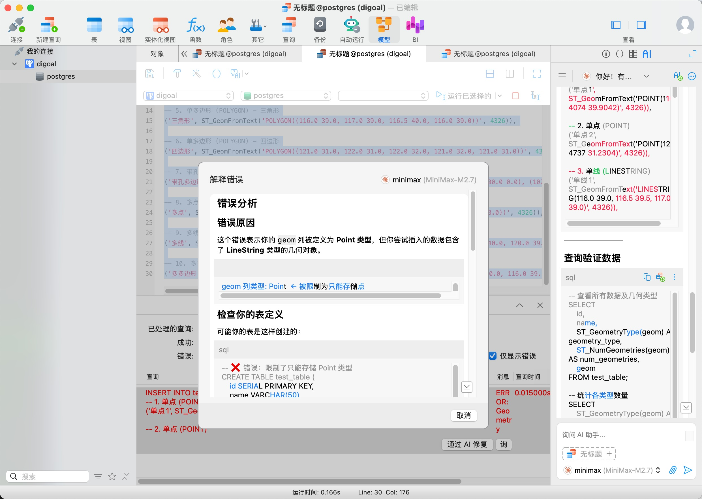
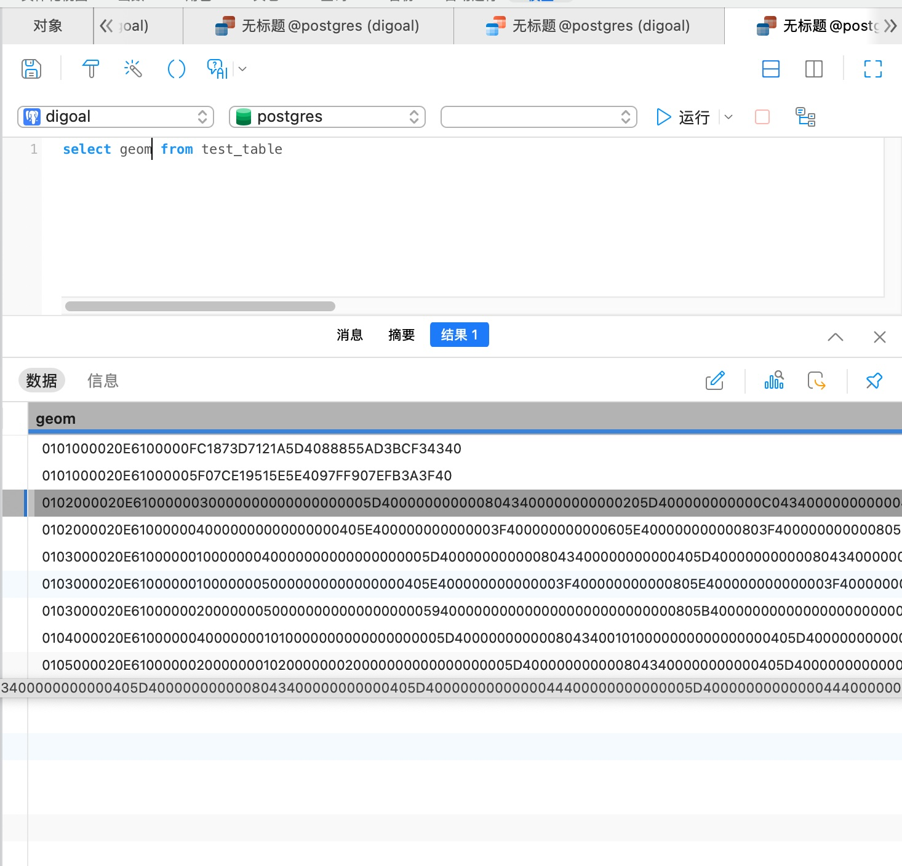

## Navicat AI 模型吃上 MiniMax  
  
### 作者  
digoal  
  
### 日期  
2026-04-20  
  
### 标签  
PostgreSQL , 管理工具 , AI , MiniMax , 地理信息 , Navicat  
  
----  
  
## 背景  
大名鼎鼎的 Navicat 想必用过数据库开发 IDE 的都知道, 可管理各种流行的数据库产品, 业界对标 Oracle SQL Developer.  
  
上次在PG大会上给 Navicat 黄老师提过一嘴需求, 希望能支持一下 PostgreSQL 地理信息类型 geometry/geography , 我只是随口一说, 没想到 Navicat 这么上心.  
  
上午收到黄老师发来的微信, 新版本已经支持了.    
  
这就来验证一下新版本, 顺道看看 Navicat AI 功能是否能接入 MiniMax ?  
  
数据库使用之前给学生上课做的镜像, 里面包含了 AI 所需的各种插件, 以及PG最常用的一些插件.  
- [《大学生数据库实践课, docker 镜像》](../202512/20251205_02.md)  
  
1、配置模型, 找不到 MiniMax 没关系, 由于 MiniMax 兼容 Anthropic , 就选它, 改一下接入点即可.  
  
  
  
2、让AI建立测试表, 必须包含地理信息字段  
  
  
  
3、生成测试数据  
  
  
  
4、写入, 遇到报错, 不过这不是AI的错, 因为我没说清楚地理信息字段里面要存储各种类型, 而创建时定义了只允许点类型.  
  
  
  
5、让 AI 修复报错, 重新写入.  
  
  
  
6、可用看到 Navicat 已支持地理信息类型.  
  
  
  
  
不过我没找到地理信息类型的可视化在哪, 如果有的话就更好了, 也许是我没找到功能入口, 也许很快 Navicat 下一个新版本就支持了.  
  
附上 pgadmin 地理信息类型可视化截图一张, 来自很久之前写过的一篇文章 [《在PostgreSQL中生成和查看泰森多边形 - Voronoi diagram - 最强大脑题目》](../201904/20190421_01.md)  
  
  
  
  
