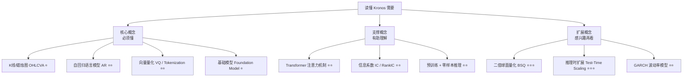
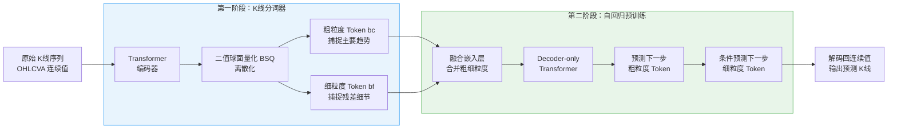
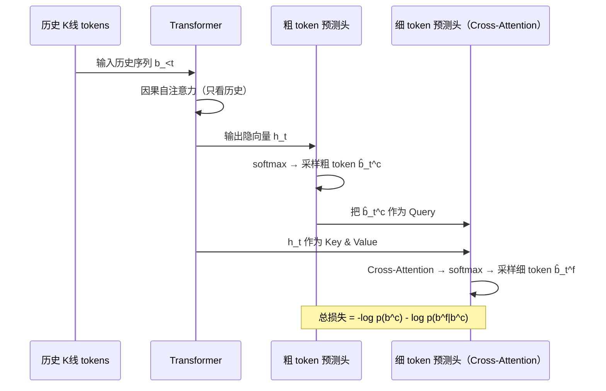

## AI论文解读 | Kronos — 金融市场语言的基础大模型
  
### 作者  
digoal  
  
### 日期  
2026-04-21  
  
### 标签  
AI , 论文解读 , K 线 , 金融K线基础大模型 , 连续数据字典化 , 量化 , 基础模型 
  
----  
  
## 背景  
> **原文信息**：Yu Shi, Zongliang Fu, Shuo Chen 等 | 2025年8月 | arXiv:2508.02739 (q-fin.ST / cs.AI / cs.LG)
> **解读日期**：2025年4月21日
> **代码开源**：https://github.com/shiyu-coder/Kronos

---

## 📍 论文定位

**一句话**：本文提出了 Kronos，一个专为金融 K 线数据设计的基础大模型，在零样本条件下横扫价格预测、波动率预测、合成数据生成等多个量化金融任务，全面碾压现有方法。

**🎓 学术价值**：填补了时间序列基础模型（TSFM）在金融领域长期"水土不服"的空白。现有通用 TSFM 因为未针对金融数据的低信噪比、非平稳性和 OHLCVA 多变量关联等特性优化，往往连简单的非预训练模型都打不过。Kronos 首次系统性地为 K 线数据设计了专属分词器 + 分层自回归框架，并在 120 亿条记录上完成大规模预训练，建立了金融时序基础模型的新范式。

**🏭 工业价值**：量化交易团队可以直接用 Kronos 替换现有的预测模型，在无需微调（零样本）的情况下，做价格走势预测（RankIC 提升 87~93%）、波动率预测（MAE 降低 9%）、合成数据生成（保真度提升 22%）。在中国 A 股实盘回测中，Kronos 策略的超额年化收益率和信息比率均为所有方法最高。

**💡 直觉类比**：这篇论文就像是给 AI 做了一个"专业金融分析师的大脑"——传统通用 AI 助手读懂了经济学书，却看不懂K线图；Kronos 从零开始学"K 线这门语言"，在全球 45 个交易所的 120 亿条记录上苦练，最终成为一位能精准解读市场信号的顶级量化分析师。

---

## 🗺️ 知识地图

在读懂 Kronos 之前，我们需要了解以下概念体系：

### 核心概念详解

**K线 / OHLCVA（Open-High-Low-Close-Volume-Amount）**
- **是什么**：每根蜡烛图记录一段时间内的开盘价、最高价、最低价、收盘价、成交量和成交额，6 个数字压缩了该时间段内市场所有参与者的博弈结果。
- **为什么重要**：这是量化交易的基本"像素"——几乎所有技术分析、价格预测、风险管理都从 K 线出发。Kronos 的输入就是 K 线序列，输出也是 K 线序列。
- **现实类比**：就像一段对话用"字"来表达，市场的"对话"用"K线"来表达。

**自回归语言模型（Autoregressive Model）**
- **是什么**：每次预测下一个 token，只依赖历史已生成的 token，不看未来。GPT 就是这种结构。
- **为什么重要**：Kronos 把 K 线预测彻底类比成"文本生成"——历史 K 线 = 上文，未来 K 线 = 续写。这一框架天然支持生成合成数据、蒙特卡洛采样等能力。
- **现实类比**：就像在写小说，每写完一个字，根据前文决定下一个字，而不是提前知道结局。

**向量量化 / Tokenization（Vector Quantization）**
- **是什么**：把连续的浮点数（价格）映射到离散的整数 ID（token），类似于把无限的音频波形压缩成有限的"音符"。
- **为什么重要**：连续值很难建模（回归问题），离散化后变成分类问题，可以直接用 Cross-Entropy loss 训练，更稳定、更容易泛化。论文消融实验证明，离散化方案比连续回归好很多。
- **现实类比**：把气温（连续值：23.78°C）离散化成"温暖/凉爽/寒冷"（离散类别），简化了描述，保留了本质信息。

**基础模型（Foundation Model）**
- **是什么**：在海量数据上预训练，一次训练，处处可用，不需要针对每个任务重新训练。
- **为什么重要**：量化金融的下游任务众多（预测、生成、风险管理），如果每个任务都要训练一个专门模型，成本极高。Kronos 实现了"一模型多任务"。
- **现实类比**：就像一个博学多才的分析师，无论你问他股票预测、波动率估算还是数据增广，他都能给出靠谱的答案，不用每次都临时培训一个专员。

---

## 🔬 论文精读

### Why — 为什么要做这个研究？

量化金融圈有一个长期痛点：**通用时间序列基础模型（TSFM）在金融数据上表现惨不忍睹**。

| 现有方法 | 问题所在 |
|---------|---------|
| 通用 TSFM（如 TimeMOE、TimeGPT） | 预训练数据中金融数据占比极少，不理解 OHLCVA 关联结构 |
| 非预训练专用模型（如 iTransformer） | 需要针对每个资产/任务重新训练，无法零样本泛化 |
| 传统计量模型（如 GARCH） | 仅针对波动率，不具备多任务能力 |
| 生成模型（如 DiffusionTS） | 只做生成，不做预测，且缺乏金融先验 |

金融 K 线数据的独特难点：
1. **极低信噪比**：价格信号极其微弱，夹杂大量随机噪声
2. **强非平稳性**：市场状态随时间剧烈变化，历史规律随时失效
3. **OHLCVA 内部强耦合**：6 个维度之间有复杂的逻辑约束（如 High ≥ max(Open, Close)），通用模型往往忽略这些约束

**作者的 Motivation**：既然 LLM 能学会"语言"，为什么不让模型学会"K线这门语言"？只要设计出合适的分词器和预训练目标，理论上可以把自然语言处理的成功经验复制到金融时序领域。

---

### What — 提出了什么方法/系统？

Kronos 是一个**两阶段框架**：

**三个规模的模型家族**：

| 模型 | Transformer 层数 | 模型维度 | 参数量 |
|------|-----------------|---------|--------|
| Kronos-Small | 8 | 512 | **24.7M** |
| Kronos-Base | 12 | 832 | **102.3M** |
| Kronos-Large | 18 | 1664 | **499.2M** |

词表大小统一为 $2^{20} \approx 100$ 万（每个 token 20 bits，粗/细各 10 bits）。

---

### How — 具体怎么实现的？

#### 第一阶段：K线分词器

**核心思路**：用一个 Transformer 自编码器把每一根 K线（6 维连续向量）压缩成一个离散 token，然后再解码回来。

分词器采用**二值球面量化（Binary Spherical Quantization, BSQ）** ：
- 编码器把 K线投影成一个连续隐向量 $\xi_t$
- BSQ 把它量化为一个 k-bit 的二值码 $b_t \in \{-1, +1\}^k$ （其实就是 k 个 0/1 决策：这个维度上，特征是"正"还是"负"）
- 20 bits → 词表大小 $2^{20} \approx 100$ 万

**为什么分成粗/细两个 subtoken？**

如果词表有 $2^{20}$ 那么大，自回归模型的输出层参数量会爆炸。于是把 20 bits 拆成两半：
- **粗粒度 token** $b_t^c$ （前 10 bits）：捕捉 K 线的主要走势特征（牛/熊/震荡等）
- **细粒度 token** $b_t^f$ （后 10 bits）：在粗粒度基础上补充细节（涨幅大小、成交量特征等）

这样两个 $2^{10} = 1024$ 大小的分类问题，就替代了一个 $2^{20}$ 大小的分类问题，计算量大幅下降。

**分层重建损失**（强制粗/细token学到不同层次的信息）：

$$\mathcal{L}_{tokenizer} = \underbrace{\mathcal{L}_{coarse}}_{\text{粗token能重建K线}} + \underbrace{\mathcal{L}_{fine}}_{\text{粗+细能精确重建K线}} + \lambda \mathcal{L}_{quant}$$

白话解释：先让粗 token 单独重建 K 线（逼它学主要信息），再让粗 + 细合起来重建（逼细 token 学残差信息）。

#### 第二阶段：分层自回归建模

自回归 Transformer 的预测过程：

一个关键设计细节：预测细 token 时，用**采样得到的粗 token**作为条件（而非正确答案），这叫做"避免 Teacher Forcing"。这让模型训练分布与推理分布更接近，减少暴露偏差（exposure bias）。

#### 预训练数据

规模之大令人震惊：

| 维度 | 规模 |
|------|------|
| K线记录总量 | **120 亿条** |
| 涵盖交易所 | **45 个全球交易所** |
| 时间频率 | **7 种**（分钟级到日级） |
| 资产类别 | 股票、期货、加密货币等 |

数据清洗专门处理金融数据特有的问题：异常价格跳空、长时间零成交量的"僵尸"片段等。

#### 推理时的蒙特卡洛增强

Kronos 的生成是随机采样，所以同一段历史可以生成多条不同的未来轨迹。把 N 条轨迹解码后取平均，预测效果随着 N 增大而稳定提升。这是"推理时扩展（Test-Time Scaling）"的体现——不重新训练，只花更多推理算力就能涨点。

---

### So What — 结果怎么样？

实验覆盖 5 大任务，对比 25 个基线模型（包括 iTransformer、TimeMOE、GARCH、DiffusionTS 等）。

#### 价格序列预测（核心任务）

| 方法 | IC（↑） | RankIC（↑） |
|------|---------|------------|
| 最佳非预训练基线（iTransformer 等） | - | 基准 |
| 最佳 TSFM 基线（TimeMOE 等） | - | 基准 |
| **Kronos-Large（零样本）** | **SOTA** | **+93% vs 最佳 TSFM +87% vs 最佳非预训练** |

> **RankIC** 是量化圈的核心指标：用预测收益率的排序与实际排序的相关性衡量选股能力，对极值不敏感。提升 87~93% 是非常显著的突破。

#### 波动率预测

| 方法 | MAE（↓） |
|------|---------|
| GARCH（传统计量） | 基准 |
| **Kronos（零样本）** | **比 GARCH 低 9%** |

这里尤其值得注意：Kronos 零样本击败了专门为波动率建模设计了几十年的 GARCH 模型。

#### 合成 K线生成

| 评估维度 | Kronos vs 最佳基线 |
|---------|-----------------|
| 保真度（Discriminative Score） | **+22%** |
| 有用性（TSTR：用合成数据训练模型在真实数据测试） | **最优** |

t-SNE 可视化显示，Kronos 生成的合成数据与真实数据分布高度重叠，而其他生成模型存在明显偏移。

#### 投资模拟（A股回测）

构建"买预测排名最高的 K 只股票"的多头策略，Kronos 在所有方法中取得最高的**超额年化收益率（AER）和信息比率（IR）** ，证明预测精度的提升真实转化为了投资收益。

#### 消融实验：离散化 vs 连续建模的对比

| 模型变体 | RankIC（价格预测） |
|--------|-----------------|
| Direct-AR（连续回归，MSE 损失） | 0.0149 |
| Prob-AR（概率连续建模，NLL 损失） | 0.0102 |
| Kronos-Parallel（离散但并行预测粗细 token） | 0.0226 |
| **Kronos-Small（离散 + 顺序预测粗→细）** | **0.0254** |

结论：**离散化 > 连续建模**，**顺序预测粗→细 > 并行预测**。

---

### Now What — 对我们意味着什么？

**学术界**：
- 开创了金融时序专用基础模型的新方向，为后续研究提供了数据、架构和评估基准
- 证明了"把时序问题转化为语言问题"的路线在金融领域同样有效
- Test-Time Scaling 在时序预测中的成功，暗示了更大规模推理计算的潜力

**工业界**：
- 量化私募、对冲基金的 Alpha 挖掘团队可以直接调用 Kronos 进行信号生成，无需从头训练
- 合成数据生成能力可以用于数据增广，解决金融数据稀缺（尤其是小市值股、新兴市场）的问题
- 波动率预测可直接应用于期权定价、风险管理（VaR 计算）

---

## 📖 术语词典

### K线 / 蜡烛图（Candlestick / K-line）
- **是什么**：记录一段时间内价格与成交信息的标准化格式，包含 Open（开盘）、High（最高）、Low（最低）、Close（收盘）、Volume（成交量）、Amount（成交额）六个维度，简称 OHLCVA。
- **为什么重要**：这是 Kronos 的基本输入单元，就像 NLP 中的"词"，是模型学习市场语言的基本原子。
- **现实类比**：就像天气预报的"晴/多云/小雨/气温 26°C"是一天天气的压缩摘要，K线是一段时间内市场博弈的压缩摘要。

### 时间序列基础模型（Time Series Foundation Model, TSFM）
- **是什么**：在大量多领域时序数据上预训练的通用模型，旨在零样本或少样本处理各类时序任务，对标 NLP 中的 GPT/BERT。
- **为什么重要**：Kronos 就是专为金融打造的 TSFM，论文的核心论点就是"通用 TSFM 不适合金融，需要领域专用版本"。
- **现实类比**：通用 TSFM 像博学的通才顾问，什么都懂一点；Kronos 是专攻金融市场的资深量化分析师。

### 二值球面量化（Binary Spherical Quantization, BSQ）
- **是什么**：把连续向量投影到一组可学习超平面上，每个超平面输出 +1 或 -1，最终得到 k-bit 的二进制码。这种方式比传统 VQ（查表）更高效，不需要显式维护大型码本。
- **为什么重要**：Kronos 的分词器核心就是 BSQ。它既能捕捉丰富的 K线特征（k=20 bit → 100万种离散状态），又通过超球面几何结构天然对金融数据的"肥尾"（极端价格波动）更敏感。
- **现实类比**：给市场状态做 20 道是非题（"今天是牛市格局吗？""成交量是否异常放大？"……），20 个答案组合成一个独特的"市场身份证"。

### 信息系数（Information Coefficient, IC）与排名信息系数（RankIC）
- **是什么**：IC 是预测值与真实收益的皮尔逊相关系数；RankIC 是它们排名的斯皮尔曼相关系数，对极端值更鲁棒。
- **为什么重要**：这是量化圈评估选股因子质量的核心指标。IC > 0.05 就算不错的因子，Kronos 在此基础上又提升了 87~93%，意义重大。
- **现实类比**：就像评估赛马预测员的准确性——不只看他猜没猜对第一名，更看他的排名预测整体上与实际排名的吻合程度。

### 超额年化收益率（Annualized Excess Return, AER）与信息比率（IR）
- **是什么**：AER 是策略年化收益减去基准（如沪深300）的收益；IR = AER / 跟踪误差标准差，衡量单位风险下的超额收益稳定性。
- **为什么重要**：这是投资策略的最终考核指标，是"论文效果能不能转化为真实利润"的证明。
- **现实类比**：AER 是"你比大盘多赚了多少钱"，IR 是"你的超额收益是不是靠谱地持续，还是全靠运气"。

### 测试时扩展（Test-Time Scaling）
- **是什么**：推理阶段通过增加采样次数（蒙特卡洛路径）来提升预测质量，不改变模型参数。
- **为什么重要**：意味着 Kronos 可以用更多算力换更好的预测——计算预算有限时用 Kronos-Small，高精度要求时用 Kronos-Large + 多次采样，提供了灵活的精度-成本权衡。
- **现实类比**：就像分析师写报告，草稿（1次采样）可能有偏差，反复修改几遍（多次采样取均值）后结论更稳健可靠。

### 暴露偏差（Exposure Bias）
- **是什么**：训练时总给模型看"正确答案"（Teacher Forcing），但推理时只有模型自己的预测，导致训练和推理分布不一致，累积误差。
- **为什么重要**：Kronos 通过在预测细粒度 token 时使用自己采样的粗粒度 token（而非真实值），主动解决了这个问题，提升了多步预测的鲁棒性。
- **现实类比**：学生在考试中从不允许参考答案，但练习时总有答案参考——考试时就容易因为没有"拐杖"而表现失常。Kronos 的做法是，连练习时也强迫自己独立完成中间步骤。

---

## ⚖️ 批判性评估

### 1. 假设前提的合理性

**假设：K线数据本身包含了足够的市场信息**

论文在 Appendix H (Q1) 中专门讨论了这个问题。K线序列确实记录了价格和成交量，但**忽略了大量基本面信息**（财报、宏观经济、新闻事件、政策变化）。对于中长期预测，这些外部信息往往是主导因素。Kronos 的超强表现主要来自短期技术面规律的提取，在事件驱动行情中可能表现欠佳。

**假设：120 亿条多市场 K线形成了有意义的跨资产规律**

不同市场（A股 vs 美股 vs 加密货币）的微观结构差异极大（涨跌停机制、交易时段、市场深度）。预训练时混合这些异质数据，是否真的学到了跨市场的普适规律，还是只是靠数据量堆出来的"近似记忆"，值得进一步验证。

### 2. 实验设计的可质疑之处

**基线的公平性**

Kronos 是零样本（无需在测试集数据上训练），而 iTransformer 等非预训练模型是全监督的（在该资产数据上充分训练）。零样本 Kronos 击败有监督的专用模型，固然令人印象深刻，但**如果给专用模型同等规模的训练数据**，差距会是多少？论文没有讨论这一场景。

**测试集的分布**

论文在中国 A 股做了投资模拟，但预训练数据也包含大量 A 股记录。测试的资产是否与预训练数据有重叠？如果有重叠，零样本声称的泛化能力可能被高估。

**评估时间段**

实验使用的历史数据没有明确说明是否覆盖了 2020 年新冠冲击、2022 年美联储加息周期等极端行情。极端市场状态下，基于技术面的 K 线模型往往会大幅失效。

### 3. 方法的适用边界

**何时会失效：**
- **事件驱动行情**：重大政策突变、战争、黑天鹅事件，K线数据没有预警信号
- **流动性极差的品种**：小市值股票、新兴市场冷门合约，K 线数据存在大量"假信号"（零成交量填充等）
- **长期预测**：论文上下文长度仅 512 tokens，对于跨月或跨季度的预测效果未经验证
- **市场制度变革期**：交易规则或监管政策发生重大变化后，历史 K 线规律可能完全失效

**计算成本约束：**
Kronos-Large 有 5 亿参数，实时推理需要 GPU 支持，中小型量化机构可能负担不起大规模部署成本。Test-Time Scaling 进一步增加了推理延迟，在高频交易场景中可能不适用。

### 4. 未来改进方向

**作者提出的方向（隐含）：**
- 扩大预训练规模（更多市场、更长历史数据）
- 探索多模态输入（融合新闻、财报文本与 K 线）

**我们认为值得探索的方向：**
- **融合基本面信息**：将 K 线 token 与公司基本面指标联合建模，突破"纯技术面"的天花板
- **因果推断与反事实预测**：现有模型学的是相关性，如何学到"如果美联储加息，市场会怎样"的因果机制，是更深层的挑战
- **在线适应（Online Adaptation）** ：市场规律会漂移，如何让 Kronos 实时更新，不依赖周期性重训
- **可解释性**：K线 token 的语义是什么？能否将学到的 token 与人类可识别的 K 线形态（如头肩顶、双底）对应起来？

---

## 📚 参考资料

- **原文**：https://arxiv.org/abs/2508.02739
- **代码**：https://github.com/shiyu-coder/Kronos
- **相关基线**：
  - iTransformer（非预训练最强基线）：[arXiv:2310.06625](https://arxiv.org/abs/2310.06625)
  - TimeMOE（最强通用 TSFM 基线）：[ICLR 2025](https://arxiv.org/abs/2409.16040)
  - BSQ（分词器核心技术）：[arXiv:2406.07548](https://arxiv.org/abs/2406.07548)
  - Chronos（时序 tokenization 先驱）：[arXiv:2403.07815](https://arxiv.org/abs/2403.07815)
  
  
#### [PostgreSQL 解决方案集合](../201706/20170601_02.md "40cff096e9ed7122c512b35d8561d9c8")
  
  
#### [德哥 / digoal's Github - 公益是一辈子的事.](https://github.com/digoal/blog/blob/master/README.md "22709685feb7cab07d30f30387f0a9ae")
  
  
#### [About 德哥](https://github.com/digoal/blog/blob/master/me/readme.md "a37735981e7704886ffd590565582dd0")
  
  

  
