## 终于把“AI 原生数据库”说清楚了
  
### 作者  
digoal  
  
### 日期  
2026-04-21  
  
### 标签  
AI , 论文解读 , K 线 , 金融K线基础大模型 , 连续数据字典化 , 量化 , 基础模型 , 垂类基座大模型 , AI 原生数据库
  
----  
  
## 背景  
今天不聊虚头巴脑的, AI 原生数据库, 到底长啥样? 我给来给做个“素描”, 保证你能看懂. 

众所舟知, 数据库是用来存业务数据的, 随着AI的出现, 就出现了AI4DB, DB4AI的说法. AI4DB通俗的说是用AI来赋能DB, 例如text2sql, AI优化器, AI数据库SQL优化、诊断等. DB4AI 的话就是用DB来做AI agent的记忆存储, 或者外部知识库, 通常要求数据库的语义搜索、图、关键词搜索、全文检索、标量检索、混合搜索、reranking等能力.  

但这些根本不是AI原生数据库! 

**什么才是真正的AI原生数据库?** 得是模型和数据融为一体的数据库, 模型必须是由数据库里存储的数据训练成的, 而不是微调或者其他开源的基座大模型. 即使不是通过数据库里存储的数据训练而成, 那也必须得是经过大量同行业、同业务在统一标准下的数据集训练而成的垂类基座大模型.   
  
可是问题来了, 怎么把数据库的数据训练成基座大模型? 数据库存储的都是结构化数据, 数值都是连续区间, 根本无法 token 化, 也就无法训练.   
  
之前也许不可能, 直到我看到了这篇论文: [《论文解读 | Kronos — 金融市场语言的基础大模型》](../202604/20260421_03.md)  

一切数据库皆可被训练成基座大模型. 

**在此我先下个断言: 未来云厂商的数据库一定会推出此类服务“将你的数据库训练成模型, 在数据库中直接嵌入训练好的基座模型.”**  

训练完之后, 有什么用? 今天的文章也会详细解读.  

先说核心类比：

| Kronos | 企业数据库版 |
|--------|------------|
| K线（OHLCVA 6维） | 业务记录（订单/用户行为/交易流水等） |
| 金融市场"语言" | 企业业务"语言" |
| 120亿条K线 | 企业多年积累的业务数据 |
| 价格预测/生成/波动率 | 需求预测/异常检测/决策辅助 |

这个迁移在技术上是完全可行的。但更有趣的问题是：**哪些场景的收益最大、最值得做？** 。下面是系统性的分析：



---

## 这个思路的本质是什么？

Kronos 做的事情，用一句话概括：**把多维度结构化时序记录，当作一种"语言"来建模**。

迁移到企业数据库，核心类比是：

| Kronos 的世界 | 企业数据库的世界 |
|---|---|
| 一根 K 线（OHLCVA，6维） | 一条业务记录（订单/就诊/设备日志，N维） |
| K 线序列 = 市场"句子" | 业务事件序列 = 用户/设备/资产的"行为句子" |
| 跨45个交易所预训练 | 跨多产品线/多城市/多客户群预训练 |
| 零样本预测新股票 | 零样本预测新产品/新用户/新设备 |

**这条路最核心的前提**：你的数据是一种"稠密的、有时序意义的多维事件流"——和K线一模一样的结构。

---

## 最值得做的四个场景

### 🛒 场景一：零售 / 电商（最优先）

**数据长什么样：**
每个 SKU 每天都有：销量、库存、价格、促销状态、退货率、浏览量……这就是电商版的"K线"，天然的 6~10 维时序向量。

**Token 化怎么做：**
- 把每个 SKU 每天的状态（价格变化幅度、库存水位、转化率变化）离散化成 token
- 粗粒度 token：品类层级的趋势（整体大促、季节性）
- 细粒度 token：单 SKU 的具体变动

**能带来哪些颠覆性应用：**

1. **零样本需求预测**：新品上线第一天，没有历史数据，但模型见过10万个SKU的"成长轨迹"，能基于品类、价格带、首周销速，预测接下来4周的需求曲线。传统做法：新品冷启动完全靠人工经验。

2. **合成销售数据**：假设要做一个限时大促的仿真沙盘，Kronos 式模型可以生成"如果降价30%+买一送一会发生什么"的合成数据序列，用于定价策略测试。这是目前完全空白的能力。

3. **异常检测（自动）** ：某 SKU 的销量序列生成了一个概率很低的 token，就是异常信号——可能是刷单、价格错误、竞品突然断货。无需人工标注异常样本。

4. **推荐系统的"下一件商品"**：用户的购买序列也是 token 序列，自回归预测下一个 token = 预测下一件最可能购买的商品。比协同过滤多了一维：时序上下文。

---

### 🏭 场景二：制造 / 供应链（高价值）

**数据长什么样：**
一台设备每分钟采集：温度、振动频率、电流、转速、油压……这比 K 线维度还高，而且更稠密。

**Token 化怎么做：**
- 把设备的"健康状态"离散化：正常运行、轻度劣化、告警前兆、即将故障
- 粗粒度 token：设备大类的状态模式（压缩机在夏季的典型老化轨迹）
- 细粒度 token：这台具体设备当前的偏差

**颠覆性应用：**

1. **预测性维护 2.0（零样本）** ：工厂新引入一台设备，没有故障历史。但模型见过同类型设备的万条序列，能估算这台设备的 RUL（剩余使用寿命）。目前行业做法：至少等半年积累数据才能建模。

2. **合成故障数据生成**：真实故障数据极其稀少（出了故障才有标签，但故障代价极高）。模型可以生成高保真的故障前序列，用于训练下游分类器——这就是 Kronos 的合成 K 线能力直接平移。

3. **跨产线泛化**：A 产线的知识迁移到 B 产线，无需重新积累数据。

---

### 🏥 场景三：医疗 / 健康（高价值，合规复杂）

**数据长什么样：**
患者每次就诊/检验都是一条记录：时间、科室、诊断码、检验值、用药、费用……这就是"患者 K 线"，记录了一个人健康状态的时序演变。

**Token 化关键设计：**
- 把每次医疗事件（就诊、检验、手术、用药）token 化
- 粗粒度：疾病进展阶段（诊断期/治疗期/恢复期/慢性期）
- 细粒度：本次具体指标偏离正常值的程度

**颠覆性应用：**

1. **患者再入院风险预测（零样本）** ：新入院患者，病历序列 token 化后直接推理，无需针对每种疾病单独建模。

2. **合成电子健康记录**：在数据隐私严格限制下，生成与真实分布高度一致的合成患者数据，供研究和模型训练使用——这在美国 HIPAA 框架下已经是热门需求。

3. **诊疗路径异常检测**：某患者的治疗序列生成了极低概率的 token——可能是用药错误、漏诊，或者编码错误。

> ⚠️ 挑战：数据孤岛（每家医院自己的系统）+ 隐私合规，预训练数据规模是最大瓶颈。

---

### 🏦 场景四：金融 / 银行（监管壁垒即护城河）

**数据长什么样：**
这就是 Kronos 最接近的场景！客户每笔交易：时间、金额、商户类型、渠道、地理位置……跟 K 线几乎同构。

**颠覆性应用：**

1. **欺诈检测**：正常用户的交易序列有规律性，欺诈行为会让序列生成低概率 token，异常立刻浮现。最大的优势：无需大量标注欺诈样本。

2. **信贷违约预测（零样本）** ：新用户没有信贷记录，但其消费行为序列和见过的千万用户序列对比，模型能估算风险画像。

3. **反洗钱（AML）** ：洗钱行为本质上是一种"异常交易序列模式"，基础模型比规则引擎能捕捉更复杂的时序模式。

---

## 怎么干：技术实现路径

**三步走：**

```
第一步：业务事件 → Token 化
  ↓
第二步：在自有历史数据上预训练（自监督）
  ↓
第三步：下游任务微调（预测/生成/异常检测）
```

**Token 化设计是核心难点**，关键决策：

| 决策点 | 推荐方案 | 原因 |
|---|---|---|
| 连续值处理 | BSQ 量化（同 Kronos） | 比 VQ 更稳定，词表更大 |
| 粗/细粒度划分 | 业务层级 vs 个体层级 | 零售：品类趋势 vs 单品偏差 |
| 序列长度 | 512~2048 tokens | 对应 1~4 年历史数据 |
| 预训练目标 | 自回归（同 Kronos） | 同时支持预测和生成 |

**最大的工程挑战**不是算法，而是：
- **数据质量**：企业数据库普遍有缺失值、编码不一致、历史数据口径变更
- **实体异质性**：SKU/设备/患者之间的差异比不同股票更大，需要更强的条件编码
- **冷启动**：新业务线/新品类/新工厂，如何快速适应

---

## 最颠覆的一件事

Kronos 最革命性的能力，不是预测更准，而是：**把生成能力引入了结构化数据领域**。

> 传统 BI/ML：告诉你"明天卖多少"（点预测）
>
> Kronos 式基础模型：给你生成"未来1000条可能的业务序列"（概率生成）

这意味着企业第一次可以做**结构化业务数据的"沙盘推演"**——让模型在虚拟空间跑出10000条不同策略的未来轨迹，再决策。这比传统仿真建模的成本低几个数量级，比专家经验的维度丰富几个数量级。

这才是真正的颠覆。

  
#### [PostgreSQL 解决方案集合](../201706/20170601_02.md "40cff096e9ed7122c512b35d8561d9c8")
  
  
#### [德哥 / digoal's Github - 公益是一辈子的事.](https://github.com/digoal/blog/blob/master/README.md "22709685feb7cab07d30f30387f0a9ae")
  
  
#### [About 德哥](https://github.com/digoal/blog/blob/master/me/readme.md "a37735981e7704886ffd590565582dd0")
  
  

  
