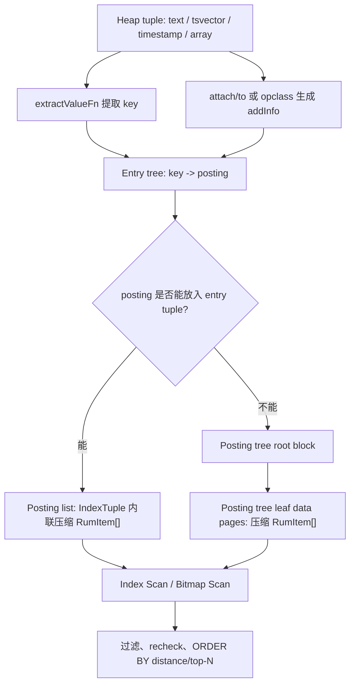

## 数据库筑基课 - 索引之 rum

### 作者
digoal

### 日期
2026-04-21

### 标签
PostgreSQL , DuckDB , 应用开发者 , 数据库筑基课 , 索引结构 , RUM , GIN , 全文检索

----

## 背景

[《数据库筑基课 - 大纲》](../202409/20240914_01.md)

这一篇属于“索引结构”基础能力。  

很多业务一开始只把全文检索理解成“能不能用索引找到包含关键词的行”。真正上线后，问题会变成：

- 搜索结果要按相关度排序，不能只是过滤。
- 短语搜索要快，例如 `"postgres <-> index"` 这种相邻词匹配。
- 搜索结果要按时间、价格、距离等业务字段排序，最好不要先扫出一堆候选行再回表排序。
- `LIMIT 20` 的查询希望尽快返回前 20 条，而不是把所有候选行算完再排序。

PostgreSQL 原生 `GIN` 很擅长“词项 -> TID 列表”的倒排过滤，但它的核心 posting 信息主要是 heap TID。相关度、短语位置、业务排序字段往往还需要访问 heap tuple 或额外计算。`rum` 扩展的核心思路是：在倒排 posting 里不只存 TID，还把与排序、排名、短语匹配有关的 additional information 一起存进去。

RUM 官方文档也明确说明：RUM 基于 GIN access method 代码，优势是更快的 ranking、phrase search、按 timestamp 排序以及 depth-first search；代价是 build/insert 慢于 GIN，因为 RUM 存储额外信息并使用 generic WAL records。参考：[Postgres Pro RUM 文档](https://postgrespro.com/docs/postgrespro/current/rum)、[postgrespro/rum README](https://github.com/postgrespro/rum)。

## 一、它解决什么问题？

### 1. GIN 的强项和短板

GIN 的逻辑模型是：

```text
lexeme/key -> posting list/posting tree -> heap TID
```

它适合回答“哪些行包含这些 key”。但业务搜索经常还要回答：

```text
这些行里谁更相关？
这些词是否相邻？
这些匹配结果离某个时间点最近的是谁？
```

如果索引里只有 TID，执行器拿到候选行后还要访问 heap，取出 `tsvector` 位置、时间戳或其他字段，再计算排名和排序。这会带来三个问题：

- 回表多：候选行越多，heap 访问越多。
- Top-N 慢：即使只要前 N 条，也可能先产生大量候选再排序。
- 短语搜索弱：短语匹配依赖词位置信息，不在索引里就需要更多 recheck。

### 2. RUM 的转化

RUM 把问题从“倒排索引只负责过滤”转成“倒排索引同时携带部分排序/排名所需信息”：

```text
lexeme/key -> (heap TID, addInfo) -> 过滤 + 排序/排名/短语判断
```

其中 `addInfo` 可以是：

- tsvector 词位置信息，用于 ranking 和 phrase search。
- `WITH (attach = 'd', to = 't')` 绑定的 timestamp/int 等业务字段，用于 `ORDER BY d <=> 常量`。
- array 长度等 operator class 自己定义的附加信息。

代价也很直接：

- 索引条目更大，空间成本更高。
- build/insert 要写入和维护 additional information，写入更慢。
- 使用 generic WAL records，日志成本和实现路径不同于 GIN。
- 某些场景存在类型限制，例如官方 README 提到 pass-by-reference additional information 用于 ordering 时存在限制；源码 `initRumState()` 也会拒绝 `order_by_attach` over pass-by-reference column。

## 二、它是什么？

RUM 是 PostgreSQL 的一个索引 access method 扩展。它可以理解为“带 additional information 的倒排索引”，不是一个独立的全文检索引擎。

源码入口在 `src/rumutil.c`。RUM 注册的 access method 回调包括：

- `ambuild = rumbuild`
- `aminsert = ruminsert`
- `ambulkdelete = rumbulkdelete`
- `amgettuple = rumgettuple`
- `amgetbitmap = rumgetbitmap`
- `amcostestimate = gincostestimate`

这说明 RUM 仍然嵌入 PostgreSQL optimizer/executor/index AM 框架中。优化器可以选择 Index Scan 或 Bitmap Index Scan，执行器通过 AM 回调从索引取 TID 和 order by 值。

RUM 的核心数据单位在 `src/rum.h`：

```c
typedef struct RumItem
{
    ItemPointerData iptr;
    bool            addInfoIsNull;
    Datum           addInfo;
} RumItem;
```

这就是它和普通“只存 TID posting”的关键差异：posting item 本身携带 `addInfo`。

## 三、核心原理

### 1. 总体结构



RUM 有两层树：

- Entry tree：按 key 找 posting，类似 GIN 的入口树。
- Posting tree：当某个 key 对应的 posting 太多，entry tuple 放不下时，把 posting 放入单独的数据页树。

官方文档的低层检查函数也按这个结构暴露：`rum_internal_entry_page_items()`、`rum_leaf_entry_page_items()`、`rum_internal_data_page_items()`、`rum_leaf_data_page_items()`。

### 2. 页面类型和元信息

`src/rum.h` 定义了固定页号：

- `RUM_METAPAGE_BLKNO = 0`
- `RUM_ROOT_BLKNO = 1`

页面 flags 包括：

- `RUM_META`：元页。
- `RUM_DATA`：posting tree 数据页。
- `RUM_LEAF`：叶子页。
- `RUM_LIST`：pending list 相关标记，但源码注释说明 pending list 已移除。
- `RUM_DELETED`：已删除页。

RUM metapage 里仍有 pending list 字段，但 `src/rum.h` 注释写着 `XXX unused - pending list is removed`。这点和 GIN 的 `fastupdate/pending list` 机制不同：RUM 不靠 pending list 缓冲写入。

### 3. Entry tuple 与 posting list/tree

Entry tree 叶子 tuple 有两种形态：

```text
小 posting:
  key + posting offset + posting count + compressed RumItem[]

大 posting:
  key + RUM_TREE_POSTING magic + posting tree root block
```

`src/rum.h` 中：

- `RumGetNPosting(itup)` 从 `t_tid.ip_posid` 读 posting 数量。
- `RUM_TREE_POSTING = 0xffff` 表示这个 tuple 指向 posting tree。
- `RumGetPostingTree(itup)` 从 `t_tid` 的 block number 取 posting tree root。

`src/ruminsert.c` 的 `addItemPointersToLeafTuple()` 和 `buildFreshLeafTuple()` 体现了转换逻辑：先尝试 `RumFormTuple()` 把 posting list 放进 entry tuple；如果超过 `RumMaxItemSize`，就 `createPostingTree()`，再把 entry tuple 改成指向 posting tree root。

### 4. Additional information 怎么来？

RUM 的 addInfo 有两类来源。

第一类是 operator class 自己生成。例如 `rum_tsvector_ops` 的 `rum_tsvector_config()` 配置 tsvector 词位置信息，`rum_tsquery_distance()` 用于 `<=>` 排名距离计算。SQL 定义在 `rum_init.sql` 的 `rum_tsvector_ops`：

```sql
CREATE OPERATOR CLASS rum_tsvector_ops
DEFAULT FOR TYPE tsvector USING rum
AS
    OPERATOR 1 @@ (tsvector, tsquery),
    OPERATOR 2 <=> (tsvector, tsquery) FOR ORDER BY pg_catalog.float_ops,
    FUNCTION 2 rum_extract_tsvector(...),
    FUNCTION 3 rum_extract_tsquery(...),
    FUNCTION 4 rum_tsquery_consistent(...),
    FUNCTION 7 rum_tsquery_pre_consistent(...),
    FUNCTION 8 rum_tsquery_distance(...),
    FUNCTION 10 rum_ts_join_pos(...),
    STORAGE text;
```

第二类是从同一 heap tuple 的另一个列 attach 过来。典型写法：

```sql
CREATE INDEX tsts_idx ON tsts USING rum (t rum_tsvector_addon_ops, d)
WITH (attach = 'd', to = 't');
```

这表示：查询条件用 `t` 的全文检索 key，但每个 `t` key 的 posting 里附带 `d` 的值，用于 `ORDER BY d <=> 常量`。源码 `initRumState()` 会解析 `attach` 和 `to`，并要求二者同时存在。

### 5. Build 路径

`src/ruminsert.c` 的 `rumbuild()` 做这些事：

1. 初始化 meta page 和 root page。
2. 创建 build 临时内存上下文。
3. 调用 `IndexBuildHeapScan()` 扫 heap。
4. `rumBuildCallback()` 对每个 heap tuple 调用 `rumHeapTupleBulkInsert()`。
5. `rumExtractEntries()` 从索引列提取 entries，并配上 addInfo。
6. `BuildAccumulator` 使用红黑树按 key 聚合 posting。
7. 当内存达到 `maintenance_work_mem` 时，把聚合结果 flush 到索引。
8. 最后更新 metapage 统计，并对 build 产生的页面写 generic WAL。

这个路径解释了为什么 RUM 构建成本高于 GIN：它不仅要聚合同一个 key 的 TID，还要保持 TID 和 addInfo 的组合，并在必要时构建 posting tree。

### 6. Insert 路径

`ruminsert()` 对单条 heap tuple：

1. 初始化 `RumState`。
2. 如果存在 attach 列，取出 `outerAddInfo`。
3. 对每个索引属性调用 `rumHeapTupleInsert()`。
4. `rumExtractEntries()` 提取 key。
5. 为每个 key 构造 `RumItem{iptr, addInfo}`。
6. 调用 `rumEntryInsert()`。

`rumEntryInsert()` 的分支很关键：

- 找到已有 entry 且已经是 posting tree：调用 `rumInsertItemPointers()` 插入 posting tree。
- 找到已有 entry 且还是 posting list：合并旧/新 posting，如果放不下则转 posting tree。
- 没找到 entry：构造 fresh leaf tuple，必要时直接建 posting tree。

所以 RUM 写入慢不是“实现不够快”这么简单，而是它维护的信息量更多，且没有 GIN pending list 带来的批量缓冲路径。

### 7. Search 路径

RUM 支持 `amgetbitmap` 和 `amgettuple` 两种接口：

- `rumgetbitmap()` 把匹配 TID 加入 TIDBitmap，适合 Bitmap Heap Scan。
- `rumgettuple()` 可以产生有序结果，适合带 `ORDER BY <=> LIMIT` 的 Index Scan。

`src/rumget.c` 中 `scanGetItem()` 会根据 scan type 分派：

- `RumFastScan`
- `RumFullScan`
- regular scan

`rumgettuple()` 如果不能按自然顺序直接返回，就把候选项放入 `rum_tuplesort`，通过 `keyGetOrdering()` 调 operator class 的 `orderingFn` 计算 order by 值，再返回给 executor。

这也是 RUM 的价值点：当 order by 所需信息在索引里，执行器不必为了排序字段或 tsvector 位置频繁回表。

### 8. Vacuum 路径

`src/rumvacuum.c` 的 `rumbulkdelete()` 从 entry tree 左端叶子页开始，逐页清理 entry page，并记录需要处理的 posting tree root。随后对这些 posting tree 调用 `rumVacuumPostingTree()` 删除无效 TID。

`rumvacuumcleanup()` 会统计总页数、entry pages、data pages、entries，并更新 metapage。它还会把 `PageIsNew` 或 `RUM_DELETED` 页记录到 FSM。

工程含义是：RUM 和其他 PostgreSQL 索引一样依赖 VACUUM 清理死元组；全文检索写入和删除频繁时，索引膨胀、vacuum 频率、autovacuum 参数都需要纳入容量规划。

## 四、横向对比

| 维度 | RUM | GIN | GiST / B-tree |
| --- | --- | --- | --- |
| 主要目标 | 带 addInfo 的倒排过滤、排名、短语、索引内排序 | 高效倒排过滤 | GiST 适合泛化搜索树；B-tree 适合有序标量 |
| 写入代价 | 较高；维护 TID + addInfo，使用 generic WAL，无 pending list 缓冲 | 通常更低；可用 pending list/fastupdate | B-tree 通常低；GiST 取决于 opclass |
| 读取代价 | 对 ranking、phrase、ORDER BY addon 可减少回表和排序成本 | 过滤快，但 ranking/phrase/order 可能需要更多 recheck/heap 访问 | 标量范围/排序强；全文倒排不适合 |
| 空间成本 | 高于只存 TID 的倒排，因为 posting 携带 addInfo | 相对更省 | 取决于 key 和结构 |
| MVCC/事务 | 存 TID，仍需 PostgreSQL 可见性检查；vacuum 清理死 TID | 同左 | 同左 |
| Top-N | 对 `<=>` 距离排序和 attach 字段排序更友好 | 常需候选集排序 | B-tree 对单列排序强，但不能表达全文相关度 |
| 适合场景 | 全文检索 + 排名/短语/时间排序/数组相似排序 | 纯包含、重叠、全文过滤 | 标量等值、范围、排序、KNN GiST 场景 |
| 不适合场景 | 高频写入、只做简单过滤、对扩展可用性有严格限制 | 需要索引内排名/附加字段排序 | 多值倒排检索 |

原因不是“谁更先进”，而是索引组织目标不同。GIN 把 posting 做轻，换来写入和空间优势；RUM 把 posting 做重，换来排序、排名、短语检索时更少回表和更早返回 Top-N 的机会。

## 五、效果如何？

可以从四个维度判断 RUM 是否值得：

1. **回表减少**  
   如果排序或 ranking 需要的信息已经在 posting 的 addInfo 中，索引扫描阶段就能计算 order by 距离。官方 `rum_tsvector_addon_ops` 示例显示 `WHERE t @@ ... ORDER BY d <=> ... LIMIT 5` 可走 `Index Scan using tsts_idx`，`Order By` 出现在索引扫描节点内。

2. **短语搜索更直接**  
   `rum_tsvector_ops` 存 lexeme position，短语搜索和 ranking 不必完全依赖 heap 里的 tsvector 位置重算。

3. **Top-N 延迟更低**  
   当索引可以按 distance/order 推进，`LIMIT` 查询有机会更早返回前几条。官方文档称 RUM 支持 depth-first search，能立即返回第一批结果。

4. **写入和空间变贵**  
   addInfo 不是免费的。每个 posting item 多了 `addInfoIsNull` 和 `addInfo`，数据页还要维护压缩、索引数组、posting tree split/vacuum。官方明确说明 RUM build/insert 慢于 GIN。

本文不提供性能数字，因为没有在当前环境实际编译运行 RUM，也没有固定数据集、PostgreSQL 版本、shared_buffers、work_mem 和查询 workload。真实评估必须用你的数据做 A/B：`GIN` vs `RUM`，并同时看查询延迟、写入 TPS、WAL、索引大小、vacuum 时间。

## 六、实操 DEMO

以下 SQL 来自 RUM README/官方文档并做了最小化整理。当前环境未安装 PostgreSQL + RUM 扩展，所以本文没有执行这些 SQL；执行输出请以你的环境为准。

### 1. 全文检索按相关度排序

```sql
CREATE EXTENSION rum;

CREATE TABLE test_rum(
    t text,
    a tsvector
);

CREATE TRIGGER tsvectorupdate
BEFORE UPDATE OR INSERT ON test_rum
FOR EACH ROW EXECUTE PROCEDURE
    tsvector_update_trigger('a', 'pg_catalog.english', 't');

INSERT INTO test_rum(t) VALUES
    ('The situation is most beautiful'),
    ('It is a beautiful'),
    ('It looks like a beautiful place');

CREATE INDEX rumidx ON test_rum USING rum (a rum_tsvector_ops);

EXPLAIN (COSTS OFF)
SELECT t, a <=> to_tsquery('english', 'beautiful | place') AS distance
FROM test_rum
WHERE a @@ to_tsquery('english', 'beautiful | place')
ORDER BY a <=> to_tsquery('english', 'beautiful | place');
```

验证点：

- 是否走 `Index Scan using rumidx`。
- `ORDER BY a <=> ...` 是否能被索引扫描利用。
- 和 `GIN` 对比时，注意 `GIN` 通常不能直接在索引内提供 `<=>` 排序值。

### 2. 全文检索按业务时间排序

```sql
CREATE TABLE docs (
    id bigserial PRIMARY KEY,
    body text NOT NULL,
    ts tsvector GENERATED ALWAYS AS
        (to_tsvector('english', body)) STORED,
    created_at timestamp NOT NULL
);

INSERT INTO docs(body, created_at) VALUES
    ('postgres rum index supports phrase search', '2026-04-21 10:00:00'),
    ('postgres gin index supports inverted search', '2026-04-20 10:00:00'),
    ('rum can attach timestamp for ordering', '2026-04-21 12:00:00');

CREATE INDEX docs_rum_idx
ON docs USING rum (ts rum_tsvector_addon_ops, created_at)
WITH (attach = 'created_at', to = 'ts');

EXPLAIN (COSTS OFF)
SELECT id, created_at, created_at <=> timestamp '2026-04-21 11:00:00' AS distance
FROM docs
WHERE ts @@ to_tsquery('english', 'postgres | rum')
ORDER BY created_at <=> timestamp '2026-04-21 11:00:00'
LIMIT 5;
```

验证点：

- 查询条件在 `ts` 上，排序距离在 `created_at` 上。
- `attach = 'created_at', to = 'ts'` 表示把 created_at 作为 ts posting 的 additional information。
- 如果 `created_at` 缺失、类型不支持、或 attach/to 写反，建索引或查询会失败。

### 3. 检查 RUM 页面

RUM 提供低层检查函数，适合 DBA 学习和排障：

```sql
SELECT * FROM rum_metapage_info('docs_rum_idx', 0);
SELECT * FROM rum_page_opaque_info('docs_rum_idx', 1);
SELECT * FROM rum_leaf_entry_page_items('docs_rum_idx', 1);
```

验证点：

- metapage 中 `n_entry_pages`、`n_data_pages`、`n_entries` 是否随数据变化。
- 某些高频 key 是否从 posting list 变成 posting tree。
- vacuum 后 dead TID 是否减少、free pages 是否变化。

## 七、最佳实践

### 数据库架构师

- 把 RUM 定位为“搜索体验优化索引”，不要默认替代所有 GIN。
- 当产品需求包含“全文过滤 + 相关度排序/短语/业务时间 Top-N”时，把 RUM 纳入候选。
- 如果只是 `WHERE tags @> ...`、`WHERE tsv @@ q` 且没有复杂排序，先用 GIN 做基线。
- 设计索引时明确主问题：是相关度、短语、时间排序，还是数组相似度。不同 opclass 的 addInfo 不一样。
- 对写多读少系统，先评估 WAL、索引大小、insert/update TPS，再决定是否上线。

### DBA

- 用 `EXPLAIN (ANALYZE, BUFFERS)` 对比 GIN/RUM，不要只看 planner 选了哪个索引。
- 重点观察：heap blocks hit/read、sort 节点是否消失、Top-N 延迟、索引大小、WAL 量、vacuum 时间。
- 对更新频繁的全文列，关注索引膨胀。RUM 仍存 heap TID，死元组清理依赖 VACUUM。
- 生产启用前确认扩展版本、PostgreSQL 版本和升级路径。README 当前说明 PostgreSQL 12+ 可直接构建，9.6-11 需要额外处理 tidbitmap 源文件。
- 不要在 pass-by-reference attach 字段上启用不被支持的 ordering 形态。源码会对 `order_by_attach` + pass-by-reference column 报错，README 也提示这类限制。

### 业务开发者

- SQL 要写成索引能理解的形态：`WHERE t @@ query ORDER BY t <=> query LIMIT n`，或者 `WHERE t @@ query ORDER BY attached_col <=> const LIMIT n`。
- 不要把 `<=>` 当成普通相似度函数到处套。它是 RUM opclass 暴露给 ORDER BY 的距离语义，通常越小越靠前。
- 对搜索框里的 query 做规范化：语言配置、停用词、前缀搜索、短语操作符会影响召回和 recheck。
- 结果质量要用业务样本评估。RUM 能让 ranking 更快，不等于默认 ranking 就一定符合产品排序目标。

## 八、适合与不适合场景

### 适合

- 文档、帖子、商品、工单、日志等全文检索，并要求相关度排序。
- 搜索结果常带 `LIMIT`，用户只看第一页，Top-N 延迟敏感。
- 短语搜索、近邻词搜索较多，词位置信息对判断很重要。
- 需要“全文过滤 + 时间/价格/业务字段距离排序”的组合查询。
- 读多写少或读写比适中，愿意用更大索引换查询体验。

### 不适合

- 高频 insert/update/delete，且搜索排序要求不强。
- 只做简单包含过滤，GIN 已经满足 SLA。
- 对扩展依赖敏感，必须只使用 PostgreSQL core 功能。
- attach 字段是复杂 varlena/pass-by-reference，并且希望用于不受支持的 ordering。
- 查询排序规则高度业务化，需要多个字段、多阶段打分、个性化排序；这种场景 RUM 只能承担召回和部分排序，最终排序仍要业务层或 SQL 层完成。

## 九、常见坑

1. **把 RUM 当成 GIN 的无脑升级版**  
   RUM 是用写入和空间换排序/排名/短语能力。没有这些需求时，GIN 往往更合适。

2. **只看查询快，不看写入慢**  
   官方文档直接说明 RUM build/insert 慢于 GIN。上线前必须压测写入、更新、WAL 和 autovacuum。

3. **attach/to 理解反了**  
   `WITH (attach = 'd', to = 't')` 是把 `d` 附着到 `t` 的 posting 上。查询过滤走 `t`，排序可以用 `d`。

4. **以为索引排序等于最终业务排序**  
   RUM 的 `<=>` 是 operator class 定义的 distance。复杂业务排序，例如会员等级、库存、点击率、新鲜度混合，仍需要额外排序或打分。

5. **忽略 recheck 和 MVCC**  
   RUM 返回 TID 后仍要经过 PostgreSQL 可见性和必要 recheck。索引内有 addInfo 不等于完全 index-only scan。

6. **用错 opclass**  
   `rum_tsvector_hash_ops` 存 lexeme hash，不支持 prefix search；`rum_tsvector_ops` 支持 prefix search。选择 opclass 前要确认查询语义。

7. **版本和部署路径没有锁定**  
   RUM 是扩展，不是 PostgreSQL core。升级 PostgreSQL 大版本、主从、备份恢复、镜像构建都要包含扩展安装和版本验证。

## 十、扩展问题

1. 如果你的业务只需要 `WHERE t @@ q LIMIT 20`，没有 `ORDER BY`，RUM 相比 GIN 的收益在哪里？代价是否值得？
2. 为什么 RUM 的 addInfo 能减少回表，但不能完全取消 MVCC 可见性检查？
3. 如果搜索排序需要同时考虑相关度、时间、新鲜度、用户画像，哪些部分适合放进 RUM，哪些部分应该放在 SQL/业务层？
4. GIN pending list 能改善写入吞吐，RUM 移除 pending list 后，对高写入 workload 意味着什么？
5. RUM 的 posting tree 内部页对 pass-by-reference additional information 有限制，这对 schema 设计有什么启发？

## 十一、扩展阅读

- [postgrespro/rum GitHub 仓库](https://github.com/postgrespro/rum)
- [Postgres Pro RUM 官方文档](https://postgrespro.com/docs/postgrespro/current/rum)
- [DeepWiki: postgrespro/rum](https://deepwiki.com/postgrespro/rum)
- RUM 源码：`src/rum.h`，核心数据结构、页面 flag、posting tuple 宏。
- RUM 源码：`src/ruminsert.c`，`rumbuild()`、`ruminsert()`、posting list 到 posting tree 的转换。
- RUM 源码：`src/rumget.c`，`rumgetbitmap()`、`rumgettuple()`、排序和扫描策略。
- RUM 源码：`src/rumvacuum.c`，`rumbulkdelete()`、`rumvacuumcleanup()`。
- RUM SQL 定义：`rum_init.sql`，operator、operator class、support function 定义。
- PostgreSQL 文档：[GIN Indexes](https://www.postgresql.org/docs/current/gin.html)
- [《PostgreSQL RUM 索引原理》](../202011/20201128_02.md)  
- [《PostgreSQL rum 索引结构 - 比gin posting list|tree 的ctid(行号)多了addition info》](../201907/20190706_01.md)  

## 参考源码与结论校验

本文主要结论对应关系：

| 结论 | 依据 |
| --- | --- |
| RUM 基于 GIN，但 posting 中存 addInfo | README、官方文档、`src/rum.h` 的 `RumItem` |
| 小 posting 内联，大 posting 转 posting tree | `src/rum.h` 的 `RUM_TREE_POSTING`，`src/ruminsert.c` 的 `addItemPointersToLeafTuple()` / `buildFreshLeafTuple()` |
| build 使用 heap scan + accumulator + maintenance_work_mem flush | `src/ruminsert.c` 的 `rumbuild()`、`rumBuildCallback()` |
| insert 逐 key 调 `rumEntryInsert()` | `src/ruminsert.c` 的 `ruminsert()`、`rumHeapTupleInsert()` |
| 支持 bitmap scan 和 tuple scan/order by | `src/rumutil.c` AM callback，`src/rumget.c` 的 `rumgetbitmap()` / `rumgettuple()` |
| vacuum 清 entry page 和 posting tree | `src/rumvacuum.c` 的 `rumbulkdelete()` |
| RUM 写入慢于 GIN | 官方文档和 README 明确说明 |
| `rum_tsvector_hash_ops` 不支持 prefix search | README、官方文档 operator class 说明 |

本文 SQL 示例未在当前环境执行；原因是当前项目不是 PostgreSQL + RUM 编译安装环境。示例语法来自官方 README/文档和 RUM 回归测试风格，生产验证应以本地 `make installcheck`、`EXPLAIN (ANALYZE, BUFFERS)` 和业务数据压测为准。
  
#### [PostgreSQL 解决方案集合](../201706/20170601_02.md "40cff096e9ed7122c512b35d8561d9c8")
  
  
#### [德哥 / digoal's Github - 公益是一辈子的事.](https://github.com/digoal/blog/blob/master/README.md "22709685feb7cab07d30f30387f0a9ae")
  
  
#### [About 德哥](https://github.com/digoal/blog/blob/master/me/readme.md "a37735981e7704886ffd590565582dd0")
  
  

  
