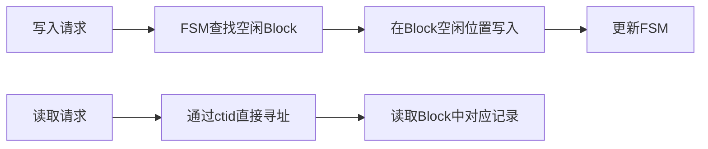
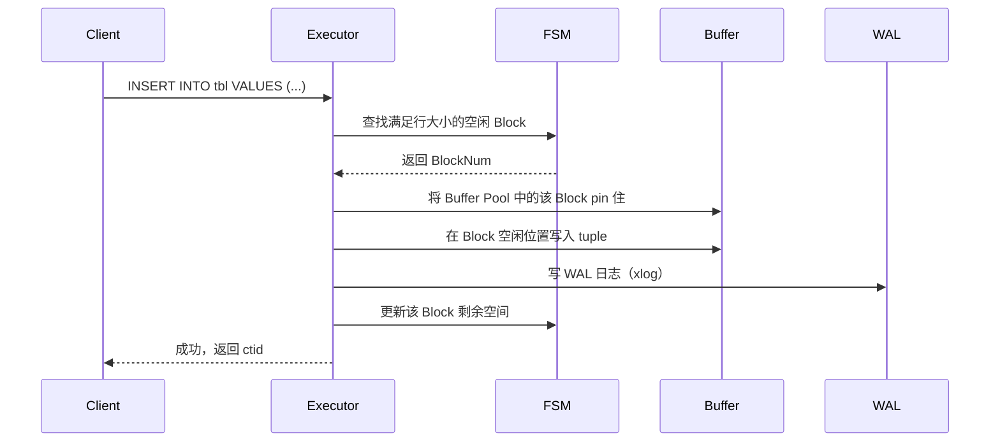
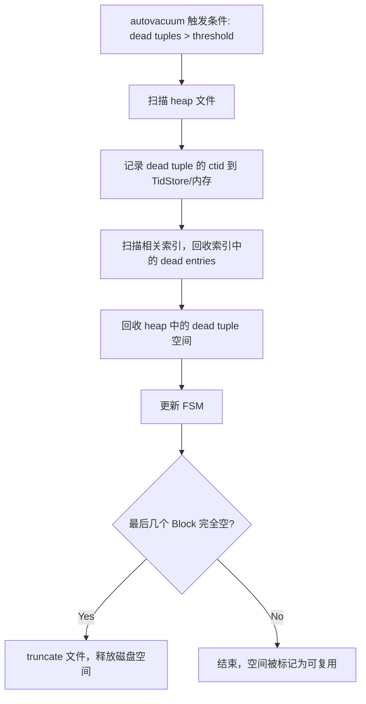
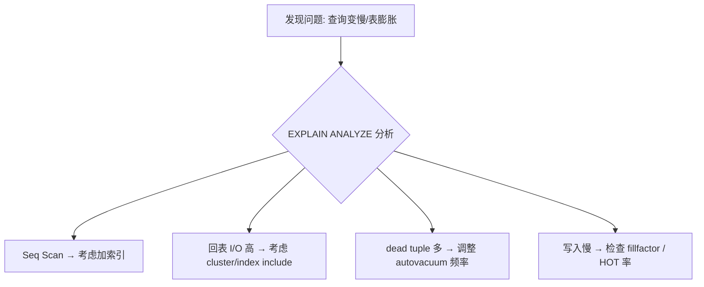

## 数据库筑基课 - 行存之 heap 表组织结构   
                                                                                    
### 作者                                                        
digoal                                                        
                                                               
### 日期                                                             
2026-04-22                                                      
                                                            
### 标签                                                          
PostgreSQL , PolarDB , DuckDB , 应用开发者 , 数据库筑基课 , 表组织结构 , 行存 , heap          
                                                                                   
----                                                            
                                                                          
## 背景      
<b>本节: 行存之 heap 表组织结构</b>     


> 所属系列：[数据库筑基课大纲](../202409/20240914_01.md)  
> 难度：★★☆☆☆  
> 适合角色：数据库架构师 / DBA / 业务开发者

---

## 目录

1. [导读](#0-导读)
2. [背景与痛点](#1-背景与痛点)
3. [核心原理](#2-核心原理)
4. [深度解析](#3-深度解析)
5. [优势与适合场景](#4-优势与适合场景)
6. [劣势与不适合场景](#5-劣势与不适合场景)
7. [竞品横向对比](#6-竞品横向对比)
8. [实操与最佳实践](#7-实操与最佳实践)
9. [性能调优](#8-性能调优)
10. [思考与边界](#9-思考与边界)
11. [FAQ](#10-faq)
12. [扩展阅读](#11-扩展阅读)

---

## 0. 导读

PostgreSQL heap 是最经典的行存储引擎，理解它是掌握数据库存储原理的第一步。

**读完本文你能做到：**
- 读懂 `ctid=(3,9)` 这样的物理行号，理解其背后的寻址逻辑
- 知道 vacuum、fillfactor、HOT-update 该怎么配置才不会让表膨胀
- 判断业务场景是否适合 heap，以及何时该考虑其他存储引擎

---

## 1. 背景与痛点

### 最基础的问题：数据放哪里、怎么找回来？

如果让你从零设计一个数据库的存储层，你可能会想到最简单的方案：所有记录顺序追加到一个大文件里。但这会带来严重问题：

| 问题 | 影响 |
|------|------|
| 查一条记录要扫全表 | SELECT 性能灾难 |
| 删除记录留下空洞 | 磁盘空间浪费 |
| 更新要移动数据 | 写放大，索引失效 |
| 并发写入争抢同一位置 | 性能下降 |

heap 存储引擎正是为了解决这些问题而设计的：



### 痛点：无序存储的代价

heap 的设计让写入极快（不排序），但也带来了独特问题：
- **dead tuple 与 live tuple 混存**：UPDATE 不原地修改，而是写新版本，旧版本变成 dead tuple
- **不及时清理会导致膨胀**：表文件越来越大，查询越来越慢

这正是 vacuum 机制存在的原因。

---

## 2. 核心原理

### 文件组织总览

```
表对应的磁盘文件（以 pg_relation_filepath() 获取基础路径）：

  base/16384/12345         ← main数据文件（默认最大1GB，超出自动新建 .1 .2 ...）
  base/16384/12345_fsm     ← Free Space Map（空闲空间图）
  base/16384/12345_vm      ← Visibility Map（可见性图）
  base/16384/12345_init    ← Init文件（仅 unlogged table）
```

### 三层物理结构

```
Layer 1: File（文件）
  ┌──────────────────────────────────────────────────────┐
  │  Segment 0 (≤1GB)  │  Segment 1 (≤1GB)  │  ...      │
  └──────────────────────────────────────────────────────┘

Layer 2: Block / Page（块，默认 8KB）
  ┌──────────────────────────────────────────────────────┐
  │  Block 0  │  Block 1  │  Block 2  │  ...             │
  └──────────────────────────────────────────────────────┘

Layer 3: Tuple（行记录）
  ┌────────────────────────────────────────────────────────────────┐
  │ PageHeader(24B) │ lp[1] │ lp[2] │ ... │ FreeSpace │ Tuple2 │ Tuple1 │
  └────────────────────────────────────────────────────────────────┘
        ↑ 行号起点                              ↑ 从尾部向前增长
```

### ctid：物理行号

```
ctid = (BlockNum, ItemIndex)

示例：ctid = (3, 9) 表示：
  - 第 3 号数据块（Block 3）
  - 该块内的第 9 条 line pointer 指向的记录

用法：
SELECT ctid, * FROM tbl WHERE ctid = '(0,1)';
SELECT ctid, * FROM tbl WHERE ctid >= '(0,1)' AND ctid < '(11,0)';
```

---

## 3. 深度解析

### 3.1 Block 内部结构详解

```
┌──────────────────────────────────────────────────────────────────┐
│  PageHeaderData（24 bytes）                                      │
│  - pd_lsn: WAL位置（8B）                                         │
│  - pd_checksum: 校验和（2B）                                     │
│  - pd_lower: 空闲区起始偏移（2B）                                │
│  - pd_upper: 空闲区结束偏移（2B）                                │
│  - pd_special: special area起始偏移（2B）                        │
├──────────────────────────────────────────────────────────────────┤
│  lp[1]（4B）│ lp[2]（4B）│ lp[3]（4B）│ ...                    │
│  Line Pointers: offset(15bit) + flags(2bit) + length(15bit)      │
├────────────────────── pd_lower ~ pd_upper ───────────────────────┤
│                       Free Space（可用区域）                     │
├──────────────────────────────────────────────────────────────────┤
│  ...  Tuple 3  │  Tuple 2  │  Tuple 1                           │
│  ← Tuples 从尾部向前增长，lp 从头部向后增长                      │
└──────────────────────────────────────────────────────────────────┘
```

**Tuple Header（23 bytes）关键字段：**

| 字段 | 说明 |
|------|------|
| t_xmin | 插入该 tuple 的事务 ID |
| t_xmax | 删除/更新该 tuple 的事务 ID（未删除时为0） |
| t_ctid | 当前有效版本的 ctid（HOT链时指向新版本） |
| t_infomask | 事务提交/回滚状态标志位 |
| t_hoff | Header 长度（含空值位图） |

### 3.2 FSM：空闲空间管理

FSM（Free Space Map）的作用是**快速找到一个能放下新记录的 Block**，类比停车场的"剩余车位显示牌"。

```
FSM 用二叉树组织（每个叶节点 = 1个 Block）：

          MAX(8,4)=8
         /          \
       MAX(8,4)    MAX(3,7)
       /    \       /    \
      8      4     3      7   ← 叶节点值 = block剩余空间/256*blocksize
   Block0  Block1  Block2  Block3
```

每个叶节点用 **1 个字节**表示该 Block 的剩余空间（0-255，精度为 blocksize/256）。

```sql
-- 查看各 Block 的剩余空间（需要 pg_freespacemap 插件）
CREATE EXTENSION pg_freespacemap;
SELECT * FROM pg_freespace('tbl') LIMIT 10;
-- 返回: blkno, avail（字节）
```

### 3.3 VM：可见性图

VM（Visibility Map）为每个 Block 维护 **2 个 bit**：

| Bit | 含义 |
|-----|------|
| all-visible | 该 Block 所有 tuple 对所有事务可见（可跳过可见性检查，支持 index only scan） |
| all-frozen | 该 Block 所有 tuple xid 已冻结（vacuum freeze 后设置，防止 xid wraparound） |

### 3.4 写入流程



### 3.5 HOT-Update（关键优化）

**痛点**：普通 UPDATE = 新写一个 tuple + 所有相关索引都要更新，写放大严重。

**HOT（Heap Only Tuple）Update**：当以下两个条件同时满足时，无需更新索引：

```
条件1: 更新的字段不是任何索引的 key
条件2: 新 tuple 与旧 tuple 在同一个 Block 内
                    ↑ 靠 fillfactor 预留空间来实现
```

HOT-Update 利用 **lp 链**：旧 lp 指向新 tuple 的 lp，索引仍指向旧 lp，通过链条找到新 tuple。

```
索引 value: ctid=(5, 3)
              ↓
  Block 5:  lp[3] → lp[7] → live tuple  (dead tuple lp 转为 redirect)
```

**配置建议：**
```sql
-- 对频繁更新非索引列的表，设置 fillfactor 预留空间给 HOT update
CREATE TABLE orders (
    id BIGINT PRIMARY KEY,
    status TEXT,       -- 频繁更新，但 status 不在索引里
    amount NUMERIC
) WITH (fillfactor = 70);  -- 预留30%空间给 HOT update

ALTER TABLE orders SET (fillfactor = 70);
```

### 3.6 MVCC 与 dead tuple

PostgreSQL 的 MVCC 实现让 UPDATE/DELETE 产生 **dead tuple**（旧版本）：

```
time →

t1: INSERT  → lp[1] → Tuple(xmin=100, xmax=0) ← live
t2: UPDATE  → lp[1] → Tuple(xmin=100, xmax=200) ← dead after t2 commit
              lp[2] → Tuple(xmin=200, xmax=0)   ← live
t3: vacuum  → lp[1] 回收（dead tuple空间释放，lp被标记为 DEAD）
```

**哪些 dead tuple 不能回收？**

```sql
-- 查看阻碍 vacuum 回收 dead tuple 的来源
SELECT pid, backend_xmin, backend_xid, state, query
FROM pg_stat_activity
WHERE backend_xmin IS NOT NULL
ORDER BY backend_xmin;

-- 查看 replication slot 的 xmin（可能阻止 vacuum）
SELECT slot_name, xmin, catalog_xmin FROM pg_replication_slots;
```

### 3.7 Vacuum 工作原理



**关键参数说明：**

| 参数 | 默认值 | 说明 |
|------|--------|------|
| `autovacuum_vacuum_threshold` | 50 | 触发 vacuum 的最少 dead tuple 数 |
| `autovacuum_vacuum_scale_factor` | 0.2 | 触发 vacuum 的 dead tuple 占比 |
| `autovacuum_vacuum_cost_delay` | 2ms | vacuum 每次 sleep 时长（IO 限速） |
| `autovacuum_vacuum_cost_limit` | 200 | vacuum 每次 sleep 前的IO消耗上限 |
| `autovacuum_max_workers` | 3 | 并发 vacuum 进程数 |

---

## 4. 优势与适合场景

| 场景 | 原因 | 典型案例 |
|------|------|----------|
| **OLTP 高频小事务** | 按行存储，全行读取效率高 | 电商订单、用户账户 |
| **随机读写** | ctid 直接寻址，O(1) 定位 | 用户信息更新 |
| **时序热数据写入** | append-only 模式，FSM 快速找位置 | IoT 传感器数据 |
| **需要访问整行大多数字段** | 一行数据物理上在一起，一次 IO 取全行 | 报表导出 |
| **中等数据量的 HTAP** | 配合并行查询，兼顾写入和分析 | SaaS 多租户 |

---

## 5. 劣势与不适合场景

| 场景 | 原因 | 推荐替代方案 |
|------|------|-------------|
| **高频 UPDATE + 长事务** | dead tuple 堆积，膨胀严重 | 使用 zheap 或分区表 |
| **只读少数列的大规模扫描** | 读取整行但只用几列，IO 浪费 | Parquet（列存） |
| **超宽表（>8KB 单行）** | 受 blocksize 限制 | TOAST + 适当拆表 |
| **历史数据归档（压缩需求高）** | 行存压缩比低 | Parquet + 对象存储 |
| **时序历史数据 OLAP 分析** | 列存更高效 | DuckDB + Parquet |

---

## 6. 竞品横向对比

| 特性 | heap（行存） | parquet（列存） | zedstore（行列混存） | LSM-Tree（如 RocksDB） |
|------|-------------|----------------|---------------------|----------------------|
| **写入速度** | ★★★★☆ | ★★☆☆☆ | ★★★★☆ | ★★★★★ |
| **点查速度** | ★★★★★ | ★★☆☆☆ | ★★★★☆ | ★★★☆☆ |
| **全列扫描** | ★★☆☆☆ | ★★★★★ | ★★★★☆ | ★★☆☆☆ |
| **少列扫描** | ★★☆☆☆ | ★★★★★ | ★★★★★ | ★★☆☆☆ |
| **UPDATE支持** | ✅（MVCC） | ❌（需重写） | ✅（MVCC） | ✅（追加写） |
| **事务支持** | ✅ ACID | ❌（文件级） | ✅ ACID | 有限 |
| **压缩比** | ★★☆☆☆ | ★★★★★ | ★★★★☆ | ★★★☆☆ |
| **适合场景** | OLTP | OLAP/数据湖 | HTAP | 写密集型 |

---

## 7. 实操与最佳实践

### 7.1 基础实验：观察 heap 存储结构

```sql
-- 环境准备（需要 pageinspect 插件）
CREATE EXTENSION IF NOT EXISTS pageinspect;
CREATE EXTENSION IF NOT EXISTS pg_freespacemap;

-- 建测试表
CREATE TABLE heap_demo (
    id      BIGSERIAL,
    name    TEXT,
    score   FLOAT,
    payload JSONB
) WITH (fillfactor = 80);

-- 插入测试数据
INSERT INTO heap_demo (name, score, payload)
SELECT
    'user_' || g,
    random() * 100,
    jsonb_build_object('level', (g % 10) + 1)
FROM generate_series(1, 10000) g;

-- 1. 查看物理文件路径
SELECT pg_relation_filepath('heap_demo');

-- 2. 查看 ctid（物理行号）
SELECT ctid, id, name FROM heap_demo LIMIT 5;
-- 输出示例: (0,1), (0,2), ... (0,N)

-- 3. 查看某个 Block 的内容
SELECT lp, lp_flags, t_xmin, t_xmax, t_ctid, t_data
FROM heap_page_items(get_raw_page('heap_demo', 0))
LIMIT 5;

-- 4. 查看 FSM 各 Block 可用空间
SELECT blkno, avail FROM pg_freespace('heap_demo') LIMIT 10;
```

### 7.2 观察 HOT-Update 效果

```sql
-- 创建只在 id 上有索引的表（name 上无索引）
CREATE TABLE hot_test (
    id    INT PRIMARY KEY,
    name  TEXT,
    score INT
) WITH (fillfactor = 70);

INSERT INTO hot_test SELECT g, 'user_'||g, g FROM generate_series(1,1000) g;

-- 记录更新前的 ctid
SELECT ctid, id, name FROM hot_test WHERE id = 1;
-- 输出: (0,1) | 1 | user_1

-- 更新非索引列（触发 HOT-update）
UPDATE hot_test SET score = 999 WHERE id = 1;

-- 查看更新后的 ctid（若 HOT 成功，Block号不变）
SELECT ctid, id, name, score FROM hot_test WHERE id = 1;
-- HOT成功时: (0,XX)，Block号仍为0

-- 统计 HOT update 比例
SELECT n_tup_upd, n_tup_hot_upd,
       round(n_tup_hot_upd::numeric / nullif(n_tup_upd,0) * 100, 2) AS hot_ratio
FROM pg_stat_user_tables
WHERE relname = 'hot_test';
```

### 7.3 监控与诊断 SQL

```sql
-- 检查表膨胀情况
SELECT
    schemaname,
    tablename,
    pg_size_pretty(pg_total_relation_size(schemaname||'.'||tablename)) AS total_size,
    pg_size_pretty(pg_relation_size(schemaname||'.'||tablename)) AS table_size,
    n_dead_tup,
    n_live_tup,
    round(n_dead_tup::numeric / nullif(n_live_tup + n_dead_tup, 0) * 100, 2) AS dead_ratio,
    last_vacuum,
    last_autovacuum
FROM pg_stat_user_tables
ORDER BY n_dead_tup DESC
LIMIT 20;

-- 找出阻碍 vacuum 的长事务
SELECT
    pid,
    age(backend_xmin) AS xmin_age,
    state,
    left(query, 100) AS query_snippet
FROM pg_stat_activity
WHERE backend_xmin IS NOT NULL
ORDER BY age(backend_xmin) DESC;

-- 手动触发 vacuum（详细模式）
VACUUM VERBOSE ANALYZE heap_demo;
```

### 7.4 时序场景最佳配置

```sql
-- 时序场景：大量顺序写，较少更新
CREATE TABLE iot_metrics (
    device_id   INT,
    ts          TIMESTAMPTZ NOT NULL DEFAULT now(),
    temperature FLOAT,
    humidity    FLOAT
) WITH (fillfactor = 100)      -- 不预留 HOT 空间（几乎不更新）
PARTITION BY RANGE (ts);       -- 按时间分区，便于冷热分离

-- 创建分区（每天一个）
CREATE TABLE iot_metrics_2024_01
PARTITION OF iot_metrics
FOR VALUES FROM ('2024-01-01') TO ('2024-02-01');

-- 配合 BRIN 索引（时序数据天然有序，BRIN 极省空间）
CREATE INDEX ON iot_metrics_2024_01 USING brin (ts);
```

---

## 8. 性能调优

### 调优思路



### TOP 5 调优手段

| 手段 | 场景 | 操作 |
|------|------|------|
| **调整 fillfactor** | 频繁 UPDATE 非索引列 | `ALTER TABLE t SET (fillfactor=70)` |
| **加快 autovacuum** | 膨胀严重的大表 | 表级别降低 `autovacuum_vacuum_scale_factor` |
| **cluster 表** | 范围查询回表 IO 多 | `CLUSTER tbl USING idx` |
| **分区表** | 超大表的 vacuum 慢 | 按时间/业务分区，减小单个分区体积 |
| **pg_repack 在线收缩** | 业务不能停机但已严重膨胀 | `pg_repack -t tbl -j 4` |

```sql
-- 对单表提高 autovacuum 频率（适合高频更新的热表）
ALTER TABLE hot_table SET (
    autovacuum_vacuum_scale_factor = 0.01,    -- 1% dead tuple 就触发
    autovacuum_vacuum_threshold = 100,
    autovacuum_vacuum_cost_delay = 0          -- 不限速（NVMe SSD 场景）
);
```

---

## 9. 思考与边界

### 扩展问题 1：为什么 vacuum 只能回收文件**末尾**的完全空闲 Block？

**分析**：heap 文件中 Block 的物理位置决定了它的 BlockNum（ctid 的第一个数字）。如果回收中间的 Block，后面所有 Block 的 BlockNum 都会变化，而**索引中存储的 ctid 无法同步更新**，会导致索引失效。

回收末尾的完全空闲 Block 不存在这个问题，因为后面没有任何 Block 需要调整编号。

```
回收中间Block（❌ 不可以）：
  Block 0, Block 1, [回收 Block 2], Block 3, Block 4
                                      ↓ BlockNum 变化！
                                    原来的 Block 3 → 变成 Block 2
                                    所有指向它的索引 ctid 全部失效

回收末尾Block（✅ 可以）：
  Block 0, Block 1, Block 2, Block 3, [回收 Block 4]
                                                ↓ 后面没有更多 Block，安全
```

### 扩展问题 2：long transaction 为什么会导致表膨胀？

**分析**：PostgreSQL 的 MVCC 基于 snapshot 实现。Vacuum 只能回收"所有活跃事务都不再需要的旧版本"。一个长事务的 `backend_xmin` 会"钉住"一个 xid 快照——这个 xid 之后产生的所有 dead tuple 都无法被回收。

如果在长事务开始后，某张高频更新的表产生了大量 dead tuple，这些 dead tuple 就会一直积累直到长事务结束。

**预防措施**：
```sql
-- 设置语句级别超时，防止意外长查询
SET statement_timeout = '30min';

-- 设置事务级别超时
SET idle_in_transaction_session_timeout = '5min';

-- 监控并 kill 危险的长事务
SELECT pg_terminate_backend(pid)
FROM pg_stat_activity
WHERE state = 'idle in transaction'
  AND now() - xact_start > interval '1 hour';
```

### 扩展问题 3：heap 存储的本质取舍是什么？

**核心 trade-off**：

| 设计选择 | 获得的 | 放弃的 |
|----------|--------|--------|
| 无序存储（靠 FSM 找空位） | 写入极快，无热点 | 范围查询 IO 多（需 cluster 辅助） |
| MVCC 多版本共存（dead+live混存） | 读写不互相阻塞，快照隔离 | 需要 vacuum 定期清理，有膨胀风险 |
| 行存（每行是一个整体） | 整行读取只需 1 次寻址 | 只读少列时 IO 浪费（对比列存） |

**一句话总结**：heap 是"为 OLTP 写入性能极度优化，牺牲了 OLAP 分析性能和空间利用率"的设计。

---

## 10. FAQ

**Q1: `fillfactor` 设多少合适？**  
A: 对于频繁 UPDATE 非索引列的表，70-80 是常见选择；对于 append-only 的时序表，100 更省空间；对于几乎不更新的历史表，100。

**Q2: vacuum 和 vacuum full 的区别？**  
A: `VACUUM` 是在线操作，只回收 dead tuple 空间供后续复用，但不缩小文件（除了末尾全空的 Block）；`VACUUM FULL` 会重建整张表，彻底缩小文件，但需要锁表，会阻塞业务。生产环境优先考虑 `pg_repack` 替代 `VACUUM FULL`。

**Q3: 为什么 UPDATE 一行后，表文件反而变大了？**  
A: UPDATE 在 heap 中是"写新版本 + 标记旧版本为 dead"，如果 HOT update 条件不满足，新旧版本都占用空间，文件会增大，直到 vacuum 清理旧版本后空间才能复用。

**Q4: TOAST 是什么？什么时候会用到？**  
A: 当一条记录（含变长字段）超过 `toast_tuple_target`（默认约 2KB）时，大的变长字段会被移到独立的 TOAST 表中存储（Extended 模式：先压缩，还大就搬走；External：不压缩直接搬走），heap 中只留一个 18 字节的指针。可以通过 `ALTER TABLE ALTER COLUMN ... SET STORAGE` 调整。

**Q5: 如何判断一张表是否严重膨胀？**  
A: 一般认为 dead tuple 比例超过 20% 或者表的实际大小是理论大小的 2 倍以上就算严重膨胀。可以用 `pgstattuple` 插件精确诊断：
```sql
CREATE EXTENSION pgstattuple;
SELECT * FROM pgstattuple('your_table');
-- 关注: dead_tuple_percent
```

---

## 11. 扩展阅读

### 官方文档
- [PostgreSQL Storage](https://www.postgresql.org/docs/17/storage.html)
- [PostgreSQL MVCC](https://www.postgresql.org/docs/17/mvcc.html)

### 源码路径
- `src/include/storage/bufpage.h` — Block/Page 结构定义
- `src/backend/access/heap/heapam.c` — heap 访问方法核心逻辑
- `src/backend/storage/freespace/` — FSM 实现
- `src/include/access/heaptoast.h` — TOAST 阈值与逻辑

### 书籍
- 《PostgreSQL 14 Internals》— https://postgrespro.com/community/books/internals
- 《The Internals of PostgreSQL》— https://www.interdb.jp/pg/

### 插件工具
- `pageinspect` — 查看 Block/Page 内部结构
- `pg_freespacemap` — 查看 FSM 中各 Block 可用空间
- `pgstattuple` — 精确统计 dead/live tuple 比例
- `pg_repack` — 在线收缩膨胀的表

### 关键 GUC 参数速查
```
fillfactor                          -- 表级 heap 块填充率
toast_tuple_target                  -- TOAST 触发阈值
autovacuum_naptime                  -- autovacuum 轮询间隔
autovacuum_vacuum_threshold         -- vacuum 触发的最少 dead tuple 数
autovacuum_vacuum_scale_factor      -- vacuum 触发比例
autovacuum_vacuum_cost_delay        -- vacuum IO 限速（sleep 间隔）
autovacuum_vacuum_cost_limit        -- vacuum 每个 sleep 周期的 IO 上限
autovacuum_max_workers              -- 并发 autovacuum worker 数
enable_tidscan                      -- 是否允许 tid scan
default_table_access_method         -- 默认存储引擎（heap/zheap等）
```

### 相关筑基课章节
- [大纲](https://github.com/digoal/blog/blob/master/202409/20240914_01.md)
- [列存之 Parquet](https://github.com/digoal/blog/blob/master/202410/20241015_01.md)
- [行列混存之 zedstore](https://github.com/digoal/blog/blob/master/202409/20240923_01.md)
- [cluster 表](https://github.com/digoal/blog/blob/master/202410/20241024_01.md)
- [LSM-Tree](https://github.com/digoal/blog/blob/master/202411/20241122_01.md)

---

*本文由 [数据库筑基课 Skill](../SKILL.md) 生成 | 最后更新: 2026-04-22*
  
#### [PostgreSQL 解决方案集合](../201706/20170601_02.md "40cff096e9ed7122c512b35d8561d9c8")
  
  
#### [德哥 / digoal's Github - 公益是一辈子的事.](https://github.com/digoal/blog/blob/master/README.md "22709685feb7cab07d30f30387f0a9ae")
  
  
#### [About 德哥](https://github.com/digoal/blog/blob/master/me/readme.md "a37735981e7704886ffd590565582dd0")
  
  

  
