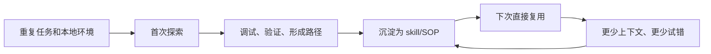
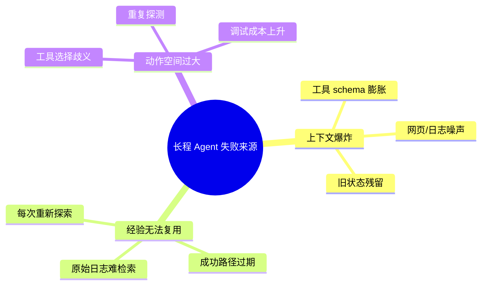
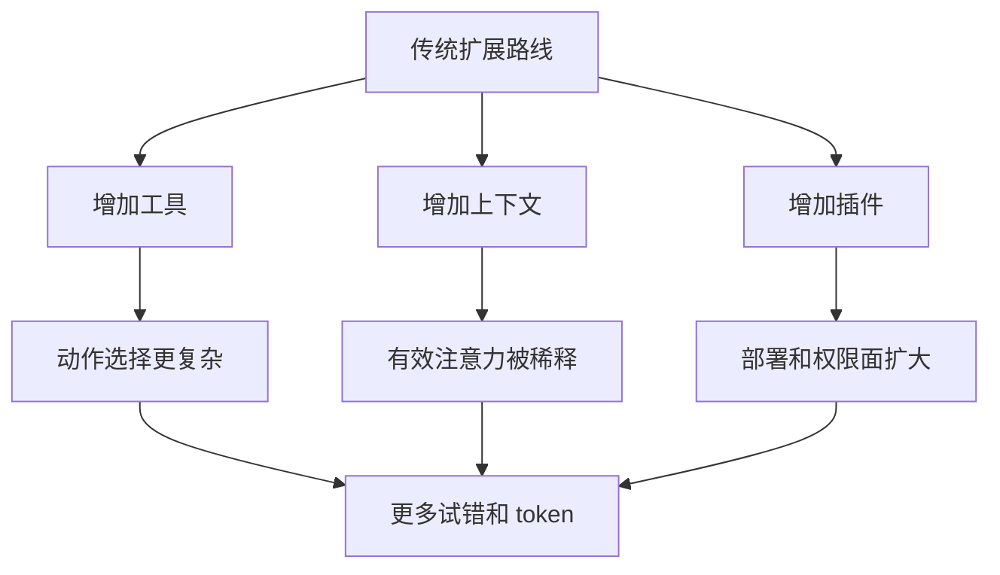
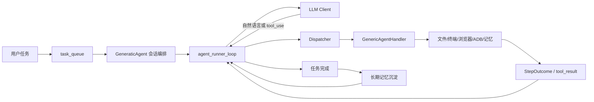
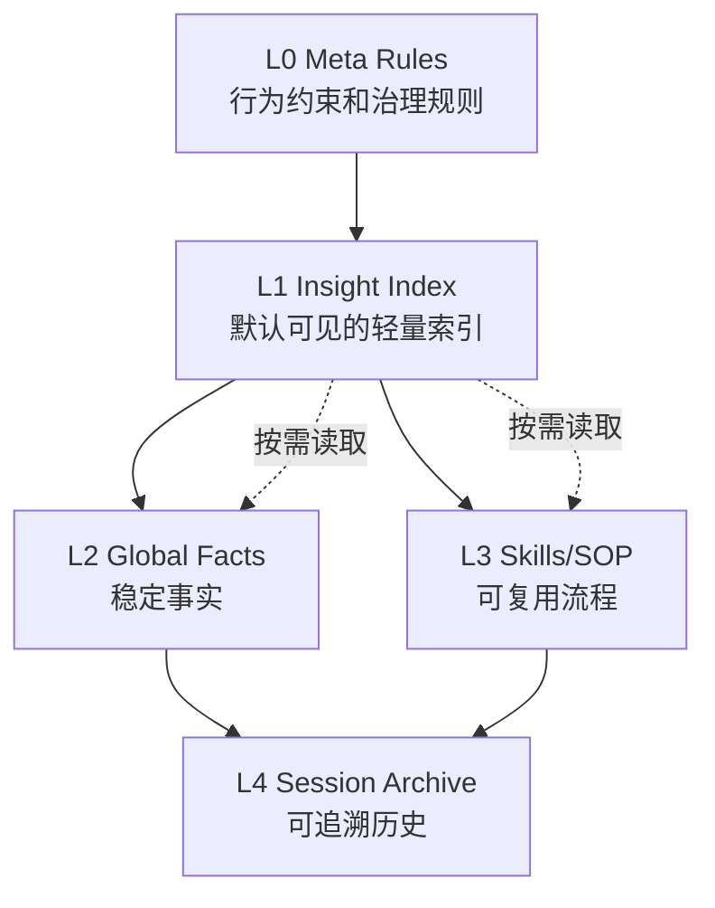
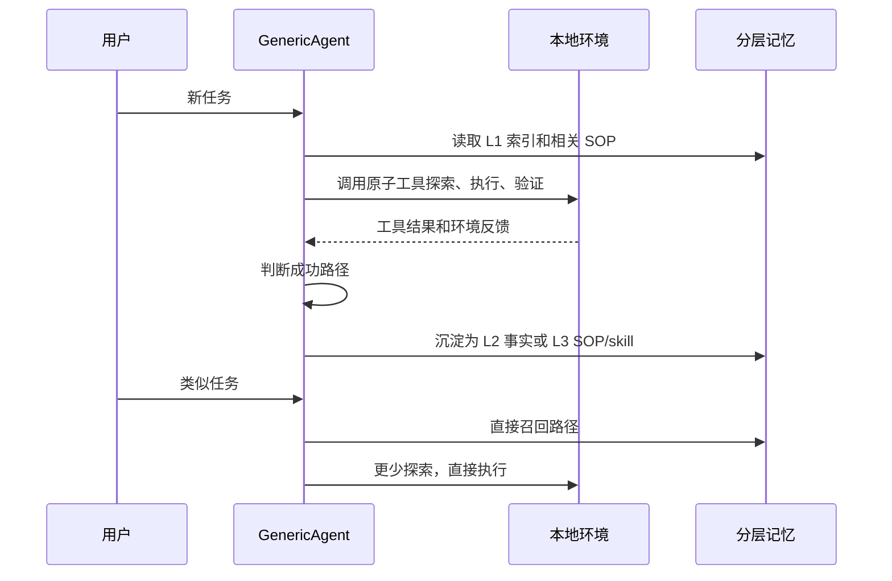
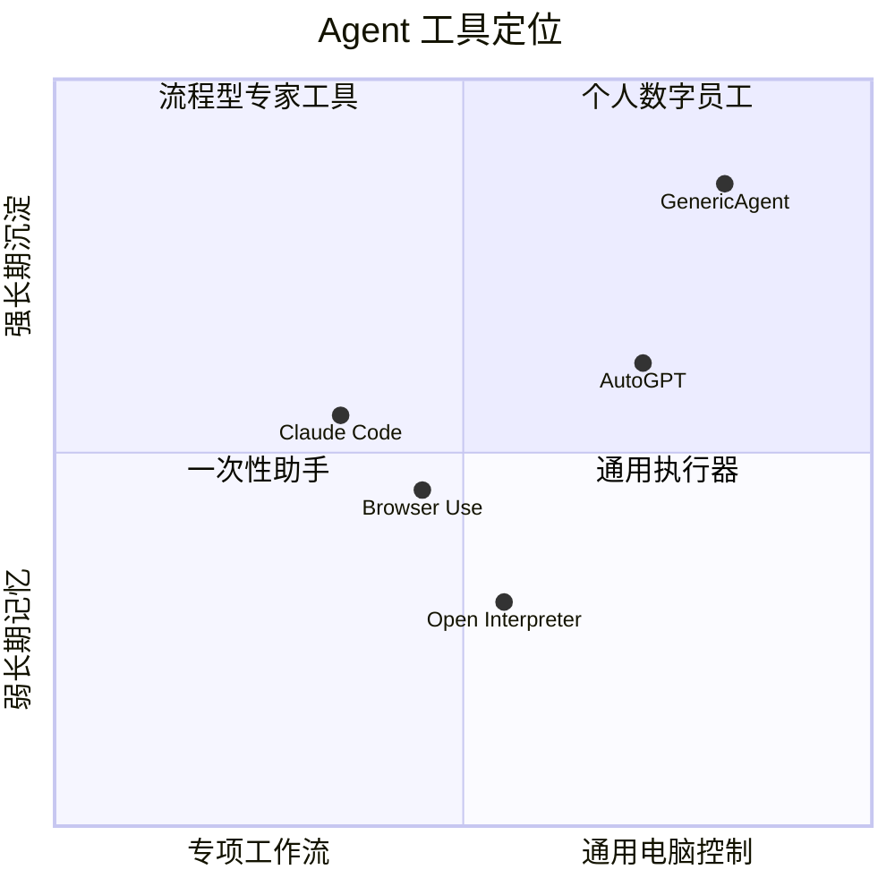
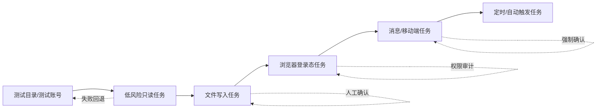

## 分享一个开源项目 GenericAgent: 和 Hermes 一样, 用“经验复利”解决“长上下文”问题
  
### 作者  
digoal  
  
### 日期  
2026-04-23  
  
### 标签  
AI , Skill , SOP , 经验密度 , 复利 , Hermes , GenericAgent , 个人助理
  
----  
  
## 背景  
> 仓库：<https://github.com/lsdefine/GenericAgent>  
> 证据日期：2026-04-23  
> 适读对象：Agent 开发者、自动化工程师、技术负责人、个人效率工具重度用户

## 开篇判断

我的观点：GenericAgent 的真正价值，不是“又一个能操作电脑的 Agent”，而是把个人 Agent 的成长路径从“每次重新探索”改成“把成功轨迹沉淀为可复用 skill/SOP”。如果你的任务具有重复性、本地环境依赖强、需要浏览器/终端/文件/移动端组合操作，它比只追求更大上下文窗口的 Agent 路线更值得研究。

成立前提：

- 你愿意让 Agent 在本地环境中执行真实操作，并能接受相应的权限、误操作和安全治理成本。
- 你的任务不是一次性问答，而是会反复出现、可被沉淀为流程。
- 你更关心长期 token 成本、个人工作流适配和可审计代码，而不是开箱即用的企业级权限、审计、隔离和托管能力。

支撑证据：

- README 将 GenericAgent 定义为“极简、可自我进化的自主 Agent 框架”，核心卖点是约 3K 行核心代码、9 个原子工具、约 100 行 Agent Loop、分层记忆和自动沉淀 skill。
- arXiv 技术报告认为长程 Agent 的核心瓶颈不是名义上下文长度，而是有限上下文中的“决策相关信息密度”；报告称 GA 通过最小工具集、分层按需记忆、自演化和上下文压缩提升效率。
- DeepWiki 架构分析显示项目核心围绕 `agentmain.py` 的会话编排、`agent_loop.py` 的 Sense-Think-Act 循环、`ga.py` 的本地执行 handler、`assets/tools_schema.json` 的工具 schema、L0-L4 分层记忆展开。

如果前提崩塌：如果你处理的是强合规、多租户、集中审计的企业 Agent 平台，GenericAgent 更适合作为架构思想和个人自动化原型参考，而不是直接替代成熟的权限网关、沙箱、审计系统或托管 Agent 平台。



## 背景：Agent 的瓶颈从“模型会不会”转向“系统怎么管上下文”

Claude Code、Codex、AutoGPT、Browser Use、Open Interpreter 等工具已经说明一件事：LLM 不再只是文本生成器，它开始通过终端、文件系统、浏览器和外部工具执行任务。问题随之改变：模型能力很强，但多轮执行会把工具说明、历史消息、网页 DOM、错误日志、临时推理和旧状态不断塞进上下文，真正关键的信息反而被淹没。

GenericAgent 的 thesis 很明确：不要把大上下文当万能解法，要最大化上下文信息密度。它选择的系统路线是：

- 工具少：固定 9 个原子工具，减少工具 schema 和动作选择空间。
- 记忆分层：默认只放轻量索引，深层事实和 SOP 按需读取。
- 经验沉淀：把验证过的执行路径变成可复用 skill/SOP，而不是保存原始长日志。
- 主动压缩：对工具输出、历史消息和工作记忆做截断、压缩和锚定。



## 场景：它解决的是“个人数字员工”的重复工作流

典型用户不是只想让 Agent 写一段代码的人，而是希望电脑上有一个长期运行、能积累经验的本地助手：

- 开发者：让 Agent 读项目、写脚本、跑命令、修复重复性问题。
- 运营/内容人员：自动浏览网页、整理资料、生成报告、发布或分发内容。
- 个人自动化用户：通过真实浏览器和移动端 ADB 处理网页、App、消息平台和本地文件。
- 研究/数据工作者：反复执行下载数据、分析、生成文档、复现实验等流程。

痛点不是“LLM 不知道怎么做”，而是第一次做完后，第二次还要消耗大量上下文重新摸索。

## 传统方案的问题

我的观点：传统 Agent 方案常见的误区是用“更多工具、更长上下文、更多插件”对抗复杂任务，但这会让 Agent 的决策界面更重。

成立前提：任务需要多轮执行，且执行过程中产生大量环境反馈。

支撑证据：GenericAgent 技术报告把上下文爆炸和经验无法跨任务复用列为两大挑战，并在工具层对比中指出 Claude Code、OpenClaw 等系统暴露更多源代码级工具/工具工厂，而 GA 只保留 9 个原子工具；报告的长程任务实验称 GA 在 5 个复杂任务上与 Claude Code 同为 100% 成功率，但 accounted tokens 为 188,829，低于 Claude Code 的 537,413 和 OpenClaw 的 633,101。该数据来自作者实验，未在本文复现。

如果前提崩塌：如果你的任务是一次性、低风险、短上下文的代码编辑或问答，那么 Claude Code、Codex、IDE Copilot、Open Interpreter 这类工具可能更直接，GenericAgent 的记忆体系不一定带来足够收益。



## GenericAgent 怎么解

GenericAgent 的产品方案可以概括为：用极少的系统级原子工具给 LLM 接管本地环境的能力，再用分层记忆和自演化机制把“已经验证过的路径”变成下次可直接调用的 skill。

README 中列出的核心能力包括：

- 真实浏览器控制，保留登录态。
- 终端、文件系统、键鼠、屏幕视觉和 Android ADB 等本地控制能力。
- 支持 Claude、Gemini、Kimi、MiniMax 等后端。
- 默认 Streamlit 桌面 UI，并提供 Telegram、微信、QQ、飞书、企业微信、钉钉等前端入口。
- 常用聊天命令如 `/new`、`/continue`、`/continue N`。

项目 `assets/tools_schema.json` 当前定义的 9 个原子工具是：

| 类别 | 工具 | 作用 |
|---|---|---|
| 代码执行 | `code_run` | 执行 Python 或 PowerShell |
| 文件 | `file_read` | 按路径、行号或关键字读文件 |
| 文件 | `file_patch` | 基于唯一旧内容做精确替换 |
| 文件 | `file_write` | 大块写入、覆盖、追加或前置 |
| Web | `web_scan` | 获取简化页面内容和 tab 列表 |
| Web | `web_execute_js` | 执行 JS 并观察页面变化 |
| 记忆 | `update_working_checkpoint` | 更新短期工作检查点 |
| 记忆 | `start_long_term_update` | 触发长期记忆沉淀 |
| 协作 | `ask_user` | 在需要决策时询问用户 |

## 架构原理

DeepWiki 对 `lsdefine/GenericAgent` 的架构分析把系统拆成几条主线：

- `GeneraticAgent` 位于 `agentmain.py`，负责 LLM session 初始化、任务队列、线程和对话历史。
- `agent_runner_loop` 位于 `agent_loop.py`，实现 Sense-Think-Act 循环，持续处理模型输出和工具调用直到完成或达到最大轮次。
- `BaseHandler` 定义工具执行接口，`GenericAgentHandler` 作为具体 handler 管理文件、shell、浏览器等本地环境能力。
- 工具由 `assets/tools_schema.json` 声明，再由 dispatcher 路由到对应 executor。
- 记忆分为 L0/L1/L2/L3/L4：元规则、索引、长期事实、任务 SOP/skills、会话归档。



### 分层记忆

我的观点：GenericAgent 的记忆设计不是“把更多内容塞给模型”，而是“让模型知道知识在哪里，需要时再读”。

成立前提：Agent 有可靠的文件读写和索引机制，且沉淀内容经过验证。

支撑证据：技术报告将 L1 作为默认可见索引层，L2 存稳定事实，L3 存 SOP，L4 存会话归档；报告还强调只有验证过、可复用的信息才应进入长期记忆。DeepWiki 也将 `global_mem_insight.txt`、`global_mem.txt`、`/memory/` 和 session archive 对应到不同层级。

如果前提崩塌：如果长期记忆没有清洗和验证，系统会积累过期 SOP、错误假设和用户偏好污染；此时应退回无记忆或人工审核后的知识库/RAG，而不是放任 Agent 自写记忆。



### 自演化循环

GenericAgent 的“自演化”不是修改基础模型权重，而是修改模型运行时的信息环境：成功执行后，把路径压缩成 SOP、脚本或 skill，让下次任务从更好的起点开始。



## 效果对比：哪些指标可以相信，哪些需要谨慎

技术报告给出了多组实验。本文不复现实验，因此只能把它们作为“作者报告的实验结果”，不能当作独立第三方基准。

| 维度 | 作者报告结果 | 解释边界 |
|---|---:|---|
| SOP-Bench | GA + Claude Sonnet 4.6 达到 100% accuracy，总 token 约 2.08M | 与 Claude Code 比，GA 准确率更高但 token 不一定最低 |
| Lifelong AgentBench | GA 100% accuracy，输入 token 222k；Claude Code 75%，OpenClaw 70% | 体现跨任务依赖和记忆复用优势，但需看任务集构成 |
| RealFin-benchmark | GA 65%，Claude Code 60/55%，Codex 60%，OpenClaw 35% | 金融任务集可能有领域偏置，生产金融决策不能直接依赖 |
| 5 个长程复杂任务 | GA 与 Claude Code 都 100% 成功，GA token 188,829，Claude Code 537,413 | 任务数量较少，更适合看机制，不适合做普适胜负结论 |
| WebCanvas/BrowseComp-ZH/自定义 Web 任务 | GA 分数高于 OpenClaw，平均 token 更低 | 对动态网页有效，但真实网站反爬、登录、权限会改变结果 |
| 重复运行自演化 | 报告称部分任务 token 可随重复执行下降，LangChain GitHub research 9 轮下降 89.6% | 强依赖任务可重复性和记忆质量 |

我的观点：这些数据支持一个方向性结论，即“高密度上下文 + 可复用 SOP”确实可能降低长程任务成本；但还不足以证明 GenericAgent 在所有 Agent 场景都优于 Claude Code、Codex、Browser Use 或 AutoGPT。

如果前提崩塌：当任务不可重复、环境变化频繁、验证信号弱或安全边界严格时，自演化带来的收益会下降，甚至可能把错误路径固化为更难发现的问题。

## 竞品比较

| 项目/产品 | 更适合的场景 | GenericAgent 的差异 | 风险/代价 |
|---|---|---|---|
| Claude Code | 专业代码库理解、改代码、跑测试、提交代码 | GenericAgent 更偏通用本地自动化和长期 skill 记忆；Claude Code 更成熟地服务软件工程工作流 | Claude Code 是商业产品，权限、订阅和模型生态绑定更强 |
| Browser Use | 浏览器自动化、网页任务、Playwright 生态和云浏览器 | GenericAgent 不只做浏览器，还组合文件、终端、记忆和 ADB；Browser Use 的浏览器专项能力和托管云更强 | GenericAgent 的真实浏览器保留登录态，权限风险更直接 |
| Open Interpreter | 自然语言运行本地代码、数据处理、脚本自动化 | GenericAgent 把代码执行放进更大的 Agent loop 和记忆体系 | Open Interpreter 更简单直接，GenericAgent 更重视长期沉淀 |
| AutoGPT | 构建、部署、管理连续 AI agents 的平台化路线 | GenericAgent 更极简、更个人化，更强调从本地 3K 行 seed 生长 skill tree | AutoGPT 平台化程度更高，GenericAgent 需要用户承担更多本地治理 |
| OpenClaw | 多工具、多 Agent/插件式自动化 | GenericAgent 明确反向选择“少工具 + 可组合” | 少工具要求模型能稳定组合工具；弱模型可能表现下降 |



## 典型使用场景

| 场景 | 症状 | 为什么 GenericAgent 有用 | 命令/配置线索 | 注意事项 |
|---|---|---|---|---|
| 个人网页任务自动化 | 每次都要登录、点击、复制、整理 | 真实浏览器控制可复用登录态，成功流程可沉淀 skill | README 提到执行 web setup SOP 解锁 web 工具 | 登录态意味着权限很高，必须从低风险任务开始 |
| 本地脚本和文件处理 | 数据下载、清洗、报告生成反复发生 | `code_run` + 文件工具 + L3 SOP 可以把流程固化 | `python3 agentmain.py` 后让 Agent 读代码装依赖 | 脚本执行要设定目录和输出边界 |
| 移动端 App 辅助 | 支付宝、微信、外卖等 App 操作无法只靠 API | README 展示 ADB 驱动移动端任务案例 | 配置 ADB 环境，连接 Android 设备 | 金融、支付、消息群发必须人工确认 |
| 多平台机器人入口 | 希望手机上发消息驱动电脑 Agent | 项目提供微信、QQ、飞书、企业微信、钉钉、Telegram 前端 | `frontends/*.py` 和 `mykey.py` 中配置 token/allowed users | 必须限制 allowed users，避免远程滥用 |
| 长期研究/资料整理 | 一次调研路径很长，下次又重来 | 自演化把检索路径和检查点沉淀为 SOP | 使用 `/continue` 恢复会话快照 | 网页和资料源会变，SOP 要定期验证 |

## 最佳实践

我的观点：GenericAgent 应该按“权限逐级开放”的方式部署，而不是一上来就给完整电脑控制权。

成立前提：Agent 能执行文件、终端、浏览器和消息平台动作，这些动作都有现实副作用。

支撑证据：README 和 GETTING_STARTED 明确引导用户解锁浏览器、OCR、视觉、ADB、聊天机器人等能力；这意味着系统能力覆盖面很广，安全边界需要用户自己治理。

如果前提崩塌：如果无法建立权限分层和人工确认流程，应只在隔离测试机或临时账户中运行，不应接入个人主力账号、支付账户、生产系统或敏感文件目录。

建议：

- 先在独立目录、测试浏览器 profile、测试账号上运行。
- 第一次执行高风险任务时要求 `ask_user` 人工确认。
- `mykey.py` 不要提交到 Git，也不要把多平台 bot 配成开放访问。
- 长期记忆要定期审计，尤其是涉及凭据、路径、业务规则、联系人和交易动作的 SOP。
- 对会写文件、发消息、下单、转账、删除数据的 skill 增加显式前置条件。
- 对重复任务保留验证命令，例如文件是否生成、页面是否成功、消息是否到达草稿而不是直接发送。



## 动手上手

以下命令来自 README 和 GETTING_STARTED。它们是入门路径，不代表生产部署方案。

### 方式一：README 标准安装

```bash
git clone https://github.com/lsdefine/GenericAgent.git
cd GenericAgent
pip install streamlit pywebview
cp mykey_template.py mykey.py
# 编辑 mykey.py，填入 LLM API Key
python launch.pyw
```

### 方式二：GETTING_STARTED 的命令行模式

```bash
cd 你的解压路径
python3 agentmain.py
```

Windows 如果 `python3` 不识别，可按 GETTING_STARTED 的说明改用：

```bash
python agentmain.py
```

### 配置 API Key 的关键规则

`mykey.py` 的变量名会影响接口格式：

| 变量名包含 | 接口类型 |
|---|---|
| `oai` | OpenAI 兼容 |
| `claude` 且不含 `native` | Claude 兼容 |
| `native` + `claude` | Claude 标准工具调用 |
| `native` + `oai` | OpenAI 标准工具调用 |

MiniMax 示例使用 `oai_minimax_config`，因为它走 OpenAI 兼容格式。

### 首次验证

启动后先做低风险验证：

```text
帮我在桌面创建一个 hello.txt，内容是 Hello World
```

然后再让 Agent 自己检查依赖：

```text
请查看你的代码，安装所有用得上的 python 依赖
```

### 回滚和清理

README 没有提供统一卸载脚本。保守清理方式是：

- 删除或隔离 `mykey.py`。
- 停止正在运行的前端进程。
- 删除测试目录中由 Agent 创建的文件。
- 对浏览器、ADB、聊天平台 bot、cron/scheduler 等额外解锁能力逐项撤销权限。

## 风险、边界和失败条件

1. 真实电脑控制不是玩具  
   GenericAgent 的优势来自真实环境执行，风险也来自真实环境执行。浏览器登录态、文件系统、移动端 ADB、消息机器人都可能造成不可逆操作。

2. 自演化可能沉淀错误经验  
   如果验证信号弱，Agent 可能把“碰巧成功”写成 SOP。长期运行后，错误 SOP 的危害会比一次性错误更大。

3. 论文实验尚需独立复现  
   arXiv 报告提供了丰富实验数据，但本文没有复现。涉及 token 降幅、成功率、竞品差距的结论，应视为作者报告结果。

4. 企业级治理能力不是 README 的核心  
   项目强调极简、自托管和个人 skill tree，不等于已经具备多租户隔离、审计日志、审批流、密钥托管、策略引擎和合规报表。

5. 弱模型可能拉低“少工具”路线  
   9 个原子工具要求模型能稳定规划和组合动作。对于工具调用能力弱、长程规划差的模型，更多专用工具反而可能更稳。

6. 网页和 App 自动化天然脆弱  
   DOM、登录、验证码、风控、App UI 变化都会让 SOP 过期。最佳实践是把关键操作拆成可验证、可回滚、需要确认的步骤。

## 结论

GenericAgent 最值得关注的不是“3K 行代码”这个数字本身，而是它押注了一条清晰路线：Agent 的长期能力来自高密度上下文、少而可组合的工具、按需读取的记忆，以及对成功执行路径的持续沉淀。

采用建议：

- 个人自动化、可重复本地流程、研究型 Agent 框架：值得试用。
- 需要真实浏览器、终端、文件、ADB、消息入口组合的个人数字员工：值得重点研究。
- 企业生产环境、高风险账户、强合规流程：先做隔离 PoC，把权限、审计、确认、回滚补齐后再谈上线。
- 一次性代码编辑或短任务：Claude Code、Codex、Open Interpreter、Browser Use 等专项工具可能更直接。

最终判断仍然是条件式的：如果你的任务会重复，环境会长期存在，成功经验能被验证和复用，GenericAgent 的“自演化 skill tree”就有真实价值；如果任务不可重复、权限不可控、验证不可自动化，那么它应被当作研究项目和个人实验框架，而不是无人值守的生产执行器。

## 证据与来源

- GenericAgent GitHub README：<https://github.com/lsdefine/GenericAgent>
- GenericAgent raw README：<https://raw.githubusercontent.com/lsdefine/GenericAgent/main/README.md>
- GenericAgent GETTING_STARTED：<https://raw.githubusercontent.com/lsdefine/GenericAgent/main/GETTING_STARTED.md>
- GenericAgent tools schema：<https://raw.githubusercontent.com/lsdefine/GenericAgent/main/assets/tools_schema.json>
- GitHub REST API 仓库状态：<https://api.github.com/repos/lsdefine/GenericAgent>。2026-04-23 查询时显示 Python 项目、MIT License、约 5,961 stars、649 forks、59 open issues、默认分支 `main`、最新 push 为 2026-04-22。
- arXiv 技术报告：<https://arxiv.org/abs/2604.17091>，提交日期 2026-04-18，标题为 “GenericAgent: A Token-Efficient Self-Evolving LLM Agent via Contextual Information Density Maximization (V1.0)”。
- DeepWiki 架构查询：通过 `npx --yes @seflless/deepwiki toc lsdefine/GenericAgent` 与 `ask` 查询获得；DeepWiki 返回的相关查询链接为 <https://deepwiki.com/search/analyze-the-repository-archite_739106fc-27e8-467b-b463-76e8b0fd006c>。
- Claude Code 官方文档：<https://docs.anthropic.com/en/docs/claude-code/overview>
- Claude Code 产品页：<https://www.anthropic.com/claude-code>
- Browser Use GitHub：<https://github.com/browser-use/browser-use>
- Open Interpreter GitHub：<https://github.com/openinterpreter/open-interpreter>
- AutoGPT GitHub：<https://github.com/Significant-Gravitas/AutoGPT>

## 校验记录

- 来源顺序已遵守：先 README，再 DeepWiki，再 web/官方资料，再成文。
- 架构 claim 使用 README、tools schema、DeepWiki 和 arXiv 报告交叉支撑。
- 实验数据均标注为“作者报告结果”，未写成本文独立复现实验。
- 竞品比较优先使用官方文档或 GitHub 页面，并避免声称 GenericAgent 全面优于竞品。
- 安装和配置命令来自 README/GETTING_STARTED。
- Mermaid 图均使用基础 `flowchart`、`sequenceDiagram`、`mindmap`、`quadrantChart` 语法。
- 未解决证据缺口：未本地克隆并运行 GenericAgent；未复现实验 benchmark；DeepWiki 通过 CLI 而非直接 MCP namespace 获取。

  
#### [PostgreSQL 解决方案集合](../201706/20170601_02.md "40cff096e9ed7122c512b35d8561d9c8")
  
  
#### [德哥 / digoal's Github - 公益是一辈子的事.](https://github.com/digoal/blog/blob/master/README.md "22709685feb7cab07d30f30387f0a9ae")
  
  
#### [About 德哥](https://github.com/digoal/blog/blob/master/me/readme.md "a37735981e7704886ffd590565582dd0")
  
  

  
