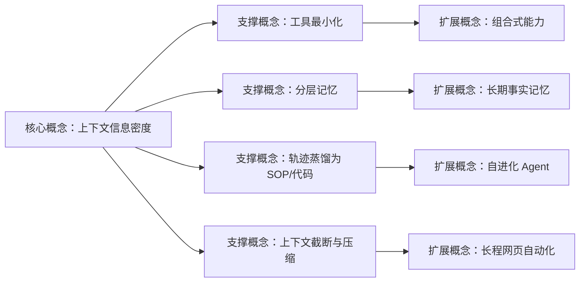
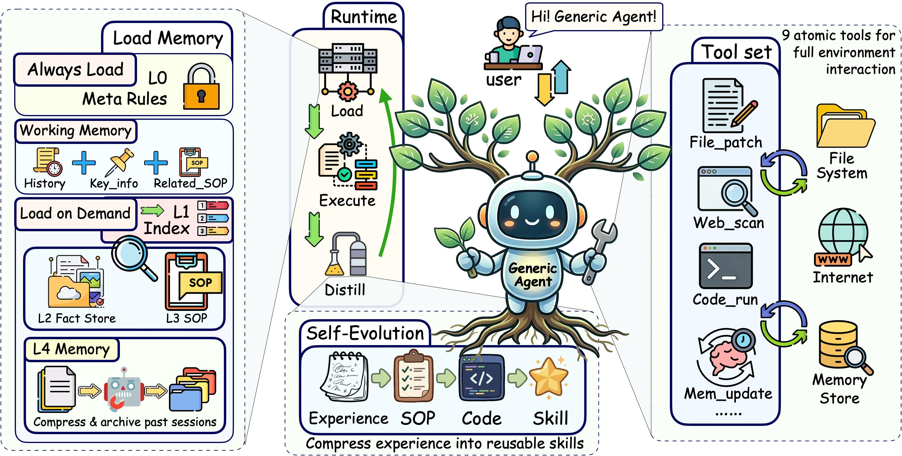
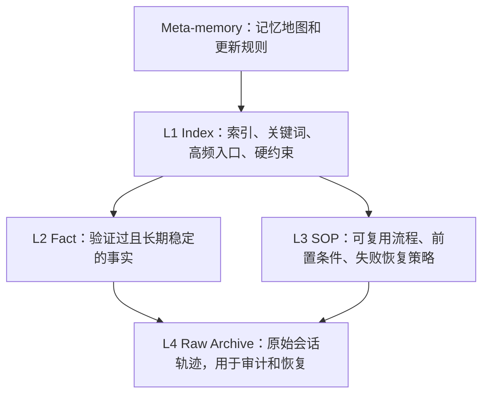
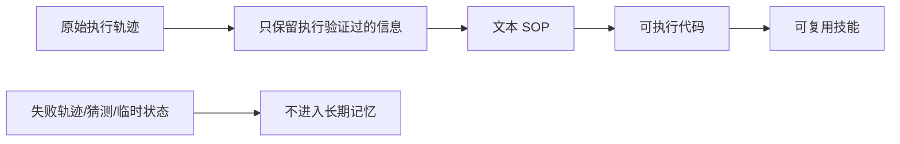
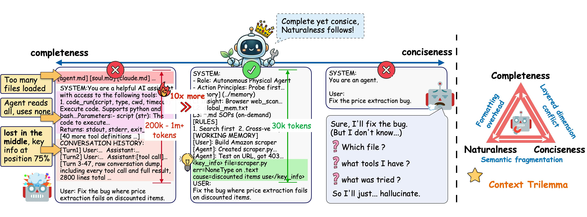

## AI论文解读 | GenericAgent：一个把“上下文含金量”当核心指标的自进化 LLM Agent
  
### 作者  
digoal  
  
### 日期  
2026-04-23  
  
### 标签  
AI , 论文解读 , SOP , SKILL , 重复任务 , 上下文稀疏 , 上下文密度 , 生成效果 , Hermes , GenericAgent , 个人助手  
  
----  
  
## 背景  
思考: 未来数据库的发展, 肯定离不开AI助理的技能沉淀、SOP管理、垃圾记忆遗忘等相关.  
  
## 论文元数据

| 项目 | 内容 |
|---|---|
| 论文 | GenericAgent: A Token-Efficient Self-Evolving LLM Agent via Contextual Information Density Maximization (V1.0) |
| 机构/团队 | Advantage AI Agent Lab (A3 Lab)，成员来自深圳 Aquaintelling Technology 与复旦大学 |
| 版本 | arXiv:2604.17091v1，2026-04-18 |
| 项目地址 | https://github.com/lsdefine/GenericAgent |
| 主要作者信息 | 论文第 8 节给出作者贡献：Jiaqing Liang 与 Yanghua Xiao 领导项目；Jinyi Han 负责论文设计与写作协调；其他成员分别参与系统实现、实验、图表和章节撰写 |
| 证据来源 | PDF 共 47 页；正文第 1-27 页，作者贡献第 31 页起，附录第 32 页起 |

## 1. 论文定位

这篇论文讨论的是长任务 LLM Agent 的核心瓶颈：不是“模型上下文窗口不够长”，而是“真正有助于下一步决策的信息太稀”。当 Agent 连续操作终端、文件、浏览器和外部工具时，工具说明、历史轨迹、网页 DOM、错误日志、记忆条目会不断挤进上下文，结果是模型读了很多 token，却更容易漏掉关键约束。

论文的学术价值在于把 Agent 系统设计统一到一个原则上：**最大化上下文信息密度**，并围绕这个原则设计工具、记忆、自进化和压缩机制。工业价值在于它试图回答一个很实际的问题：怎样让自动化 Agent 在长流程、重复任务、网页任务中更便宜、更稳定，并且越用越熟。

一个直观类比：普通 Agent 像把整间办公室的文件都堆到会议桌上再开会；GenericAgent 像只把会议议题、索引和必要证据放上桌，其他档案放在柜子里，需要时按索引取。

## 2. 前置知识地图

| 概念 | 是什么 | 类比 | 例子 |
|---|---|---|---|
| 上下文信息密度 | 有限上下文里，真正跟当前决策相关的信息占比 | 开会时桌面只放议题、证据和决策清单 | 不把完整网页 HTML 塞给模型，而是提取可见、主要、可操作元素 |
| 完整性 | 当前决策需要的信息必须出现 | 做手术前必须有关键检查结果 | 修 bug 时至少要知道文件、错误、复现步骤 |
| 简洁性 | 无关、重复、过期信息应被排除 | 简报不能把全部原始日志贴进去 | 历史工具输出只保留头尾或摘要 |
| 自然性 | 压缩后的表达仍要让模型好理解 | 速记不能压到没人看得懂 | 用结构化摘要，而不是难解析的乱码编码 |
| 分层记忆 | 默认只放索引，细节按需读取 | 图书馆目录和书架分离 | L1 存索引，L2 存事实，L3 存 SOP，L4 存原始轨迹 |
| 自进化 | 把验证过的成功轨迹沉淀为 SOP、代码、技能 | 新员工把重复流程写成操作手册，再写成脚本 | 第一次研究 GitHub 项目很慢，后续复用 SOP 和脚本显著降 token |

## 3. 论文精读：5W1H

### Why：为什么做这个研究？

论文第 1 节指出长程 Agent 面临两个基础问题。

第一是 **context explosion**：工具定义、检索记忆、中间观察、环境反馈会越积越多，导致关键证据被挤到上下文中间甚至被排除。论文引用长上下文研究，强调位置偏置、无关信息干扰、有效上下文长度小于标称窗口等问题。

第二是 **经验难以复用**：任务中的有效操作模式、工具行为、用户偏好往往要通过试错获得。如果这些经验不能被验证、压缩并长期保留，Agent 每次遇到类似任务都要重新探索，token 成本线性增长，能力却不增长。

### What：论文提出了什么？

论文提出 GenericAgent (GA)，一个通用、自进化的 LLM Agent 系统。核心主张是：

> 长程 Agent 的性能主要取决于有限上下文预算中保留了多少“决策相关信息”，而不是上下文窗口本身有多长。

GA 用四个机制实现这个原则：

1. **最小原子工具集**：减少工具 schema 和选择空间。
2. **分层按需记忆**：默认只加载很小的索引层，细节需要时再读。
3. **自进化管线**：把验证过的历史轨迹压缩成 SOP、代码和技能。
4. **上下文截断与压缩**：长执行中主动裁剪工具输出、压缩旧消息、保留工作记忆锚点。

### How：具体怎么实现？

#### 3.1 总体架构

论文 Figure 2 描述了 GA 的总体循环：用户任务进入系统，Agent 从记忆中取相关信息，调用工具观察和行动，完成后把有效经验蒸馏进记忆。

这个图有三个重点：

| 模块 | 论文设计 | 实际含义 |
|---|---|---|
| Tool set | 9 个原子工具覆盖文件、代码、网页、记忆和用户交互 | 不靠大量专用工具堆能力，而靠小工具组合 |
| Memory | Always Load、Working Memory、Load on Demand、L4 archive | 默认上下文很轻，历史知识不直接塞进 prompt |
| Self-Evolution | Experience → SOP → Code → Skill | 成功经验从自然语言流程逐步变成可执行资产 |

#### 3.2 工具最小化

第 2.3.1 节列出 GA 的 9 个原子工具，分为五类：

| 类别 | 工具 | 作用 |
|---|---|---|
| 文件操作 | `file_read`, `file_patch`, `file_write` | 读取、精确修改、写入文件 |
| 代码执行 | `code_run` | 在受控运行时执行 Python 或 Bash |
| 网页交互 | `web_scan`, `web_execute_js` | 低成本扫描页面、执行精确浏览器动作 |
| 记忆管理 | `update_working_checkpoint`, `start_long_term_update` | 更新工作记忆、触发长期记忆蒸馏 |
| 人类介入 | `ask_user` | 需要用户决策时询问 |

论文的关键判断是：理论上 Agent 可以只靠 `code_run` 复制其他工具能力，但那会迫使模型每次从零写脚本。额外的 8 个工具不是扩大能力边界，而是降低决策成本和操作成本。

#### 3.3 分层记忆

第 2.3.2 节把记忆拆成四层：

重点不是“能存多少”，而是“默认放多少”。GA 默认只注入 meta-memory 和 L1 索引；L2/L3 通过工具按需读取；L4 主要用于追溯，不频繁进入上下文。

这解决了一个常见矛盾：如果把所有记忆都放进 prompt，Agent 会记得多但思考乱；如果不放记忆，Agent 每次都像新手。GA 的方案是让 LLM 先看到“知识存在的索引”，再决定是否花工具调用去读细节。

#### 3.4 自进化

第 2.3.3 节强调，GA 进化的是“策略和知识”，不是底层工具。工具层固定，任务能力存在 SOP 文件和可复用脚本里。

这里最重要的规则是论文提出的 **No Execution, No Memory**：没有经过工具执行验证的信息，不应被提升为长期记忆。它的目的不是让记忆更漂亮，而是防止错误经验污染未来任务。

#### 3.5 上下文截断与压缩

第 2.3.4 节把上下文管理做成四阶段：

| 阶段 | 做什么 | 目的 |
|---|---|---|
| 工具输出截断 | 超过阈值时保留头尾，中间省略 | 控制单条工具结果体积 |
| 标签级压缩 | 压缩旧的 reasoning/tool/history 标签内容 | 清掉重复旧信息 |
| 消息淘汰 | 超预算时按 FIFO 删除旧消息到 60% 预算以下 | 防止历史线性增长 |
| 工作记忆锚点 | 每次工具调用后注入最近摘要、轮次、关键状态 | 保留任务连续性 |

论文 Table 1 给出部分阈值：`code_run` 约 10,000 字符，`web_execute_js` 约 8,000 字符，`web_scan(text_only)` 约 10,000 字符，`web_scan(HTML)` DOM 预算约 35,000 字符，`file_read` 总量约 20,000 字符。

Figure 1 形象地说明了论文的中心权衡：只追求完整会变臃肿，只追求简洁会漏信息，GA 要找的是“完整且简洁，自然性跟随”的操作点。

### So What：实验结果怎么样？

#### 4.1 任务完成率与 token 效率

论文 Table 2 比较 SOP-Bench、Lifelong AgentBench 和 RealFin-benchmark。

| Benchmark | GA 结果 | 对比信息 | 解读 |
|---|---:|---|---|
| SOP-Bench | Claude Sonnet 4.6 下 100%，2.08M total tokens | OpenClaw 100%，2.64M；Claude Code 85%，1.25M | GA 兼顾成功率和较低 token；Claude Code token 少但成功率低 |
| Lifelong AgentBench | 100%，241k total tokens | OpenClaw 70%，1.45M；Claude Code 75%，814k | GA 同时取得更高准确率和更低成本 |
| RealFin-benchmark | 65%，114k total tokens | Claude Code Opus 60%，307k；Codex GPT-5.4 60%，892k；OpenClaw 35%，251k | 金融真实任务中 GA 准确率最高、token 最低 |

论文自己的解释是：低 token 不只是省钱，也反映上下文管理质量更高。无效上下文越多，模型越容易注意力稀释和状态混乱。

#### 4.2 工具使用效率

论文 Table 4 用 5 个长程复杂任务比较 GA、Claude Code、OpenClaw，任务包括 PDF/PPT 生成、SQL copilot、实验报告、采购决策、论文复现可行性分析。

| Agent | 成功率 | Total Tokens | 平均请求数 | 平均工具调用 |
|---|---:|---:|---:|---:|
| Claude Code | 100% | 537,413 | 32.6 | 22.6 |
| GA | 100% | 188,829 | 11.0 | 12.8 |
| OpenClaw | 80% | 633,101 | 15.0 | 16.6 |

GA 的成功率与 Claude Code 持平，但 token 只有 Claude Code 的 35.1%、OpenClaw 的 29.8%。这支持论文的工具最小化观点：只要原子工具可组合，少工具不等于弱能力，反而能降低提示词和决策空间负担。

#### 4.3 记忆系统有效性

论文 Table 5 在 SOP-Bench dangerous_goods 上做记忆消融。

| 配置 | 记忆大小 | TSR |
|---|---:|---:|
| No-Memory | 0 token | 13.87% |
| Full-Memory | 575 tokens | 52.44% |
| Redundant-Memory | 288 tokens | 66.48% |
| Condensed memory | 165 tokens | 66.48% |

最值得注意的是：Condensed memory 和 Redundant-Memory 成功率一样，但前者更短。这说明“高密度规则”比“完整解释材料”更适合放进 Agent 决策上下文。

论文 Table 6 在 LoCoMo 长期事实记忆任务上比较 Mem0、A-MEM、OpenClaw 和 GA。GA 在 Multi-Hop、Temporal、Open-Domain、Single-Hop 四类任务的 F1 和 BLEU-1 都最高。例如 Multi-Hop F1 为 43.33，Temporal F1 为 52.23，Single-Hop F1 为 45.69。

论文 Table 7 显示安装 20 个技能并密集使用后，最小输入 “Hello” 的完整 prompt 长度：Claude Code 22,821 tokens，Codex 23,932，OpenClaw 43,321，GA 2,298。这是分层按需记忆最直接的证据。

#### 4.4 自进化能力

论文 Table 8 记录了 LangChain GitHub research 任务的 9 轮演化：

| 阶段 | 代表轮次 | 变化 |
|---|---|---|
| 初始运行 | #1 | 7m30s，32 次 LLM call，222,203 total tokens |
| SOP 优化 | #2-#5 | token 从 66k 逐步降到 35k 左右 |
| Codified SOP | #6-#9 | 稳定在约 23k tokens，5-6 次 LLM call |

第 9 轮相对第 1 轮：运行时间从 7m30s 降到 1m38s，LLM 调用从 32 次降到 5 次，总 token 从 222,203 降到 23,010，降幅 89.6%。论文认为主要收益不是单次回答更短，而是消除了重复理解、推理、生成的循环。

#### 4.5 网页浏览能力

论文 Table 9 比较 GA 和 OpenClaw，二者都使用 Claude Opus 4.6。

| Benchmark | 任务数 | GA 分数 | OpenClaw 分数 | GA 平均 tokens | OpenClaw 平均 tokens |
|---|---:|---:|---:|---:|---:|
| WebCanvas | 12 | 0.834 | 0.72 | 0.18M | 0.71M |
| BrowseComp-ZH | 10 | 0.60 | 0.20 | 0.47M | 1.31M |
| Custom Tasks | 22 | 0.577 | 0.50 | 0.26M | 0.76M |

网页任务特别能体现上下文管理：网页 DOM 和无关 UI 非常容易把 prompt 撑爆。GA 的 `web_scan` 会做布局分析、可见性过滤和主区域提取，论文认为这让 GA 在多跳网页搜索中更不容易丢失初始目标。

### Now What：对我们意味着什么？

对 Agent 产品设计来说，论文给出一个很有工程味的判断：**别把“更多工具、更长上下文、更多记忆”自动等同于更强 Agent**。真正该优化的是每一步模型看到的信息是否完整、简洁、可执行。

对企业落地来说，这意味着 Agent 架构应该优先检查三件事：

1. 工具接口是否过多、重叠、长期占据 prompt。
2. 记忆是否经过验证和压缩，而不是把原始日志塞回上下文。
3. 重复任务是否能从执行轨迹沉淀为 SOP、脚本或技能。

## 4. 关键图表解释

| 图/表 | 位置 | 说明 | 读法 |
|---|---|---|---|
| Figure 1 | 第 4 页 | 完整性、简洁性、自然性的关系 | 论文不是主张“越短越好”，而是完整和简洁的平衡 |
| Figure 2 | 第 6 页 | GA 总体架构 | 工具、记忆、自进化共同服务于信息密度 |
| Table 1 | 第 11 页 | 工具输出截断阈值 | 上下文管理被实现为具体工程规则 |
| Table 2 | 第 15 页 | 多 benchmark 准确率和 token | GA 在多个任务上兼顾成功率和成本 |
| Table 4 | 第 17 页 | 长程复杂任务 | 少工具仍可完成复杂流程，并显著少用 token |
| Table 5 | 第 19 页 | 记忆消融 | 压缩后的关键规则优于冗长 SOP |
| Table 6 | 第 20 页 | 长期事实记忆 | GA 不靠额外向量库也取得最好 F1/BLEU |
| Table 7 | 第 20 页 | 长期使用后的 prompt 长度 | GA 把默认 prompt 控制在 2,298 tokens |
| Table 8 | 第 21 页 | 9 轮自进化轨迹 | 从探索到 SOP 到代码，token 降 89.6% |
| Table 9 | 第 24 页 | 网页浏览任务 | GA 分数更高且 token 少 2.9x-3.9x |

## 5. 术语解释

**Contextual Information Density（上下文信息密度）**
- 是什么：单位上下文预算中，决策相关信息的含量。
- 为什么重要：长程 Agent 的失败常常不是信息不够，而是无关信息太多导致关键内容不可用。
- 现实类比：不是把整本资料发给决策者，而是给一页有证据编号的决策简报。

**Atomic Tool（原子工具）**
- 是什么：职责单一、不可再拆的工具接口。
- 为什么重要：减少工具说明占用的上下文，也减少模型选择工具时的歧义。
- 现实类比：厨房里保留刀、锅、炉这些基础工具，而不是为每道菜做一个专用机器。

**Hierarchical Memory（分层记忆）**
- 是什么：把记忆分成索引、事实、流程和原始归档等层级。
- 为什么重要：让 Agent 默认只看到方向，不被所有历史细节淹没。
- 现实类比：先看目录，再按需翻章节，不把整套书摊在桌上。

**SOP（标准操作流程）**
- 是什么：从成功执行中提炼出的可复用步骤、条件和失败恢复办法。
- 为什么重要：它把一次性探索变成下次可复用的执行路径。
- 现实类比：客服把一次复杂排障写成知识库，下次按流程快速处理。

**Self-Evolution（自进化）**
- 是什么：系统通过真实执行反馈，把经验沉淀为更高效的记忆、SOP、代码和技能。
- 为什么重要：让 Agent 的边际执行成本随重复使用下降。
- 现实类比：新人第一次摸索流程很慢，后来写成脚本，之后几乎一键完成。

**Working-Memory Anchor（工作记忆锚点）**
- 是什么：每轮持续注入的短摘要，包含近期历史、当前轮次和关键状态。
- 为什么重要：即使旧消息被压缩或删除，任务关键状态仍留在活跃上下文。
- 现实类比：项目经理每次会议开头重申目标、约束和当前进度。

## 6. 批判性评估：强在哪里，边界在哪里

### 论文强在哪里

第一，论文把多个 Agent 组件统一到一个清晰目标：上下文信息密度。工具最小化、分层记忆、自进化和压缩不再是零散技巧，而是同一个系统目标的不同环节。

第二，实验不只看一次性成功率，还看 token、请求数、工具调用、重复执行后的收敛。对工业 Agent 来说，这比单纯刷 benchmark 更接近真实成本。

第三，Table 5、Table 7、Table 8 很有说服力：它们分别证明“精炼记忆优于冗余记忆”“长期使用不必导致 prompt 爆炸”“重复任务可以从探索收敛到低成本执行”。

### 需要谨慎的地方

1. **很多结果依赖系统级实现细节**：例如 `web_scan` 的 DOM 过滤、工具阈值、记忆提升规则。这些是否能在不同工具环境、不同网页、不同权限模型下稳定复现，还需要更多独立实验。

2. **部分 benchmark 样本较小**：WebCanvas 抽样 12 个任务，BrowseComp-ZH 10 个任务，长程复杂任务 5 个。论文证明了方向，但工业部署还需要更大规模、更多失败类型的压力测试。

3. **“更低 token 对应更好性能”不是无条件定律**：论文在长程 Agent 场景下给出强证据，但对开放式创作、需要大量证据综合的研究任务，过度压缩仍可能损害完整性。正确理解应是：低价值 token 越少越好，不是所有 token 越少越好。

4. **自进化有记忆污染和安全边界问题**：论文用 “No Execution, No Memory” 控制质量，但真实环境中“执行成功”不等于“策略正确”或“长期安全”。例如一次网页自动化成功绕过了异常分支，不代表这个路径适合所有未来任务。

5. **权限决定能力，也带来风险**：论文第 5 节认为权限定义 Agent 能力上限，权限太窄会让 Agent 安全但无用。可推断的工业问题是：要同时设计权限分级、审计、回滚和人类确认，否则自进化 Agent 的行动空间越大，治理难度也越大。

### 可落地的未来方向

| 方向 | 为什么值得做 |
|---|---|
| 独立复现实验 | 验证 GA 的 token/成功率优势是否可跨模型、跨任务、跨环境保持 |
| 记忆提升审计 | 记录哪些内容从 L4 升到 L2/L3，为什么升，是否经过验证 |
| 安全策略与 SOP 绑定 | SOP 不只记录步骤，也记录权限、风险和停止条件 |
| 更细的压缩质量评估 | 不只测 token 下降，也测被删信息是否影响后续决策 |
| 企业知识库集成 | 把 L1/L2/L3 设计映射到真实企业文档、流程和脚本资产 |

## 7. 一句话总结

GenericAgent 的核心贡献不是又发明了一个 Agent 工具箱，而是把长程 Agent 的系统工程问题压缩成一个可执行原则：**在有限上下文里，只保留当前决策真正需要、经过验证、可复用的信息；把重复探索沉淀为 SOP、代码和技能。**

## 8. 参考与来源说明

- 标题、摘要、项目地址：论文第 1 页。
- 研究动机：第 1-2 页，第 1 节 Introduction。
- 设计原则：第 3-6 页，第 2.1 节。
- 总体架构：第 7 页第 2.2 节，Figure 2 位于第 6 页。
- 工具、记忆、自进化、压缩机制：第 7-11 页，第 2.3.1-2.3.4 节。
- 任务完成率和 token 效率：Table 2，第 15 页。
- 工具使用效率：Table 4，第 17 页；Figure 3，第 18 页。
- 记忆系统实验：Table 5-7，第 19-20 页。
- 自进化实验：Table 8，第 21 页；Figure 5，第 22 页。
- 网页浏览实验：Table 9，第 24 页。
- 讨论、相关工作和结论：第 24-27 页，第 5-7 节。
- 作者贡献：第 31-32 页，第 8 节。

## 9. 抽取限制

本次使用脚本成功抽取了 47 页 PDF 文本和 4 个嵌入图片，状态为 `ok`。`paper_tables.md` 中表格候选抽取质量较差，因此本文没有直接依赖该文件的表格解析结果，而是从 `paper_text.md` 中表格附近的正文抽取并人工整理 Table 1-9 的关键数值。未发现扫描型 PDF 或无法读取正文的问题。

  
#### [PostgreSQL 解决方案集合](../201706/20170601_02.md "40cff096e9ed7122c512b35d8561d9c8")
  
  
#### [德哥 / digoal's Github - 公益是一辈子的事.](https://github.com/digoal/blog/blob/master/README.md "22709685feb7cab07d30f30387f0a9ae")
  
  
#### [About 德哥](https://github.com/digoal/blog/blob/master/me/readme.md "a37735981e7704886ffd590565582dd0")
  
  

  
