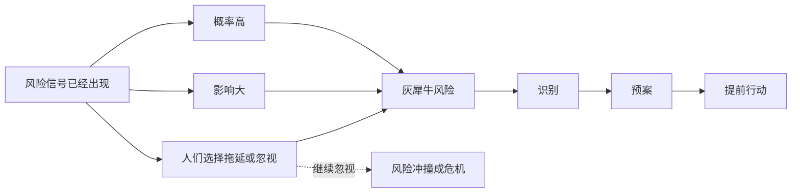
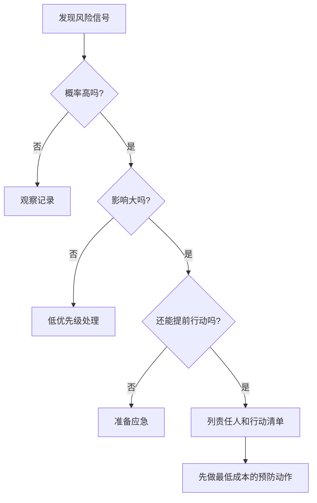

## 思维课: 灰犀牛
  
### 作者  
digoal  
  
### 日期  
2026-04-23 
  
### 标签  
灰犀牛 , 已发现 , 高概率 , 影响大 , 常被忽略  
  
----  
  
## 背景 
> 面向对象: 初中生到高中生  
> 核心问题: 为什么有些危险明明早就看见了，人们还是会拖到出事才行动？  
> 先说结论: 灰犀牛指高概率、高影响、信号明显却常被忽视的风险。它提醒我们: 最大的危险不一定来自突然袭击，而可能来自我们一直假装没看见的东西。

## 一张图先看懂



## 求真讲法

### 它到底说了什么

“灰犀牛”不是动物知识，而是风险管理中的一个比喻。它说的是这样一种风险:

- **看得见**: 不是完全没信号，而是已经有迹象。
- **概率高**: 如果不处理，很可能发生。
- **影响大**: 一旦发生，后果严重。
- **常被忽视**: 人们因为害怕、侥幸、成本太高或责任不清，迟迟不行动。

把它放到生活里，可以这样理解:

```text
黑天鹅: 你很难预料的突然事件。
灰犀牛: 你早就看见它冲过来，却一直没躲。
房间里的大象: 大家都知道有问题，但没人愿意说。
```

灰犀牛最关键的不是“危险存在”，而是“危险已经明显到足以行动，但人们仍然选择拖延”。

### 它是怎么来的

“灰犀牛”概念由美国作家、政策分析人士 Michele Wucker 提出。她在 2013 年世界经济论坛年会上介绍这个比喻，并在 2016 年出版的《The Gray Rhino: How to Recognize and Act on the Obvious Dangers We Ignore》中系统展开。

她用“灰犀牛”反衬“黑天鹅”。黑天鹅强调低概率、难预测、冲击大的事件；灰犀牛强调高概率、很明显、却被忽视的事件。

这个概念的价值，不在于给风险起一个新名字，而在于追问:

> 既然危险早就可见，为什么我们没有提前行动？

### 它依赖哪些假设

灰犀牛这个框架成立，需要几个前提:

| 前提 | 含义 | 如果不成立会怎样 |
|---|---|---|
| 风险信号可观察 | 已经有数据、迹象或警告 | 如果完全无信号，更像黑天鹅 |
| 发生概率较高 | 不是极小概率想象 | 如果只是幻想恐惧，会变成过度焦虑 |
| 影响足够大 | 值得投入资源预防 | 如果影响很小，不一定值得优先处理 |
| 行动仍有空间 | 现在做事还能降低损失 | 如果无法改变，只能应急或接受 |
| 忽视来自人类决策 | 拖延、侥幸、责任模糊等 | 如果没人知道，就不能说是“忽视” |

灰犀牛不是所有风险的总称。它专门指那些“已经看得见、又很危险、却没有被认真处理”的风险。

### 常见误解

**误解一: 灰犀牛就是所有大风险。**  
不对。大风险不一定是灰犀牛。灰犀牛必须有明显信号，并且通常存在被忽视、拖延或低估的问题。

**误解二: 灰犀牛和黑天鹅差不多。**  
不对。黑天鹅强调难以预测，灰犀牛强调明明可见。一个是“没想到”，一个是“想到了但没做”。

**误解三: 识别灰犀牛就等于解决问题。**  
不对。识别只是第一步。真正困难的是分配资源、承担责任、提前行动。

**误解四: 所有预警都应该立刻处理。**  
也不对。资源有限，必须比较概率、影响、时间窗口和行动成本。

## 求存讲法

### 它有什么用

灰犀牛最有用的地方，是把注意力从“灾难发生后谁倒霉”转向“灾难发生前谁早就看见了”。

它适合用来分析:

- 学生长期拖延导致考试崩盘。
- 家庭长期透支消费导致债务压力。
- 公司长期忽视产品质量导致用户流失。
- 城市长期忽视排水系统导致暴雨内涝。
- 社会长期忽视人口、环境、金融等积累性风险。

这些问题往往不是突然出现的，而是长期信号被忽视的结果。

### 它怎么迁移到熟悉领域

你可以把灰犀牛变成一个日常检查表:

1. 这个问题有没有反复出现的信号？
2. 如果继续不管，发生概率会不会越来越高？
3. 一旦发生，损失会不会很大？
4. 我为什么还没有行动，是不知道、害怕、懒、没资源，还是没人负责？
5. 现在最小的一步行动是什么？



### 它的适用范围和边界

适用时:

- 风险有清楚信号。
- 风险发生概率不低。
- 后果严重，值得提前管理。
- 你还能采取行动降低概率或损失。
- 关键问题是拖延、侥幸、责任不清或短期利益阻碍。

不适用或要谨慎时:

- 事件完全没有预警，更接近黑天鹅。
- 只是情绪化担心，没有证据。
- 行动成本远高于可能损失。
- 你把“灰犀牛”当作吓唬别人服从的标签。

### 正例: 怎么用它提升能力

**例子: 学习中的灰犀牛。**

小周连续三周数学作业错误率很高，课堂听不懂的地方越来越多，单元测验也开始下滑。这些都是信号。

如果他把问题识别为灰犀牛，就不会等到期末考试崩盘才说“没想到”。他可以提前做三件事:

1. 把错题按知识点分类。
2. 每天补一个薄弱点。
3. 一周后用同类题测试是否改善。

这个例子成立，是因为风险信号清楚、概率较高、影响较大，而且还有行动窗口。

### 反例: 前提不成立会怎样

**反例: 把一次偶然失误当成灰犀牛。**

小林某天因为身体不舒服，英语听写只得了 70 分。此前成绩稳定，也没有连续退步。她立刻断定“英语要完了”，每天花大量时间重复背已经会的单词，反而挤占了数学和睡眠。

这里失败的前提是“风险信号可观察”和“发生概率较高”。一次异常不等于趋势。把所有小波动都当灰犀牛，会制造过度焦虑，浪费注意力。

## 思考

灰犀牛真正刺痛人的地方，是它把问题从“我没办法预见”变成“我为什么没有面对”。

可以继续追问:

1. 我现在生活里有没有一头正在靠近的灰犀牛？
2. 我不行动的理由，是因为风险不重要，还是因为行动让我不舒服？
3. 一个组织里，为什么大家都看见问题，却没人负责处理？
4. 如果要提前行动，最小、最便宜、最能验证效果的一步是什么？

灰犀牛思维不是让人每天害怕未来，而是让人把害怕变成清单，把清单变成行动。

## 最后记住

1. 灰犀牛是高概率、高影响、信号明显却常被忽视的风险。
2. 它不同于黑天鹅: 黑天鹅难预测，灰犀牛早有预警。
3. 识别灰犀牛后，关键是责任、资源和行动。
4. 不是所有担心都是灰犀牛，必须看证据、概率和影响。
5. 面对灰犀牛，最好的问题是: “我现在能做的最小预防动作是什么？”

## 参考资料

- Gray Rhino & Company, [Michele Wucker profile](https://www.thegrayrhino.com/the-gray-rhino-about/michelewucker/): 介绍 Michele Wucker 提出灰犀牛概念、2013 年在世界经济论坛年会介绍该概念，以及 2016 年出版相关著作。
- Gray Rhino & Company, [The Gray Rhino book](https://www.thegrayrhino.com/the-gray-rhino-book/): 对“灰犀牛”作出简明定义: 高概率、高影响、给予我们回应选择的威胁。
- World Economic Forum, [How can we overcome the most likely risks of 2016?](https://www.weforum.org/stories/2016/02/confronting-the-gray-rhinos-of-2016/): Michele Wucker 用全球风险报告中的高概率、高影响风险说明灰犀牛思维。
- Carnegie Council, [Move Over, Black Swan: Here Comes the Gray Rhino](https://www.carnegiecouncil.org/media/podcast/20160614-move-over-black-swan-here-comes-the-gray-rhino): 访谈中区分黑天鹅和灰犀牛，强调灰犀牛是眼前明显却被忽视的威胁。

  
#### [PostgreSQL 解决方案集合](../201706/20170601_02.md "40cff096e9ed7122c512b35d8561d9c8")
  
  
#### [德哥 / digoal's Github - 公益是一辈子的事.](https://github.com/digoal/blog/blob/master/README.md "22709685feb7cab07d30f30387f0a9ae")
  
  
#### [About 德哥](https://github.com/digoal/blog/blob/master/me/readme.md "a37735981e7704886ffd590565582dd0")
  
  

  
