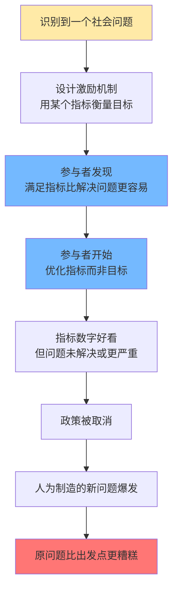
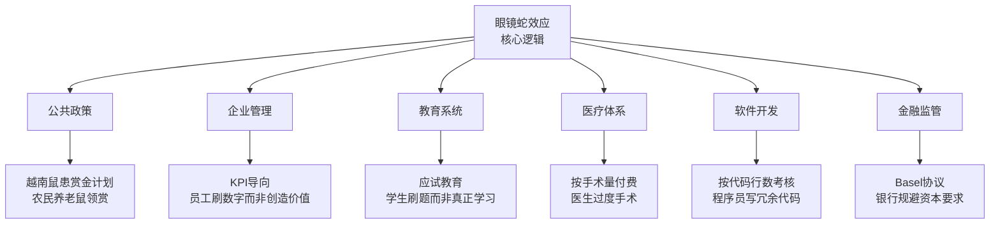

## 思维课: 眼镜蛇效应
  
### 作者  
digoal  
  
### 日期  
2026-04-25 
  
### 标签  
眼镜蛇效应 , 问题 , 目标 , 反馈回路 
  
----  
  
## 背景 

> 当激励政策的目标与实际结果背道而驰时，"解决方案"本身成为了问题的制造者。

 

## 🔍 求真讲法：这个效应从哪里来？

### 背景与动机

故事发生在大英帝国统治印度的年代。

19世纪，殖民地德里城里眼镜蛇横行，市民人心惶惶。英国殖民政府想出了一个"聪明"的办法： **悬赏灭蛇** —— 每上交一条死眼镜蛇，政府给一笔赏金。

政策初期效果惊人，上交的死蛇数量暴增。官员们弹冠相庆，以为问题即将解决。

然而他们没有想到……

> 聪明的印度人开始 **养殖眼镜蛇**，然后杀掉领赏。

政府察觉后立即取消了赏金政策。养蛇人发现手里的蛇一文不值，于是 —— **把蛇全部放生**。

结果？德里城里的眼镜蛇数量，比政策出台之前**还要多**。

这个荒诞的故事，被德国经济学家 **霍斯特·西伯特（Horst Siebert）** 在2001年写入著作，正式命名为"眼镜蛇效应"（Cobra Effect），成为经济学和政策科学中的经典警示。

 

### 核心假设

眼镜蛇效应得以发生，需要同时满足以下前提：

- **激励可以被操纵**：奖励/惩罚机制存在可被利用的漏洞
- **参与者是理性的**：人会追求自身利益最大化
- **政策制定者信息不对称**：制定者无法完全预测执行者的行为反应
- **反馈回路存在滞后**：政策效果无法被实时监控和纠正
- **目标与指标可以脱钩**：用来衡量目标的指标，可以在不实现目标的情况下被满足

 

### 推导过程

眼镜蛇效应的发生遵循一个清晰的逻辑链：



**关键转折点**在于 “参与者发现满足指标比解决问题更容易” → “参与者开始优化指标而非目标” 这一步：

当"满足指标"和"实现目标"出现**裂缝**，理性人必然选择成本更低的那条路。

 

### 直觉理解

想象你让孩子"把房间收拾干净"，并承诺每次整洁就给零花钱。

孩子很快发现：把所有东西塞进床底下，房间看起来就干净了。

你奖励的是 **"看起来干净"** ，而不是 **"真正干净"** 。

当激励和真实目标之间存在缝隙，人就会钻进那道缝里。

 

## 🛠️ 求存讲法：这个效应能告诉我们什么？

### 核心用途

眼镜蛇效应是政策制定和管理学中最重要的警示框架之一，它揭示了：

- **为什么好的初衷会带来坏的结果**
- **如何识别激励机制的潜在漏洞**
- **为什么"衡量什么就得到什么"是一把双刃剑**

 
### 跨领域迁移

眼镜蛇效应不只在殖民地政府中出现——它无处不在：



 

### 适用边界

| 情境 | 眼镜蛇效应是否容易发生 | 原因 |
|------|----------------------|------|
| 指标容易量化但目标复杂 | ✅ 高风险 | 指标与目标容易脱钩 |
| 执行者信息优于监管者 | ✅ 高风险 | 更容易发现和利用漏洞 |
| 奖惩力度高 | ✅ 高风险 | 动机更强，值得"投入"钻漏洞 |
| 目标本身可直接衡量 | ⚠️ 中风险 | 需看是否有替代性满足方式 |
| 多维度综合评估 | 🟢 低风险 | 难以在所有维度同时造假 |
| 结果与现实紧密绑定 | 🟢 低风险 | 造假成本极高或无法造假 |

 

### ✅ 正例：生活与工作中的眼镜蛇效应

**例1：越南鼠患——历史重演**

法国殖民越南时，河内鼠患严重。当局推出"按鼠尾领赏"政策。聪明的越南人开始——切下鼠尾放生，让老鼠继续繁殖，源源不断提供鼠尾。

**例2：学校排名与教育质量**

某些国家用考试成绩排名学校，并给高分学校更多资源。结果：学校开始集中精力培训考试技巧、劝退成绩差的学生，而非真正提升教育质量。

**例3：工厂产量KPI**

苏联时期按重量考核钉子产量，工厂就生产少量超重的大钉子；改按数量考核，工厂就生产大量轻薄的小钉子——两种情况下真正有用的钉子都不多。

**例4：软件bug奖励**

某公司奖励发现bug最多的测试员。结果：测试员开始把一个大bug拆分成十几个小bug分别上报，以刷高数量。

**例5：医院死亡率考核**

如果只考核医院死亡率，医院可能会拒收病情太重的患者——因为他们"太容易死"，会拉低统计数据。

 

### ❌ 反例：假设被打破时效应消失

**反例1：激励不可操纵**

如果奖励的是"城市实际眼镜蛇数量减少"（由独立第三方普查核实），而非"上交死蛇数量"，养蛇人的套利空间就消失了。指标与目标直接绑定，效应不发生。

**反例2：参与者不是纯粹理性人**

医生的职业道德、教师的教育使命感，使他们不会纯粹追求数字。当内在动机足够强，外在激励的漏洞就不那么容易被利用——尽管如此，长期高压的激励机制仍然可能腐蚀内在动机。

 

## 📊 一图看懂：好政策 vs 眼镜蛇政策

```
目标：减少城市眼镜蛇数量

【好政策路径】                    【眼镜蛇政策路径】
                                  
真实减蛇 ──→ 指标改善              指标改善 ──→ 养蛇+领赏
    ↑                                              ↓
政策奖励 ←── 指标改善              政策取消 ←── 发现造假
                                       ↓
                                   蛇比以前更多 ❌

关键区别：
指标是否与真实目标"绑定"？
        ✅ 是 → 相对安全
        ❌ 否 → 危险！眼镜蛇效应潜伏其中
```

 

## 💡 思考：值得深究的问题

1. **如果你是印度殖民政府的官员，你会如何重新设计这个政策，避免眼镜蛇效应？**
   提示：思考如何让"真正减蛇"和"获得奖励"之间的路径保持一致。

2. **你身边有没有眼镜蛇效应的例子？**
   比如学校、公司、家庭中——有没有某个"激励"让人们做了表面正确但本质错误的事？

3. **"测量本身会改变被测量的对象"——这句话和眼镜蛇效应有什么关系？**
   （提示：参考"古德哈特定律"：当一个指标成为目标，它就不再是好的指标。）

4. **完全消除眼镜蛇效应可能吗？**
   如果任何指标都可能被钻漏洞，我们是否应该放弃用指标管理社会？还是有别的办法？

5. **内在动机和外在激励哪个更可靠？**
   医生、教师、科学家如果只靠奖金驱动，会发生什么？纯靠职业精神又会怎样？

 

## 📚 延伸阅读

- **古德哈特定律（Goodhart's Law）** ："当一个度量成为目标时，它就不再是好的度量。"——眼镜蛇效应的理论化表达。
- **坎贝尔定律（Campbell's Law）** ：量化指标用于社会决策越多，越容易遭受腐蚀性压力，反而失效。
- 霍斯特·西伯特《眼镜蛇效应：德国经济如何走出发展陷阱》（2001）——效应命名来源。
- **《魔鬼经济学》（Freakonomics）** ：充满类似"反直觉激励"的真实案例，极度好读。
  
  
#### [PostgreSQL 解决方案集合](../201706/20170601_02.md "40cff096e9ed7122c512b35d8561d9c8")
  
  
#### [德哥 / digoal's Github - 公益是一辈子的事.](https://github.com/digoal/blog/blob/master/README.md "22709685feb7cab07d30f30387f0a9ae")
  
  
#### [About 德哥](https://github.com/digoal/blog/blob/master/me/readme.md "a37735981e7704886ffd590565582dd0")
  
  

  
