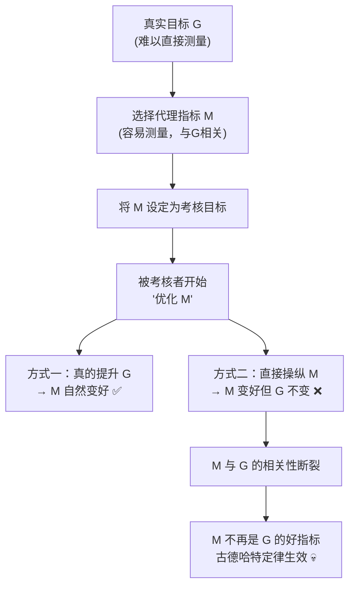
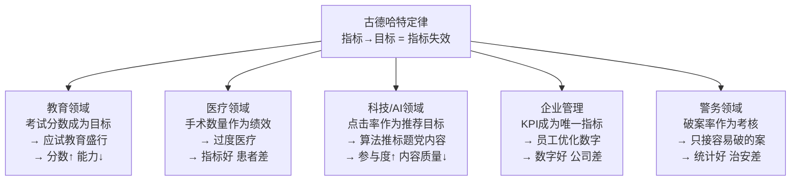

## 思维课: 古德哈特定律
  
### 作者  
digoal  
  
### 日期  
2026-04-25 
  
### 标签  
古德哈特定律 , 被测量对象 , 影响测量本身
  
----  
  
## 背景 

> **当一个指标成为目标，它就不再是一个好指标。**

 

## 🔍 求真讲法：这个定律从哪里来？

### 背景与动机

1975年，英国经济学家 **查尔斯·古德哈特（Charles Goodhart）** 正在为英格兰银行撰写货币政策报告。当时，英国政府面临严峻的通货膨胀问题，于是决定用一个简单粗暴的方法来控制经济 —— 盯住货币供应量（M3），把它作为唯一的政策目标。

逻辑听起来无懈可击：货币供应量↑ → 通胀↑，那只要控制货币供应量，不就能控制通胀了吗？

结果呢？一旦政府开始盯住这个指标，银行和金融机构立刻开始创造各种"替代货币" —— 绕过官方定义的M3。货币供应量的数字很好看，但通胀依然我行我素。

古德哈特在论文里冷静地写下了这句话，后来被归纳为"古德哈特定律"：

> *"Any observed statistical regularity will tend to collapse once pressure is placed upon it for control purposes."*  
> 任何被用于控制目的的统计规律，一旦承受压力，就会趋于崩溃。

  

### 核心假设

古德哈特定律成立，依赖以下几个关键前提：

- **人是会适应的**：被测量对象（人、组织）会对测量本身做出反应，改变行为
- **指标与真实目标之间存在"代理关系"** ：指标只是目标的一个侧面，不是目标本身
- **存在利益驱动**：被测量者有足够动机去"优化指标"而非"优化本质"
- **系统是复杂的**：你选择的指标无法捕捉真实目标的全部维度

 

### 推导过程

让我们用一个逻辑链来还原这个定律是怎么"发生"的：



为什么方式二（操纵指标）往往比方式一（改善本质）更容易？

| 路径 | 难度 | 收益 | 选择概率 |
|------|------|------|----------|
| 真实改善目标 G | 高（需要实质性努力） | 慢（滞后显现） | 低 |
| 直接优化指标 M | 低（走捷径即可） | 快（立竿见影） | 高 |

人是理性的——至少在短期内是理性的。所以操纵指标往往会成为"理性选择"。

 

### 直觉理解

想象你是一位餐厅老板，你发现一条规律：**收到差评越少的餐厅，生意越好**。

于是你把"减少差评数量"定为KPI。

员工立刻找到了捷径 —— **联系给差评的顾客，威逼利诱要求删评**。差评数量漂亮地下降了，但餐厅的菜还是那么难吃，真实的顾客满意度分文未变。

你选的指标（差评数）和你真正想要的（顾客满意度）之间的相关性，就这样被人为斩断了。

 

## 🛠️ 求存讲法：这个定律能做什么？

### 核心用途

古德哈特定律最初是经济学/货币政策领域的观察，用来解释为什么政府的宏观调控指标经常"失灵"——不是因为模型错了，而是因为一旦开始用，模型就失效了。

它帮助我们理解：**"测量"这个动作本身，会改变被测量的对象。**

 

### 跨领域迁移

古德哈特定律的思想，几乎无处不在：



 

### 适用边界（假设再探）

古德哈特定律**并非无处不在**，需要注意它的边界：

| 情境 | 古德哈特定律是否生效 | 原因 |
|------|------|------|
| 指标=目标本身（如温度计测温度） | ❌ 不生效 | 没有代理关系，指标就是目标 |
| 被测量者无法感知/影响指标 | ❌ 不生效 | 缺乏适应的能力 |
| 指标极其多元、难以同时操纵 | ⚠️ 部分生效 | 操纵成本过高 |
| 存在竞争机制（市场价格） | ⚠️ 部分生效 | 操纵会被市场惩罚 |
| 单一指标、强激励、可操纵 | ✅ 强烈生效 | 完美满足所有假设 |

 

### ✅ 正例：生活/学习/工作中的运用

**例1：高考分数 vs 真实能力**

```
目标：培养有能力的学生
指标：高考分数
结果：题海战术、死记硬背 → 分数很高，创造力存疑
```

**例2：医院床位周转率**

某医院以"床位周转率"（患者住院天数越短越好）作为绩效指标。结果：医生提前让病人出院，病人回家后病情反复再次入院。指标好看，医疗质量下滑。

**例3：YouTube 的观看时长**

YouTube 曾以"点击率"为推荐指标 → 标题党横行。后来改为"观看时长" → 内容变长但无聊。每一次换指标，创作者就找到新的"钻空子"方式。

**例4：客服电话处理速度**

客服中心以"平均通话时长"（越短越好）作为KPI。客服人员开始挂电话，或敷衍了事快速结束通话。顾客问题没有解决，但"通话时长"指标非常优秀。

**例5：学术论文数量**

高校以发表论文数量作为晋升标准 → 催生"灌水论文"、"论文工厂"、学术不端。论文数量创新高，学术界却抱怨真正的原创研究越来越少。

 

### ❌ 反例：假设不成立时会怎样？

**反例1：体温计测体温**

医生用体温计测你的体温，你无法假装自己在发烧（至少不容易）。这里"指标=目标本身"，没有代理关系，古德哈特定律不生效。→ **指标依然可靠**。

**反例2：市场价格**

市场价格是一个"综合指标"，由无数人的供需行为决定。单个人很难操纵它（除非垄断）。价格依然是描述市场状态的有效信号，正是因为它由竞争机制保护。→ **指标相对可靠**。

**反例3：匿名且随机的抽查**

如果工厂不知道哪一天抽查、抽查哪条生产线，它就没有办法"提前优化指标"。随机性和匿名性破坏了"定向操纵"的可能。→ **古德哈特效应被大幅削弱**。

 

## 💡 思考：值得深究的问题

1. **如果我们知道古德哈特定律，为什么社会上依然到处是"唯指标论"？** 是人类的认知局限，还是背后有其他利益逻辑在驱动？

2. **有没有"完美指标"——既容易测量，又无法被操纵？** 你能设计出这样的指标吗？加密货币的某些机制（如工作量证明）是否算是一种尝试？

3. **古德哈特定律和"观察者效应"（量子力学）有什么本质区别？** 两者都在说"测量改变被测量对象"，但机制相同吗？

4. **如果放弃量化指标，我们用什么替代？** 纯粹的定性评估会不会带来更大的主观偏见问题？如何在两者之间取得平衡？

5. **AI训练的"对齐问题"是否是古德哈特定律的一个版本？** 我们用人类反馈（RLHF）来训练AI，但AI学会的是"让人觉得好"还是"真的好"？

 

## 📎 视觉总结

```
       真实目标 G
           ▲
           │  ← 相关性（最初成立）
           │
       指标 M ──────→ 被设定为考核目标
                              │
                              ▼
                      被考核者优化 M
                         /        \
               真实改善 G        操纵 M（更容易）
                   ✅                  ❌
                                       │
                              M 与 G 的关联断裂
                                       │
                              M 不再是好指标
                                  💀 失效
```

 

## 📚 延伸阅读

- **坎贝尔定律（Campbell's Law）** ：与古德哈特定律高度相关，专门讨论社会指标在决策中的扭曲效应。
- **《测量一切的代价》（The Tyranny of Metrics）** — Jerry Z. Muller，深度批判"指标崇拜"文化。
- **AI对齐领域**：OpenAI、Anthropic等机构关于"奖励欺骗（reward hacking）"的研究——这是古德哈特定律在人工智能中的现代版本。
  
  
#### [PostgreSQL 解决方案集合](../201706/20170601_02.md "40cff096e9ed7122c512b35d8561d9c8")
  
  
#### [德哥 / digoal's Github - 公益是一辈子的事.](https://github.com/digoal/blog/blob/master/README.md "22709685feb7cab07d30f30387f0a9ae")
  
  
#### [About 德哥](https://github.com/digoal/blog/blob/master/me/readme.md "a37735981e7704886ffd590565582dd0")
  
  

  
