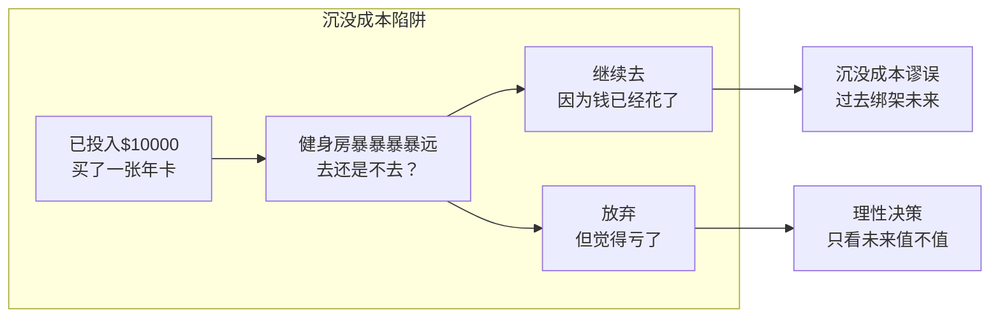
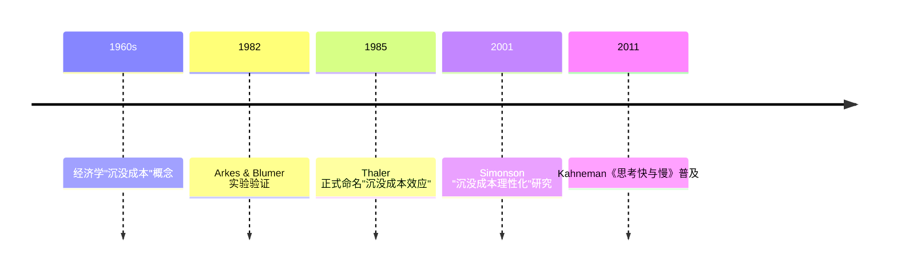
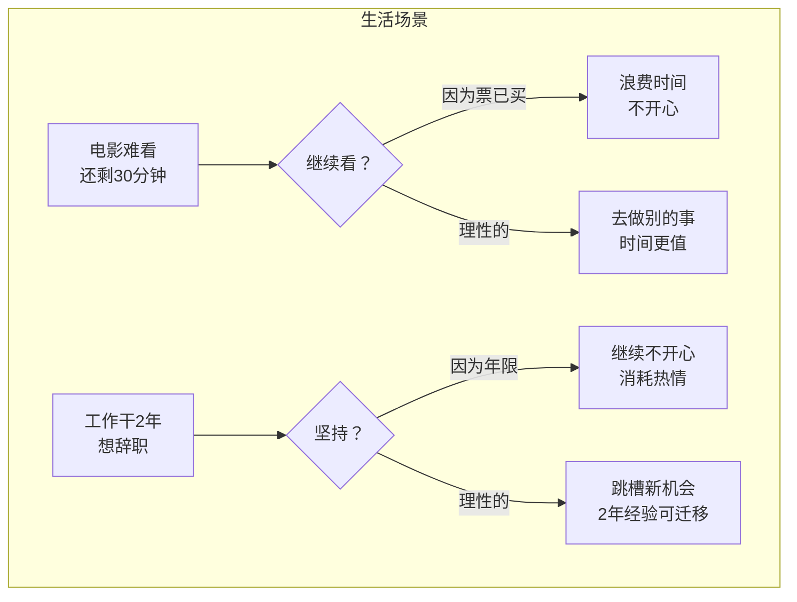
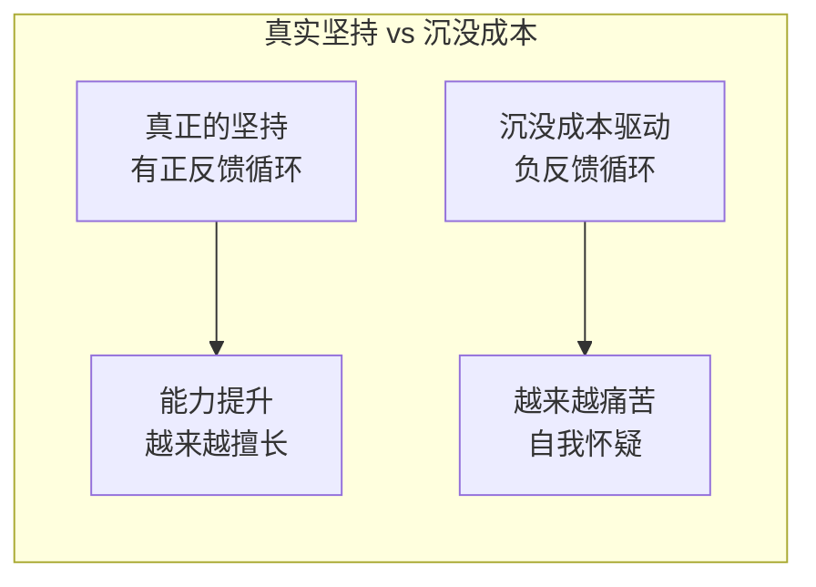

## 思维课: 沉没成本谬误: 越坚持越亏损的心理陷阱
  
### 作者  
digoal  
  
### 日期  
2026-04-25 
  
### 标签  
沉没成本 , 已投入 , 无法回收 
  
----  
  
## 背景 
> 面向对象: 高中生及以上
> 核心问题: 已经在某事上投入了那么多，该继续还是放弃？
> 先说结论: 沉没成本谬误是指因为舍不得已投入的资源而继续错误决策的心理倾向——理性选择应只看未来成本与收益，过去已发生的代价与未来决策无关。

## 一张图先看懂



```txt
传统思维:  "我投入了X，所以必须坚持"     ← 谬误
理性思维:  "继续投入Y，能获得价值Z吗？"   ← 正确
```

| 决策类型 | 关注点 | 沉没成本 |
|---------|--------|---------|
| 传统思维 | 过去已花多少 | 是 |
| 理性决策 | 未来净收益 | 否 |

## 求真讲法

### 它到底说了什么

**沉没成本**（Sunk Cost）：已经发生、无法回收的资源（金钱、时间、精力）。

**沉没成本谬误**（Sunk Cost Fallacy）：决策时系统性地被沉没成本影响，即使未来预期收益为负仍选择坚持。

核心洞察：**过去的代价应该被"遗忘"，只考虑未来成本与未来收益的差值。**

### 它是怎么来的



行为经济学的重要发现：人类决策系统性地违背理性经济人假设。

### 它依赖哪些假设

| 假设 | 说明 |
|------|------|
| 损失厌恶 | 人们对损失比对等量收益敏感约2倍 |
| 完整性冲动 | 人有"做事要有始有终"的心理需求 |
| 自我辩解 | 承认错误等于承认之前投入是浪费 |
| 厌恶后悔 | 放弃=承认之前的决定是错的 |

> 如果你不在乎"浪费"，沉没成本谬误就没有驱动力。

### 常见误解

- **误解1**：珍惜资源是美德 → 对的，但"珍惜"应体现在**未来**决策而非**过去**
- **误解2**：坚持就是有毅力 → 错的！方向错了越坚持越糟糕
- **误解3**：放弃=承认失败 → 错的！及时止损是**理性**而非**懦弱**

---

## 求存讲法

### 它有什么用

- **投资止损**：识别该卖出还是该持有
- **项目决策**：什么时候该砍掉亏损项目
- **人际关系**：何时该结束消耗型关系
- **职业选择**：该继续还是该跳槽

### 它怎么迁移到熟悉领域



### 它的适用范围和边界

| 适用场景 | 边界条件 |
|---------|---------|
| 商业投资、项目管理 | 存在可量化的未来成本/收益 |
| 个人消费决策 | 后续投入无额外价值 |
| 职业/感情等长期承诺 | 关系有修复可能时需慎重 |

**什么时候不该放弃？** 沉没成本本身不是放弃的理由——未来预期收益才是。

### 正例: 怎么用它提升能力

**软件项目"砍需求"决策**

```
项目A：已投入3个月，预期再投2个月完成
项目B：已投入1个月，预期再投1个月完成，价值更高

传统思维："项目A都快完成了，不能砍"
理性思维：比较未来投入vs未来价值 → 如果B价值更高，砍A是正确的
```

**电影/餐厅止损**
- 电影难看：30分钟×观影乐趣 = -30分；走人去做其他事 = +X分
- 结论：明显难看就走，别为"票已买"继续受罪

### 反例: 前提不成立会怎样

**刻意坚持可能带来超额回报**



**反例**：学习乐器
- 初期枯燥 → 很多人因"已经买了钢琴"而坚持，最终突破瓶颈
- 这里"买了钢琴"是**触发坚持的契机**，而非**继续的理由**
- 关键区别：是否有**阶段性正反馈**让人相信未来会好转

---

## 思考

> 如果你今天发现一个项目继续投入需要$100、产出只有$80，你会不会因为"已经投了$500"而继续投？
>
> 沉没成本谬误的本质是：**用过去的错误来惩罚未来的自己**。
>
> 设问：如果时光倒流，你一无所知地面对今天的选择，你会怎么选？
> 这个问题的答案，就是你"该不该继续"的真正答案。

---

## 最后记住

1. **沉没成本是过去，决策只看未来**：过去已发生、无法改变，不应影响未来决策
2. **坚持≠正确**：方向错了的坚持是浪费，方向对了才是韧性
3. **止损是技能不是懦弱**：亏10%止损 vs 亏100%破产，前者是理性风险管理
4. **用"未来视角"做决定**：如果我今天一无所知，会选择继续投入吗？
5. **警惕"完整性冲动"**：有始有终是美德，但只在"终"有价值时才成立

---

## 参考资料

- Arkes & Blumer (1985). "The Psychology of Sunk Cost"
- Thaler (1980). "Toward a positive theory of consumer choice"
- Kahneman (2011).《思考快与慢》第35章
- 注：无联网时，基于行为经济学通用教材体系
  
