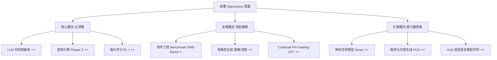
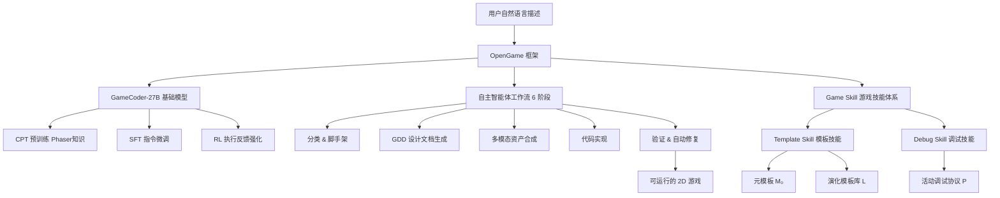

## AI论文解读 | OpenGame, 人人皆可开发游戏

### 作者
digoal

### 日期
2026-04-25

### 标签
OpenGame , 游戏开发 , 论文解读 , AI 

----

## 背景
> **原文信息**：Yilei Jiang, Jinyuan Hu, et al. | 2026 | arXiv:2604.18394 | CUHK MMLab
> **解读日期**：2026-04-25

---

## 📍 论文定位

**一句话**：本文提出了 OpenGame，一个让 AI 能从自然语言描述出发、端到端自动生成完整可运行 2D 网页游戏的开源智能体框架。

**🎓 学术价值**：首次将"进化式技能积累"机制引入游戏代码生成领域，提出了 Template Skill + Debug Skill 双轮驱动的 Game Skill 体系，将 LLM 代码智能体从"离散任务求解者"推向"复杂交互软件工程师"的角色；同时提出 OpenGame-Bench，将游戏生成评估从静态代码正确性提升至动态可玩性评估。

**🏭 工业价值**：降低游戏开发门槛，普通用户只需用自然语言描述想法（如"我想做一个漫威复仇者游戏"），系统可自动生成包含角色动画、背景音乐、关卡设计的完整 2D 游戏；对游戏创作者、教育工作者、内容博主均有直接实用价值。

**💡 直觉类比**：这篇论文就像给 AI 配了一个"老练的游戏工程师助手"——不仅懂得从蓝图到代码的全套开发流程，还会随着项目积累越来越多的"踩坑经验"，下次遇到同样的 Bug 直接秒杀。

---

## 🗺️ 知识地图



**核心概念讲解：**

**LLM 代码智能体 ⭐⭐**
- 是什么：能够调用工具、读写文件、执行命令的大语言模型，可以多步骤完成编程任务
- 为什么重要：OpenGame 的核心执行引擎，负责从自然语言到游戏代码的全过程
- 现实类比：就像一个会用电脑的程序员实习生，你说"做个平台跳跃游戏"，它会自己打开终端、建文件夹、写代码、运行测试

**Phaser 3 游戏引擎 ⭐⭐**
- 是什么：一款基于 JavaScript 的开源 2D 网页游戏框架，所有代码可纯文本表达
- 为什么重要：是 OpenGame 选择的目标平台，因为其纯代码驱动特性非常适合 LLM 生成
- 现实类比：就像乐高积木说明书，所有零件（物理、碰撞、动画）都有明确的 API，AI 按图索骥就能搭出来

**强化学习 RL ⭐⭐⭐**
- 是什么：让模型在"执行代码→获得奖励"的反馈循环中自我优化
- 为什么重要：GameCoder-27B 的第三训练阶段，让模型代码在执行层面更可靠
- 现实类比：就像小孩学骑自行车，每次摔倒都是反馈，越练越稳

---

## 🔬 论文精读

### Why — 研究动机

**现有 LLM/代码智能体做游戏时的三大失效模式：**

| 失效类型 | 具体表现 | 类比 |
|---------|---------|------|
| 逻辑不一致（Logical Incoherence） | 游戏循环状态追踪混乱，导致游戏卡死或核心机制无法实现 | 像一个健忘的厨师，做到一半忘记第一步放了什么 |
| 引擎知识盲区（Engine-Specific Knowledge Gaps） | 不会用 Phaser 的原生物理/场景 API，从头重新造轮子 | 拿到高级工具箱却只会用锤子 |
| 跨文件不一致（Cross-File Inconsistencies） | 资产 key 对不上、场景初始化顺序错误、配置字段缺失 | 一本小说里，第一章叫男主"张三"，第三章突然改成"李四" |

**之前 vs 本文的方法对比：**

| 维度 | 传统代码 LLM | OpenGame |
|------|-------------|----------|
| 项目结构 | 单次生成，无结构约束 | 模板库 + 钩子扩展，结构稳定 |
| 调试方式 | 每次从零开始 | 累积 Debug 协议，已知错误秒修 |
| 评估方式 | 静态代码检查 | 无头浏览器动态执行 + VLM 评判 |
| 专业知识 | 通用 LLM 知识 | GameCoder-27B 游戏引擎专项训练 |

---

### What — 核心方法

OpenGame 由三大支柱构成：



**五大演化模板家族**（从经验中自动涌现，非预设）：
1. 重力侧视平台（Platformer）
2. 俯视自由移动（Top-Down）
3. 离散网格逻辑（Grid Logic）
4. 路径波次防守（Tower Defense）
5. UI 驱动交互（UI-Heavy）

---

### How — 技术细节

#### GameCoder-27B 三阶段训练

**阶段 1 — 持续预训练（CPT）**
- 数据：GitHub 上的开源 Phaser/JS 游戏仓库 + 官方文档 + 社区教程
- 目标：建立游戏循环、物理系统、状态管理的先验知识

**阶段 2 — 监督微调（SFT）**
- 用 GPT-5.1 生成复杂的多步设计提示（如"实现带二段跳和精灵动画的平台角色控制器"）
- 用 MiniMax-2.5 生成高质量参考答案
- 目标：学会将创意意图转化为具体代码结构

**阶段 3 — 强化学习（RL）**
- 不生成完整游戏，而是生成单文件游戏逻辑模块（碰撞检测、状态机等）
- 奖励信号 = 执行成功率 + 单元测试通过率
- 目标：让模型代码在执行层面具备确定性逻辑

#### Game Skill 核心算法

```
输入：用户描述 x、元模板 M₀、模板库 L、调试协议 P
输出：可运行游戏项目 y

1. 从 L 中选择合适模板家族 T（初始为 M₀）
2. 用 T 生成项目骨架 y
3. 在 y 的扩展点中注入游戏特定内容
4. 循环直至收敛：
   a. 按 P 执行构建/测试/运行验证
   b. 若失败：用 P 诊断并修复 y
   c. 若为新错误模式：将 (特征, 根因, 修复) 记录至 P
5. 从 y 中提取可复用片段合并至 L
6. 返回 y
```

#### 三层阅读策略（防止上下文溢出）

代码实现阶段，智能体按顺序加载：
1. 模板系统 API 摘要（最轻量）
2. 目标源文件（待修改的具体文件）
3. 实现指南（最后加载，保证最高显著性）

> 这个设计解决了大模型"文档读了记不住中间部分"（Lost-in-the-Middle）的经典问题。

---

### So What — 实验结果

**主实验结果（150 个游戏任务，3 个维度各 0~100 分）：**

| 系统 / 模型 | 构建健康度(BH) | 视觉可用性(VU) | 意图对齐度(IA) |
|------------|:------------:|:------------:|:------------:|
| DeepSeek V3.2（直接生成） | 57.0 | 38.9 | 33.5 |
| Claude Sonnet 4.6（直接生成） | 58.5 | 50.8 | 50.3 |
| GPT-5.1（直接生成） | 57.4 | 52.9 | 49.4 |
| Gemini 3.1 Pro（直接生成） | 53.6 | 60.2 | 42.1 |
| Cursor + Claude Sonnet 4.6 | 66.8 | 61.4 | 58.9 |
| **OpenGame + GameCoder-27B** | 63.9 | 57.0 | 54.1 |
| **OpenGame + Claude Sonnet 4.6** | **72.4** | **67.2** | **65.1** |

**关键消融发现：**

| 消融项目 | BH 变化 | IA 变化 | 结论 |
|---------|---------|---------|------|
| 去掉钩子驱动实现（Hook-Driven） | -10.1 | -11.6 | **最重要的单一设计** |
| 去掉三层阅读策略 | -4.6 | -8.6 | 上下文管理很关键 |
| 去掉物理优先分类 | -2.2 | -3.5 | 模板匹配有作用 |
| 仅用元模板 M₀（无演化库） | -11.9 | -13.9 | 模板演化是核心 |
| 仅用静态调试规则 | 基线 | 基线 | 活动协议提升 ~8 分 |

**调试迭代次数的影响：**
- T=0（零样本）：BH = 58.4，表现脆弱
- T=3：大幅改善，解决大部分跨文件不一致
- T=5：趋于平稳，收益递减

**按游戏类型的意图对齐分（OpenGame vs Cursor，Claude 4.6 后端）：**

| 游戏类型 | OpenGame IA | Cursor IA | 优势 |
|---------|:-----------:|:---------:|:----:|
| 平台跳跃（Platformer） | **76.8** | 70.1 | +6.7 |
| 俯视射击（Top-Down Shooter） | **71.4** | 64.5 | +6.9 |
| 街机动作（Arcade） | **66.5** | 59.7 | +6.8 |
| 策略（Strategy） | **58.2** | 52.4 | +5.8 |
| 解谜/UI（Puzzle/UI） | **52.6** | 47.8 | +4.8 |

物理驱动类游戏优势最大，抽象逻辑类游戏提升相对有限。

---

### Now What — 价值总结

**学术界**：
- 开创了"游戏可玩性评估"的新范式（动态执行 + VLM 评判），未来游戏生成研究有了标准化基准
- 证明了"累积经验"机制（Template/Debug Skill 演化）对长链复杂软件工程任务的有效性
- 为"专域代码模型"训练提供了 CPT→SFT→RL 的完整工程路径

**工业界**：
- 游戏快速原型：创意者可以在几分钟内看到自己想法的可玩版本，再交给专业开发者精修
- 教育游戏生成：教师可以快速定制化课堂互动游戏
- 游戏 AI 测试：自动生成大量游戏变体用于 AI 行为测试

---

## 📖 术语词典

### Game Skill（游戏技能）
- **是什么**：OpenGame 的核心可复用能力模块，由 Template Skill 和 Debug Skill 组成，负责将自然语言转化为可运行游戏
- **为什么重要**：它是解决跨文件一致性问题的关键设计，使智能体具备"累积经验"能力
- **现实类比**：就像一位有多年经验的老工程师随身携带的"项目模板集"和"踩坑笔记本"

### Template Skill（模板技能）
- **是什么**：维护一个不断演化的项目骨架库 L，从单一元模板 M₀ 出发，随经验积累扩展为多种专用模板家族
- **为什么重要**：大幅压缩代码生成的搜索空间，稳定项目整体结构，避免每次从零开始
- **现实类比**：就像建筑师的标准户型图纸库，新项目不用每次重新设计楼梯和管道走向

### Debug Skill（调试技能）
- **是什么**：维护一份"活动调试协议" P，记录历次错误的（特征签名, 根本原因, 已验证修复）三元组，并随新任务持续更新
- **为什么重要**：让调试知识具有累积性和持久性，高频错误不再重复踩坑
- **现实类比**：就像医院的疑难病例档案库，新来的医生可以直接查到前人的确诊经验和处方

### OpenGame-Bench（评估基准）
- **是什么**：150 个游戏任务的评估流水线，通过无头浏览器执行 + VLM 评判，从构建健康度、视觉可用性、意图对齐度三维度评分
- **为什么重要**：解决了"代码通过编译但游戏不可玩"的评估盲区
- **现实类比**：就像不只检查菜谱写得对不对，而是真的下锅炒出来让人尝一尝

### Physics-First Classification（物理优先分类）
- **是什么**：基于物理约束（重力、视角、移动类型）而非流派名称来分类游戏类型的规则
- **为什么重要**：避免歧义（如"Terraria 是平台跳跃不是俯视冒险"），确保选择正确的模板家族
- **现实类比**：不问"这道菜叫什么名字"，而是问"它是煎的还是蒸的"——方法决定工具选择

### Hook-Driven Implementation（钩子驱动实现）
- **是什么**：智能体不从头写代码，而是复制模板文件后仅覆盖指定的钩子方法（如 `setupCustomCollisions`）来注入游戏特定逻辑
- **为什么重要**：保留基类的确定性生命周期管理，防止智能体破坏游戏引擎的核心流程
- **现实类比**：就像公司有标准作业流程 SOP，员工不是重写整套流程，只在指定位置填入自己的工作内容

### GameCoder-27B
- **是什么**：基于 Qwen3.5-27B 骨干，经过 CPT→SFT→RL 三阶段专项训练的游戏代码大模型
- **为什么重要**：为 OpenGame 框架提供领域专业的代码生成能力，比通用模型更熟悉 Phaser API 和多文件游戏结构
- **现实类比**：就像通用医学博士（通用 LLM）和神经外科专科医生（GameCoder-27B）的区别

### Three-Layer Reading Strategy（三层阅读策略）
- **是什么**：实现阶段按"API 摘要 → 目标源文件 → 实现指南"顺序逐步加载上下文的策略
- **为什么重要**：防止大模型在长上下文中"忘记"中间关键信息（Lost-in-the-Middle 问题）
- **现实类比**：先看目录，再翻到具体章节，最后查阅参考手册——信息按需加载，不要一口气全吞

---

## ⚖️ 批判性评估

### 1. 假设前提的合理性

**假设一：Phaser 3（网页 2D 框架）足以代表游戏开发**
- 论文仅在 Phaser 3 框架下验证，而业界主流是 Unity 和 Unreal Engine
- 论文自我辩护：Phaser 的纯文本 API 更适合 LLM，是合理的研究起点
- **质疑**：从 Phaser 到 Unity 的迁移并不平坦，成果的普适性存疑

**假设二：GameCoder-27B 的 SFT 数据质量依赖 GPT-5.1 和 MiniMax-2.5**
- 这意味着 GameCoder-27B 的上界受限于这两个模型的能力
- 如果这两个模型本身在游戏领域有盲点，蒸馏出的数据质量存疑

### 2. 实验设计的可质疑之处

**基线公平性问题**
- 所有基线模型都被强制要求使用 Phaser 3（通过 prompt 指定），而 OpenGame 的整个框架和 GameCoder-27B 都是专门为 Phaser 3 优化的
- 这相当于让通用选手穿着别人定制的装备参赛，不完全公平

**150 个任务的代表性**
- 任务来源于"精心策划的公开 game-jam 仓库和 AI 辅助设计摘要"，经过人工筛选确保"技术上可实现"
- 这意味着任务难度分布可能偏向于 OpenGame 框架擅长的类型，极端创意性需求未被充分测试

**VLM 评判的一致性**
- 视觉可用性和意图对齐均依赖 VLM 自动评判，但论文未详细报告 VLM 评判的置信度或人工标注对比实验

### 3. 方法的适用边界

**抽象逻辑类游戏是明显弱点**
- Strategy（58.2）和 Puzzle/UI（52.6）的 IA 分数明显低于物理类游戏
- 根本原因：逻辑状态脱同步时不会触发编译错误或运行崩溃，调试信号稀少，自动修复难以介入
- 这是 Debug Skill 当前设计的结构性限制

**多文件大型游戏的可扩展性未知**
- 测试任务均为"可在 2D web 框架内实现"的相对简单游戏
- 对于包含几十个场景、数百个实体的大型游戏，框架能否稳定运行尚未验证

**实时性能与资产质量**
- 论文重点在代码结构的正确性，对生成游戏的帧率、资产美术质量的量化评估较少

### 4. 未来改进方向

**作者提出的 future work：**
- 解决抽象逻辑类游戏中"无声失败"的检测难题（如状态机逻辑脱同步）
- 需要更丰富的执行轨迹信号来帮助智能体检测非显式错误

**读者视角的延伸方向：**
- **3D 游戏引擎适配**：将框架迁移至 Babylon.js 或 Three.js 等 3D 框架，挑战更复杂的多维状态管理
- **多智能体协作**：拆分设计、美术、代码、测试为不同专业智能体，形成开发团队模拟
- **持续在线学习**：从用户反馈（"这个游戏不好玩"）中进行 RLHF，提升生成游戏的趣味性而非仅仅可玩性
- **游戏测试自动化**：结合游戏 AI（如强化学习玩家）对生成游戏进行更全面的可玩性评估，减少 VLM 评判的主观性

---

## 📚 参考资料

- **原文**：arXiv:2604.18394 — https://arxiv.org/abs/2604.18394
- **项目主页**：https://www.opengame-project-page.com/
- **GitHub**：https://github.com/leigest519/OpenGame
- **关键引用**：
  - SWE-Bench（代码智能体基准）：Jimenez et al., ICLR 2024
  - Phaser 游戏引擎：https://phaser.io
  - GameDevBench（游戏开发能力评估）：Chi et al., 2026
  - Genie（神经世界模型）：Bruce et al., ICML 2024
  
#### [PostgreSQL 解决方案集合](../201706/20170601_02.md "40cff096e9ed7122c512b35d8561d9c8")
  
  
#### [德哥 / digoal's Github - 公益是一辈子的事.](https://github.com/digoal/blog/blob/master/README.md "22709685feb7cab07d30f30387f0a9ae")
  
  
#### [About 德哥](https://github.com/digoal/blog/blob/master/me/readme.md "a37735981e7704886ffd590565582dd0")
  
  

  
