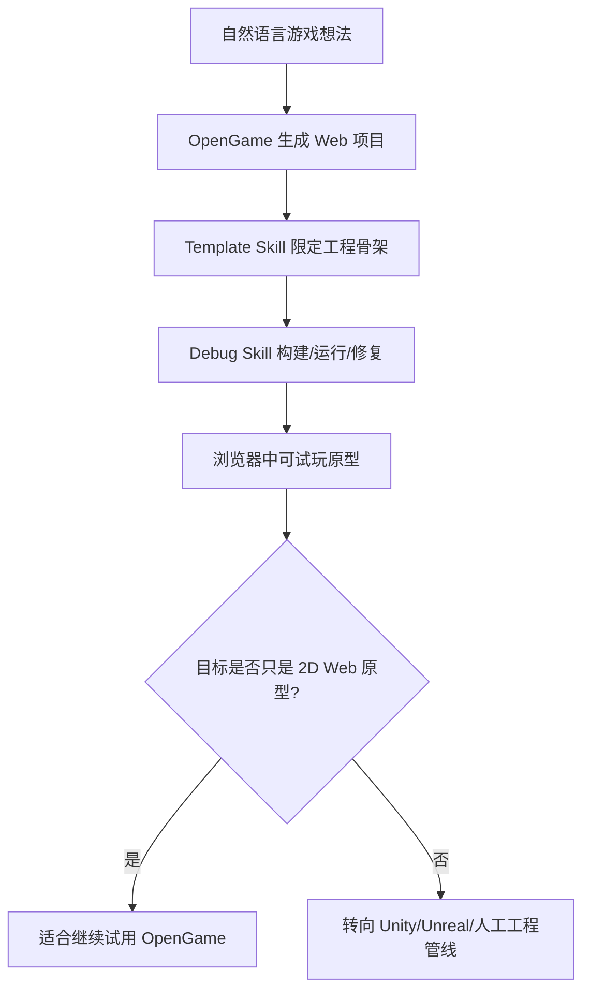
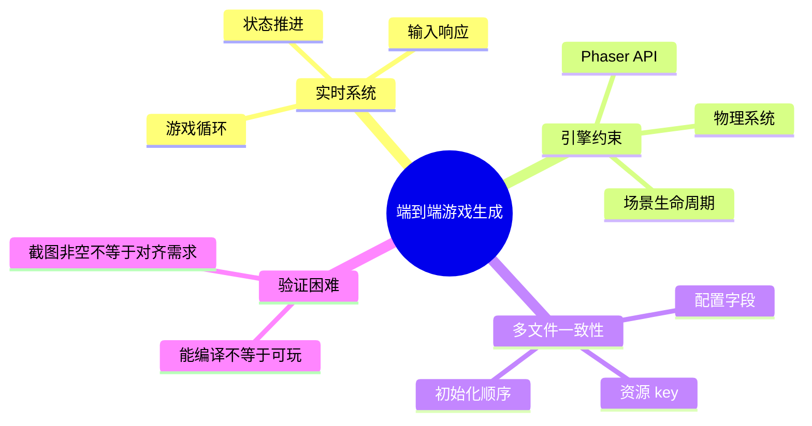
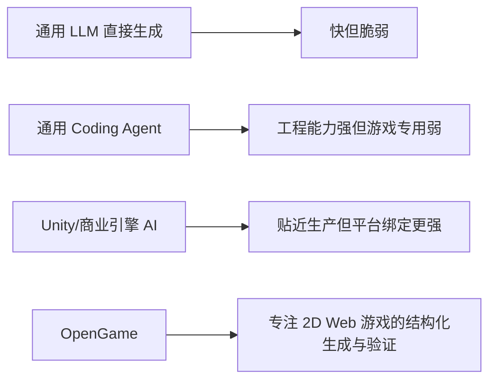
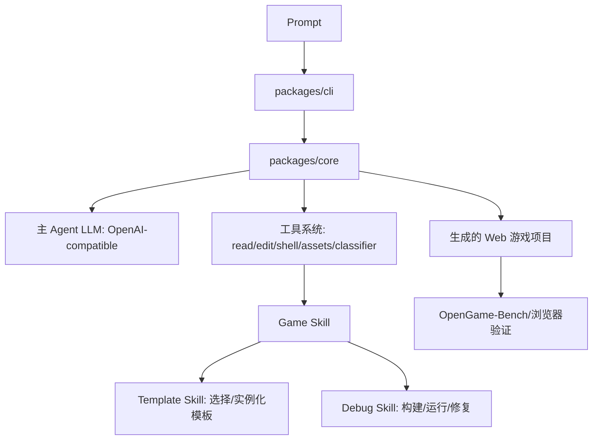
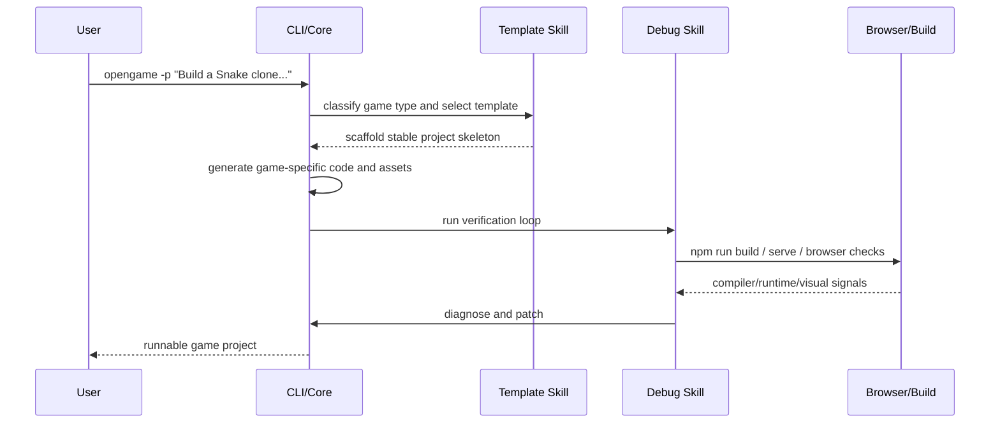
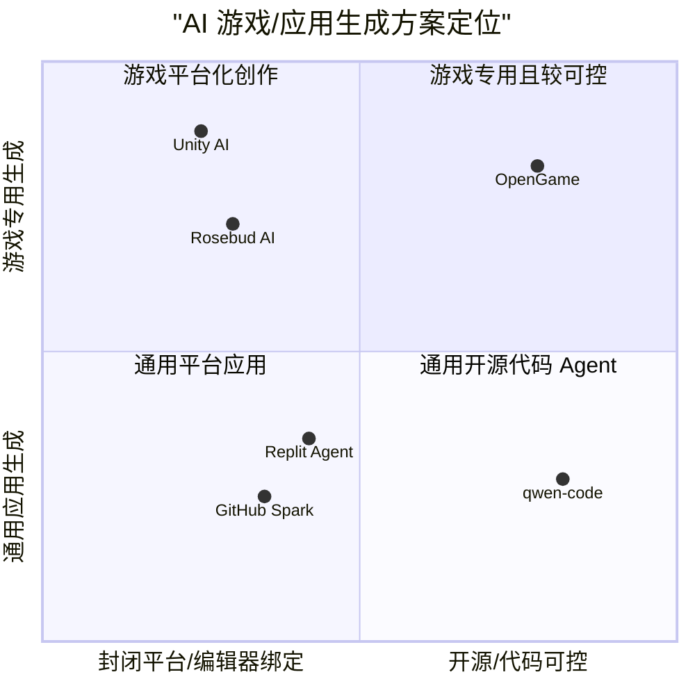
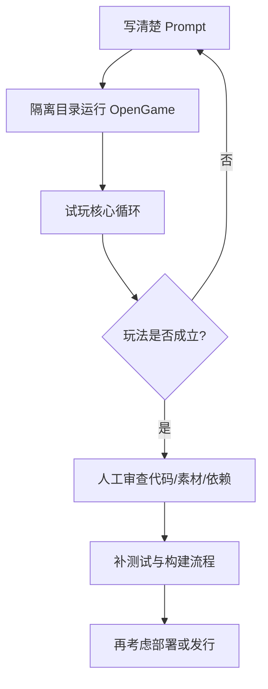
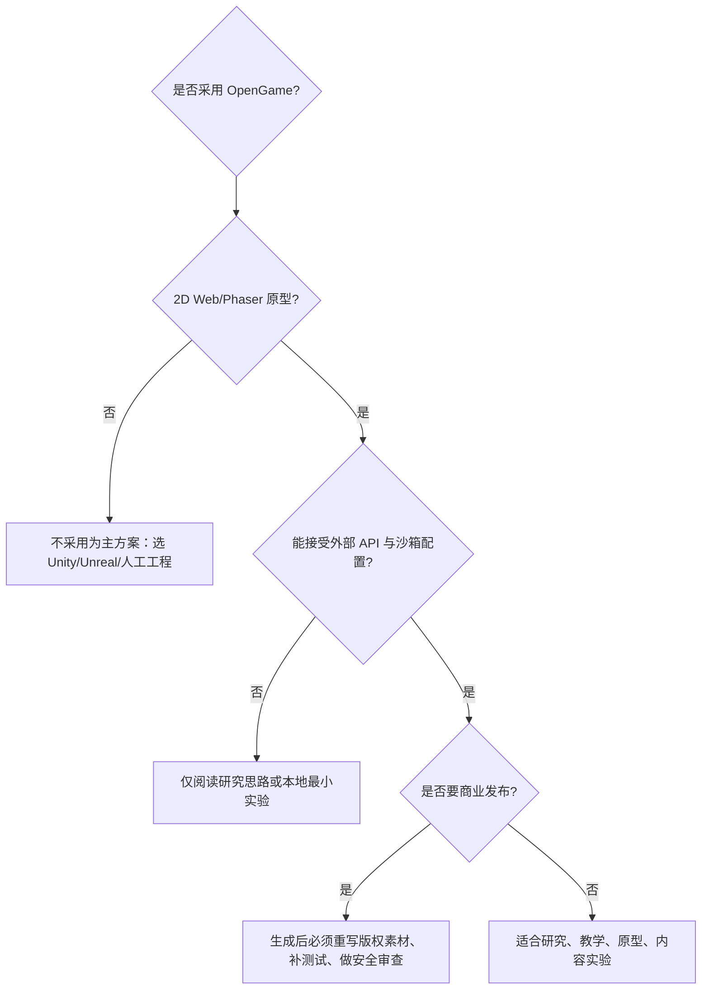

## OpenGame 项目解读: 如何用 AI 开发 2D 网页游戏

### 作者
digoal

### 日期
2026-04-25

### 标签
OpenGame , 游戏开发 , AI 

----

## 背景

## 开篇判断

我的观点：OpenGame 的真正价值，不是又做了一个“用一句话生成小游戏”的演示，而是把网页游戏生成拆成了可积累的工程系统：模板先约束结构，调试协议再消化反复出现的集成错误，最后用动态浏览器评测判断游戏是否真的可玩。

成立前提：你的目标是 2D Web 游戏、可接受 Phaser/Canvas/three.js 等网页技术栈、愿意配置外部模型和多模态资产服务，并且把 OpenGame 视为“生成可试玩原型和研究工作流”的工具，而不是替代完整商业游戏团队。

支撑证据：OpenGame README 将项目定义为“from a prompt”生成端到端网页游戏的开源 agentic framework，并明确核心由 Game Skill、GameCoder-27B、OpenGame-Bench 构成；论文在 150 个浏览器游戏任务上报告 Build Health、Visual Usability、Intent Alignment 三维评测；GitHub 页面显示项目采用 Apache-2.0 license，主语言为 TypeScript，当前无 GitHub release。

如果前提崩塌：如果你要做 3D 大型商业游戏、强美术管线、多人后端、移动端发行、主机平台或商业级 Unity/Unreal 工程，OpenGame 不应是主方案；更合理的是 Unity AI/Unity Editor 工作流、人工游戏工程团队，或把 OpenGame 限定为早期概念验证。



## 背景：游戏生成为什么比普通代码生成更难

普通代码 Agent 常见任务是修一个函数、补一段业务逻辑、改一个页面；游戏生成的难点在于多个系统必须同时一致：实时循环、物理、场景切换、资源 key、碰撞层、输入事件、胜负状态、UI 反馈和音画资产。论文把通用 LLM 在端到端游戏生成中的典型失败归纳为三类：逻辑不一致、引擎知识缺口、跨文件不一致。这解释了为什么“单文件 HTML5 小游戏”看起来容易，而“多文件、可维护、可调试的 Phaser 项目”会迅速失控。

OpenGame 选择 Web 2D 游戏作为切入点是务实的。Phaser 官方文档称 Phaser 是面向 HTML5 的开源游戏框架，支持 WebGL/Canvas、JavaScript/TypeScript 和桌面/移动浏览器。相比 Unity/Unreal 的 GUI、二进制资产和编辑器工作流，Phaser 的文本化工程结构更适合代码 Agent 读写。



## 场景：谁应该关心它

OpenGame 更适合四类人：

| 角色 | 典型场景 | OpenGame 能帮什么 |
| --- | --- | --- |
| 独立开发者 | 想快速验证玩法原型 | 从提示词生成可运行的 Web 项目 |
| 教育者 | 把知识点做成互动游戏 | 生成小型 quiz、卡牌、平台跳跃类教学游戏 |
| 内容创作者 | 用热点主题做传播型小游戏 | 快速产出可演示版本和素材组合 |
| AI/软件工程研究者 | 研究 Agentic Coding 的长链路任务 | 使用 OpenGame-Bench 思路评估 build、视觉、意图对齐 |

不适合的场景也要说清楚：它不是商业游戏发行流水线，不保证版权安全的角色/素材，不提供默认 API key，也没有在 README 中承诺 npm 正式发布已经完成。

## 痛点：传统“让大模型直接写游戏”哪里会坏

痛点一：单次生成没有稳定骨架。模型可能写出几个看似合理的文件，但场景生命周期、配置字段、资源加载和事件绑定之间互相不匹配。

痛点二：调试知识无法积累。今天修过的资源 key 错误、场景跳转错误、构建错误，明天换一个 prompt 又重新犯一遍。

痛点三：评测标准太低。能编译不代表能玩；画面有内容不代表符合 prompt；能跑几秒也不代表有胜负闭环。

我的观点：游戏 Agent 的核心不是“更会写代码”，而是“更会把工程约束提前固化，并把执行反馈变成下一次生成的经验”。

成立前提：生成目标是可脚本化执行、可浏览器验证、工程结构可以模板化的 Web 游戏。

支撑证据：论文的 ablation 显示，去掉 Hook-Driven Implementation 后 Build Health 从 72.4 降到 62.3，Intent Alignment 从 65.1 降到 53.5；这说明结构约束不是装饰，而是影响可运行性的核心机制。

如果前提崩塌：如果项目需要大量手工美术、复杂叙事设计、联网后端、物理精度或商业发行约束，应该把 AI 当辅助工具，而不是端到端交付者。

## 传统方案与问题

| 方案 | 优点 | 关键问题 | 什么时候仍然正确 |
| --- | --- | --- | --- |
| 直接让通用 LLM 写 Phaser/HTML5 | 快、门槛低 | 多文件一致性差，缺少动态验证 | 一次性教学 demo、非常简单玩法 |
| Cursor/Replit/GitHub Spark 这类通用 Agent | 通用工程能力强，生态成熟 | 不是专门为游戏循环、物理、素材、玩法评测设计 | 做普通 Web App、全栈应用、内部工具 |
| Unity AI/Unity Editor 流程 | 贴近商业游戏引擎和资产管线 | 编辑器依赖更强，自动化与开源可复现成本不同 | 商业游戏、复杂 3D、成熟团队协作 |
| 手工 Phaser/Unity 开发 | 可控性最高 | 成本高，原型速度慢 | 生产级项目、质量和版权要求高 |



## OpenGame 的产品解法

OpenGame 是一个命令行驱动的开源 Agent 框架。README 给出的当前使用方式是 headless mode：用户在空目录中输入 prompt，`opengame` 生成游戏项目，完成后打开 `index.html` 或运行生成项目提示的 dev server 来试玩。

它的方案可以拆成三层：

1. Agent 框架层：继承并扩展 qwen-code/Gemini CLI 风格的终端 Agent，包含 CLI、core、工具系统、沙箱和配置。
2. 游戏工程层：Game Skill 用 Template Skill 选择稳定项目骨架，用 Debug Skill 反复构建、运行、诊断和修复。
3. 评测与模型层：GameCoder-27B 提供游戏领域代码模型能力，OpenGame-Bench 用浏览器执行和 VLM 判断评估可玩性。



## 架构原则：先收窄搜索空间，再让 Agent 写代码

DeepWiki 对仓库的结构分析显示，OpenGame 主要由 `packages/cli` 和 `packages/core` 构成：CLI 负责用户输入、终端显示、命令和配置；core 负责与模型 API、工具执行、会话状态、文件系统和 provider 配置交互。工具位于 `packages/core/src/tools/`，包括文件读写、shell、资产生成、游戏类型分类等能力。

Template Skill 的思路是从最小元模板 M0 出发，逐步积累模板库 L。DeepWiki 将其流水线概括为 Collector、Classifier、Extractor、Abstractor、Merger；论文进一步说明，模板家族会逐渐形成五类常见游戏结构：重力侧视、俯视连续运动、离散网格逻辑、路径与波次、防守/策略、UI 驱动玩法。

Debug Skill 则维护一个 living debugging protocol P。每次构建、测试或运行失败，系统把错误签名、根因和已验证修复记录下来；下一次遇到类似资源 key、配置字段、场景跳转、初始化顺序错误时，就不必从零定位。



## 效果对比：论文数据支持什么，不支持什么

论文在 OpenGame-Bench 的 150 个浏览器游戏任务上报告三项指标，每项 0 到 100：Build Health、Visual Usability、Intent Alignment。OpenGame + Claude Sonnet 4.6 的结果是 BH 72.4、VU 67.2、IA 65.1；论文称它相对最强基线 Cursor + Claude Sonnet 4.6 分别高 5.6、5.8、6.2 分。

| 系统 | Build Health | Visual Usability | Intent Alignment |
| --- | ---: | ---: | ---: |
| Cursor + Claude Sonnet 4.6 | 66.8 | 61.4 | 58.9 |
| qwen-code + Claude Sonnet 4.6 | 63.2 | 54.3 | 57.8 |
| OpenGame + GameCoder-27B | 63.9 | 57.0 | 54.1 |
| OpenGame + Claude Sonnet 4.6 | 72.4 | 67.2 | 65.1 |

必须注意数据边界：这些数字来自项目论文，不是第三方复现实验；论文也承认即使完整 OpenGame 仍有约 34.9% 的加权机制需求未完全满足。也就是说，OpenGame 的结果支持“专用结构化 Agent 能显著改善 2D Web 游戏生成”，不支持“自然语言已经能稳定交付任意游戏”。

```mermaid
xychart-beta
  title "OpenGame-Bench 论文主结果"
  x-axis ["Cursor Claude", "qwen-code Claude", "OpenGame GameCoder", "OpenGame Claude"]
  y-axis "Score" 0 --> 80
  bar "Build Health" [66.8, 63.2, 63.9, 72.4]
  bar "Intent Alignment" [58.9, 57.8, 54.1, 65.1]
```



我的观点：OpenGame 的数据最有说服力的地方，是 ablation，而不是榜单第一。去掉模板方法、三层阅读、物理优先分类、成熟模板库或 living protocol，指标都会下降，这证明收益来自系统设计，而不是只靠换更强模型。

成立前提：论文实验设置可信，150 个任务代表了常见 2D Web 游戏 prompt，并且评测 pipeline 对各系统足够公平。

支撑证据：论文 Table 3 显示去掉 Hook-Driven Implementation 使 IA 下降 11.6；Table 4 显示从静态骨架 + 静态规则提升到完整模板库 + living protocol，BH 从 60.5 到 72.4，IA 从 51.2 到 65.1。

如果前提崩塌：如果第三方复现发现 prompt、基线配置或 VLM judge 偏向 OpenGame，那么应把该论文视为“有启发的系统设计案例”，而不是采纳依据。

## 竞品比较：OpenGame 的差异在“游戏专用可验证闭环”

| 项目/产品 | 定位 | 优势 | 相对 OpenGame 的差异 |
| --- | --- | --- | --- |
| Replit Agent | 从自然语言构建、检查、修复和部署应用 | 平台完整，适合 Web App 和生产部署 | 泛应用 Agent，不是专门围绕 Phaser 游戏模板和 playability benchmark |
| GitHub Spark | 自然语言、可视化、代码方式构建并发布智能应用 | GitHub/Copilot/部署生态强 | 面向 full-stack intelligent apps，不强调游戏物理、资源一致性和浏览器游戏评测 |
| Rosebud AI | 浏览器内创建 2D/3D 游戏和世界 | 用户门槛低，社区和模板导向强 | 更像创作平台；OpenGame 更偏开源研究框架和本地 CLI/代码工程 |
| Unity AI | Unity Editor 内的 AI 工具套件 | 贴近商业引擎、资产和编辑器上下文 | 更适合 Unity 生产工作流；OpenGame 更适合文本化 Web 项目和可复现实验 |
| Phaser 原生开发 | 成熟开源 HTML5 游戏框架 | 控制力和可维护性最高 | 需要开发者自己写工程；OpenGame 是在 Phaser 等技术栈上自动生成 |



## 使用场景

| 场景 | 症状 | 为什么 OpenGame 有帮助 | 验证信号 | 注意事项 |
| --- | --- | --- | --- | --- |
| 快速玩法原型 | 想法多，工程起步慢 | prompt 到 Web 项目，模板减少空白工程成本 | 能打开 `index.html` 或 dev server 试玩 | 结果仍需人工审查玩法与版权 |
| 教学互动游戏 | 知识点想游戏化 | 适合 quiz、卡牌、平台跳跃等 2D 表达 | 学生能通过浏览器交互 | 题库、评分逻辑需人工校验 |
| Agent 研究 | 想评估复杂交互代码生成 | OpenGame-Bench 提供动态评测范式 | build、截图、交互、VLM judge | benchmark pipeline README 称将来发布，当前需关注开放程度 |
| 低成本内容实验 | 想快速做热点主题 demo | 多模态资产 provider 可组合 | 生成项目包含画面、音效、玩法 | 热点 IP 可能有版权风险 |
| Phaser 项目脚手架 | 不想从零搭模板 | Template Skill 提供稳定结构 | 文件结构、配置、生命周期清晰 | 复杂业务仍要人接管 |

## 最佳实践

1. 先把 prompt 写成产品需求，而不是一句灵感。至少包含玩法类型、胜负条件、输入方式、关卡/敌人/资源、视觉风格和不可接受行为。
2. 控制第一版范围。先做一个核心循环可玩的版本，再扩展关卡、剧情、音效和复杂 UI。
3. 把 API key 分权限配置。README 和 `.env.example` 都强调 OpenGame 不内置默认凭据；主 Agent LLM 使用 `OPENAI_API_KEY` / `OPENAI_BASE_URL` / `OPENAI_MODEL`，资产/GDD provider 使用 `OPENGAME_REASONING_*`、`OPENGAME_IMAGE_*`、`OPENGAME_VIDEO_*`、`OPENGAME_AUDIO_*`。
4. 对 `--yolo` 保持谨慎。README 的 quick start 使用 `--yolo` 允许 shell 命令；headless 文档说明默认 auto-edit 允许写文件但不允许 shell，`--yolo` 才允许 shell。生产机器上建议使用沙箱或隔离目录。
5. 生成后必须人工 code review。重点看授权素材、外部 API 调用、依赖、构建脚本、用户输入处理和资源文件体积。
6. 把 OpenGame 输出当作“可运行草稿”，不是最终架构。真正上线前要补测试、压缩资产、处理加载失败、加入遥测和错误报告。



## 上手步骤

以下命令来自 README 和官方文档，按“源码安装”路径整理。

```bash
# Node.js 20+
curl -qL https://www.npmjs.com/install.sh | sh

git clone https://github.com/leigest519/OpenGame.git
cd OpenGame
npm install
npm run build
npm link
```

配置主 Agent LLM：

```bash
export OPENAI_API_KEY="your-api-key-here"
export OPENAI_BASE_URL="https://api.openai.com/v1"
export OPENAI_MODEL="gpt-4o"
```

配置资产/GDD provider。示例来自 README 和 `docs/users/configuration/api-keys.md`，不同模态可混用不同 provider：

```bash
export OPENGAME_REASONING_PROVIDER=openai-compat
export OPENGAME_REASONING_API_KEY="sk-..."
export OPENGAME_REASONING_BASE_URL="https://api.openai.com/v1"
export OPENGAME_REASONING_MODEL="gpt-4o-mini"

export OPENGAME_IMAGE_PROVIDER=tongyi
export OPENGAME_IMAGE_API_KEY="sk-..."
```

生成一个游戏：

```bash
cd agent-test
mkdir -p games/my-game
cd games/my-game
opengame -p "Build a Snake clone with WASD controls and a dark theme." --yolo
```

运行 demo 的 README 命令：

```bash
unzip demo_*.zip
cd demo_*
npm install
npm run dev   # opens at http://localhost:5173
```

如果不想默认允许 shell，参考 headless 文档：

```bash
opengame -p "Build a Snake clone with WASD controls and a dark theme."
opengame -p "Build a Snake clone..." --approval-mode default
opengame -p "Build a Snake clone..." --approval-mode yolo
```

排错检查：

| 问题 | 检查点 |
| --- | --- |
| CLI 找不到 `opengame` | 确认 `npm link` 成功，当前 shell 的 PATH 包含 npm global bin |
| 资产生成失败 | 检查对应 `OPENGAME_IMAGE_*`、`OPENGAME_VIDEO_*`、`OPENGAME_AUDIO_*` |
| GDD/分类失败 | 检查 `OPENGAME_REASONING_*` |
| 写文件但不执行命令 | headless 默认 auto-edit 允许写文件，shell 需要 `--yolo` 或 approval mode |
| 生成项目跑不起来 | 回到生成目录，查看 OpenGame 输出的 build/dev 命令和浏览器 console |

## 风险、边界与失败条件

风险一：证据开放度仍有限。论文给出了 OpenGame-Bench 设计和结果，但 README 写明 evaluation pipeline will be released soon。若完整 benchmark、prompt、judge 配置尚未完全开放，第三方复现要打折。

风险二：项目还很新。GitHub 页面显示 2026-04-21 才正式发布，当前没有 GitHub releases；README 也说 “while we prepare the npm release”。这意味着 API、目录、配置名和运行体验可能快速变化。

风险三：外部 provider 复杂。OpenGame 不内置凭据，图像、视频、音频、reasoning provider 独立配置。真实成本、限流、隐私和内容合规由使用者承担。

风险四：版权和品牌内容。README demo 使用 Marvel、Harry Potter、Star Wars、Squid Game 等知名 IP 风格 prompt。内部研究可以展示能力，但商业使用必须重新设计原创素材、角色和叙事。

风险五：游戏质量上限。论文显示 Puzzle/UI、Strategy 等抽象逻辑类玩法 IA 更低；这是合理的，因为逻辑错误不一定触发编译或 runtime 崩溃，浏览器截图也难以发现深层规则不一致。



## 结论

OpenGame 值得关注的原因，不是“AI 终于能一键做游戏”，而是它把 Agentic Coding 从泛代码生成推进到了一个更硬的问题：如何把自然语言、引擎结构、多文件一致性、资产生成、构建执行和动态评测放进同一个闭环。

我的最终建议：

| 条件 | 建议 |
| --- | --- |
| 做 2D Web 游戏原型、教学互动、Agent 研究 | 可以试用 OpenGame |
| 做商业级游戏、复杂 3D、多人联网、大型内容管线 | 不要把 OpenGame 当主方案 |
| 想研究 AI Coding 的下一步 | 重点看 Game Skill、Debug Skill、OpenGame-Bench，而不是只看 GameCoder-27B |
| 想落地到团队流程 | 先小范围 sandbox 试验，再建立人工审核、版权审核、测试和部署流程 |

## 参考资料

- OpenGame GitHub README: https://github.com/leigest519/OpenGame
- OpenGame raw README: https://raw.githubusercontent.com/leigest519/OpenGame/main/README.md
- OpenGame project page: https://www.opengame-project-page.com/
- OpenGame arXiv paper: https://arxiv.org/abs/2604.18394
- OpenGame headless docs: https://raw.githubusercontent.com/leigest519/OpenGame/main/docs/users/features/headless.md
- OpenGame provider configuration docs: https://raw.githubusercontent.com/leigest519/OpenGame/main/docs/users/configuration/api-keys.md
- OpenGame package.json: https://raw.githubusercontent.com/leigest519/OpenGame/main/package.json
- OpenGame `.env.example`: https://raw.githubusercontent.com/leigest519/OpenGame/main/.env.example
- OpenGame CONTRIBUTING: https://raw.githubusercontent.com/leigest519/OpenGame/main/CONTRIBUTING.md
- DeepWiki: `leigest519/OpenGame` wiki TOC and architecture Q&A, accessed via `npx --yes @seflless/deepwiki`
- Phaser official docs: https://docs.phaser.io/phaser/getting-started/what-is-phaser
- Replit Agent official page: https://replit.com/products/agent
- Replit Agent docs: https://docs.replit.com/core-concepts/agent
- GitHub Spark official page: https://github.com/features/spark
- GitHub Spark docs: https://docs.github.com/en/copilot/tutorials/spark/your-first-spark
- Rosebud AI official page: https://rosebud.ai/
- Unity AI official page: https://unity.com/muse

  
#### [PostgreSQL 解决方案集合](../201706/20170601_02.md "40cff096e9ed7122c512b35d8561d9c8")
  
  
#### [德哥 / digoal's Github - 公益是一辈子的事.](https://github.com/digoal/blog/blob/master/README.md "22709685feb7cab07d30f30387f0a9ae")
  
  
#### [About 德哥](https://github.com/digoal/blog/blob/master/me/readme.md "a37735981e7704886ffd590565582dd0")
  
  

  
