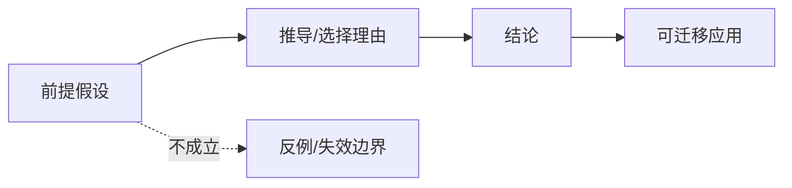

# Axiom Explainer

## Overview

Generate a clear Chinese teaching article for students from a single viewpoint, axiom, theorem, law, principle, or theory system. The output must be Markdown, visually rich, and saved under the current project's `markdown/` directory.

## Workflow

1. Identify the input type:
   - Axiom or postulate: explain that it is not proven inside the system. Describe why people choose it, what problem it solves, what assumptions it introduces, and what changes if it is replaced.
   - Theorem or proposition: trace the axioms, definitions, lemmas, and reasoning chain that support it. Give an intuitive proof first, then a concise formal skeleton when useful.
   - Viewpoint, law, principle, or theory system: rewrite it as claims plus assumptions, then explain its evidence chain, mechanism, scope, and failure cases.

2. Scope the audience:
   - Default to middle-school or high-school students unless the user specifies another level.
   - Use concrete analogies before abstract notation.
   - Define specialized terms at first use.
   - State any simplifications made for readability.

3. Verify the concept:
   - Use reliable references when the derivation, history, statement, or applicability is uncertain.
   - Prefer primary sources, standard textbooks, official course notes, or authoritative encyclopedia references.
   - Do not invent historical stories, theorem proofs, or real-world applications.
   - If a topic has multiple versions, name the version being explained.

4. Create visuals:
   - Include at least one Mermaid diagram.
   - Include at least one additional visual form: ASCII/TXT diagram, Markdown table, timeline, or inline SVG.
   - Use visuals to explain causal chains, assumption boundaries, proof structure, transfer paths, or failure cases.
   - Do not use decorative visuals that do not teach anything.

5. Write and save:
   - Create `markdown/` in the current project if it does not exist.
   - Save the article as `markdown/YYYYMMDD-<topic-slug>.md`.
   - Use a readable topic slug. Pinyin or short English is preferred; Chinese is acceptable when clearer.
   - In the final response, report the saved file path and a short summary. Do not paste the full article unless the user asks.

## Article Structure

Use this structure unless the user asks for a different format:

```markdown
# <主题>: 一句话讲透

> 面向对象: <学生层级>
> 核心问题: <这篇文章要解决的困惑>
> 先说结论: <用一两句话说清楚它到底是什么>

## 一张图先看懂

<Mermaid 概念图、推导图、边界图或迁移图>

## 求真讲法

### 它到底说了什么

<用学生能听懂的语言重述>

### 它是怎么来的

<公理讲动机和选择理由；定理讲推导链；观点讲证据链>

### 它依赖哪些假设

<列出前提、定义、理想化条件、隐含边界>

### 常见误解

<说明哪些说法看似相近但其实不对>

## 求存讲法

### 它有什么用

<原生领域的作用>

### 它怎么迁移到熟悉领域

<从诞生领域迁移到学习、工作、生活、管理、技术或商业等领域>

### 它的适用范围和边界

<说明什么条件下有效，什么条件下不能乱用>

### 正例: 怎么用它提升能力

<学习、工作或生活中的可操作例子>

### 反例: 前提不成立会怎样

<实际生活或工作中的失败例子，突出逻辑判断和洞察>

## 思考

<发人深省的拓展问题、反事实设问、跨学科联系>

## 最后记住

<3-5 条可复述要点>

## 参考资料

<列出参考来源；没有联网时说明基于通用知识和已知教材体系>
```

## Explanation Standards

- Teach from concrete to abstract: story or现象 -> intuition -> formal statement -> example -> boundary.
- Keep "求真" and "求存" separate: first explain why it is true or why it is accepted, then explain why it matters and where it works.
- For axioms, never say the axiom was "proved" from inside the same axiom system. Use "动机、选择理由、等价表达、独立性、模型解释" instead.
- For theorems, separate "直观理解" from "严格证明". If the full proof is too long, provide a reliable proof skeleton and name the missing lemmas.
- For viewpoints, expose the hidden assumptions and show what evidence would make the viewpoint stronger or weaker.
- Explain assumptions twice when useful: once in "求真讲法" as logical premises, once in "求存讲法" as practical boundaries.
- Use examples that students can observe, summarize, and reuse. Prefer school, home, work, collaboration, technology, money, time, and decision-making examples.
- Include at least one positive example and one negative example. The negative example must fail because a named assumption is false, not because the person "did it wrong" vaguely.
- Use concise headings and short paragraphs. Avoid empty motivational language.
- Mark uncertain claims explicitly instead of overstating them.

## Visual Standards

Use diagrams as teaching tools:



Useful visual patterns:

- Mermaid flowchart for assumption -> reasoning -> conclusion -> application.
- Mermaid timeline for historical development.
- TXT/ASCII diagram for simple contrasts or before/after relationships.
- Markdown table for "前提成立/前提不成立" comparisons.
- Inline SVG for geometric, spatial, set, or coordinate relationships.

Do not add fake image URLs. If using an external image, cite its source and make sure it directly supports the explanation.

## Final Checks

Before finishing, verify:

- The article is saved under the current project's `markdown/` directory.
- The Markdown contains the three required parts: `求真讲法`, `求存讲法`, and `思考`.
- The explanation names the assumptions behind the concept.
- The article includes at least one Mermaid diagram and one additional visual/table/SVG/TXT figure.
- The article includes positive and negative examples tied to the assumptions.
- The article distinguishes derivation, proof, motivation, and applicability boundaries correctly.
- The final response gives the saved path and does not flood the user with the full article.
