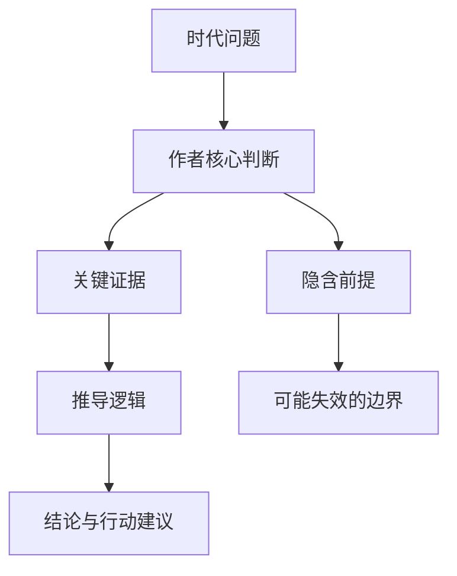
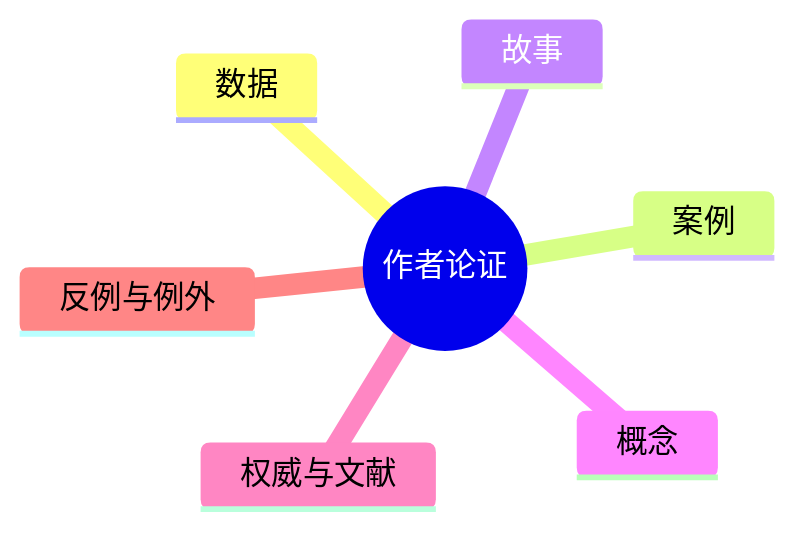

# Reading Note Framework

Use this reference after gathering book metadata and high-quality source material.

## What a Good Reading Note Looks Like

A good reading note is not a plot recap or a loose collection of quotes. It should let a reader answer five questions:

1. Why did this book need to exist?
2. What is the author trying to make us believe, see, or do?
3. How does the author support that attempt?
4. Under what assumptions is the argument strong or weak?
5. What can we transfer into our own judgment, work, and life?

The note should work for three use cases:

- Personal review: preserve the core thinking and your reflection.
- Public sharing: make the book understandable to people who have not read it.
- Oral explanation: provide enough structure to explain the book in a short talk.

## Recommended Markdown Structure

Use this structure unless the book clearly calls for a different one.

```markdown
# 《书名》读书笔记：副标题式判断

> 一句话结论：...
> 适合谁读：...
> 我的评价：...

## 1. 书籍档案与资料来源

## 2. 时代背景：这本书在回应什么问题

## 3. 作者想表达什么

## 4. 作者如何证明：数据、案例、故事与概念

## 5. 书中的1-3个浓缩例子

## 6. 论证逻辑图

## 7. 前提假设与反方观点

## 8. 作者真正的思想

## 9. 我读完学到了什么

## 10. 如何举一反三

## 11. 我的反思与讨论问题

## 12. 分享版：3-5分钟讲稿

## 13. 来源与延伸阅读
```

## Analysis Prompts

Use these questions while writing:

- Historical context: What social, technological, political, economic, academic, or personal context shaped the book?
- Author's purpose: Is the author explaining, persuading, warning, defending, attacking, teaching, or confessing?
- Central thesis: Can the thesis be written as "The world is not A, but B, therefore we should C"?
- Evidence: Which evidence is strongest? Which evidence is vivid but weak? Which evidence is missing?
- Condensed examples: Which 1-3 examples from the book can carry the whole argument? For each, explain the scene, the point it proves, and how it changes the reader's mental model.
- Logic: Does the author reason by causality, comparison, chronology, classification, incentives, systems, psychology, or moral argument?
- Assumptions: What must the author assume about human nature, institutions, markets, technology, history, or culture?
- Boundaries: Where does the thesis stop working?
- Reader change: What mental model should the reader have after reading?
- Transfer: What decision rule, checklist, metaphor, or model can be reused elsewhere?
- Reflection: What do you agree with, reject, doubt, or want to test?

## Visual Patterns

Choose visuals that clarify thinking rather than decorate the note.

## Condensed Example Format

Use this format for each book example:

```markdown
### 例子一：短标题

- 书中发生了什么：用3-6句话压缩原案例或故事。
- 作者借它证明什么：说明它服务于哪个观点。
- 这个例子的关键机制：指出因果、激励、心理、制度、技术或历史机制。
- 我的迁移理解：说明这个例子能如何用于其他场景。
```

For nonfiction, choose cases, experiments, historical events, business examples, research findings, or personal stories. For fiction, choose scenes, character decisions, conflicts, or symbols that reveal the book's core concern. Do not fabricate details if only secondary summaries are available; mark the example as source-limited when necessary.

### Argument Flow



### Evidence Map



### Assumption Table

| 前提假设 | 支撑材料 | 可能反例 | 我的判断 |
|---|---|---|---|
|  |  |  |  |

### Transfer Matrix

| 书中思想 | 可迁移场景 | 使用方法 | 风险 |
|---|---|---|---|
|  |  |  |  |

### Minimal Inline SVG

Use inline SVG only when Mermaid or tables are insufficient. Keep SVG small and readable in Markdown.

```html
<svg width="720" height="160" viewBox="0 0 720 160" xmlns="http://www.w3.org/2000/svg" role="img" aria-label="book idea ladder">
  <rect x="20" y="40" width="130" height="60" fill="#f5f5f5" stroke="#333"/>
  <text x="85" y="76" text-anchor="middle" font-size="16">问题</text>
  <path d="M150 70 H230" stroke="#333" marker-end="url(#arrow)"/>
  <rect x="230" y="40" width="130" height="60" fill="#f5f5f5" stroke="#333"/>
  <text x="295" y="76" text-anchor="middle" font-size="16">观点</text>
  <path d="M360 70 H440" stroke="#333" marker-end="url(#arrow)"/>
  <rect x="440" y="40" width="130" height="60" fill="#f5f5f5" stroke="#333"/>
  <text x="505" y="76" text-anchor="middle" font-size="16">证据</text>
  <path d="M570 70 H650" stroke="#333" marker-end="url(#arrow)"/>
  <text x="680" y="76" text-anchor="middle" font-size="16">行动</text>
  <defs>
    <marker id="arrow" markerWidth="10" markerHeight="10" refX="8" refY="3" orient="auto">
      <path d="M0,0 L0,6 L9,3 z" fill="#333"/>
    </marker>
  </defs>
</svg>
```

## Source Quality Ladder

Prefer sources in this order:

1. Official book, publisher, author, university, museum, archive, or journal pages.
2. Author interviews, talks, lectures, podcasts, and essays.
3. Scholarly reviews, academic papers, and serious professional reviews.
4. Reputable media, established magazines, major newspaper book sections.
5. High-signal long-form reader essays with clear citations and original analysis.
6. Aggregated summaries, anonymous posts, marketing blurbs, and unsourced short reviews.

Use level 6 only as weak context, never as primary evidence.

## Final Self-Check

Before saving, verify:

- The note names the book, author, edition, and source limitations.
- Every major factual claim has a source link or is marked as inference.
- The author's thesis, evidence, logic, and assumptions are explicit.
- The note includes 1-3 condensed examples from the book and explains what each example proves.
- There are at least two meaningful visuals.
- The note contains usable sharing material, not only private reflections.
- The final file is saved in the current project's `markdown/` directory.
