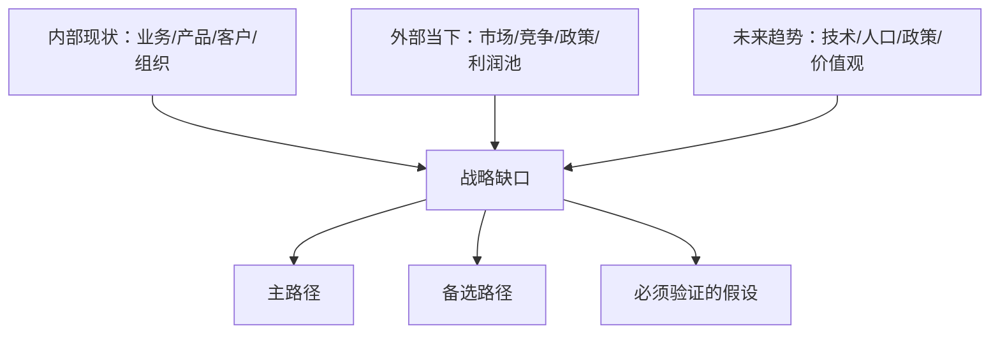

# 企业未来规划与建议书模板

使用本结构撰写最终 Markdown 报告。可根据企业语境调整标题，但不要省略必需分析部分。

## 文件规则

- 保存到当前项目的 `markdown/` 目录。
- 文件名格式：`enterprise-future-planning-<company>-YYYYMMDD-HHMM.md`。
- 在相关论断附近或文末来源清单中加入来源链接。
- 记录生成时间和网络调研覆盖的日期范围。

## 推荐开头

```markdown
# <企业名>未来规划与建议书

生成时间：YYYY-MM-DD HH:MM  
研究对象：<企业名、官网、主营业务一句话>  
规划周期：<1年/3年/5年，按用户要求或合理假设>  
结论置信度：高/中/低；哪些关键部分仍需内部数据验证
```

## 必需结构

### 1. 执行摘要

包括：

- 一句话核心判断。
- 主推荐路径。
- 备选路径。
- 3 个最重要风险。
- 30 天内第一行动。

### 2. 前提假设与信息缺口

| 类型 | 内容 | 置信度 | 验证方式 |
|---|---|---|---|
| 已知事实 |  | 高 | 来源/用户提供 |
| 推断 |  | 中 |  |
| 假设 |  | 中/低 |  |
| 未知项 |  | 需验证 |  |

说明：“如果假设 X 不成立，建议 Y 应调整为 Z。”

### 3. 企业画像

包括最小企业画像表：

| 维度 | 已知事实 | 推断 | 假设 | 未知项 | 规划含义 |
|---|---|---|---|---|---|
| 业务 |  |  |  |  |  |
| 产品 |  |  |  |  |  |
| 客户 |  |  |  |  |  |
| 运营 |  |  |  |  |  |
| 团队 |  |  |  |  |  |
| 资源 |  |  |  |  |  |
| 外部市场 |  |  |  |  |  |
| 未来趋势 |  |  |  |  |  |

增加一张紧凑示意图：



### 4. 内部诊断

子章节：

- 业务基本面：营收结构、利润结构、现金流、增长质量、资产负债风险。公开资料不足时标注缺口。
- 产品/服务结构：明星业务、现金牛、问题业务、探索业务。
- 客户资产：客户群体、集中度、复购、购买原因、痛点。
- 运营效率：人效、交付、供应链、研发转化、销售周期或可观察代理指标。
- 组织与人：创始人/高管、决策机制、人才结构、文化和执行约束。
- 资源与能力：牌照、专利、品牌、渠道、供应链、数据、核心流程能力。

### 5. 外部环境分析

必须包括：

- 有来源证据支持的行业规模、增长与利润池。
- 价值链与定价权。
- 客户需求与购买决策流程。
- 直接竞争者、替代方案、潜在进入者与合作地图。
- 相关时纳入当前宏观、信用、就业、贸易、政策与监管温度。

### 6. 行业、赛道、场景分析

使用表格：

| 候选赛道 | 需求驱动 | 利润池 | 客户预算 | 企业匹配度 | 进入难度 | 置信度 |
|---|---|---|---|---|---|---|

| 场景 | 客户痛点 | 当前替代做法 | 付费理由 | 企业切入点 | 验证方法 |
|---|---|---|---|---|---|

### 7. 未来趋势与战略缺口

分析：

- 技术断点以及 AI/自动化影响。
- 人口与社会结构变化。
- 长期政策锚点与供应链重构。
- 价值驱动的需求迁移。

使用下表：

| 未来趋势 | 威胁/机会 | 对当前优势的影响 | 所需能力 | 行动 |
|---|---|---|---|---|

### 8. 战略选项与推荐

提供 2-4 个选项：

| 选项 | 核心判断 | 所需资产 | 预期收益 | 关键风险 | 验证信号 |
|---|---|---|---|---|---|

然后给出建议：

- 主路径。
- 备选路径。
- 应拒绝的路径及原因。

### 9. 客户愿意付费的痛点与商机

对每个机会说明：

- 目标客户与预算负责人。
- 痛点频率、严重程度与紧迫性。
- 当前支出或替代做法。
- 为什么是现在。
- 为什么该企业有优势。
- 第一个可触达客户渠道。
- 付费模式与定价假设。

### 10. 产品/服务原型

描述：

- 产品/服务名称。
- 目标用户。
- 核心承诺。
- 主要流程。
- 交付物。
- 定价假设。
- 差异化。
- 数据、技术、交付与合规要求。

可选 SVG 草图：

```html
<svg width="760" height="260" viewBox="0 0 760 260" xmlns="http://www.w3.org/2000/svg">
  <rect x="20" y="40" width="190" height="80" fill="#f5f5f5" stroke="#333"/>
  <text x="115" y="85" text-anchor="middle" font-size="16">客户痛点/输入</text>
  <rect x="285" y="40" width="190" height="80" fill="#f5f5f5" stroke="#333"/>
  <text x="380" y="85" text-anchor="middle" font-size="16">企业能力/流程</text>
  <rect x="550" y="40" width="190" height="80" fill="#f5f5f5" stroke="#333"/>
  <text x="645" y="85" text-anchor="middle" font-size="16">可付费结果</text>
  <path d="M210 80 H285" stroke="#333" marker-end="url(#arrow)"/>
  <path d="M475 80 H550" stroke="#333" marker-end="url(#arrow)"/>
  <defs><marker id="arrow" markerWidth="10" markerHeight="10" refX="8" refY="3" orient="auto"><path d="M0,0 L0,6 L9,3 z" fill="#333"/></marker></defs>
</svg>
```

### 11. MVP 设计与验证

| MVP 步骤 | 范围 | 成本/时间 | 成功指标 | 停止/继续规则 |
|---|---|---|---|---|

保持 MVP 小于最终产品。在构建完整软件或重资产前，优先采用人工、服务先行、试点或管家式交付。

### 12. 参与方式、变现路径与团队

包括：

- 参与方式：自建、合作、渠道、OEM/ODM、咨询/服务、SaaS/产品、平台/生态、投资/并购或混合模式。
- 变现阶梯：试点费 -> 项目费 -> 年度/经常性合同 -> 产品化套餐 -> 适用时的平台/生态收入。
- 销售渠道：现有客户、主动外拓、经销商、行业协会、内容、招投标/采购、战略伙伴。
- 团队设计：负责人、销售、产品、交付、技术、运营、财务/合规、顾问。说明每个角色为何必要以及何时招聘。

### 13. 路线图

使用 30/90/180 天计划：

| 阶段 | 目标 | 行动 | 指标 | 复盘决策 |
|---|---|---|---|---|

### 14. 风险与回退方案

| 风险 | 早期信号 | 缓解措施 | 回退方案 |
|---|---|---|---|

### 15. 来源清单

列出来源标题、发布方、日期（如有）和 URL。

## 写作风格

- 使用“结论先行 + 前提 + 证据 + 推理 + 行动”。
- 语言直接、面向决策，并贴合具体企业。
- 避免口号、不可验证的赞美和泛泛的转型话术。
- 案例只能作为说明，不能作为市场真相的证明。
