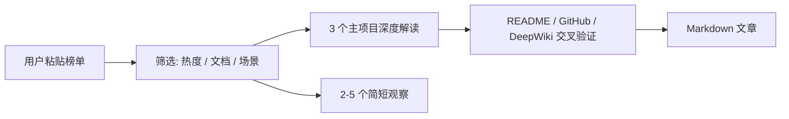

# GitHub 每周热门项目解读

## 目标

读取用户粘贴的 GitHub Trending 周榜或开源项目榜单内容，筛选值得关注的开源项目，先建立可验证的项目事实卡，再生成适合公众号发布的中文 Markdown 文章。

工作流：

`用户粘贴榜单内容 -> README / GitHub 项目页 -> DeepWiki -> 项目事实卡 -> 公众号文章 -> 当前项目 markdown 目录 -> 事实校验`

## 触发条件

用户询问以下内容时使用本技能：

- GitHub 每周热门项目
- GitHub Trending 周榜解读
- 每周开源热点分析
- 热门开源项目介绍
- 公众号开源项目推荐文章
- 本周值得关注的开源项目

## 数据来源优先级

| 来源 | 用途 | 可靠性要求 |
| --- | --- | --- |
| 用户粘贴的榜单内容 | 获取候选项目、语言、本周热度、简介、用户关注点 | 必须记录用户提供内容的时间和可解析字段 |
| GitHub 仓库页 | stars、license、默认分支、release、issue、贡献活跃度 | 以页面当前展示为准 |
| README / 官方文档 | 项目定位、核心能力、安装方式、官方示例 | 项目功能事实的主要来源 |
| DeepWiki MCP | 架构、代码组织、模块关系、实现机制 | 用于辅助理解，不单独作为商业采用或性能结论来源 |
| 官方博客 / 官方案例 / release note | 采用案例、路线图、重要变更 | 有明确链接才可引用 |

禁止把未验证信息写成事实。尤其不要编造公司采用案例、benchmark 结果、创始团队动机、融资信息、客户信息、性能优劣。

## 输出文件

默认输出 Markdown 文件：

```text
markdown/github-weekly-trending-YYYY-WW.md
```

其中 `YYYY` 为年份，`WW` 为 ISO 周数，例如 `2026-W15`。

在当前项目根目录下创建或复用 `markdown/` 目录。如用户指定路径或文件名，按用户要求执行。

## 操作步骤

### Step 1 - 解析用户粘贴的榜单内容

不要主动访问 `https://github.com/trending?since=weekly&spoken_language_code=` 获取榜单。以用户粘贴的内容作为候选项目输入。

记录：

- 处理时间和时区
- 输入来源：用户粘贴内容
- 若用户粘贴内容包含原始 URL、榜单类型、语言过滤或日期，原样记录
- 若缺少上述信息，标注“用户未提供”，不要补写成已知事实

从用户粘贴内容中解析候选项目：

- 项目名称：`owner/repo`
- 项目简介
- 主要语言
- 当前 stars
- 用户粘贴内容中展示的本周新增 stars 或热度指标
- 仓库地址

当用户只提供 `owner/repo` 或类似 `owner / repo` 的项目名时，自动补齐：

- 标准项目名：去掉 `/` 两侧空格，规范为 `owner/repo`
- GitHub 仓库地址：`https://github.com/owner/repo`
- DeepWiki MCP `repoName` 参数：使用同一个标准项目名 `owner/repo`

示例：用户提供 `microsoft / markitdown` 时，记录项目名为 `microsoft/markitdown`，仓库地址为 `https://github.com/microsoft/markitdown`，并在 DeepWiki MCP 中使用 `repoName: "microsoft/markitdown"`。

注意：“本周新增 stars”或热度指标以用户粘贴内容为准，不等同于完整历史审计数据。

如果用户粘贴内容无法解析出足够候选项目，先向用户请求补充榜单内容。不要自行抓取 GitHub Trending 页面替代用户输入。

### Step 2 - 筛选项目

默认选择 3 个主项目深度解读。用户指定数量时按用户要求执行。

优先选择：

- 周榜排名靠前
- 用户粘贴内容中本周新增 stars 或热度指标明显
- README 和文档信息充分
- 有清晰使用场景
- 对中文开发者或中国技术社区有参考价值

谨慎选择：

- 刚初始化、代码和文档很少的项目
- 没有 license 的项目
- README 只有愿景、缺少可验证功能的项目
- 主要信息来自营销页面而非代码或文档的项目

可以增加 2-5 个“简短观察”项目，但不要把每个项目都写成完整深度分析。

### Step 3 - 获取 README 和项目基础信息

优先通过 GitHub 仓库页识别默认分支和 README 文件。

README fallback 顺序：

1. GitHub 仓库首页渲染 README
2. `https://raw.githubusercontent.com/{owner}/{repo}/{default_branch}/README.md`
3. `README.rst`、`README.adoc`、`README.txt`
4. 仓库中的 `docs/` 或 README 指向的官方文档

同时记录：

- License
- 最近 release 或 tag
- 最近提交活跃度
- open issues / pull requests 的大致状态
- 官方文档地址，若存在

### Step 4 - 使用 DeepWiki 辅助理解

对每个主项目使用 DeepWiki MCP：

- `read_wiki_structure`：先查看可用文档结构
- `read_wiki_contents`：读取项目整体说明
- `ask_question`：针对架构、核心模块、实现机制、适用场景提问

建议提问：

- 这个项目的核心架构是什么？
- 主要模块如何协作？
- 它解决的核心技术问题是什么？
- 和常见同类方案相比，设计差异在哪里？
- 有哪些适合从代码或文档中验证的最佳实践？

DeepWiki 结论必须和 README、代码结构或官方文档交叉检查。不要仅凭 DeepWiki 写企业采用、商业化、融资、性能 benchmark。

### Step 5 - 建立项目事实卡

写文章前，先为每个主项目建立事实卡。事实卡可以不出现在最终文章中，但文章必须基于事实卡生成。

每张事实卡包含：

- 仓库：`[owner/repo](https://github.com/owner/repo)`
- 官方一句话定位
- 主要语言
- stars 和用户粘贴内容中的本周新增 stars 或热度指标
- license
- 最近 release / 活跃度摘要
- 核心能力：3-5 条，必须来自 README 或官方文档
- 架构摘要：来自 DeepWiki，并和仓库资料交叉验证
- 适用场景：区分事实和推断
- 已验证来源链接
- 不确定信息：明确列出，不得在正文中扩写成事实

### Step 6 - 生成文章

文章结构：

```markdown
# 主标题：项目名或本周趋势 + 核心价值

> 副标题：一句话说明本周看点

## 导言

## 本周趋势总览

## 一图看懂本周热点

## 项目一：owner/repo

### 项目定位
### 核心能力
### 架构或工作流图
### 为什么会火
### 适用场景
### 局限与风险

## 项目二：owner/repo

...

## 其他值得关注的项目

## 总结

## 参考资料
```

每个主项目必须包含：

- 项目定位：2-3 句话说明它解决什么问题，基于 README 或官方文档
- 核心能力：表格列出 3-5 个主要功能，只写可验证能力
- 架构或工作流图：优先使用 Mermaid，基于 README、官方文档、DeepWiki 交叉验证后的模块关系绘制；信息不足时省略
- 为什么会火：结合用户粘贴内容中的热度表现、技术趋势、开发者痛点分析，并明确区分事实和推断
- 适用场景：给出 2-3 个具体场景；若是推断，使用“适合用于”，不要写成“已经用于”
- 局限与风险：项目成熟度、文档完整度、生态依赖、license 或运维风险

## 图表规则

用 Mermaid 或 SVG 增强可读性，但不要为了装饰强行加图。默认优先使用 Mermaid，因为 Markdown 可维护、便于公众号二次编辑。

建议包含：

- 1 张“本周热点总览”图：展示候选项目 -> 筛选维度 -> 主项目 -> 简短观察项目。
- 每个主项目最多 1 张架构或工作流图：展示输入、核心模块、输出、外部依赖。
- 复杂竞品对比可以用 Mermaid quadrantChart、flowchart 或简洁表格，不要重复表达同一信息。

Mermaid 使用规则：

- 使用 `flowchart LR` 或 `flowchart TD` 表达流程、架构、模块关系。
- 使用简短节点文本，避免长句挤压版面。
- 节点内容必须来自 README、官方文档、代码结构或 DeepWiki 交叉验证结果。
- 对推断关系使用节点或图标题标注“推断”，不要画成确定事实。

SVG 使用规则：

- 仅当用户要求可直接发布的视觉图，或 Mermaid 无法表达清楚时使用内联 SVG。
- SVG 必须简洁、可复制到 Markdown，不依赖外部图片资源。
- 不要使用复杂渐变、装饰性图形或无法在公众号编辑器稳定显示的效果。

示例 Mermaid：



以下模块仅在有可靠来源时添加：

- 真实采用案例
- 竞品性能对比
- 可运行代码示例
- 创始团队或背后公司动机

如果没有可靠公开来源，写“未找到可靠公开来源”，不要补写。

## 竞品对比规则

竞品对比只比较可验证维度：

- 官方定位
- 核心功能
- 主要语言
- 部署方式
- License
- GitHub 活跃度
- 生态成熟度的可观察指标，例如 release、插件、文档、社区讨论

不要写无来源支持的性能结论。不要使用“全面领先”“碾压”“业界最佳”等不可验证表达。

## 代码示例规则

优先引用 README 或官方文档中的最小示例。

分级处理：

- 已本地运行：说明运行环境和结果
- 未本地运行但来自官方文档：标注“基于官方文档示例整理”
- 自行整理的伪代码或概念示例：明确标注“示意代码”

不要为了满足格式强行给每个项目写代码示例。

## 写作风格

- 面向有基础技术认知的中文开发者
- 专业、直接、避免夸张营销语
- 短句为主，少用长从句
- 多解释“为什么值得关注”，少堆功能清单
- 标题使用 `##` 和 `###`，避免超过 3 级标题
- 表格保持简洁，列数不要过多
- 事实和推断分开表达

## 质量校验

提交前逐项检查：

- [ ] 记录了处理时间、时区和用户粘贴内容中的来源信息
- [ ] 未主动抓取 GitHub Trending 页面作为候选项目来源
- [ ] 所有仓库地址可访问
- [ ] stars、license、语言信息来自 GitHub 当前页面或用户粘贴内容，并区分来源
- [ ] README / 官方文档链接可访问
- [ ] DeepWiki 结论没有被单独用作商业采用或性能事实
- [ ] 公司采用案例、benchmark、融资、团队动机都有可靠来源；否则删除或标注未知
- [ ] 竞品对比只包含可验证维度
- [ ] 代码示例标注了来源和验证状态
- [ ] Mermaid 或 SVG 图表只表达已验证事实或明确标注的推断，节点文本简短可读
- [ ] Markdown 标题层级、表格、链接格式正确
- [ ] 输出文件位于当前项目 `markdown/` 目录，除非用户指定其他路径
- [ ] 全文默认 3000-6000 字；若超过，优先压缩项目数量和重复背景介绍

## 失败和不确定情况

- 如果用户没有粘贴榜单内容，向用户请求输入，不要自行抓取 Trending 页面。
- 如果用户粘贴内容缺少 stars、本周新增 stars、语言等字段，可以用 GitHub 仓库页补充当前字段；缺少的榜单热度字段保持未知。
- 如果某项目 README 信息不足，降级为“简短观察”，不要做深度解读。
- 如果 DeepWiki 没有覆盖该项目，以 README、官方文档和仓库信息为主。
- 如果无法验证某个事实，保留不确定性，不要为了文章完整而补事实。
