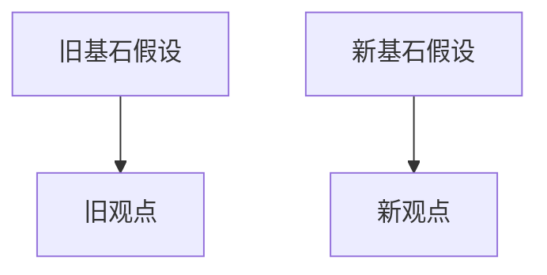

# Higher Order Article Writer

## Overview

Use this skill to transform an existing article into a sharper, higher-level article. The output must preserve the useful insight from the source, expose the assumptions beneath it, stress-test those assumptions, then build a new thesis with stronger logic, evidence, cases, and visual explanation.

Default to Chinese output unless the user explicitly asks for another language.

## Workflow

1. Collect the source material.
   - If the user gives a URL, fetch and read the page. If browsing is needed, use current web sources and cite links.
   - If the user gives article text or a local file, use that as the primary source.
   - If the source is paywalled, inaccessible, or too sparse, state the limitation and proceed only with the available text.

2. Digest the old article before writing.
   - Extract 3-7 core claims.
   - For each claim, identify the foundational assumption, supporting data, case evidence, and reasoning chain.
   - Compress the old article into one concise conclusion that includes: assumptions, claims, evidence, cases, and logic.
   - Do not start the new article until this extraction is coherent.

3. Audit the old logic.
   - Find unsupported leaps, hidden premises, causality/correlation confusion, missing counterexamples, stale data, selection bias, false dichotomies, and incentive blind spots.
   - Separate "the article is wrong" from "the article is incomplete under changed assumptions".
   - Keep useful claims when their assumptions still hold.

4. Rebuild with first principles.
   - Name the failed or fragile foundational assumption.
   - Replace it with a new foundational assumption grounded in observable mechanisms.
   - Derive the new thesis from constraints, incentives, resource flows, balance sheets, user behavior, technology limits, policy rules, or other primary mechanisms relevant to the topic.
   - Make the new viewpoint explicit, not merely "more balanced".

5. Support the new thesis.
   - Use authoritative current sources when facts, numbers, policies, market data, company data, or public figures may have changed.
   - Prefer primary sources: official statistics, filings, annual reports, central bank or government data, academic papers, standards, product docs, and direct company materials.
   - Use secondary media only to contextualize or compare interpretations.
   - Cite sources with Markdown links.

6. Check "逻辑三洽".
   - 自洽: Definitions, assumptions, and causal chains do not contradict each other.
   - 他洽: The thesis can explain the old article's valid observations, important counterexamples, and known external facts.
   - 续洽: The thesis can generate future observable signals. If time-based proof is not possible, use derivation-style reasoning and list future signals that would confirm or falsify the thesis.

7. Write the final Markdown article and save it.
   - Create or reuse `markdown/` under the current project.
   - Save the file with a descriptive slug and date when useful.
   - Include text explanation, at least one Mermaid diagram, and at least one inline SVG diagram.
   - Keep diagrams semantically useful; do not add decorative visuals.

## Output Structure

Use this structure unless the user's requested style clearly conflicts:

````markdown
# [鲜明的新标题]

> 一句话新结论: [new thesis]

## 旧文真正说了什么

[List core claims, assumptions, evidence, cases, logic.]

## 旧逻辑的关键漏洞

[Explain which assumptions are fragile and why.]

## 如果基石假设崩塌: 新假设是什么

[State the new foundational assumption and derive the new thesis.]



## 新观点: [clear claim]

[Detailed argument with data, cases, and mechanisms.]

<svg role="img" aria-label="..." viewBox="0 0 800 360" xmlns="http://www.w3.org/2000/svg">
  ...
</svg>

## 逻辑三洽检验

- 自洽: ...
- 他洽: ...
- 续洽: ...

## 未来主要观测信号

[Signals that would validate or falsify the thesis.]

## 结论

[Memorable synthesis.]

## 参考来源

- [Source title](https://...)
````

## Writing Requirements

- Keep the new article higher-level than the old one: more abstract in mechanism, more concrete in evidence.
- Use short, forceful section titles.
- Make the contrast clear: "旧文基于什么假设成立；新文在什么新假设下推出什么新结论".
- Explain concepts enough for an intelligent non-specialist without diluting the argument.
- Avoid generic rewrites, moralizing, empty trend language, and unsourced data.
- Do not fabricate article content, data, citations, cases, or quotes.
- When evidence is uncertain, say what is known, what is inferred, and what would need verification.
