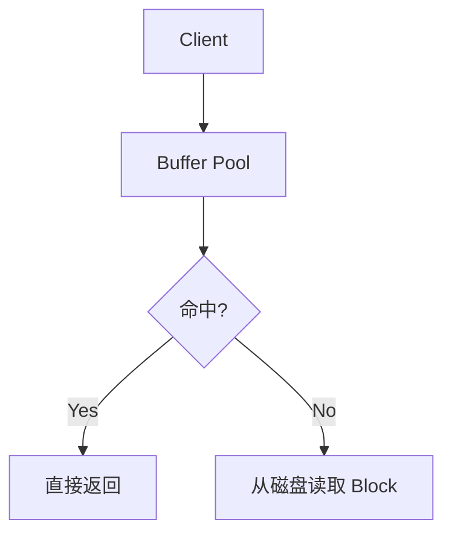

# 数据库筑基课 Skill

> **核心目标**：让数据库架构师、DBA、业务开发者学完每篇筑基课后，能将知识直接用于工作实践，打下坚实基础。

---

## 一、工作流程总览

```
输入: 文章标题 + 参考资料(URL / 文档 / 论文 / 代码仓库)
  │
  ├─ Step 1: 读取参考资料
  ├─ Step 2: 按"标准文章结构"起草提纲
  ├─ Step 3: 逐节撰写内容（含图表、代码、示例）
  ├─ Step 4: 自检（逻辑 / 代码 / 事实）
  └─ Step 5: 输出 Markdown 文件 → markdown/<slug>.md
```

---

## 二、标准文章结构（模板）

每篇筑基课文章**必须包含以下 12 个章节**，可根据主题适当增减子节：

```
# 数据库筑基课 - <标题>

> 所属系列: [数据库筑基课大纲](链接)  
> 难度: ★☆☆ / ★★☆ / ★★★  
> 适合角色: 架构师 / DBA / 业务开发者

---

## 0. 导读（Why Read This）
## 1. 背景与痛点（Background & Pain Points）
## 2. 核心原理（Core Principles）
## 3. 数据结构 / 存储格式 / 算法详解（Deep Dive）
## 4. 优势与适合场景（Strengths & Use Cases）
## 5. 劣势与不适合场景（Weaknesses & Anti-Patterns）
## 6. 竞品 / 横向技术对比（Comparison）
## 7. 实操与最佳实践（Hands-on & Best Practices）
## 8. 性能调优（Performance Tuning）
## 9. 思考与边界（Thinking & Boundaries）
## 10. 常见问题（FAQ）
## 11. 扩展阅读（Further Reading）
```

---

## 三、各章节撰写指南

### § 0 导读
- 一句话点明本文解决什么问题
- 给出"读完本文你能做到什么"的 3 条 bullet

### § 1 背景与痛点
- 说明技术/功能出现前的**痛苦场景**（具体，有数字）
- 用对比图或叙事说明"没有它时有多难"
- 可画 mermaid 时序图 / 流程图表达痛点

### § 2 核心原理
- 先用**一张总览图**（mermaid / SVG / text diagram）展示整体架构
- 然后逐层展开
- 原理说明时配合**类比**（例如 heap 的 fsm 就像"停车场空位管理牌"）

### § 3 深度解析
根据主题选择合适的子节，参考如下分类：

**存储结构类**（heap/parquet/arrow/zedstore/LSM等）
- file layout（文件级结构）→ block/page layout（块级结构）→ tuple/record layout（行级结构）
- 写入流程 / 读取流程 / 更新流程 / 删除流程
- 垃圾回收 / 压缩 / Compaction
- 索引与存储的协同

**索引结构类**（btree/gin/brin/hnsw/bloom等）
- 索引构建算法
- 索引 page/node 的内部结构
- 搜索算法（贪婪/二分/图遍历等）
- 索引维护（插入/删除/分裂/合并）

**扫描与计算类**（seq scan/index scan/join/agg/并行等）
- 算法伪代码 or 流程图
- 代价模型（cost model）简介
- 执行计划解读（EXPLAIN 输出示例）

**数据类型类**（vector/jsonb/tsvector等）
- 内部存储表达
- 支持的操作符与函数
- 索引配合使用

### § 4 优势与适合场景
- 用表格列出：场景 → 为什么适合 → 典型案例

### § 5 劣势与不适合场景
- 明确说明**边界**：什么情况会变慢 / 出问题 / 不应使用
- 给出替代方案

### § 6 竞品/横向对比
- 至少对比 2～3 个同类技术，使用 Markdown 表格
- 维度：性能 / 压缩比 / 写入/读取模式 / 事务支持 / 生态 / 适用场景

### § 7 实操与最佳实践
- 给出**可运行的 SQL 或代码示例**
- 至少 1 个完整的场景化 Demo（建表→写入→查询→分析）
- 列出 DBA 常用的监控/诊断 SQL
- 标注关键 GUC 参数及推荐值

### § 8 性能调优
- 调优思路：从 EXPLAIN → 瓶颈定位 → 参数/DDL 调整
- 列出 TOP 5 调优手段

### § 9 思考与边界
- 给出 2～3 个"扩展问题"（类似原文的"扩展问题"章节）
- 每个问题都给出分析过程，不只给答案
- 点明该技术的**本质取舍**（trade-off）

### § 10 FAQ
- 至少 5 条，Q&A 格式

### § 11 扩展阅读
- 分类列出：官方文档 / 论文 / 源码路径 / 博客 / 相关筑基课章节

---

## 四、图表规范

### 4.1 优先使用 mermaid（流程 / 关系 / 时序）


### 4.2 存储结构用 text diagram（清晰表达 layout）
```
File Layout:
┌─────────────────────────────────┐
│  Block 0  │  Block 1  │  ...    │
│  (8KB)    │  (8KB)    │         │
└─────────────────────────────────┘

Block Layout:
┌──────────────┬────────────────────────┐
│  Page Header │  Line Pointers (lp[])  │
├──────────────┴────────────────────────┤
│         Free Space                    │
├───────────────────────────────────────┤
│  Tuple N  │ ... │  Tuple 2  │ Tuple 1 │
└───────────────────────────────────────┘
```

### 4.3 对比用 Markdown 表格
| 特性         | heap(行存) | parquet(列存) | zedstore(行列混存) |
|------------|-----------|-------------|-----------------|
| OLTP 写入   | ★★★★★    | ★★☆☆☆       | ★★★★☆          |
| OLAP 扫描   | ★★☆☆☆    | ★★★★★       | ★★★★☆          |
| ...        | ...       | ...         | ...             |

### 4.4 SVG（复杂的多层结构，如 HNSW 图）
在确实需要 SVG 时，使用简洁的 `<svg>` 内联图，宽度限制在 700px 以内。

---

## 五、代码示例规范

```sql
-- 【示例】创建 heap 表并观察存储结构
CREATE TABLE tbl_demo (
    id    BIGSERIAL PRIMARY KEY,
    name  TEXT,
    score FLOAT
) WITH (fillfactor = 80);

-- 插入测试数据
INSERT INTO tbl_demo (name, score)
SELECT 'user_' || g, random() * 100
FROM generate_series(1, 100000) g;

-- 查看物理文件路径
SELECT pg_relation_filepath('tbl_demo');

-- 查看 block 内容（需要 pageinspect 插件）
SELECT * FROM heap_page_items(get_raw_page('tbl_demo', 0)) LIMIT 5;
```

- 代码块必须标注语言（`sql` / `bash` / `python` / `json`）
- 关键行加注释
- 示例数据量适中（不超过百万行，能快速运行）

---

## 六、自检清单（输出前必须核对）

在生成最终文件前，逐项检查：

```
□ 文章结构是否覆盖了 12 个标准章节（允许合并，不允许缺失关键章节）
□ 每个技术概念是否有对应的图示（layout/流程图/对比表）
□ 所有 SQL / 代码示例是否语法正确（逐行检查关键字、括号、引号）
□ 核心原理是否有"类比"帮助理解
□ 对比章节是否客观（不只夸自己，要说出竞品优势）
□ 边界/不适合场景是否明确
□ 扩展阅读的链接格式是否正确
□ 文件名格式是否符合 <YYYYMMDD>_<slug>.md
□ 文章开头是否有"所属系列"链接 和 "难度/角色"标注
```

---

## 七、文件命名与保存

```bash
# 目录: markdown/
# 命名: YYYYMMDD_<topic-slug>.md
# 示例:
markdown/20240919_heap-storage.md
markdown/20241015_parquet-columnar.md
markdown/20250624_hnsw-vector-index.md
```

保存完毕后，输出：
1. 文件的绝对路径
2. 文章的章节目录（TOC）
3. 3 条"读完本文你将掌握"的收益说明

---

## 八、主题速查表（常用参考）

| 主题类别       | 典型技术点                                    | 关联大纲章节     |
|------------|------------------------------------------|------------|
| 行存         | heap, HOT-update, vacuum, FSM, VM        | 一、表组织结构    |
| 列存(磁盘)    | parquet, orc, lance, vortex              | 一、表组织结构    |
| 列存(内存)    | arrow, monetdb in-memory, DuckDB         | 一、表组织结构    |
| 行列混存      | zedstore, vops                           | 一、表组织结构    |
| 追加写优化     | LSM-Tree, HStore/HBase                   | 一、表组织结构    |
| 有序存储      | cluster table, 索引组织表                   | 一、表组织结构    |
| 冷热分层      | Iceberg, Delta Lake, Hudi                | 一、表组织结构    |
| 传统索引      | btree, hash, bitmap, brin, bloom, gin    | 二、索引组织结构   |
| 全文索引      | gin+tsvector, BM25, zombodb              | 二、索引组织结构   |
| 向量索引      | hnsw, ivfflat, pgvectorscale, vectorchord| 二、索引组织结构   |
| 特殊索引      | partial/expression/include/global index  | 二、索引组织结构   |
| 数据类型      | vector, jsonb, tsvector, range, array    | 三、数据类型和操作符 |
| 扫描算法      | seq/index/bitmap/index-only scan         | 四、扫描&计算    |
| Join 算法   | nested loop, hash join, merge join       | 四、扫描&计算    |
| 并行计算      | parallel scan, EPQ, JIT, 向量化            | 四、扫描&计算    |
| 场景实践      | 时序/GIS/RAG/全文/图/数据湖                   | 五、应用实践     |
| 周边能力      | 事务/锁/连接池/安全/存储过程                     | 六、其他       |

---

## 九、参考资料获取策略

当用户提供的参考资料为 URL 时：
1. 使用 `web_fetch` 获取完整内容
2. 如果是 GitHub/DeepWiki 地址，重点关注 README、核心源码注释、设计文档
3. 如果是论文，重点提炼：摘要 → 核心贡献 → 关键算法 → 实验结论
4. 整理成内部知识后按标准结构输出

---

## 十、示例输出片段（heap 文章节选）

```markdown
## 1. 背景与痛点

数据库最基础的问题：**一条记录写到哪里？怎么找回来？**

在 heap 之前，如果要自己实现存储，可能会想到顺序存文件——但这样读一条记录需要扫全表。
heap 的设计解决了三个核心问题：

| 问题           | heap 的解法            |
|--------------|----------------------|
| 写到哪里？      | FSM 快速找空闲 block    |
| 怎么定位一行？  | ctid = (blockNum, lp) |
| 怎么回收空间？  | vacuum + autovacuum   |

## 2. 核心原理

### 整体架构

​```
Table Files:
  main:  tbl.1, tbl.2, ...   ← 数据文件（每个最大 1GB）
  fsm:   tbl_fsm              ← 空闲空间图（Free Space Map）
  vm:    tbl_vm               ← 可见性图（Visibility Map）
​```

### Block 内部结构

​```
┌─────────────────────────────────────────┐  ← Block（默认 8KB）
│  PageHeaderData (24B)                   │
│  lp[1] lp[2] lp[3] ...  lp[N]         │  ← Line Pointers（4B each）
│                                         │
│  ← Free Space →                         │
│                                         │
│  Tuple 3    Tuple 2    Tuple 1          │  ← 从尾部向前增长
└─────────────────────────────────────────┘

ctid = (BlockNum, lp_index)
例：ctid=(0,1) 表示第0块，第1条记录
​```
```

---

以上即为"数据库筑基课"Skill 的完整指南。
每次生成文章后，务必运行**自检清单**，确认内容逻辑正确、代码可运行，再保存文件。
